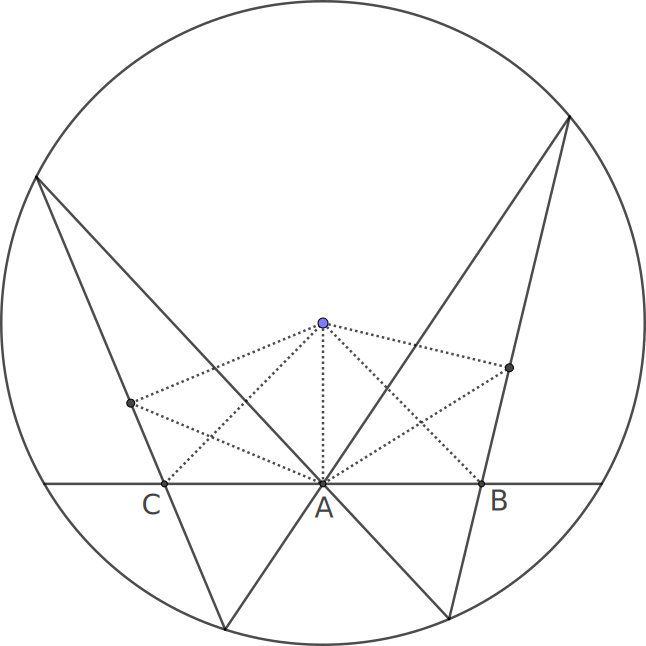
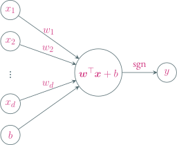

---
presentation:
  transition: "none"
  enableSpeakerNotes: true
  margin: 0
---

@import "../common/css/font-awesome-4.7.0/css/font-awesome.css"
@import "../common/css/style-color.css"
@import "../common/css/margin.css"

<!-- slide data-notes="大家晚上好，我是张腾，非常荣幸受谢老师所托，给大家做一个关于人工智能的讲座" -->

# 人工智能 简介

### 张腾

### 2019 / 05 / 29

<!-- slide data-notes="在讲之前，有几句话想要说清楚，首先人工智能是一个非常大的领域，机器学习是它的一个子领域，而我呢，博士阶段主要研究的是机器学习中的核方法，机器学习经过了几十年的飞速发展，要说跟核方法一个层次的算法，可以说十几个，所以我所学所知的实在是人工智能中的沧海一粟，今天等于是强行升两个维度给大家讲人工智能，忐忑不已，所以如果讲得不好，大家千万多包涵，如果哪里讲得不清楚，大家也可以随时打断" -->

HEADER 有言在先

@import "../dot/ai-ml-kernel.dot" {.center .top5}

FOOTER3 SCTS/CGCL/BDTS 人工智能简介 tengzhang@hust.edu.cn

<!-- slide vertical=true data-notes="首先提到人工智能，大家会想到什么？" -->

HEADER 引子

@import "../puml/ai.puml" {.center .top10}

FOOTER3 SCTS/CGCL/BDTS 人工智能简介 tengzhang@hust.edu.cn

<!-- slide data-notes="可能有人会想到alphago，横扫围棋界，将多位世界冠军杀得毫无还手之力" data-background-video="../videos/alphago.mp4" data-background-video-loop data-background-video-muted vertical=true -->

<!-- slide data-notes="可能有人会想到自动驾驶，现在谷歌、百度、特斯拉等许多公司都在研究" data-background-video="../videos/self-driving.mp4" data-background-video-loop data-background-video-muted vertical=true -->

<!-- slide data-notes="可能还有人会想到这个要destroy全人类的sophia" data-background-video="../videos/sophia.mp4" data-background-video-loop data-background-video-muted vertical=true -->

<!-- slide data-notes="没有问题，这些都是机器学习的应用……这个讲座如果只把这些应用讲给大家，我觉得可能大家不会有太多收获，走马观花一样，看完就忘了，因为这里的每一项应用背后都有多项很前沿的技术，例如" vertical=true -->

HEADER 引子

@import "../dot/ai-app.dot"

FOOTER3 SCTS/CGCL/BDTS 人工智能简介 tengzhang@hust.edu.cn

<!-- slide vertical=true -->

HEADER 引子

@import "../dot/ai-app-dev.dot"

FOOTER3 SCTS/CGCL/BDTS 人工智能简介 tengzhang@hust.edu.cn

<!-- slide -->

HEADER 人工智能 时代背景

维纳 《控制论》：

 

> 第一次工业革命：用某种机器来减轻甚至代替体力劳动

> 上世纪中叶：用某种新型机器来减轻甚至代替某些脑力劳动

FOOTER3 SCTS/CGCL/BDTS 人工智能简介 tengzhang@hust.edu.cn

<!-- slide vertical=true -->

HEADER 人工智能 起源

达特茅斯会议

- 时间：1956 年
- 地点：达特茅斯学院
- 人物：香农、麦卡锡、明斯基、西蒙、纽厄尔等十人
- 事件：讨论用机器模拟人的智能

 

    
    

FOOTER3 SCTS/CGCL/BDTS 人工智能简介 tengzhang@hust.edu.cn

<!-- slide vertical=true -->

HEADER 人工智能 三次浪潮

推理期

- 热潮：1956 - 60 年代初
- 凛冬：60 年代中 - 60 年代末

知识期

- 热潮：70 年代初 - 80 年代初
- 凛冬：80 年代中 - 90 年代初

学习期

- 热潮：90 年代中 - 2012
- 井喷：2012 - ？
- 凛冬将至？

FOOTER3 SCTS/CGCL/BDTS 人工智能简介 tengzhang@hust.edu.cn

<!-- slide -->

HEADER 数学机械化

笛卡尔：代数可以将几何推理符号化甚至机械化 解析几何

蝴蝶定理：$AC = BC$

 

纯几何证法：3 个点、7 条辅助线

 

解析证法：曲线系方程

FOOTER3 SCTS/CGCL/BDTS 人工智能简介 tengzhang@hust.edu.cn

<!-- slide vertical=true -->

HEADER 人工智能 推理期

机器擅长固定套路的计算 vs. 人类擅长妙手偶得的推理

符号主义：智能 = 逻辑推理

西蒙和纽厄尔设计了逻辑理论家程序

- 1952 年，逻辑理论家证明了 《数学原理》 中的 38 条定理
- 1963 年，证明了全部 52 条定理，其中定理 2.85 的证明比原书作者更巧妙
- 西蒙和纽厄尔获得了 1975 年的图灵奖

衰退：

- 并非所有定理都可以方便地符号化，也并非所有问题都可以转换成推理问题
- 十万步内无法证明两个连续函数之和还是连续函数

FOOTER3 SCTS/CGCL/BDTS 人工智能简介 tengzhang@hust.edu.cn

<!-- slide vertical=true -->

HEADER 符号化 归结原理

根据以下事实判别谁说了实话

- $A$：$B$和$C$都是说谎者
- $B$：$A$和$C$都是说谎者
- $C$：$A$和$B$中至少有一个说谎者

|   公式   |          $p \rightarrow q$           | $\Longleftrightarrow$ |                   $\neg p \vee q$                    |
| :------: | :----------------------------------: | :-------------------: | :--------------------------------------------------: |
| **条件** | $A \rightarrow \neg B \wedge \neg C$ | $\Longleftrightarrow$ | $1.~\neg A \vee \neg B, \quad 2.~\neg A \vee \neg C$ |
|          |    $\neg A \rightarrow B \vee C$     | $\Longleftrightarrow$ |                 $3.~A \vee B \vee C$                 |
|          | $B \rightarrow \neg A \wedge \neg C$ | $\Longleftrightarrow$ |               $4.~\neg B \vee \neg C$                |
|          |    $\neg B \rightarrow A \vee C$     | $\Longleftrightarrow$ |                 $3.~A \vee B \vee C$                 |
|          |  $C \rightarrow \neg A \vee \neg B$  | $\Longleftrightarrow$ |         $5.~\neg A \vee \neg B \vee \neg C$          |
|          |   $\neg C \rightarrow A \wedge B$    | $\Longleftrightarrow$ |           $6.~A \vee C, \quad 7.~B \vee C$           |
| **归结** | $1 + 7 \rightarrow 8.~\neg A \vee C$ | $\Longleftrightarrow$ |                     $C$说了实话                      |

FOOTER3 SCTS/CGCL/BDTS 人工智能简介 tengzhang@hust.edu.cn

<!-- slide -->

HEADER 人工智能 知识期

教训：光有逻辑推理远远不够，机器得拥有知识

信仰：知识就是力量，智能 = 知识 + 逻辑推理

专家系统 = 知识库 + 推理机

- 在特定领域内具有专家水平解决问题能力的程序系统
- 第一个成功的专家系统 DENDRAL 于 1968 年问世
- 知识工程之父费根鲍姆获得了 1994 年的图灵奖

衰退：

- 人工构建知识库成本太高
- 很多知识获取困难，甚至无法被清晰地表示出来

FOOTER3 SCTS/CGCL/BDTS 人工智能简介 tengzhang@hust.edu.cn

<!-- slide vertical=true -->

HEADER 动物识别专家系统

@import "../dot/reasoning.dot"

FOOTER3 SCTS/CGCL/BDTS 人工智能简介 tengzhang@hust.edu.cn

<!-- slide -->

HEADER 人工智能 学习期

观点：知识由机器从数据中自动学习得到

 

西瓜数据集：

| 特征 &nbsp; → | 编号 | 色泽 | 根蒂 | 敲声 | 纹理 | 脐部 | 触感 |              好瓜              |
| ------------------------------------------------------------------------------: | :--: | :--: | :--: | :--: | :--: | :--: | :--: | :----------------------------: |
|                                         样本 &nbsp; → |  1   | 青绿 | 蜷缩 | 浊响 | 清晰 | 凹陷 | 硬滑 |               是               |
|                                                                                 |  2   | 乌黑 | 蜷缩 | 沉闷 | 清晰 | 凹陷 | 硬滑 |               是               |
|                                                                                 |  3   | 乌黑 | 稍蜷 | 沉闷 | 稍糊 | 稍凹 | 硬滑 |               否               |
|                                                                                 |  4   | 浅白 | 硬挺 | 清脆 | 模糊 | 平坦 | 硬滑 |               否               |
|                                                                                 |      |      |      |      |      |      |      |               ↑                |
|                                                                                 |      |      |      |      |      |      |      | 类别 |

知识：(浅白、稍蜷、沉闷、稍糊、凹陷、硬滑、好瓜 = ? )

FOOTER3 SCTS/CGCL/BDTS 人工智能简介 tengzhang@hust.edu.cn

<!-- slide vertical=true -->

HEADER 机器学习

设数据集中共有$l$种颜色，则第$i$种颜色编码为

$$
\begin{align*}
    \underbrace{0\cdots0}_{l-i个0}1\underbrace{0\cdots0}_{i-1个0}
\end{align*}
$$

 

设共有$m$种根蒂，$n$种敲声，每个西瓜样本对应一个$d=l+m+n$位的$01$向量，即$\Rbb^d$中的一个点

 

目标知识：将好瓜对应的点和坏瓜对应的点分开

 

线性分类器：将两类点分开的超平面

FOOTER3 SCTS/CGCL/BDTS 人工智能简介 tengzhang@hust.edu.cn

<!-- slide vertical=true -->

HEADER 线性分类器

设数据集中每个样本$\xv \in \Rbb^d$，线性分类器$y = \sgn(\wv^\top \xv + b)$

FOOTER3 SCTS/CGCL/BDTS 人工智能简介 tengzhang@hust.edu.cn

<!-- slide vertical=true -->

HEADER 深度神经网络

$$
\begin{align*}
    f(\xv) = \Wv_n~A( \cdots (\Wv_2~A(\Wv_1 \xv)) \cdots)
\end{align*}
$$

 

@import "../dot/nn.dot" {.center}

FOOTER3 SCTS/CGCL/BDTS 人工智能简介 tengzhang@hust.edu.cn

<!-- slide -->

HEADER 结束语

人工智能：用机器代替人类的部分脑力活动

- 推理期：符号主义，逻辑推理
- 知识期：知识工程，知识图谱
- 学习期：机器学习

 

每一次兴起都伴随着对前一次热潮的反思

 

凛冬将至？何去何从？

### 谢谢！！

FOOTER3 SCTS/CGCL/BDTS 人工智能简介 tengzhang@hust.edu.cn
