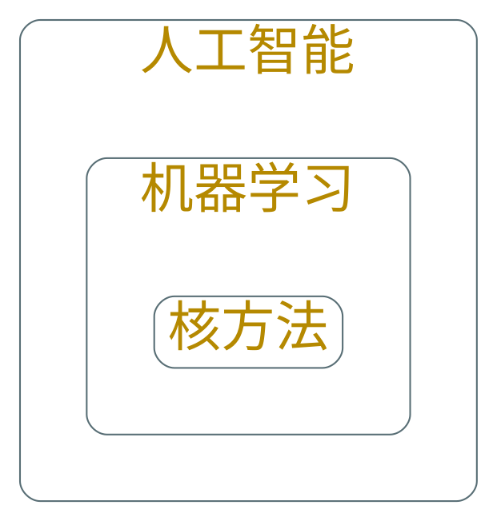
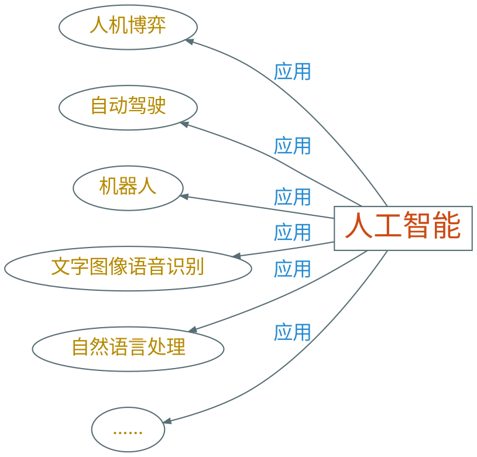
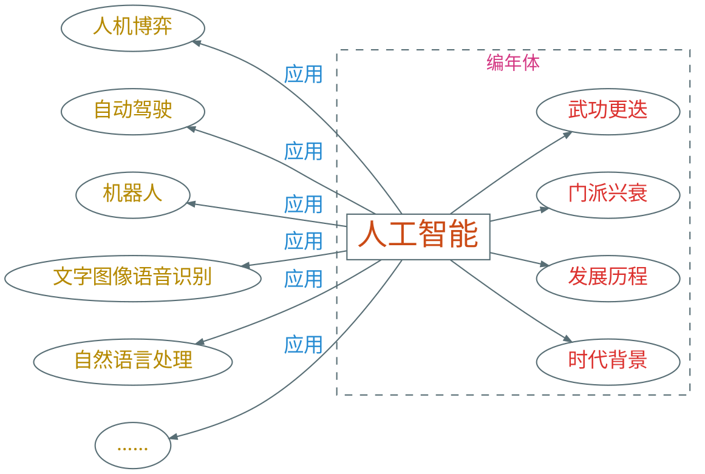
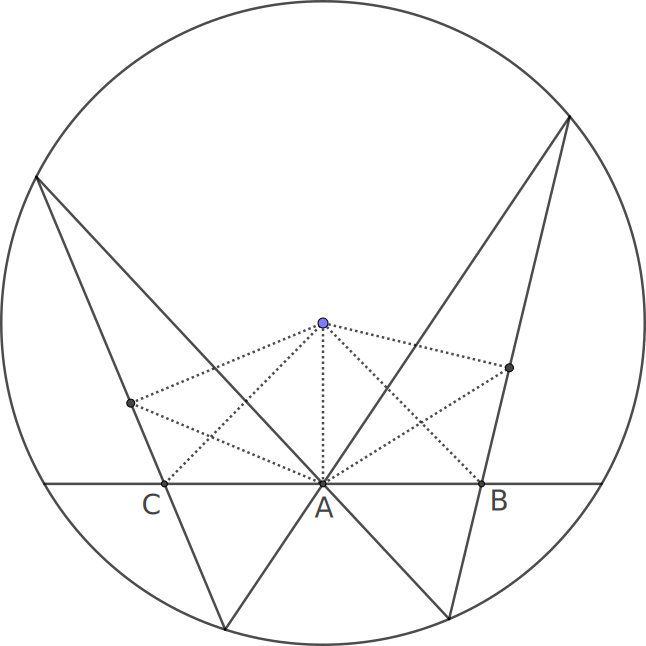
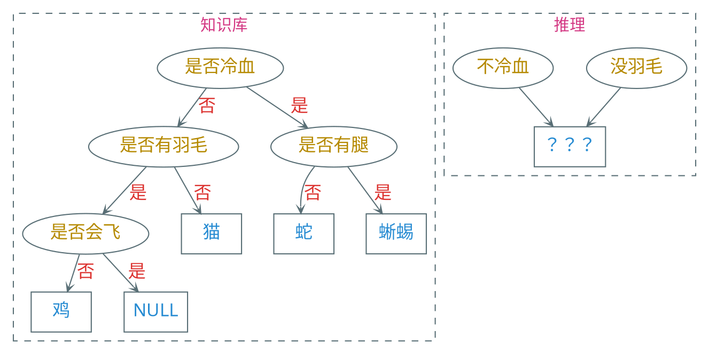
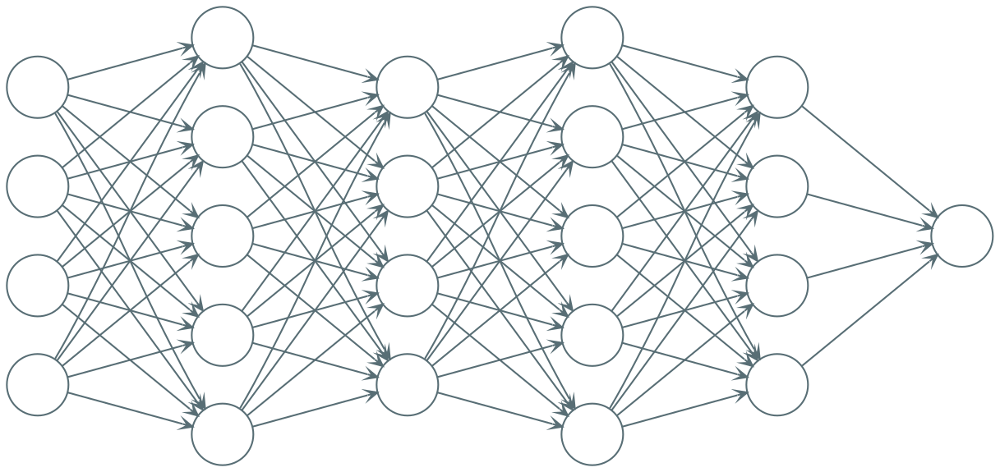

---
presentation:
    transition: "none"
    enableSpeakerNotes: true
    margin: 0
---

@import "../common/css/font-awesome-4.7.0/css/font-awesome.css"
@import "../common/css/zhangt-solarized.css"
@import "css/190529-ai-intro.css"

<!-- slide data-notes="大家晚上好，我是张腾，非常荣幸受谢老师所托，给大家做一个关于人工智能的讲座" -->
<div class="header">
    
</div>

<div class="bottom15"></div>

# 人工智能 简介

<hr class="width15">

## 张腾

### 2019 - 05 - 29

<!-- slide data-notes="在讲之前，有几句话想要说清楚，首先人工智能是一个非常大的领域，机器学习是它的一个子领域，而我呢，博士阶段主要研究的是机器学习中的核方法，机器学习经过了几十年的飞速发展，要说跟核方法一个层次的算法，可以说十几个，所以我所学所知的实在是人工智能中的沧海一粟，今天等于是强行升两个维度给大家讲人工智能，忐忑不已，所以如果讲得不好，大家千万多包涵，如果哪里讲得不清楚，大家也可以随时打断" -->
<div class="header">
    
    <div class="title">
        <hr class="hr_top">
        <h5>有言在先</h5>
    </div>
</div>

<div style="margin-left:auto;margin-right:auto;margin-top:2rem" markdown="1">



</div>

<div class="footer">
<hr class="hr_bottom">
<div class="multi_column">
    <h6 class="bottom_left">SCTS & CGCL & BDTS</h6>
    <h6 class="bottom_center">人工智能 简介</h6>
    <h6 class="bottom_right">tengzhang@hust.edu.cn</h6>
</div>
</div>

<!-- slide vertical=true data-notes="首先提到人工智能，大家会想到什么？" -->
<div class="header">
    
    <div class="title">
        <hr class="hr_top">
        <h5>引子</h5>
    </div>
</div>

<div style="margin-left:auto;margin-right:auto;margin-top:10%" markdown="1">

```puml
skinparam backgroundColor transparent
scale 2.4
张三 -right-> (人工智能) : ？
李四 -left-> (人工智能) : ？
```

</div>

<div class="footer">
<hr class="hr_bottom">
<div class="multi_column">
    <h6 class="bottom_left">SCTS & CGCL & BDTS</h6>
    <h6 class="bottom_center">人工智能 简介</h6>
    <h6 class="bottom_right">tengzhang@hust.edu.cn</h6>
</div>
</div>

<!-- slide data-notes="可能有人会想到alphago，横扫围棋界，将多位世界冠军杀得毫无还手之力" data-background-video="videos/alphago.mp4" data-background-video-loop data-background-video-muted vertical=true -->

<!-- slide data-notes="可能有人会想到自动驾驶，现在谷歌、百度、特斯拉等许多公司都在研究" data-background-video="videos/self-driving.mp4" data-background-video-loop data-background-video-muted vertical=true -->

<!-- slide data-notes="可能还有人会想到这个要destroy全人类的sophia" data-background-video="videos/sophia.mp4" data-background-video-loop data-background-video-muted vertical=true -->

<!-- slide data-notes="没有问题，这些都是机器学习的应用……这个讲座如果只把这些应用讲给大家，我觉得可能大家不会有太多收获，走马观花一样，看完就忘了，因为这里的每一项应用背后都有多项很前沿的技术，例如" vertical=true -->
<div class="header">
    
    <div class="title">
        <hr class="hr_top">
        <h5>引子</h5>
    </div>
</div>



<div class="footer">
<hr class="hr_bottom">
<div class="multi_column">
    <h6 class="bottom_left">SCTS & CGCL & BDTS</h6>
    <h6 class="bottom_center">人工智能 简介</h6>
    <h6 class="bottom_right">tengzhang@hust.edu.cn</h6>
</div>
</div>

<!-- slide vertical=true -->
<div class="header">
    
    <div class="title">
        <hr class="hr_top">
        <h5>引子</h5>
    </div>
</div>



<div class="footer">
<hr class="hr_bottom">
<div class="multi_column">
    <h6 class="bottom_left">SCTS & CGCL & BDTS</h6>
    <h6 class="bottom_center">人工智能 简介</h6>
    <h6 class="bottom_right">tengzhang@hust.edu.cn</h6>
</div>
</div>

<!-- slide -->
<div class="header">
    
    <div class="title">
        <hr class="hr_top">
        <h5>人工智能 时代背景</h5>
    </div>
</div>

N. Wiener 《控制论》:

<br>

> 第一次工业革命：用某种机器来减轻甚至代替<span class="blue">体力</span>劳动<br>
> 上世纪中叶：用某种新型机器来减轻甚至代替某些<span class="blue">脑力</span>劳动

<div class="footer">
<hr class="hr_bottom">
<div class="multi_column">
    <h6 class="bottom_left">SCTS & CGCL & BDTS</h6>
    <h6 class="bottom_center">人工智能 简介</h6>
    <h6 class="bottom_right">tengzhang@hust.edu.cn</h6>
</div>
</div>

<!-- slide vertical=true -->
<div class="header">
    
    <div class="title">
        <hr class="hr_top">
        <h5>人工智能 起源</h5>
    </div>
</div>

- 时间：1956 年
- 地点：达特茅斯学院
- 人物：Shannon、McCarthy、Minsky、Simon、Newell 等
- 事件：讨论用机器模拟人的智能

<div class="multi_column top4">
    
    
</div>

<div class="footer">
<hr class="hr_bottom">
<div class="multi_column">
    <h6 class="bottom_left">SCTS & CGCL & BDTS</h6>
    <h6 class="bottom_center">人工智能 简介</h6>
    <h6 class="bottom_right">tengzhang@hust.edu.cn</h6>
</div>
</div>

<!-- slide vertical=true -->
<div class="header">
    
    <div class="title">
        <hr class="hr_top">
        <h5>人工智能 三次浪潮</h5>
    </div>
</div>

推理期

- 热潮：1956 - 60 年代初
- 凛冬：60 年代中 - 60 年代末

<div class="top2"></div>

知识期

- 热潮：70 年代初 - 80 年代初
- 凛冬：80 年代中 - 90 年代初

<div class="top2"></div>

学习期

- 热潮：90 年代中 - 2012
- 井喷：2012 - ？
- 凛冬将至？

<div class="footer">
<hr class="hr_bottom">
<div class="multi_column">
    <h6 class="bottom_left">SCTS & CGCL & BDTS</h6>
    <h6 class="bottom_center">人工智能 简介</h6>
    <h6 class="bottom_right">tengzhang@hust.edu.cn</h6>
</div>
</div>

<!-- slide -->
<div class="header">
    
    <div class="title">
        <hr class="hr_top">
        <h5>数学机械化</h5>
    </div>
</div>

Descartes：代数可以将几何推理符号化甚至机械化 解析几何

<div class="multi_column top6">

<p class="left8 top10">
    蝴蝶定理：$AC = BC$<br><br>
    纯几何证法：3个点、7条辅助线<br><br>
    解析证法：曲线系方程
</p>
</div>

<div class="footer">
<hr class="hr_bottom">
<div class="multi_column">
    <h6 class="bottom_left">SCTS & CGCL & BDTS</h6>
    <h6 class="bottom_center">人工智能 简介</h6>
    <h6 class="bottom_right">tengzhang@hust.edu.cn</h6>
</div>
</div>

<!-- slide vertical=true -->
<div class="header">
    
    <div class="title">
        <hr class="hr_top">
        <h5>人工智能 推理期</h5>
    </div>
</div>

机器：擅长固定套路的计算 vs. 人类：擅长妙手偶得的推理

<br>

符号主义：<span class="blue">智能 = 逻辑推理</span>

<br>

Simon 和 Newell 设计了“逻辑理论家”程序

- 1952 年，“逻辑理论家”证明了《数学原理》中的 38 条定理
- 1963 年，证明了全部 52 条定理，其中定理 2.85 的证明比原书作者更巧妙
- Simon 和 Newell 获得了 75 年的图灵奖

<br>

面对更难的定理就无能为力了，十万步无法证明“两个连续函数之和还是连续函数”

<div class="footer">
<hr class="hr_bottom">
<div class="multi_column">
    <h6 class="bottom_left">SCTS & CGCL & BDTS</h6>
    <h6 class="bottom_center">人工智能 简介</h6>
    <h6 class="bottom_right">tengzhang@hust.edu.cn</h6>
</div>
</div>

<!-- slide vertical=true -->
<div class="header">
    
    <div class="title">
        <hr class="hr_top">
        <h5>符号化 归结原理</h5>
    </div>
</div>

$A$：“$B$和$C$都是说谎者”；

$B$：“$A$和$C$都是说谎者”；

$C$：“$A$和$B$中至少有一个说谎者”，谁说了实话？

<div class="resolution" markdown="1">

| 公式 |          $p \rightarrow q$           | $\Longleftrightarrow$ |           $\neg p \vee q$           |
| :--: | :----------------------------------: | :-------------------: | :---------------------------------: |
| 条件 | $A \rightarrow \neg B \wedge \neg C$ | $\Longleftrightarrow$ |       $1.~\neg A \vee \neg B$       |
|      |                                      | $\Longleftrightarrow$ |       $2.~\neg A \vee \neg C$       |
|      |    $\neg A \rightarrow B \vee C$     | $\Longleftrightarrow$ |        $3.~A \vee B \vee C$         |
|      | $B \rightarrow \neg A \wedge \neg C$ | $\Longleftrightarrow$ |       $4.~\neg B \vee \neg C$       |
|      |    $\neg B \rightarrow A \vee C$     | $\Longleftrightarrow$ |        $3.~A \vee B \vee C$         |
|      |  $C \rightarrow \neg A \vee \neg B$  | $\Longleftrightarrow$ | $5.~\neg A \vee \neg B \vee \neg C$ |
|      |   $\neg C \rightarrow A \wedge B$    | $\Longleftrightarrow$ |            $6.~A \vee C$            |
|      |                                      | $\Longleftrightarrow$ |            $7.~B \vee C$            |
| 归结 | $1 + 7 \rightarrow 8.~\neg A \vee C$ | $\Longleftrightarrow$ |             $C$说了实话             |

</div>

<div class="footer">
<hr class="hr_bottom">
<div class="multi_column">
    <h6 class="bottom_left">SCTS & CGCL & BDTS</h6>
    <h6 class="bottom_center">人工智能 简介</h6>
    <h6 class="bottom_right">tengzhang@hust.edu.cn</h6>
</div>
</div>

<!-- slide -->
<div class="header">
    
    <div class="title">
        <hr class="hr_top">
        <h5>人工智能 知识期</h5>
    </div>
</div>

教训：光有逻辑推理远远不够，机器得拥有知识

<br>

观点：“知识就是力量”，<span class="blue">智能 = 知识 + 逻辑推理</span>

<br>

专家系统(知识工程) = 知识库 + 推理引擎

- 在特定领域内具有专家水平解决问题能力的程序系统
- 第一个成功的专家系统 DENDRAL 于 1968 年问世
- “知识工程”之父 E. A. Feigenbaum 获得了 94 年的图灵奖

<br>

人工构建知识库成本太高

知识获取困难

<div class="footer">
<hr class="hr_bottom">
<div class="multi_column">
    <h6 class="bottom_left">SCTS & CGCL & BDTS</h6>
    <h6 class="bottom_center">人工智能 简介</h6>
    <h6 class="bottom_right">tengzhang@hust.edu.cn</h6>
</div>
</div>

<!-- slide vertical=true -->
<div class="header">
    
    <div class="title">
        <hr class="hr_top">
        <h5>动物识别专家系统</h5>
    </div>
</div>



<div class="footer">
<hr class="hr_bottom">
<div class="multi_column">
    <h6 class="bottom_left">SCTS & CGCL & BDTS</h6>
    <h6 class="bottom_center">人工智能 简介</h6>
    <h6 class="bottom_right">tengzhang@hust.edu.cn</h6>
</div>
</div>

<!-- slide -->
<div class="header">
    
    <div class="title">
        <hr class="hr_top">
        <h5>人工智能 学习期</h5>
    </div>
</div>

观点：<span class="blue">知识由机器从数据中自动学习得到</span>

<br>

目标知识：色泽 = ？$\wedge$ 根蒂 = ？$\wedge$ 敲声 = ？$\longrightarrow$ 好瓜

<br>

西瓜数据集：

<div class="dataset" markdown="1">

| 编号 | 色泽 | 根蒂 | 敲声 | 好瓜 |
| :--: | :--: | :--: | :--: | :--: |
|  1   | 青绿 | 蜷缩 | 浊响 |  是  |
|  2   | 乌黑 | 蜷缩 | 浊响 |  是  |
|  3   | 青绿 | 硬挺 | 清脆 |  否  |
|  4   | 乌黑 | 蜷缩 | 沉闷 |  否  |

</div>

<div class="footer">
<hr class="hr_bottom">
<div class="multi_column">
    <h6 class="bottom_left">SCTS & CGCL & BDTS</h6>
    <h6 class="bottom_center">人工智能 简介</h6>
    <h6 class="bottom_right">tengzhang@hust.edu.cn</h6>
</div>
</div>

<!-- slide vertical=true -->
<div class="header">
    
    <div class="title">
        <hr class="hr_top">
        <h5>机器学习</h5>
    </div>
</div>

设数据集中共有$l$种颜色，则第$i$种颜色编码为

<div>
$$
    \begin{align*}
        \underbrace{0\cdots0}_{l-i个0}1\underbrace{0\cdots0}_{i-1个0}
    \end{align*}
$$
</div>

<br>

设共有$m$种根蒂，$n$种敲声，每个西瓜样本对应一个$d=l+m+n$位的$01$向量，即$\Rbb^d$中的一个点

<br>

目标知识：将好瓜对应的点和坏瓜对应的点分开

<br>

线性分类器：将两类点分开的超平面

<div class="footer">
<hr class="hr_bottom">
<div class="multi_column">
    <h6 class="bottom_left">SCTS & CGCL & BDTS</h6>
    <h6 class="bottom_center">人工智能 简介</h6>
    <h6 class="bottom_right">tengzhang@hust.edu.cn</h6>
</div>
</div>

<!-- slide vertical=true -->
<div class="header">
    
    <div class="title">
        <hr class="hr_top">
        <h5>线性分类器</h5>
    </div>
</div>

设数据集中每个样本$\xv \in \Rbb^d$，线性分类器$y = \sgn(\wv^\top \xv + b)$


<div class="footer">
    <hr class="hr_bottom">
    <div class="multi_column">
        <h6 class="bottom_left">SCTS & CGCL & BDTS</h6>
        <h6 class="bottom_center">人工智能 简介</h6>
        <h6 class="bottom_right">tengzhang@hust.edu.cn</h6>
    </div>
</div>

<!-- slide vertical=true -->
<div class="header">
    
    <div class="title">
        <hr class="hr_top">
        <h5>深度神经网络</h5>
    </div>
</div>

<div>
$$
    \begin{align*}
        f(\xv) = \Wv_n~A( \cdots (\Wv_2~A(\Wv_1 \xv)) \cdots)
    \end{align*}
$$
</div>

<br>



<div class="footer">
    <hr class="hr_bottom">
    <div class="multi_column">
        <h6 class="bottom_left">SCTS & CGCL & BDTS</h6>
        <h6 class="bottom_center">人工智能 简介</h6>
        <h6 class="bottom_right">tengzhang@hust.edu.cn</h6>
    </div>
</div>

<!-- slide -->
<div class="header">
    
    <div class="title">
        <hr class="hr_top">
        <h5>结束语</h5>
    </div>
</div>

人工智能：用机器代替人类的部分脑力活动

- 推理期：符号主义，逻辑推理
- 知识期：知识工程，知识图谱
- 学习期：机器学习

<br>

每一次兴起都伴随着对前一次热潮的反思

<br>

凛冬将至？何去何从？

<hr style="margin-top:10%;width:60%;height:1px">

<h2 class="top3" style="font-size:3rem">谢谢！</h2>

<div class="footer">
    <hr class="hr_bottom">
    <div class="multi_column">
        <h6 class="bottom_left">SCTS & CGCL & BDTS</h6>
        <h6 class="bottom_center">人工智能 简介</h6>
        <h6 class="bottom_right">tengzhang@hust.edu.cn</h6>
    </div>
</div>
