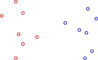
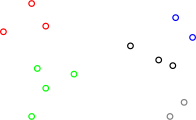
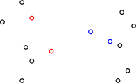
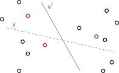
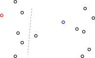
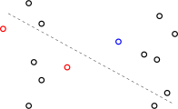
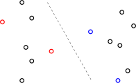

---
presentation:
  transition: "none"
  enableSpeakerNotes: true
  margin: 0
---

@import "../common/css/font-awesome-4.7.0/css/font-awesome.css"
@import "../common/css/style-color.css"
@import "../common/css/margin.css"

<!-- slide data-notes="自我介绍<br><br>为何改题目<br><br>前沿需要太多的铺垫 一学期的课程<br><br>前沿不一定有价值 非前沿可以是经典" -->
<div class="header"></div>

<div class="bottom15"></div>

# 强化学习<strike>研究前沿</strike>简介

<hr class="width50">

## 暑期年会

<div class="top5"></div>

### 张腾

### tengzhang@hust.edu.cn

### 2019 / 07 / 31

<!-- slide data-notes="强化学习最高光的时刻 16年 17年 简述下历史14年前还很小众" data-background-video="../videos/alphago.mp4" data-background-video-loop data-background-video-muted vertical=true -->

<!-- slide vertical=true data-notes="强化学习是  分支  从人工智能讲起 不会讲太细" -->

HEADER 大纲

@import "../dot/rl-outline.dot" {.center .top5}

FOOTER3 华中科技大学 SCTS/CGCL/BDTS tengzhang@hust.edu.cn

<!-- slide data-notes="" -->

HEADER 大纲

@import "../dot/rl-outline2.dot" {.center .top5}

FOOTER3 华中科技大学 SCTS/CGCL/BDTS tengzhang@hust.edu.cn

<!-- slide vertical=true data-notes="" -->

HEADER 人工智能 时代背景

维纳 《控制论》：

<br>

> 第一次工业革命：用某种机器来减轻甚至代替<span class="blue">体力</span>劳动

> 上世纪中叶：用某种新型机器来减轻甚至代替某些<span class="blue">脑力</span>劳动

FOOTER3 华中科技大学 SCTS/CGCL/BDTS tengzhang@hust.edu.cn

<!-- slide vertical=true data-notes="下面介绍几位大佬 Minsky是位传奇人物 他建造了第一台可以学习的神经网络机器 他有一本非常有名的书叫感知机 感知机就是一层的神经网络 他在书里又全盘否定了人工智能 感知机连简单的异或函数都学习不了 因为大佬的盖棺定论 整个领域直接冷掉10年 直到八十年代中期 hinton提出了反向传播 多层神经网络终于可以学习非线性函数了 这个插个题外话 反向传播并不是hinton第一个发明的 60年代就被发现过很多次 而且反向传播就是个链式法则" -->

HEADER 人工智能 起源

达特茅斯会议

- 时间：1956 年
- 地点：达特茅斯学院
- 人物：香农、麦卡锡、明斯基、西蒙、纽厄尔等十人
- 事件：讨论用机器模拟人的智能

<br>

<div class="multi_column top_2">
    
    
</div>

FOOTER3 华中科技大学 SCTS/CGCL/BDTS tengzhang@hust.edu.cn

<!-- slide vertical=true data-notes="" -->

HEADER 人工智能 三次浪潮

推理期

- 热潮：1956 - 60 年代初
- 凛冬：60 年代中 - 60 年代末

<div class="top2"></div>

知识期

- 热潮：70 年代初 - 80 年代初
- 凛冬：80 年代中 - 90 年代初

<div class="top2"></div>

学习期

- 热潮：90 年代中 - 2012
- 井喷：2012 - ？
- 凛冬将至？

FOOTER3 华中科技大学 SCTS/CGCL/BDTS tengzhang@hust.edu.cn

<!-- slide data-notes="我个人猜测原因是数学原理讲的是公理集合论 当然是罗素的 不是zfc 天生符号化 连续函数如何符号化" -->

HEADER 逻辑推理

机器擅长固定套路的计算 vs. 人类擅长妙手偶得的推理

<div class="bottom4"></div>

符号主义：<span class="blue">智能 = 逻辑推理</span>

<div class="bottom4"></div>

西蒙和纽厄尔设计了<span class="blue">逻辑理论家</span>程序

- 1952 年，逻辑理论家证明了 《数学原理》 中的 38 条定理
- 1963 年，证明了全部 52 条定理，其中定理 2.85 的证明比原书作者更巧妙
- 西蒙和纽厄尔获得了 1975 年的图灵奖

<div class="bottom4"></div>

衰退：

- 并非所有定理都可以方便地符号化，也并非所有问题都可以转换成推理问题
- 十万步内无法证明<span class="blue">两个连续函数之和还是连续函数</span>

FOOTER3 华中科技大学 SCTS/CGCL/BDTS tengzhang@hust.edu.cn

<!-- slide vertical=true data-notes="" -->

HEADER 符号化 归结原理

根据以下事实判别谁说了实话

- $A$：$B$和$C$都是说谎者
- $B$：$A$和$C$都是说谎者
- $C$：$A$和$B$中至少有一个说谎者

<div class="threelines row7-border-top-solid column1-border-right-solid">

|   公式   |          $p \rightarrow q$           | $\Longleftrightarrow$ |                   $\neg p \vee q$                    |
| :------: | :----------------------------------: | :-------------------: | :--------------------------------------------------: |
| **条件** | $A \rightarrow \neg B \wedge \neg C$ | $\Longleftrightarrow$ | $1.~\neg A \vee \neg B, \quad 2.~\neg A \vee \neg C$ |
|          |    $\neg A \rightarrow B \vee C$     | $\Longleftrightarrow$ |                 $3.~A \vee B \vee C$                 |
|          | $B \rightarrow \neg A \wedge \neg C$ | $\Longleftrightarrow$ |               $4.~\neg B \vee \neg C$                |
|          |    $\neg B \rightarrow A \vee C$     | $\Longleftrightarrow$ |                 $3.~A \vee B \vee C$                 |
|          |  $C \rightarrow \neg A \vee \neg B$  | $\Longleftrightarrow$ |         $5.~\neg A \vee \neg B \vee \neg C$          |
|          |   $\neg C \rightarrow A \wedge B$    | $\Longleftrightarrow$ |           $6.~A \vee C, \quad 7.~B \vee C$           |
| **归结** | $1 + 7 \rightarrow 8.~\neg A \vee C$ | $\Longleftrightarrow$ |                     $C$说了实话                      |

</div>

FOOTER3 华中科技大学 SCTS/CGCL/BDTS tengzhang@hust.edu.cn

<!-- slide vertical=true data-notes="" -->

HEADER 知识工程

教训：光有逻辑推理远远不够，机器得拥有知识

<div class="bottom4"></div>

信仰：知识就是力量，<span class="blue">智能 = 知识 + 逻辑推理</span>

<div class="bottom4"></div>

专家系统 = 知识库 + 推理机

- 在特定领域内具有专家水平解决问题能力的程序系统
- 第一个成功的专家系统 DENDRAL 于 1968 年问世
- 知识工程之父费根鲍姆获得了 1994 年的图灵奖

<div class="bottom4"></div>

衰退：

- 人工构建知识库成本太高
- 很多知识获取困难，甚至无法被清晰地表示出来

FOOTER3 华中科技大学 SCTS/CGCL/BDTS tengzhang@hust.edu.cn

<!-- slide vertical=true data-notes="" -->

HEADER 动物识别专家系统

@import "../dot/reasoning.dot"

FOOTER3 华中科技大学 SCTS/CGCL/BDTS tengzhang@hust.edu.cn

<!-- slide data-notes="前两个领域并非就此销声匿迹 因果学习 知识图谱" -->

HEADER 大纲

@import "../dot/rl-outline3.dot" {.center .top5}

FOOTER3 华中科技大学 SCTS/CGCL/BDTS tengzhang@hust.edu.cn

<!-- slide vertical=true data-notes="横轴为对动物的特征描述 类标记为是否为猫" -->

HEADER 机器学习

基本想法：<span class="blue">知识由机器从数据中自动学习得到</span>

<div class="head-highlight-2
column2-border2-top-solid-head column2-border1-bottom-solid-head
column3-border2-top-solid-head column3-border1-bottom-solid-head
column4-border2-top-solid-head column4-border1-bottom-solid-head
column5-border2-top-solid-head column5-border1-bottom-solid-head column8-border1-right-solid-head
column6-border2-top-solid-head column6-border1-bottom-solid-head
column7-border2-top-solid-head column7-border1-bottom-solid-head
column8-border2-top-solid-head column8-border1-bottom-solid-head
column9-border2-top-solid-head column9-border1-bottom-solid-head
row4-column2-border2-bottom-solid row4-column3-border2-bottom-solid row4-column4-border2-bottom-solid
row4-column5-border2-bottom-solid row4-column6-border2-bottom-solid row4-column7-border2-bottom-solid
row4-column8-border2-bottom-solid row4-column9-border2-bottom-solid
row1-column8-border1-right-solid row2-column8-border1-right-solid
row3-column8-border1-right-solid row4-column8-border1-right-solid
">

| <span style="font-weight:normal"><span class="blue">特征</span> &nbsp; →</span> | 编号 | 色泽 | 根蒂 | 敲声 | 纹理 | 脐部 | 触感 |              好瓜              |
| ------------------------------------------------------------------------------: | :--: | :--: | :--: | :--: | :--: | :--: | :--: | :----------------------------: |
|                                         <span class="blue">样本</span> &nbsp; → |  1   | 青绿 | 蜷缩 | 浊响 | 清晰 | 凹陷 | 硬滑 |               是               |
|                                                                                 |  2   | 乌黑 | 蜷缩 | 沉闷 | 清晰 | 凹陷 | 硬滑 |               是               |
|                                                                                 |  3   | 乌黑 | 稍蜷 | 沉闷 | 稍糊 | 稍凹 | 硬滑 |               否               |
|                                                                                 |  4   | 浅白 | 硬挺 | 清脆 | 模糊 | 平坦 | 硬滑 |               否               |

</div>

知识：(浅白、稍蜷、沉闷、稍糊、凹陷、硬滑、好瓜 = ? )

<br>

常见设定：

- 被动接收数据：监督学习、无监督学习、半监督学习
- 主动获取数据：主动学习、强化学习

FOOTER3 华中科技大学 SCTS/CGCL/BDTS tengzhang@hust.edu.cn

<!-- slide vertical=true data-notes="特征是二维平面坐标 类标记是颜色" -->

HEADER 监督学习

- 分类
- 输入：$\{ (\xv_1,y_1), \ldots, (\xv_m,y_m) \}$
- 输出：$y = f(\xv)$，$\Pr[y | \xv]$



FOOTER3 华中科技大学 SCTS/CGCL/BDTS tengzhang@hust.edu.cn

<!-- slide vertical=true data-notes="" -->

HEADER 监督学习

- 分类
- 输入：$\{ (\xv_1,y_1), \ldots, (\xv_m,y_m) \}$
- 输出：$y = f(\xv)$，$\Pr[y | \xv]$


FOOTER3 华中科技大学 SCTS/CGCL/BDTS tengzhang@hust.edu.cn

<!-- slide data-notes="商店新注册用户 无法判断用户类型 只能靠相似度先归类" -->

HEADER 无监督学习

- 聚类：从样本层面，对数据进行分组
- 输入：$\{ \xv_1, \ldots, \xv_m \}$
- 输出：样本所属的组，$c_i = f(\xv_i)$


FOOTER3 华中科技大学 SCTS/CGCL/BDTS tengzhang@hust.edu.cn

<!-- slide vertical=true data-notes="" -->

HEADER 无监督学习

- 聚类：从样本层面，对数据进行分组
- 输入：$\{ \xv_1, \ldots, \xv_m \}$
- 输出：样本所属的组，$c_i = f(\xv_i)$



FOOTER3 华中科技大学 SCTS/CGCL/BDTS tengzhang@hust.edu.cn

<!-- slide vertical=true data-notes="有些数据中存在高度冗余的特征 例如下面这张图 横轴是身高 纵轴是体重 降维" -->

HEADER 无监督学习

- 降维：从特征层面，对数据进行压缩
- 输入：$\{ \xv_1, \ldots, \xv_m \}$
- 输出：投影映射$y_i = f(\xv_i)$


FOOTER3 华中科技大学 SCTS/CGCL/BDTS tengzhang@hust.edu.cn

<!-- slide vertical=true data-notes="" -->

HEADER 无监督学习

- 降维：从特征层面，对数据进行压缩
- 输入：$\{ \xv_1, \ldots, \xv_m \}$
- 输出：投影映射$y_i = f(\xv_i)$


FOOTER3 华中科技大学 SCTS/CGCL/BDTS tengzhang@hust.edu.cn

<!-- slide data-notes="顾名思义 介于两者之间 分界面穿过低密度区域 多条 少量有标记样本可以甄别" -->

HEADER 半监督学习

- 对未标记样本进行分类
- 输入：$\{ (\xv_1,y_1), \ldots, (\xv_l,y_l), \xv_{l+1}, \ldots, \xv_{l+u} \}, ~ l \ll u$
- 输出：$y_i = f(\xv_i),~i = l+1, \ldots, l+u$



FOOTER3 华中科技大学 SCTS/CGCL/BDTS tengzhang@hust.edu.cn

<!-- slide vertical=true data-notes="" -->

HEADER 半监督学习

- 对未标记样本进行分类
- 输入：$\{ (\xv_1,y_1), \ldots, (\xv_l,y_l), \xv_{l+1}, \ldots, \xv_{l+u} \}, ~ l \ll u$
- 输出：$y_i = f(\xv_i),~i = l+1, \ldots, l+u$



FOOTER3 华中科技大学 SCTS/CGCL/BDTS tengzhang@hust.edu.cn

<!-- slide vertical=true data-notes="用于类标记获取代价很高的问题 例如医疗影像标注 这个时候假设有未标记样本 可以向oracle询问 但问的次数越少越好" -->

HEADER 主动学习

- 分类：选择尽可能少的样本查询其类标记，构建分类器
- 输入：$\{ \xv_1, \ldots, \xv_m \}$
- 输出：$y = f(\xv)$，$\Pr[y | \xv]$



FOOTER3 华中科技大学 SCTS/CGCL/BDTS tengzhang@hust.edu.cn

<!-- slide vertical=true data-notes="" -->

HEADER 主动学习

- 分类：选择尽可能少的样本查询其类标记，构建分类器
- 输入：$\{ \xv_1, \ldots, \xv_m \}$
- 输出：$y = f(\xv)$，$\Pr[y | \xv]$



FOOTER3 华中科技大学 SCTS/CGCL/BDTS tengzhang@hust.edu.cn

<!-- slide vertical=true data-notes="" -->

HEADER 主动学习

- 分类：选择尽可能少的样本查询其类标记，构建分类器
- 输入：$\{ \xv_1, \ldots, \xv_m \}$
- 输出：$y = f(\xv)$，$\Pr[y | \xv]$



FOOTER3 华中科技大学 SCTS/CGCL/BDTS tengzhang@hust.edu.cn

<!-- slide data-notes="最后来看下 强化学习 如果知道/不知道房间结构 直接走出去 先探探路 熟悉环境" -->

HEADER 强化学习 引子

2 → 5


FOOTER3 华中科技大学 SCTS/CGCL/BDTS tengzhang@hust.edu.cn

<!-- slide vertical=true data-notes="抽象化成有向无环图 但还不够 没有引导作用" -->

HEADER 强化学习 引子

@import "../dot/rl-exam.dot"

<br>

形式化：有限状态自动机

核心问题：快速熟悉环境，走向目标状态

FOOTER3 华中科技大学 SCTS/CGCL/BDTS tengzhang@hust.edu.cn

<!-- slide vertical=true data-notes="引入边上的权重 可以看作移动一步获得的分数 二步的分数计算 引入折扣引子 二步到目标状态和一步到目标状态肯定不一样" -->

HEADER 强化学习 引子


<div class="lefta right2 top-26per">

$$
\begin{align*}
  Q^1 = 
  \begin{array}{c|ccccc}
    & 0 & 1 & 2 & 3 & 4 & 5 \\ 
    \hline 
    0 & & & & & 0 \\
    1 & & & & 0 & & 100 \\
    2 & & & & 0 \\
    3 & & 0 & 0 & & 0 \\
    4 & 0 & & & 0 & & 100 \\
    5 & & 0 & & & 0 & 100 \\
	\end{array}
\end{align*}
$$

</div>

引入折扣引子$\gamma = 0.8$

$$
  \begin{align*}
    Q^2 (0,4) & = 0 + \gamma \cdot \max \{ Q^1 (4,0), Q^1 (4,3), \class{blue}{Q^1 (4,5)} \} = 80 \\
    Q^2 (3,1) & = 0 + \gamma \cdot \max \{ Q^1 (1,3), \class{blue}{Q^1 (1,5)} \} = 80
  \end{align*}
$$

FOOTER3 华中科技大学 SCTS/CGCL/BDTS tengzhang@hust.edu.cn

<!-- slide vertical=true data-notes="所以更新一下 这个矩阵记为Q2" -->

HEADER 强化学习 引子


<div class="lefta right2 top-26per">

$$
\begin{align*}
  Q^2 = 
  \begin{array}{c|ccccc}
    & 0 & 1 & 2 & 3 & 4 & 5 \\ 
    \hline 
    0 & & & & & 80 \\
    1 & & & & 0 & & 180 \\
    2 & & & & 0 \\
    3 & & 80 & 0 & & 80 \\
    4 & 0 & & & 0 & & 180 \\
    5 & & 80 & & & 80 & 180 \\
	\end{array}
\end{align*}
$$

</div>

引入折扣引子$\gamma = 0.8$

$$
  \begin{align*}
    Q^2 (0,4) & = 0 + \gamma \cdot \max \{ Q^1 (4,0), Q^1 (4,3), \class{blue}{Q^1 (4,5)} \} = 80 \\
    Q^2 (3,1) & = 0 + \gamma \cdot \max \{ Q^1 (1,3), \class{blue}{Q^1 (1,5)} \} = 80
  \end{align*}
$$

FOOTER3 华中科技大学 SCTS/CGCL/BDTS tengzhang@hust.edu.cn

<!-- slide vertical=true data-notes="同理可以算出三步的分数" -->

HEADER 强化学习 引子


<div class="lefta right2 top-26per">

$$
\begin{align*}
  \begin{array}{c|ccccc}
    \Qv^3 & 0 & 1 & 2 & 3 & 4 & 5 \\ 
    \hline 
    0 & & & & & 144 \\
    1 & & & & 64 & & 244 \\
    2 & & & & 64 \\
    3 & & 144 & 0 & & 144 \\
    4 & 64 & & & 64 & & 244 \\
    5 & & 144 & & & 144 & 244 \\
	\end{array}
\end{align*}
$$

</div>

引入折扣引子$\gamma = 0.8$

$$
\begin{align*}
    Q^3 (*,4) & = 0 + \gamma \cdot \max \{ Q^2 (4,0), Q^2 (4,3), \class{blue}{Q^2 (4,5)} \} = 144 \\
    Q^3 (*,1) & = 0 + \gamma \cdot \max \{ Q^2 (1,3), \class{blue}{Q^2 (1,5)} \} = 144 \\
    Q^3 (*,3) & = 0 + \gamma \cdot \max \{ \class{blue}{Q^2 (3,1)}, Q^2 (3,2), \class{blue}{Q^2 (3,4)} \} = 64
\end{align*}
$$

FOOTER3 华中科技大学 SCTS/CGCL/BDTS tengzhang@hust.edu.cn

<!-- slide vertical=true data-notes="由于折扣引子的存在 最终会收敛 这个值反应了一直不停地走可以获得的最大值" -->

HEADER 强化学习 引子


<div class="lefta right2 top-26per">

$$
\begin{align*}
    \begin{array}{c|ccccc}
    & 0 & 1 & 2 & 3 & 4 & 5 \\ 
    \hline 
    0 & & & & & 400 \\
    1 & & & & 320 & & 500 \\
    2 & & & & 320 \\
    3 & & 400 & 256 & & 400 \\
    4 & 320 & & & 320 & & 500 \\
    5 & & 400 & & & 400 & 500 \\
    \end{array}
\end{align*}
$$

</div>

最优轨迹：

- $2 \longrightarrow 3 \longrightarrow 1 \longrightarrow 5$
- $2 \longrightarrow 3 \longrightarrow 4 \longrightarrow 5$

FOOTER3 华中科技大学 SCTS/CGCL/BDTS tengzhang@hust.edu.cn

<!-- slide data-notes="" -->

HEADER 基本概念


<div style="margin-top:-220px;margin-left:460px">
<p>
<ul style="width:100%">
  <li>
    状态集合$S = \{0, 1, 2, 3, 4, 5\}$
  </li>
  <li>
    动作集合$A = \{ 有向边 \}$
  </li>
  <li>
    转移概率$P_{s \rightarrow s'}^a: S \times A [\times S] \mapsto \Rbb$
  </li>
  <li>
    奖赏函数$R_{s \rightarrow s'}^a: S [\times A] \times S \mapsto \Rbb$
  </li>
  <li>
    确定策略$\pi(s): S \mapsto A$
  </li>
  <li>
    随机策略$\pi(a|s): S \times A \mapsto \Rbb$
  </li>
</ul>
</p></div>

<p style="margin-top:40px;margin-bottom:-30px">
“传统”机器学习　vs.　强化学习
</p>

```dot
digraph g {
  node[shape=box, fontsize=20, fontname="EBG, fzlz"]
  edge [arrowhead=vee arrowsize=0.8, fontname="EBG, fzlz"]
  graph [nodesep=0.8, ranksep=2.6]
  bgcolor="transparent"

  subgraph ml {
    label = 机器学习
    subgraph nrl {
      label = 非强化学习
      m1 [label="机器"]
      {rank = same; m1 数据 模型}
      m1 -> 数据 -> 模型
    }
    subgraph rl {
      label = 强化学习
      m2 [label="机器"]
      {rank = same; m2 环境}
      m2:ne -> 环境:nw [xlabel="动作"]
      环境:sw -> m2:se [xlabel="  状态"]
      环境:w -> m2:e [xlabel="  奖赏", style=dashed]
    }
  }
}
```

FOOTER3 华中科技大学 SCTS/CGCL/BDTS tengzhang@hust.edu.cn

<!-- slide vertical=true data-notes="给定策略 就可以得到一个状态转移轨迹 目标就是寻找策略 最大化期望累积奖赏 考虑全部路径比较麻烦 可以先考虑初始状态为s的case 然后再对s求期望 类似于算年级平均分时先按班级算" -->

HEADER 基本概念

策略$\pi \rightarrow$轨迹$\tau: s_0 \stackrel{a_0 / r_1}{\longrightarrow} s_1 \stackrel{a_1 / r_2}{\longrightarrow} s_2 \stackrel{a_2 / r_3}{\longrightarrow} \cdots \stackrel{a_{t-1} / r_t}{\longrightarrow} s_t \stackrel{a_t / r_{t+1}}{\longrightarrow} \cdots$

轨迹$\tau$的累积奖赏：$G^\pi (\tau) = \sum_{t=0}^\infty \gamma^t r_{t+1}$

目标：$\pi^\star = \argmax_\pi \sum_\tau G^\pi (\tau) = \argmax_\pi \sum_s \sum_\tau G^\pi (\tau(s_0) = s)$


FOOTER3 华中科技大学 SCTS/CGCL/BDTS tengzhang@hust.edu.cn

<!-- slide vertical=true data-notes="从状态s出发期望得到的总分数就是状态值函数 想象成一个向量 最大特点 有递归形式 称为Bellman方程 最终解就是唯一的不动点" -->

HEADER 值函数


状态值函数：$\class{blue}{V^\pi (s)} = \sum_a \pi(a|s) \sum_{s'} P_{s \rightarrow s'}^a [R_{s \rightarrow s'}^a + \gamma \class{blue}{V^\pi (s')]}$

Bellman 方程：递归形式，压缩映射，不动点

FOOTER3 华中科技大学 SCTS/CGCL/BDTS tengzhang@hust.edu.cn

<!-- slide vertical=true data-notes="如果关注从状态s出发 采用动作a得到的期望分数 就是状态动作值函数 从图上看 就是只看这个分支 如果确定策略 即只有一个分支 我们前面那个例子里 一直迭代计算的就是状态动作值函数" -->

HEADER 值函数


状态值函数：$V^\pi (s) = \sum_a \pi(a|s) \class{blue}{\sum_{s'} P_{s \rightarrow s'}^a [R_{s \rightarrow s'}^a + \gamma V^\pi (s')]}$

状态-动作值函数：$Q^\pi(s,a) = \sum_{s'} P_{s \rightarrow s'}^a [R_{s \rightarrow s'}^a + \gamma V^\pi (s')]$

当$\pi$为确定策略且$\pi(s) = a$时，$V^\pi (s) = Q^\pi(s,a)$

FOOTER3 华中科技大学 SCTS/CGCL/BDTS tengzhang@hust.edu.cn

<!-- slide data-notes="" -->

HEADER 大纲


FOOTER3 华中科技大学 SCTS/CGCL/BDTS tengzhang@hust.edu.cn

<!-- slide vertical=true data-notes="总的来说有两种思路" -->

HEADER 两种思路

值函数估计：

- 先估计最优值函数，再据此求得最优策略$\pi^\star(s) = \argmax_a Q^\star (s,a)$
- 固定最优策略，最优值函数是贝尔曼方程的不动点
- 先有鸡？先有蛋？
- DeepMind

策略搜索：

- 绕过值函数，直接求最优策略
- OpenAI

孰优孰劣？信仰

FOOTER3 华中科技大学 SCTS/CGCL/BDTS tengzhang@hust.edu.cn

<!-- slide vertical=true data-notes="" -->

HEADER 大纲


FOOTER3 华中科技大学 SCTS/CGCL/BDTS tengzhang@hust.edu.cn

<!-- slide data-notes="刚才说了这里有个先有蛋还是先有鸡的问题 最简单的办法就是交替更新 值函数是连续的 策略函数是离散的" -->

HEADER 策略迭代

策略迭代：交替更新

1. 随机初始化策略$\pi$和$\pi'$
2. while $\pi \neq \pi'$ do
3. &emsp;&emsp;迭代$V^\pi(s) \leftarrow \sum_a \pi(a|s) \sum_{s'} P_{s \rightarrow s'}^a [R_{s \rightarrow s'}^a + \gamma V^\pi (s')]$至不动点
4. &emsp;&emsp;计算状态-动作值函数$Q^\pi(s,a) \leftarrow \sum_{s'} P_{s \rightarrow s'}^a [R_{s \rightarrow s'}^a + \gamma V^\pi (s')]$
5. &emsp;&emsp;更新策略$\pi'(s) \leftarrow \argmax_a Q^\pi(s,a)$
6. end while

缺点：当值函数$V^\pi (s)$未收敛到不动点时，策略函数$\pi$可能就已经收敛了，计算力的巨大浪费

FOOTER3 华中科技大学 SCTS/CGCL/BDTS tengzhang@hust.edu.cn

<!-- slide vertical=true data-notes="由于最优策略必然是确定性策略 因为当值函数达到最优时 最大化期望分数必然是在每个状态取分数最大的动作 因此可以直接考虑值函数迭代 以上两种方法都依赖状态转移矩阵已知" -->

HEADER 值迭代

最优策略必然是确定策略：

$$
\begin{align*}
  V^\star (s) = \max_a \sum_{s'} P_{s \rightarrow s'}^a [R_{s \rightarrow s'}^a + \gamma V^\star (s')]
\end{align*}
$$

<p style="margin-top:-2%">
值迭代：
</p>

1. 随机初始化状态值函数$V(s)$
2. while $V(s)$没有收敛 do
3. &emsp;&emsp;$V (s) \leftarrow \max_a \sum_{s'} P_{s \rightarrow s'}^a [R_{s \rightarrow s'}^a + \gamma V (s')]$直至收敛到不动点
4. end while
5. 计算$Q^\star(s,a)$，$\pi^\star (s) = \argmax_a Q^\star(s, a)$

有模型方法：状态转移矩阵$P$已知，可以求解贝尔曼 (Bellman) 方程

FOOTER3 华中科技大学 SCTS/CGCL/BDTS tengzhang@hust.edu.cn

<!-- slide vertical=true data-notes="当状态转移矩阵未知时 无法求解Bellman方程 因此可以考虑用蒙特卡洛法进行随机模拟 蒙特卡洛就是撒豆子" -->

HEADER 蒙特卡洛

基本想法：多次随机模拟求平均

$$
\begin{align*}
  V^\pi (s) \approx \frac{1}{N} \sum_{n=1}^N G(\tau_{s_0=s}^{(n)})
\end{align*}
$$

1. 随机初始化状态值函数$V(s)$
2. for $t = 1, 2, \ldots$ do
3. &emsp;&emsp;for $s \in S$ do
4. &emsp;&emsp;&emsp;&emsp;执行策略$\pi$产生$N$条轨迹，计算$V^\pi (s)$
5. &emsp;&emsp;end for
6. &emsp;&emsp;计算$Q (s,a)$，更新策略$\pi(s)$
7. end for

FOOTER3 华中科技大学 SCTS/CGCL/BDTS tengzhang@hust.edu.cn

<!-- slide vertical=true data-notes="利用走一步值估计当前" -->

HEADER 时序差分

蒙特卡洛需要足够多的完整轨迹，效率太低，结合贝尔曼方程和蒙特卡洛随机模拟

$$
\begin{align*}
  V(s) \leftarrow (1 - \alpha) V(s) + \alpha (R_{s \rightarrow s'}^{\pi(s)} + \gamma V(s'))
\end{align*}
$$

1. 随机初始化状态值函数$V(s)$
2. for $t = 1, 2, \ldots$ do
3. &emsp;&emsp;for $s \in S$ do
4. &emsp;&emsp;&emsp;&emsp;$V(s) \leftarrow (1 - \alpha) V(s) + \alpha (R_{s \rightarrow s'}^{\pi(s)} + \gamma V(s'))$
5. &emsp;&emsp;end for
6. &emsp;&emsp;计算$Q (s,a)$，更新策略$\pi(s)$
7. end for

FOOTER3 华中科技大学 SCTS/CGCL/BDTS tengzhang@hust.edu.cn

<!-- slide vertical=true data-notes="之前假设都是有限 所以值函数只是个数组 不可能遍历无穷个状态 只能依靠有限个采样进行插值 和统计机器学习类似 这时什么事样本" -->

HEADER 值函数近似

有限状态和动作：值函数是数组

无限状态和动作：值函数是真·函数

基本想法：借助统计机器学习，对值函数进行拟合：

$$
\begin{align*}
  \theta_\pi = \argmin_\theta (V^\pi(s) - \theta^\top \phi(s))^2
\end{align*}
$$

- $\phi(s)$：样本，$\phi$是对$s$的编码方式，类似于核函数
- $V^\pi(s)$：通过随机模拟获得
- $\theta$：通过梯度下降之类的方法进行更新

FOOTER3 华中科技大学 SCTS/CGCL/BDTS tengzhang@hust.edu.cn

<!-- slide data-notes="" -->

HEADER 大纲


FOOTER3 华中科技大学 SCTS/CGCL/BDTS tengzhang@hust.edu.cn

<!-- slide vertical=true data-notes="" -->

HEADER 策略梯度

基本想法：将策略$\pi(a|s)$写成以$\theta$为参数的连续可微函数

$$
\begin{align*}
  \theta \longrightarrow \pi_\theta (a|s) \longrightarrow \tau \longrightarrow \sum_\tau G^\pi (\tau)
\end{align*}
$$

<p style="margin-top:-2%" >
目标：$\pi^\star = \argmax_\pi \sum_\tau G^\pi (\tau) \longrightarrow \theta^\star = \argmax_\theta \sum_\tau G^\pi (\tau)$

代表性方法：

- REINFORCE 算法：采样一条轨迹，随机梯度上升更新$\theta$
- 带基准线的 REINFORCE 算法：多引入一个控制变量减小方差

缺点：需要采集整条轨迹

FOOTER3 华中科技大学 SCTS/CGCL/BDTS tengzhang@hust.edu.cn

<!-- slide vertical=true data-notes="名字很酷 但并没有太多创新 只是之前想法的结合 所以给算法起个抓眼的名字也很重要 具体来说演员是 评论家是 每轮根据时序差分估计出的值来更新值函数的参数 然后用策略梯度法更新策略函数的参数" -->

HEADER 演员-评论家

基本想法：不采样整条轨迹，利用时序差分

演员-评论家算法：

- 演员：策略函数$\pi_\theta (a|s)$
- 评论家：值函数$V_\varphi (s)$

每一轮：

- 时序差分更新$\varphi = \argmin_\varphi (V_\varphi (s) - R_{s \rightarrow s'} - \gamma V_\varphi (s'))^2$
- 策略梯度法更新$\theta$

FOOTER3 华中科技大学 SCTS/CGCL/BDTS tengzhang@hust.edu.cn

<!-- slide vertical=true data-notes="以上都是强化学习领域最经典的算法 都是写进教科书的 可以看到它们都相同的套路 就是。。。 然后这些算法都各有很多改进的变种 这里简单列一些 比如对值函数近似 可以引进很多传统机器学习常用的技术" -->

HEADER 一些改进工作

固定套路：执行策略$\longrightarrow$估计回报$\longrightarrow$更新策略

值函数近似：$\theta_\pi = \argmin_\theta (V^\pi(s) - \theta^\top \phi(s))^2$

- 引进正则项控制过拟合，$\| \theta \|_2^2 \rightarrow$岭回归、$\| \theta \|_1 \rightarrow$LASSO
- 编码方式$\phi(\cdot)$的设计方式：高斯核、拉普拉斯核、扩散小波

策略迭代：

- 提高样本的使用效率：重要性采样
- 引入主动学习的思想加速收敛

FOOTER3 华中科技大学 SCTS/CGCL/BDTS tengzhang@hust.edu.cn

<!-- slide data-notes="最后聊点这个领域比较前沿的话题" -->

HEADER 大纲


FOOTER3 华中科技大学 SCTS/CGCL/BDTS tengzhang@hust.edu.cn

<!-- slide vertical=true data-notes="首先就是深度强化学习" -->

HEADER 其它话题

深度强化学习：策略函数和值函数全部采用神经网络来近似

- 基于视觉感知的控制任务，打游戏：卷积神经网络
- 连续历史状态信息：循环神经网络
- 复杂状态：注意力机制

逆向强化学习：从人类专家提供的决策轨迹数据反推奖赏函数

分层强化学习：将最终目标分解为多个子任务来学习层次化的策略

迁移强化学习：星际争霸$\longrightarrow$DOTA

多智能体强化学习：八人局三国杀，无人机群

FOOTER3 华中科技大学 SCTS/CGCL/BDTS tengzhang@hust.edu.cn

<!-- slide vertical=true data-notes="这些前沿话题中 最火爆的当属深度强化学习 alphago之父在16年ICML的tutorial上说  " -->

HEADER 深度强化学习

研究现状：

- 门庭若市：三天的会议，一天半的深度强化学习

主要问题：

- 奖赏信号稀疏：很难甄别算法不 work 与代码有 bug
- 性能不稳定：同一个算法同一套参数跑两次，结果可以大相近庭
- 幸存者偏差：大多数问题上其实都不 work

适用任务：

- 数据获取非常容易
- 可以进行左右互搏
- 奖励函数容易定义

FOOTER3 华中科技大学 SCTS/CGCL/BDTS tengzhang@hust.edu.cn

<!-- slide vertical=true data-notes="至于未来的发展方向 堆硬件 这其实是全部用到深度学习的领域的通法 买显卡 加层数" -->

HEADER 深度强化学习

发展方向：

- 大力出奇迹：堆硬件，硬杠有限时间下随机模拟的不靠谱
- 利用有模型的学习任务：与迁移强化学习结合
- 自动学习奖励函数：与逆向强化学习结合

<h3 class="top_10">谢谢！</h3>

FOOTER3 华中科技大学 SCTS/CGCL/BDTS tengzhang@hust.edu.cn
