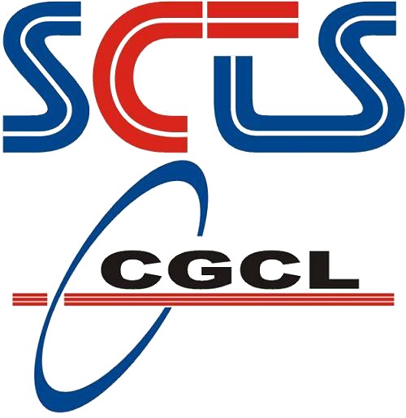
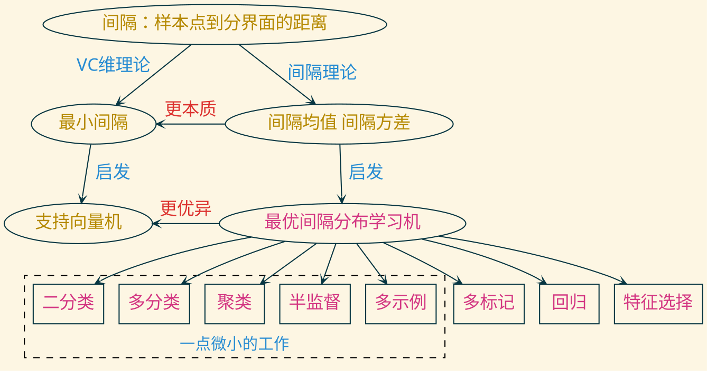
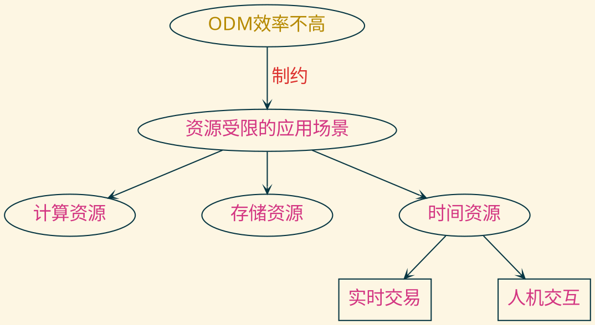
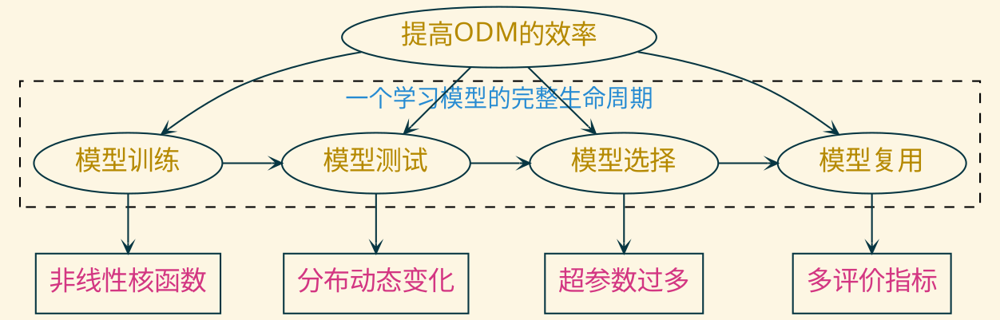

---
presentation:
  transition: "none"
  enableSpeakerNotes: true
  margin: 0
---

@import "zhangt-style.css"
@import "../common/css/font-awesome-4.7.0/css/font-awesome.css"

<!-- slide data-notes="" -->

  
  

  <h1 class="front_page_title top_10">青年科学基金项目申请</h1>
  
 
  <h4 class="front_page_subtitle top_2">资源受限的最优间隔分布学习机的研究</h4>

  <h4 class="author top_10">张 腾</h4>
  <h4 class="mail">tengzhang@hust.edu.cn</h4>
  <h4 class="date">2020 / 03 / 27</h4>

<!-- slide data-notes="啊啊啊啊啊啊啊啊啊啊啊"-->

  

    

    <h5 class="title">背景</h5>
  

  

  

  

    <h6 class="bottom_left">华中科技大学计算机学院</h6>
    <h6 class="bottom_center">SCTS & CGCL</h6>
    <h6 class="bottom_right">tengzhang@hust.edu.cn</h6>
  

<!-- slide data-notes="啊啊啊啊啊啊啊啊啊啊啊" vertical=true -->

  

    

    <h5 class="title">问题</h5>
  

  

  

  

    <h6 class="bottom_left">华中科技大学计算机学院</h6>
    <h6 class="bottom_center">SCTS & CGCL</h6>
    <h6 class="bottom_right">tengzhang@hust.edu.cn</h6>
  

<!-- slide data-notes="啊啊啊啊啊啊啊啊啊啊啊" -->

  

    

    <h5 class="title">内容</h5>
  

  

- 非线性核函数：自适应选择核函数，并实现加速
- 分布动态变化：多个候选模型对冲，控制其数量，理论保证？
- 超参数过多：已知(超参数1、最优解1)，是否可以/如何快速得到(超参数2、？)
- 多评价指标：已有以准确率维优化目标的学习模型，是否可以/如何快速得到以Precision、Recall、F-measure、AUC等其它评价指标为优化目标的学习模型

  

  

    <h6 class="bottom_left">华中科技大学计算机学院</h6>
    <h6 class="bottom_center">SCTS & CGCL</h6>
    <h6 class="bottom_right">tengzhang@hust.edu.cn</h6>
  

<!-- slide data-notes="啊啊啊啊啊啊啊啊啊啊啊" vertical=true -->

  

    

    <h5 class="title">意义</h5>
  

  

创新

- 我们AAAI'19的文章曾对ODM的核函数加速做过初步探索，现同时做核函数选择和加速，毕其功于一役
- 我们AAAI'20的文章曾对ODM的动态遗憾界做过分析，但ODM的数学性质没充分用起来，这意味着还可探索更加苛刻的自适应遗憾界
- 曾有人探索过部分统计学习模型中单个超参数与最优解的(分段线性)关系，而ODM则是多个超参数与最优解的非线性关系
- 如何将性质相近的评价指标纳入到统一的形式化框架下？如何高效求解？

价值

- 让最优间隔分布学习机这一新型统计学习框架可以进入更多的实际应用
- 在全民跟风 all in 深度学习时，需有人不忘初心，坚守退潮的领域(大雾)

  

  

    <h6 class="bottom_left">华中科技大学计算机学院</h6>
    <h6 class="bottom_center">SCTS & CGCL</h6>
    <h6 class="bottom_right">tengzhang@hust.edu.cn</h6>
  

<!-- slide data-notes="" -->

  

    

    <h5 class="title">完结</h5>
  

  

<h3 class="top_15">敬请各位专家批评指正</h3>
<h3 class="top_3">谢谢！</h3>

  

  

    <h6 class="bottom_left">华中科技大学计算机学院</h6>
    <h6 class="bottom_center">SCTS & CGCL</h6>
    <h6 class="bottom_right">tengzhang@hust.edu.cn</h6>
  

