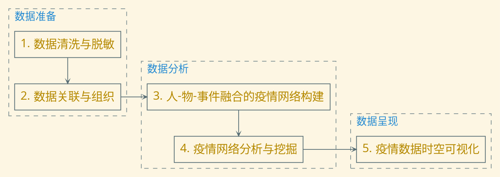
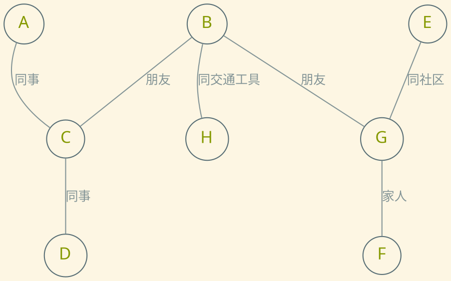
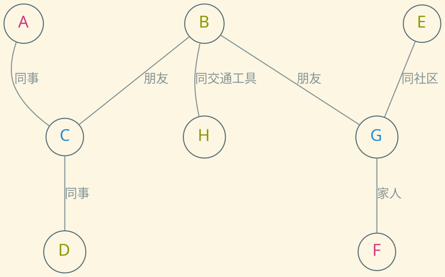
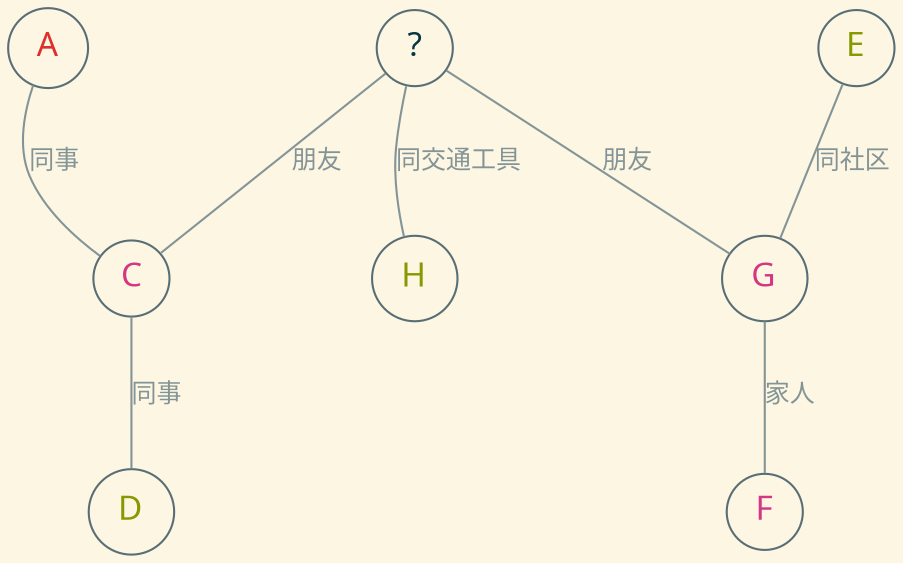
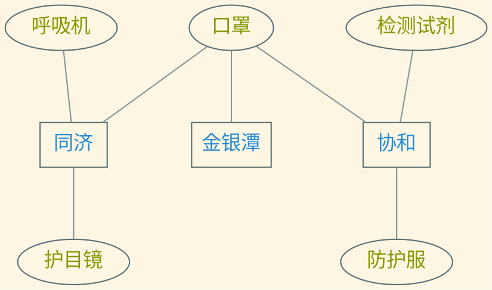
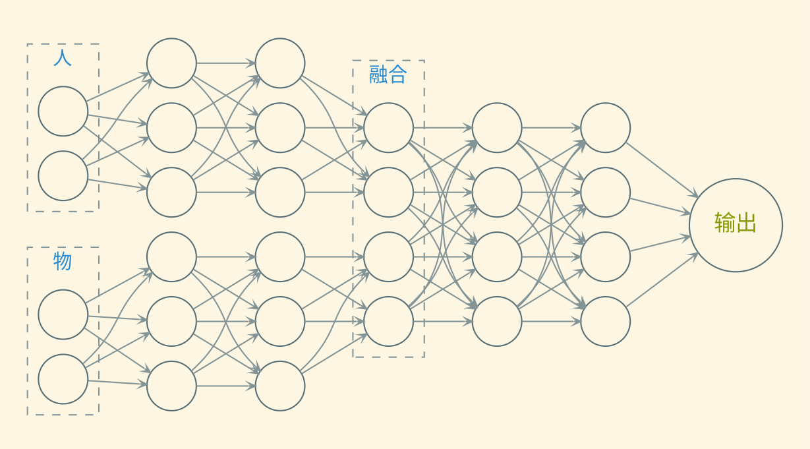
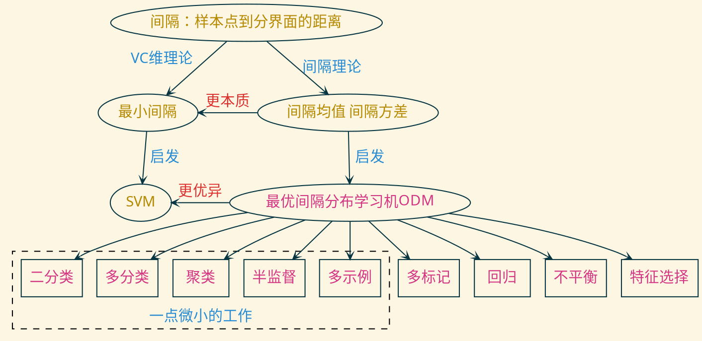
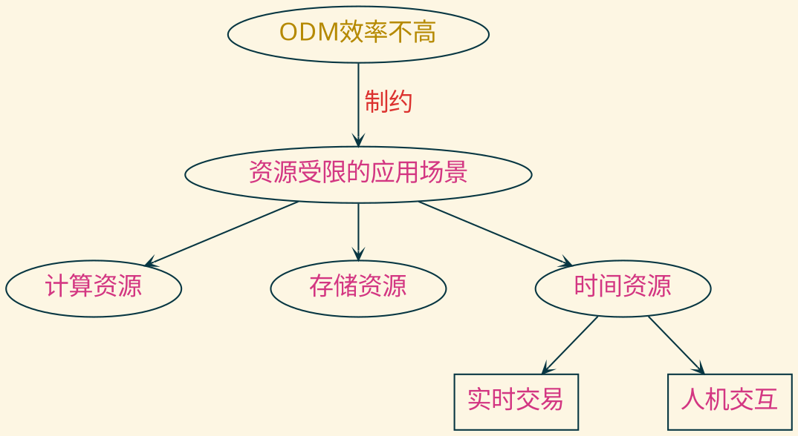
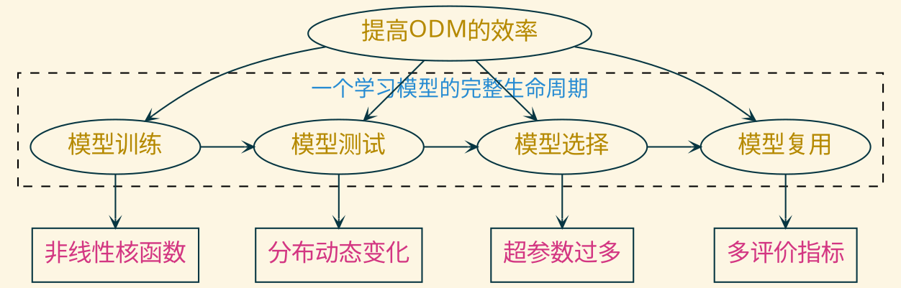

---
presentation:
    transition: "none"
    enableSpeakerNotes: true
    margin: 0
---

@import " zhangt-style.css"
@import "../common/css/font-awesome-4.7.0/css/font-awesome.css"

<!-- slide data-notes="金老师和各位老师晚上好，我简单汇报一下我们组关于新冠疫情复盘的项目，项目主要内容由石老师、华老师、黄老师以及我讨论得出" -->

    
    

    <h1 class="front_page_title top_10">面向特定时空的新冠疫情复盘</h1>
    
 
    <!-- <h4 class="front_page_subtitle top_2">暑期年会</h4> -->
    <h4 class="author top_10">大数据组</h4>
    <!-- <h4 class="mail">tengzhang@hust.edu.cn</h4> -->
    <h4 class="date">2020 / 08 / 29</h4>

<!-- slide data-notes="项目的总体目标是沉淀一份由原始数据承载的“国家记忆”。按“能收尽收、能汇尽汇”的原则，聚合出PB级可反映疫情及其抗击过程的各种载体、各种记录形式的数据，据此构建一份经过脱敏处理的可以用于复盘的“全数据集”，满足用户隐私保护与数据安全要求；研制一套“数字武汉”系统，挖掘千万级节点的疫情网络数据，用数字化手段复现疫情的宏观态势和微观事件。" -->

    

        

        <h5 class="title">项目概述</h5>
    

    

总体目标：沉淀一份由原始数据承载的“国家记忆”

成果形式

-   一份经过脱敏处理的可以用于复盘的“全数据集”
-   一套疫情大数据复盘的“数字武汉”系统

    

    

        <h6 class="bottom_left">华中科技大学计算机学院</h6>
        <h6 class="bottom_center">BDTS</h6>
        <h6 class="bottom_right">tengzhang@hust.edu.cn</h6>
    

<!-- slide data-notes="根据项目要求，我们大致归纳出5个子任务，下面我将逐一介绍"  vertical=true -->

    
 
        

        <h5 class="title">任务分解</h5>
    

    

5 个子任务

    

    

        <h6 class="bottom_left">华中科技大学计算机学院</h6>
        <h6 class="bottom_center">BDTS</h6>
        <h6 class="bottom_right">tengzhang@hust.edu.cn</h6>
    

<!-- slide data-notes="首先是数据的清洗与脱敏。由于数据来源不同、噪声多、准确性参差不齐，需先对数据进行清洗，保证数据的总体质量。此外出于保护公民个人自由和隐私的目的，对姓名等涉及个人隐私的数据进行必要的匿名化处理。其次是数据的关联与组织。因为数据来源不一样，同一个人的数据可能分成了好几块，需要先进行对齐。此外，利用人的时空移动轨迹特征，可以建立人与人之间的联系，方便后续的分析" -->

    

        

        <h5 class="title">数据准备</h5>
    

    

清洗与脱敏

-   噪声多，准确性差
-   保护公民个人自由和隐私，匿名化处理

 

关联与组织

-   来源不同，需先对齐
-   通过人的时空移动轨迹，建立人与人之间的联系

    

    

        <h6 class="bottom_left">华中科技大学计算机学院</h6>
        <h6 class="bottom_center">BDTS</h6>
        <h6 class="bottom_right">tengzhang@hust.edu.cn</h6>
    

<!-- slide data-notes="有了每个人的信息，又有了人与人之间的关系，就可以建立这样一个人流网络，网络节点是每个个人，节点可以有年龄、性别、住址、工作、位置等等属性特征；边是人与人之间的关系，如两个人可以是家人、朋友、同事、住同一个社区、坐同一趟地铁等等。对这样的图进行学习，无非三个层面，一是节点层面、二是边层面、三是整个网络层面；节点层面我们可以做节点分类，也就是个人的健康状态预测，而且具体到这个项目，是个动态图节点分类问题，因为图是时刻在变化的。就像图中这样，初始所有人都是未感染状态" -->

    

        

        <h5 class="title">图数据分析</h5>
    

    

人流网络：预测节点健康状态

节点：年龄、性别、住址、工作、位置 类别：未感染、密切接触者、轻症、重症

    

    

        <h6 class="bottom_left">华中科技大学计算机学院</h6>
        <h6 class="bottom_center">BDTS</h6>
        <h6 class="bottom_right">tengzhang@hust.edu.cn</h6>
    

<!-- slide data-notes="可能到某个时间点，A和F出现了轻症，C和G成了密切接触者" vertical=true -->

    

        

        <h5 class="title">图数据分析</h5>
    

    

人流网络：预测节点健康状态

节点：年龄、性别、住址、工作、位置 类别：未感染、密切接触者、轻症、重症

    

    

        <h6 class="bottom_left">华中科技大学计算机学院</h6>
        <h6 class="bottom_center">BDTS</h6>
        <h6 class="bottom_right">tengzhang@hust.edu.cn</h6>
    

<!-- slide data-notes="之后C和G也确诊了，那么中间B这个人的健康状态是什么呢？这里可以学个模型预测一下。边层面似乎没有什么问题可以做，边预测一般是社交网络中做推荐用的。整个网络层面的话，就是对武汉的整体状态进行预测，判断当前疫情是处于上升期、平稳期，还是下降期等等，但这似乎也没太大意义" vertical=true -->

    

        

        <h5 class="title">图数据分析</h5>
    

    

人流网络：预测节点健康状态

节点：年龄、性别、住址、工作、位置 类别：未感染、密切接触者、轻症、重症

    

    

        <h6 class="bottom_left">华中科技大学计算机学院</h6>
        <h6 class="bottom_center">BDTS</h6>
        <h6 class="bottom_right">tengzhang@hust.edu.cn</h6>
    

<!-- slide data-notes="据说数据中还有物资的信息，那么还可以建个物流网络，这是一个异质网络，节点既有物资、也有医院，物资节点的属性特征是位置、数量等等，医院节点的属性特征是各种物资的消耗和储备、各类病人的数量等等，边是节点间的物理距离、实时交通情况等等，据此可以做一个物资运送方案的智能推荐" -->

    

        

        <h5 class="title">图数据分析</h5>
    

    

物流网络：智能推荐物资运送方案

节点：物资（所在位置，数量）、医院（各种物资的消耗和储备，各类病人的数量） 边：物理距离、实时交通情况

    

    

        <h6 class="bottom_left">华中科技大学计算机学院</h6>
        <h6 class="bottom_center">BDTS</h6>
        <h6 class="bottom_right">tengzhang@hust.edu.cn</h6>
    

<!-- slide data-notes="如果既有人流信息、又有物流信息，那么还可以考虑融合两者，让它们相互辅助，利用对方的信息提升自己的性能，比如如果采用神经网络的话，可以将两个神经网络的某个隐藏层拼接起来，合为一个神经网络" -->

    

        

        <h5 class="title">图数据分析</h5>
    

    

网络融合：相互辅助，共同提升

    

    

        <h6 class="bottom_left">华中科技大学计算机学院</h6>
        <h6 class="bottom_center">BDTS</h6>
        <h6 class="bottom_right">tengzhang@hust.edu.cn</h6>
    

<!-- slide data-notes="此外，还可以学一个疫情扩散模型，传统的SIR模型是将全部人分成三类：未感染者、已感染者和已康复者。然后通过三个带参数的微分方程描述三类人之间的相互转化关系，最后问题就转化成了通过数据来估计待定参数" -->

    

        

        <h5 class="title">疫情扩散模型学习</h5>
    

    

SIR 模型：$S(t)$未感染者，$I(t)$已感染者，$R(t)$已康复者

通过三个带参数的方程描述各类人相互之间的转化关系

$$
\begin{align*}
S'(t) & = -\frac{\beta}{N} I(t) S(t) \\
I'(t) & = -\frac{\beta}{N} I(t) S(t) - \gamma I(t) \\
R'(t) & = \gamma I(t)
\end{align*}
$$

关键：如何估计参数$\beta$、$\gamma$？

    

    

        <h6 class="bottom_left">华中科技大学计算机学院</h6>
        <h6 class="bottom_center">BDTS</h6>
        <h6 class="bottom_right">tengzhang@hust.edu.cn</h6>
    

<!-- slide data-notes="对于这次的新冠疫情，依然可以采用类似的想法，不过有一些新的特征，例如病情有0-14天的潜伏期、存在无症状感染者等等，因此不是简单的再分为三类了，需要引入更多类别的人；此外免疫不是永久的，意味着康复者可能还会再转成感染者；总的来说，就是要用更精细的模型，才能准确地描述实际情况，当然这也意味着更多要学习的参数。但好在我们有每天的确诊和疑似的人数，数据量比较充足，应该可以支撑复杂模型的学习。最终关于参数的估计，可以考虑用一些机器学习里的方法，例如将预测确诊/疑似人数与实际确诊/疑似人数的差作为损失函数，然后通过最小化这个损失函数来学习模型时，参数是不可微的，这时可以采用Bayes之类的无梯度优化方法来求解" vertical=true -->

    

        

        <h5 class="title">疫情扩散模型学习</h5>
    

    

本质上与经典的 SIR 模型一样，依然将人群分为若干类，用带参数的差分方程组描述转化关系，最终通过拟合真实数据得到参数

 

新的特征，新的模型

-   潜伏期长，免疫没用，主要靠隔离
-   每天更新确诊/疑似人数，可以用更精细的模型（更多待学习的参数）

 

引入机器学习

-   损失函数为预测确诊/疑似人数与实际确诊/疑似人数的差
-   损失函数关于参数不可微，可采用 Bayes 优化之类的零阶优化方法

    

    

        <h6 class="bottom_left">华中科技大学计算机学院</h6>
        <h6 class="bottom_center">BDTS</h6>
        <h6 class="bottom_right">tengzhang@hust.edu.cn</h6>
    

<!-- slide data-notes="最后是数据呈现，首先最终展示的系统应该具有交互功能，不能限制用户只能用文字输入，应该还可以通过语音、手势等等方式进行交互；另外可视化，需要做到高效实时渲染" -->

    

        

        <h5 class="title">可视化</h5>
    

    

多模态交互

-   文字、语音、手势
-   快速响应

 

可视化

-   高效实现渲染

    

    

        <h6 class="bottom_left">华中科技大学计算机学院</h6>
        <h6 class="bottom_center">BDTS</h6>
        <h6 class="bottom_right">tengzhang@hust.edu.cn</h6>
    

<!-- slide data-notes="综上，最终总结出了8个题目，前2个是关于数据准备的，中间4个是关于数据分析的，最后2个是关于数据呈现的" -->

    

        

        <h5 class="title">人员分工安排</h5>
    

    

-   基于隐私保护的海量数据清洗与集成 &nbsp;&nbsp;&nbsp;&nbsp; 1 人
-   疫情数据的统一表示 &nbsp;&nbsp;&nbsp;&nbsp; 1 人   
-   基于图（神经网络）的个人健康状态预测 &nbsp;&nbsp;&nbsp;&nbsp; 1 人
-   物资调配方案的智能推荐 &nbsp;&nbsp;&nbsp;&nbsp; 1 人
-   融合异构数据的疫情建模 &nbsp;&nbsp;&nbsp;&nbsp; 1 人
-   基于无梯度优化的疫情扩散模型学习 &nbsp;&nbsp;&nbsp;&nbsp; 1 人   
-   疫情系统的多模态交互 &nbsp;&nbsp;&nbsp;&nbsp; 1 人
-   海量数据的实时可视化 &nbsp;&nbsp;&nbsp;&nbsp; 1 人

    

    

        <h6 class="bottom_left">华中科技大学计算机学院</h6>
        <h6 class="bottom_center">BDTS</h6>
        <h6 class="bottom_right">tengzhang@hust.edu.cn</h6>
    

<!-- slide data-notes="" -->

    

        

        <h5 class="title">完</h5>
    

    

敬请各位老师批评指正

谢谢！

    

    

        <h6 class="bottom_left">华中科技大学计算机学院</h6>
        <h6 class="bottom_center">BDTS</h6>
        <h6 class="bottom_right">tengzhang@hust.edu.cn</h6>
    

<!-- slide data-notes="下面几张slides是我接下来的工作计划" -->

  
    

  <h1 class="front_page_title top_10">工作展望</h1>
  
 
  <h4 class="front_page_subtitle top_2">2020暑期教师工作会议</h4>

  <h4 class="author top_10">张 腾</h4>
  <h4 class="mail">tengzhang@hust.edu.cn</h4>
  <h4 class="date">2020 / 08 / 29</h4>

<!-- slide data-notes="我先简单介绍一下我的研究背景，机器学习里有个很重要的概念叫间隔，它是样本点到分界面的距离，据此先后产生了两套理论，先是上世纪60年代萌芽、80年代就完整建立起来的VC维理论，它关注的是最小间隔，由此启发了支持向量机这样的学习模型；后是上世纪90年代出现、直到13年才完整建立起来的间隔理论，它关注的是间隔分布，由此启发了最优间隔分布学习机。由于后者在理论上比前者更优，得到的泛化界比前者更紧，这意味着间隔分布比最小间隔更加体现问题的本质，因此ODM实际表现通常也比SVM更优异，在将优化间隔分布的思想推广到各种学习问题设置中，我做了一些微小的工作"-->

  

    

    <h5 class="title">背景</h5>
  

  

  

  

    <h6 class="bottom_left">华中科技大学计算机学院</h6>
    <h6 class="bottom_center">BDTS</h6>
    <h6 class="bottom_right">tengzhang@hust.edu.cn</h6>
  

<!-- slide data-notes="虽然在一些常见的环境中，ODM已经做得很好了，但是对于一些资源受限的极端环境，例如在计算资源、存储资源受限的移动设备上训练模型，以及时间资源受限的实时交易等问题，ODM还没做到很好的适配，如果以盖房子来打比方的话，现阶段ODM只是建了个毛坯，离住人还有段距离，我想接下来再花些时间将ODM进一步打磨，让它使用面可以更广" vertical=true -->

  

    

    <h5 class="title">问题</h5>
  

  

  

  

    <h6 class="bottom_left">华中科技大学计算机学院</h6>
    <h6 class="bottom_center">BDTS</h6>
    <h6 class="bottom_right">tengzhang@hust.edu.cn</h6>
  

<!-- slide data-notes="考虑一个学习模型完整的生命周期，我打算从模型训练、测试、选择、复用四个方面进一步改进ODM" -->

  

    

    <h5 class="title">展望</h5>
  

  

- 非线性核函数：自适应选择核函数，并实现加速
- 分布动态变化：多个候选模型对冲，控制其数量
- 超参数过多：{超参数1、最优解1} → {超参数2、？}
- 多评价指标：准确率 → {不平衡代价、Precision、Recall、F-measure、AUC}

  

  

    <h6 class="bottom_left">华中科技大学计算机学院</h6>
    <h6 class="bottom_center">BDTS</h6>
    <h6 class="bottom_right">tengzhang@hust.edu.cn</h6>
  

<!-- slide data-notes="" -->

  

    

    <h5 class="title">完</h5>
  

  

敬请各位老师批评指正

谢谢！

  

  

    <h6 class="bottom_left">华中科技大学计算机学院</h6>
    <h6 class="bottom_center">BDTS</h6>
    <h6 class="bottom_right">tengzhang@hust.edu.cn</h6>
  

