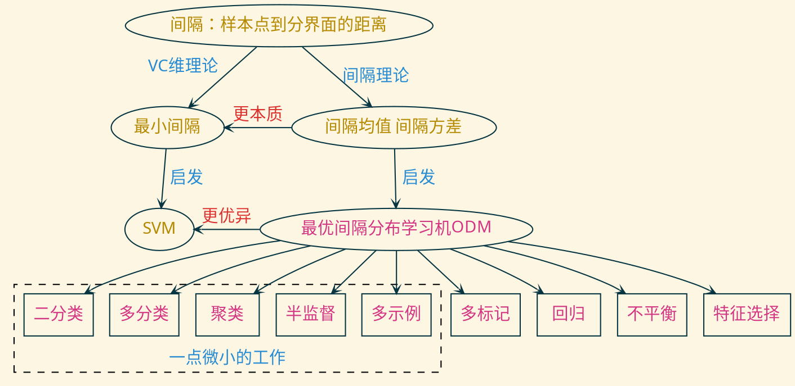
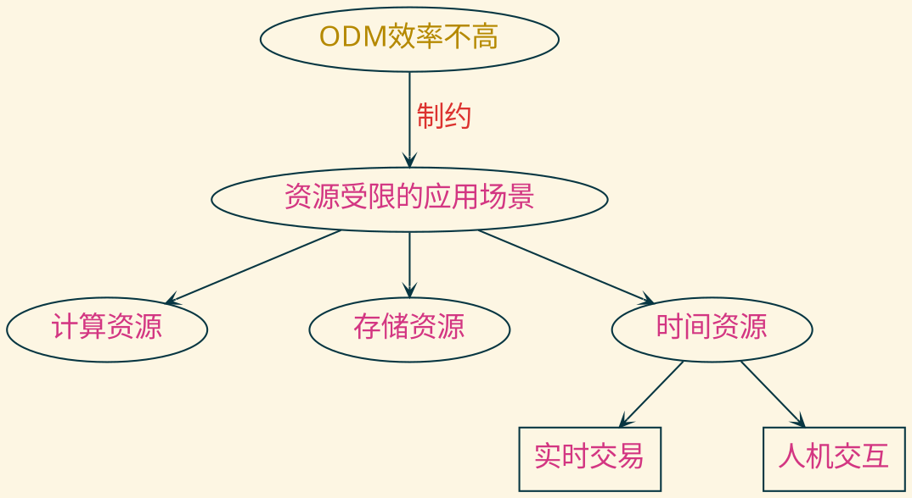
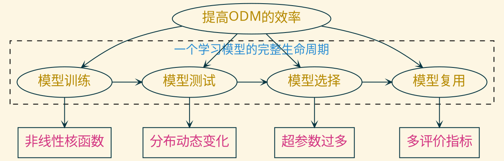

---
presentation:
  transition: "none"
  enableSpeakerNotes: true
  margin: 0
---

@import " zhangt-style.css"
@import "../common/css/font-awesome-4.7.0/css/font-awesome.css"

<!-- slide data-notes="各位老师下午好，我简要介绍一下未来的工作计划" -->

  
    

  <h1 class="front_page_title top_10">工作计划</h1>
  
 
  <h4 class="front_page_subtitle top_2">2020暑期教师工作会议</h4>

  <h4 class="author top_10">张 腾</h4>
  <h4 class="mail">tengzhang@hust.edu.cn</h4>
  <h4 class="date">2020 / 08 / 30</h4>

<!-- slide data-notes="我先简单介绍一下我的研究背景，机器学习里有个很重要的概念叫间隔，它是样本点到分界面的距离，据此先后产生了两套理论，先是上世纪60年代萌芽、80年代就完整建立起来的VC维理论，它关注的是最小间隔，由此启发了支持向量机这样经典的学习模型；后是上世纪90年代出现、直到13年才完整建立起来的间隔理论，它关注的是间隔分布，由此启发了最优间隔分布学习机。由于后者在理论上比前者更优，得到的泛化界比前者更紧，这意味着间隔分布比最小间隔更加体现问题的本质，因此ODM实际表现通常也比SVM更优异，在将优化间隔分布的思想推广到各种学习问题设置中，我做了一些微小的工作"-->

  

    

    <h5 class="title">背景</h5>
  

  

  

  

    <h6 class="bottom_left">华中科技大学计算机学院</h6>
    <h6 class="bottom_center">BDTS</h6>
    <h6 class="bottom_right">tengzhang@hust.edu.cn</h6>
  

<!-- slide data-notes="虽然在一些常见的环境中，ODM已经做得很好了，但是对于一些资源受限的极端环境，例如在手机等计算资源、存储资源受限的移动设备上训练模型，以及时间资源受限的实时交易等问题，ODM还没做到很好的适配，如果以盖房子来打比方的话，现阶段ODM只是建了个毛胚，离住人还有段距离，我想接下来花些时间将ODM进行进一步打磨，让它使用面可以更广" vertical=true -->

  

    

    <h5 class="title">问题</h5>
  

  

  

  

    <h6 class="bottom_left">华中科技大学计算机学院</h6>
    <h6 class="bottom_center">BDTS</h6>
    <h6 class="bottom_right">tengzhang@hust.edu.cn</h6>
  

<!-- slide data-notes="考虑一个学习模型完整的生命周期，我打算从模型训练、测试、选择、复用四个方面分别，分别针对核函数自适应选择、样本分布动态变化、超参数过多、多评价指标迁移四个问题，进一步改善ODM的使用体验" -->

  

    

    <h5 class="title">内容</h5>
  

  

- 非线性核函数：自适应选择核函数，并实现加速
- 分布动态变化：多个候选模型对冲，控制其数量
- 超参数过多：{超参数1、最优解1} → {超参数2、？}
- 多评价指标：准确率 → {不平衡代价、Precision、Recall、F-measure、AUC}

  

  

    <h6 class="bottom_left">华中科技大学计算机学院</h6>
    <h6 class="bottom_center">BDTS</h6>
    <h6 class="bottom_right">tengzhang@hust.edu.cn</h6>
  

<!-- slide data-notes="" -->

  

    

    <h5 class="title">完</h5>
  

  

敬请各位老师批评指正

谢谢！

  

  

    <h6 class="bottom_left">华中科技大学计算机学院</h6>
    <h6 class="bottom_center">BDTS</h6>
    <h6 class="bottom_right">tengzhang@hust.edu.cn</h6>
  

