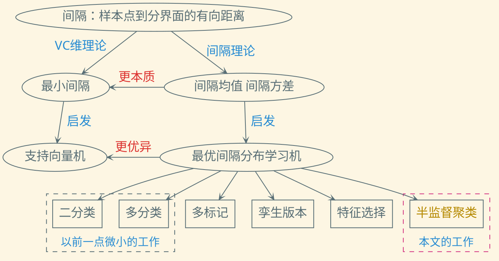

---
presentation:
  transition: "none"
  enableSpeakerNotes: true
  margin: 0
---

@import "../common/css/font-awesome-4.7.0/css/font-awesome.css"
@import "../common/css/zhangt-solarized.css"
@import "css/210807-ccml376.css"

<!-- slide data-notes="各位专家 各位老师下午好 我是来自华科计算机学院的张腾 今天和大家汇报一下我和南大黎铭老师 华科金海老师合作的一篇文章 题目是……" -->

# 面向半监督聚类的最优间隔分布学习机 CCML'21

## <u>张腾</u>1 & 黎铭2 & 金海1

### &nbsp;&nbsp;&nbsp;&nbsp;&nbsp;&nbsp;&nbsp;&nbsp;&nbsp; 1华中科技大学计算机学院 &nbsp;&nbsp;&nbsp;&nbsp; &nbsp;&nbsp;&nbsp;&nbsp; 2南京大学计算机系

<h3 style="font-style:italic">{tengzhang,hjin}@hust.edu.cn &nbsp;&nbsp;&nbsp;&nbsp;&nbsp;&nbsp;&nbsp;&nbsp;&nbsp; lim@nju.edu.cn</h3>

#### 2021 - 8 - 7

<!-- slide data-notes="这是汇报的大纲 我先给出必要的背景介绍 然后详细介绍我们提出的方法 之后是实验结果和总结展望" -->

    
    

        

        <h5>大纲</h5>
    

背景介绍

- 半监督聚类
- 最优间隔分布学习机

所提方法

- 动机
- 形式化
- 优化

实验结果

总结展望

FOOTER3 CCML'21 面向半监督聚类的最优间隔分布学习机 tengzhang@hust.edu.cn

<!-- slide vertical=true data-notes="聚类属于无监督学习的范畴，但在现实聚类任务中，除了大量的无标记样本，我们往往还能获得一些额外的监督信息，利用这些信息进一步提升算法的聚类性能称为半监督聚类很多时候  监督信息大致有两种类型：一是两两样本之间的成对约束信息，包括“必连”约束和“勿连”约束，前者是指两个样本必属于同一个簇，后者是指两个样本必不属于同一个簇；另一种是少量的有标记样本，由于有标记样本可以导出“必连”约束和“勿连”约束，而反过来不成立，因此成对约束信息的形式更为一般化，对应的算法也更为通用，本文也考虑这种形式的监督信息  根据利用方式的不同，现有的半监督聚类算法可分为两类，一是使用约束来指导最优聚类结构的搜索，二是先根据约束先进行度量学习，之后再用常规的聚类算法进行聚类" -->

    
    

        

        <h5>半监督聚类</h5>
    

监督信息类型

- 少量样本的类别标记
- 样本间的成对约束：必连约束、勿连约束

使用约束来指导最优聚类结构的搜索

- COPKMEANS [Wagstaff et al., ICML'01]
- CVQE [Davidson & Ravi, ICDM'05]、LCVQE [Pelleg & Baras, ICML'07]
- PCKMEANS [Basu et al., ICDM'04]

根据约束先进行度量学习，再用常规的聚类算法进行聚类

- 最小化必连约束距离之和、控制勿连约束距离之和 [Xing et al., NIPS'02]
- 在核映射空间做度量学习和聚类 [Hertz et al., ICML'04]
- 约束样本对->样本、约束类型->类标记 [Liu et al., KDD'07]

    

    

        <h6 class="bottom_left">面向半监督聚类的最优间隔分布学习机</h6>
        <h6 class="bottom_right">tengzhang@hust.edu.cn</h6>
    

<!-- slide vertical=true data-notes="间隔是机器学习中最为重要的概念之一，它定义为样本到分界面的有向距离，在此基础上先后发展出两套刻画泛化性能的理论，先出现的是基于最小间隔的VC维理论，由此启发了支持向量机  后出现的是间隔理论，它指出间隔分布是更为本质的物理量，由此启发了优化间隔均值和方差的最优间隔分布学习机  针对二分类和多分类问题的ODM是我之前做过的一点微小的工作，也有其他研究者……，本文是将其推广到半监督聚类问题上" -->

    
    

        

        <h5>最优间隔分布学习机</h5>
    

    

    

        <h6 class="bottom_left">面向半监督聚类的最优间隔分布学习机</h6>
        <h6 class="bottom_right">tengzhang@hust.edu.cn</h6>
    

<!-- slide vertical=true data-notes="" -->

    
    

        

        <h5>最优间隔分布学习机</h5>
    

- 最大化间隔均值
- 最小化间隔方差

$$
    \begin{align*}
        \min_{\wv, \bar{\gamma}, \xi_i, \epsilon_i} & ~ \Omega(\wv) - \eta \class{blue}{\bar{\gamma}} + \frac{\lambda}{2} \class{red}{\sum_{i \in [m]} \frac{\xi_i^2 + \epsilon_i^2}{m}}, \\
        \st                                         & ~ \gamma (\xv_i, y_i) \geq \class{blue}{\bar{\gamma}} - \xi_i, ~ \gamma (\xv_i, y_i) \leq \class{blue}{\bar{\gamma}} + \epsilon_i, ~ \forall i \in [m].
    \end{align*}
$$

<ul class="top3">
    <li>选取$\ell_2$正则</li>
    <li>代入$\gamma (\xv_i, y_i) = y_i \langle \wv, \phi(\xv_i) \rangle$</li>
    <li>拉伸$\wv$使得间隔均值$\bar{\gamma}$固定为$1$</li>
    <li>引入超参数$\nu$、$\theta$增强模型的灵活性</li>
</ul>

$$
    \begin{align*}
            \min_{\wv, \xi_i, \epsilon_i} & ~ \frac{1}{2} \|\wv\|^2 + \frac{\lambda}{2m} \sum_{i \in [m]} (\xi_i^2 + \nu \epsilon_i^2), \\
            \st & ~ y_i \langle \wv, \phi(\xv_i) \rangle \geq 1 - \theta - \xi_i, ~ y_i \langle \wv, \phi(\xv_i) \rangle \leq 1 + \theta + \epsilon_i, ~ \forall i \in [m].
    \end{align*}
$$

    

    

        <h6 class="bottom_left">面向半监督聚类的最优间隔分布学习机</h6>
        <h6 class="bottom_right">tengzhang@hust.edu.cn</h6>
    

<!-- slide data-notes="" -->

    
    

        

        <h5>大纲</h5>
    

背景介绍

- 半监督聚类
- 最优间隔分布学习机

所提方法

- 形式化
- 优化

实验结果

总结展望

    

    

        <h6 class="bottom_left">面向半监督聚类的最优间隔分布学习机</h6>
        <h6 class="bottom_right">tengzhang@hust.edu.cn</h6>
    

<!-- slide vertical=true data-notes="之前我们说过ODM是上面这个形式，做半监督聚类时就得联合优化簇标记赋值和间隔分布了，第二个式子中的优化变量\yhat的可行域集合B就是我们的约束信息" -->

    
    

        

        <h5>形式化</h5>
    

最优间隔分布学习机

$$
    \begin{align*}
        \min_{\wv, \xi_i, \epsilon_i} & ~ \frac{1}{2} \|\wv\|^2 + \frac{\lambda}{2m} \sum_{i \in [m]} (\xi_i^2 + \nu \epsilon_i^2), \\
        \st & ~ y_i \langle \wv, \phi(\xv_i) \rangle \geq 1 - \theta - \xi_i, ~ y_i \langle \wv, \phi(\xv_i) \rangle \leq 1 + \theta + \epsilon_i, ~ \forall i \in [m].
    \end{align*}
$$

    利用成对约束信息联合优化簇标记赋值和间隔分布

$$
    \begin{align*}
        \class{blue}{\min_{\yvhat \in \Bcal}} \min_{\wv, \xi_i, \epsilon_i} & ~ \frac{1}{2} \|\wv\|^2 + \frac{\lambda}{2m} \sum_{i \in [m]} (\xi_i^2 + \nu \epsilon_i^2), \\
        \st & ~ \class{blue}{\yhat_i} \langle \wv, \phi(\xv_i) \rangle \geq 1 - \theta - \xi_i, ~ \class{blue}{\yhat_i} \langle \wv, \phi(\xv_i) \rangle \leq 1 + \theta + \epsilon_i, ~ \forall i \in [m].
    \end{align*}
$$

- $\Bcal = \{ \yvhat = [\yhat_1; \ldots; \yhat_m] \mid \yhat_i = \yhat_j, ~ \forall (i, j) \in \Mcal, ~ \yhat_k \neq \yhat_l, ~ \forall (k, l) \in \Ccal \}$是候选簇标记赋值集合
- $\Mcal$是“必连”约束集合, $\Ccal$是“勿连”约束集合

    

    

        <h6 class="bottom_left">面向半监督聚类的最优间隔分布学习机</h6>
        <h6 class="bottom_right">tengzhang@hust.edu.cn</h6>
    

<!-- slide vertical=true data-notes="由于核映射的存在，内层问题一般转化为对偶问题" -->

    
    

        

        <h5>形式化 变形</h5>
    

当前问题

$$
    \begin{align*}
        \class{blue}{\min_{\yvhat \in \Bcal}} \min_{\wv, \xi_i, \epsilon_i} & ~ \frac{1}{2} \|\wv\|^2 + \frac{\lambda}{2m} \sum_{i \in [m]} (\xi_i^2 + \nu \epsilon_i^2), \\
        \st & ~ \class{blue}{\yhat_i} \langle \wv, \phi(\xv_i) \rangle \geq 1 - \theta - \xi_i, ~ \class{blue}{\yhat_i} \langle \wv, \phi(\xv_i) \rangle \leq 1 + \theta + \epsilon_i, ~ \forall i \in [m].
    \end{align*}
$$

由于核映射$\phi$的存在，内层问题一般转化为对偶问题，引入拉格朗日乘子$\alphav = [\alpha_1; \ldots; \alpha_m]$、$\betav = [\beta_1; \ldots; \beta_m]$、$\deltav = \alphav - \betav$，根据 KKT 条件

$$
    \begin{align*}
        \wv = \sum_{i \in [m]} (\alpha_i - \beta_i) \yhat_i \phi(\xv_i), \quad \lambda \xi_i = m \alpha_i, \quad \lambda \nu \epsilon_i = m \beta_i.
    \end{align*}
$$

对偶问题为

$$
    \begin{align*}
        \class{blue}{\min_{\yvhat \in \Bcal}} \max_{\alphav, \betav \succeq \zerov} - \frac{1}{2} \deltav^\top (\Kv \odot \class{blue}{\yvhat} \class{blue}{\yvhat}^\top) \deltav - \underbrace{\frac{m}{2 \lambda} \begin{bmatrix}
            \alphav \\ \betav
        \end{bmatrix}^\top
        \begin{bmatrix}
            \Iv          \\
            & \Iv / \nu
        \end{bmatrix}
        \begin{bmatrix}
            \alphav \\ \betav
        \end{bmatrix} - \begin{bmatrix} (\theta - 1) \ev \\ (\theta + 1) \ev \end{bmatrix}^\top \begin{bmatrix}
            \alphav \\ \betav
        \end{bmatrix}}_{A(\alphav, \betav)}.
    \end{align*}
$$

    

    

        <h6 class="bottom_left">面向半监督聚类的最优间隔分布学习机</h6>
        <h6 class="bottom_right">tengzhang@hust.edu.cn</h6>
    

<!-- slide vertical=true data-notes="外层问题是整数规划，直接求解是NP难的，所以交换……，将它挪到内层，方便进一步处理，这步交换实际是做了一个凸放松  挪到内层之后，将内层的从有限集合B中选取是目标函数值最小的\yhat，转化为连续优化问题，只需引入变量\mu即可  最后再次交换min和max顺序，这个交换是等价交换，得到要求解的对偶问题" -->

    
    

        

        <h5>形式化 变形</h5>
    

当前问题

$$
    \begin{align*}
        \class{blue}{\min_{\yvhat \in \Bcal}} \max_{\alphav, \betav \succeq \zerov} - \frac{1}{2} \deltav^\top (\Kv \odot \class{blue}{\yvhat} \class{blue}{\yvhat}^\top) \deltav - A(\alphav, \betav).
    \end{align*}
$$

外层问题是整数规划，交换$\min_{\yvhat \in \Bcal}$和$\max_{\alphav, \betav \succeq \zerov}$[Li et al., AISTATS'09]

$$
    \begin{align*}
        \max_{\alphav, \betav \succeq \zerov} \class{blue}{\min_{\yvhat \in \Bcal}} - \frac{1}{2} \deltav^\top (\Kv \odot \class{blue}{\yvhat} \class{blue}{\yvhat}^\top) \deltav - A(\alphav, \betav).
    \end{align*}
$$

引入$|\Bcal|$维单纯形$\Delta^{|\Bcal|} = \{ \muv \mid \ev^\top \muv = 1, ~ \muv \succeq \zerov \}$可得连续优化：

$$
    \begin{align*}
        \max_{\alphav, \betav \succeq \zerov} \class{blue}{\min_{\muv \in \Delta^{|\Bcal|}}} - \frac{1}{2} \deltav^\top \left( \sum_{t:\yvhat_t \in \Bcal} \mu_t \Kv \odot \yvhat_t \yvhat_t^\top \right) \deltav - A(\alphav, \betav).
    \end{align*}
$$

根据鞍点定理[Kim & Boyd, CDC'07]，再次(等价)交换

$$
    \begin{align*}
        \text{ODMSSC-D}: ~ \min_{\muv \in \Delta^{|\Bcal|}} \max_{\alphav, \betav \succeq \zerov} - \frac{1}{2} \deltav^\top \left( \sum_{t: \yvhat_t \in \Bcal} \mu_t \Kv \odot \yvhat_t \yvhat_t^\top \right) \deltav - A(\alphav, \betav).
    \end{align*}
$$

    

    

        <h6 class="bottom_left">面向半监督聚类的最优间隔分布学习机</h6>
        <h6 class="bottom_right">tengzhang@hust.edu.cn</h6>
    

<!-- slide data-notes="有了对偶问题，下面再推导下原问题，引入辅助样本和辅助核矩阵，可以将对偶问题第一项中的求和写成紧凑的形式，对比没放松前的对偶问题，就是K变成了\tilde{K}，\yhat变成了\ev，因此立刻可以得到原问题" -->

    
    

        

        <h5>形式化 原问题</h5>
    

ODMSSC 的对偶问题

$$
    \begin{align*}
        \text{ODMSSC-D}: ~ \min_{\muv \in \Delta^{|\Bcal|}} \max_{\alphav, \betav \succeq \zerov} - \frac{1}{2} \deltav^\top \left( \sum_{t: \yvhat_t \in \Bcal} \mu_t \Kv \odot \yvhat_t \yvhat_t^\top \right) \deltav - A(\alphav, \betav).
    \end{align*}
$$

- 辅助样本$\xvt_i = [\sqrt{\mu_1} [\yvhat_1]_i \phi(\xv_i); \ldots; \sqrt{\mu_{|\Bcal|}} [\yvhat_{|\Bcal|}]_i \phi(\xv_i)]$
- 辅助核矩阵$\Kvt$满足$[\Kvt]_{ij} = \langle \xvt_i, \xvt_j \rangle$

$$
    \begin{align*}
        \text{ODMSSC-D}: ~ \min_{\muv \in \Delta^{|\Bcal|}} \max_{\alphav, \betav \succeq \zerov} & - \frac{1}{2} \deltav^\top (\class{blue}{\Kvt \odot \ev \ev^\top}) \deltav - A(\alphav, \betav). \\
        & ~ \class{red}{\bigg \Downarrow ~ \Kv \rightarrow \Kvt, ~ \yvhat \rightarrow \ev} \\
        \text{ODMSSC-P}: ~ \min_{\muv \in \Delta^{|\Bcal|}} \min_{\wvt, \xi_i, \epsilon_i} & ~ \frac{1}{2} \|\wvt\|^2 + \frac{\lambda}{2m} \sum_{i \in [m]} (\xi_i^2 + \nu \epsilon_i^2), \\
        \st & ~ \langle \wvt, \xvt_i \rangle \geq 1 - \theta - \xi_i, ~ \langle \wvt, \xvt_i \rangle \leq 1 + \theta + \epsilon_i, ~ \forall i \in [m].
    \end{align*}
$$

KKT 条件为$\wvt = \sum_{i \in [m]} (\alpha_i - \beta_i) \xvt_i$、$\lambda \xi_i = m \alpha_i$、$\lambda \nu \epsilon_i = m \beta_i$

    

    

        <h6 class="bottom_left">面向半监督聚类的最优间隔分布学习机</h6>
        <h6 class="bottom_right">tengzhang@hust.edu.cn</h6>
    

<!-- slide vertical=true data-notes="最后通过引入\wv_1, \ldots, \wv_B，将隐藏在\xvt_i中外层优化变量\muv给显式地弄出来，就得到了最终要求解地原问题" -->

    
    

        

        <h5>形式化 原问题</h5>
    

ODMSSC 的原问题

$$
    \begin{align*}
        \text{ODMSSC-P}: ~ \min_{\muv \in \Delta^{|\Bcal|}} \min_{\wvt, \xi_i, \epsilon_i} & ~ \frac{1}{2} \|\wvt\|^2 + \frac{\lambda}{2m} \sum_{i \in [m]} (\xi_i^2 + \nu \epsilon_i^2), \\
        \st & ~ \langle \wvt, \xvt_i \rangle \geq 1 - \theta - \xi_i, ~ \langle \wvt, \xvt_i \rangle \leq 1 + \theta + \epsilon_i, ~ \forall i \in [m].
    \end{align*}
$$

外层优化变量$\muv$隐藏在$\xvt_i$中，设$\wvt = [\wv_1 / \sqrt{\mu_1}; \ldots; \wv_{|\Bcal|} / \sqrt{\mu_{|\Bcal|}}]$

$$
    \begin{align*}
        \text{ODMSSC-P}: ~ \min_{\muv \in \Delta^{|\Bcal|}} \min_{\wv_t, \xi_i, \epsilon_i} & ~ \frac{1}{2} \sum_{t: \yvhat_t \in \Bcal} \frac{\|\wv_t\|^2}{\mu_t} + \frac{\lambda}{2m} \sum_{i \in [m]} (\xi_i^2 + \nu \epsilon_i^2), \\
        \st & ~ \sum_{t: \yvhat_t \in \Bcal} [\yvhat_t]_i \langle \wv_t, \phi(\xv_i) \rangle \geq 1 - \theta - \xi_i \\ 
        & ~ \sum_{t: \yvhat_t \in \Bcal} [\yvhat_t]_i \langle \wv_t, \phi(\xv_i) \rangle \leq 1 + \theta + \epsilon_i, ~ \forall i \in [m].
    \end{align*}
$$

    

    

        <h6 class="bottom_left">面向半监督聚类的最优间隔分布学习机</h6>
        <h6 class="bottom_right">tengzhang@hust.edu.cn</h6>
    

<!-- slide vertical=true data-notes="这就是最终要求解的原问题和对偶问题" -->

    
    

        

        <h5>形式化 最终形式</h5>
    

ODMSSC 的原问题

$$
    \begin{align*}
        \min_{\muv \in \Delta^{|\Bcal|}} \min_{\wv_t, \xi_i, \epsilon_i} & ~ \frac{1}{2} \sum_{t: \yvhat_t \in \Bcal} \frac{\|\wv_t\|^2}{\mu_t} + \frac{\lambda}{2m} \sum_{i \in [m]} (\xi_i^2 + \nu \epsilon_i^2), \\
        \st & ~ \sum_{t: \yvhat_t \in \Bcal} [\yvhat_t]_i \langle \wv_t, \phi(\xv_i) \rangle \geq 1 - \theta - \xi_i \\ 
        & ~ \sum_{t: \yvhat_t \in \Bcal} [\yvhat_t]_i \langle \wv_t, \phi(\xv_i) \rangle \leq 1 + \theta + \epsilon_i, ~ \forall i \in [m].
    \end{align*}
$$

ODMSSC 的对偶问题

$$
    \begin{align*}
        \min_{\muv \in \Delta^{|\Bcal|}} \max_{\alphav, \betav \succeq \zerov} - \frac{1}{2} \begin{bmatrix}
        \alphav \\ \betav
    \end{bmatrix}^\top & \begin{bmatrix}
        \Iv \\ -\Iv
    \end{bmatrix} \Kvt \begin{bmatrix}
        \Iv \\ -\Iv
    \end{bmatrix}^\top \begin{bmatrix}
        \alphav \\ \betav
    \end{bmatrix} \\
    & \qquad - \frac{m}{2 \lambda} \begin{bmatrix}
        \alphav \\ \betav
    \end{bmatrix}^\top
    \begin{bmatrix}
        \Iv &           \\
            & \Iv / \nu
    \end{bmatrix}
    \begin{bmatrix}
        \alphav \\ \betav
    \end{bmatrix} - \begin{bmatrix} (\theta - 1) \ev \\ (\theta + 1) \ev \end{bmatrix}^\top \begin{bmatrix}
        \alphav \\ \betav
    \end{bmatrix}.
    \end{align*}
$$

    

    

        <h6 class="bottom_left">面向半监督聚类的最优间隔分布学习机</h6>
        <h6 class="bottom_right">tengzhang@hust.edu.cn</h6>
    

<!-- slide data-notes="由于有两层优化，我们采用交替优化，当\muv固定时，通过对偶问题可以得到\alphav、\betav优化子问题，这是非负象限上的凸二次规划，……" -->

    
    

        

        <h5>交替优化</h5>
    

当$\muv$固定时，$\Kvt$亦固定，优化$\alphav$、$\betav$为非负象限上的凸二次规划

$$
    \begin{align*}
        \max_{\alphav, \betav \succeq \zerov} - \frac{1}{2} \begin{bmatrix}
            \alphav \\ \betav
        \end{bmatrix}^\top \begin{bmatrix}
            \Kvt + m \Iv / \lambda & -\Kvt \\ -\Kvt & \Kvt + m \Iv / \lambda \nu
        \end{bmatrix} \begin{bmatrix}
            \alphav \\ \betav
        \end{bmatrix} - \begin{bmatrix} (\theta - 1) \ev \\ (\theta + 1) \ev \end{bmatrix}^\top \begin{bmatrix}
            \alphav \\ \betav
        \end{bmatrix}
    \end{align*}
$$

采用投影梯度法

$$
    \begin{align*}
        \begin{bmatrix}
            \alphav \\ \betav
        \end{bmatrix} \leftarrow \max \left\{ \zerov, \begin{bmatrix}
            \alphav \\ \betav
        \end{bmatrix} - \eta \left( \begin{bmatrix}
            \Kvt + m \Iv / \lambda & -\Kvt \\ -\Kvt & \Kvt + m \Iv / \lambda \nu
        \end{bmatrix} \begin{bmatrix}
            \alphav \\ \betav
        \end{bmatrix} + \begin{bmatrix} (\theta - 1) \ev \\ (\theta + 1) \ev \end{bmatrix} \right) \right\}
    \end{align*}
$$

求得$\alphav$、$\betav$后，由$\lambda \xi_i = m \alpha_i$、$\lambda \nu \epsilon_i = m \beta_i$可得$\epsilon_i$、$\xi_i$，由

$$
    \begin{align*}
        \begin{bmatrix}
            \wv_1 / \sqrt{\mu_1} \\ \vdots \\ \wv_{|\Bcal|} / \sqrt{\mu_{|\Bcal|}}
        \end{bmatrix} = \wvt = \sum_{i \in [m]} (\alpha_i - \beta_i) \xvt_i = \sum_{i \in [m]} (\alpha_i - \beta_i) \begin{bmatrix}
            \sqrt{\mu_1} [\yvhat_1]_i \phi(\xv_i) \\ \vdots \\ \sqrt{\mu_{|\Bcal|}} [\yvhat_{|\Bcal|}]_i \phi(\xv_i)
        \end{bmatrix}
    \end{align*}
$$

可得$\wv_1, \ldots, \wv_{|\Bcal|}$

    

    

        <h6 class="bottom_left">面向半监督聚类的最优间隔分布学习机</h6>
        <h6 class="bottom_right">tengzhang@hust.edu.cn</h6>
    

<!-- slide vertical=true data-notes="当\alphav、\betav固定时，\muv优化子问题较为简单，通过柯西不等式可以直接得到闭式解" -->

    
    

        

        <h5>交替优化</h5>
    

当$\alphav$、$\betav$固定时，$\wv_t$、$\epsilon_i$、$\xi_i$亦固定，$\muv$优化子问题为

$$
    \begin{align*}
        \min_{\muv \in \Delta^{|\Bcal|}} ~ \sum_{t: \yvhat_t \in \Bcal} \frac{\|\wv_t\|^2}{\mu_t}
    \end{align*}
$$

由柯西-施瓦茨不等式知

$$
    \begin{align*}
        \sum_{t: \yvhat_t \in \Bcal} \frac{\|\wv_t\|^2}{\mu_t} = \left( \sum_{t: \yvhat_t \in \Bcal} \frac{\|\wv_t\|^2}{\mu_t} \right) \left( \sum_{t: \yvhat_t \in \Bcal} \mu_t \right) \ge \left( \sum_{t: \yvhat_t \in \Bcal} \|\wv_t\| \right)^2
    \end{align*}
$$

取等号的条件是$\|\wv_t\| / \mu_t$为常数，不妨设为$k$，于是有闭式解

$$
    \begin{align*}
        \mu_t = \frac{\|\wv_t\|}{k} = \frac{\|\wv_t\|}{k \sum_{i: \yvhat_i \in \Bcal} \mu_i} = \frac{\|\wv_t\|}{\sum_{i: \yvhat_i \in \Bcal} \|\wv_i\|}
    \end{align*}
$$

    

    

        <h6 class="bottom_left">面向半监督聚类的最优间隔分布学习机</h6>
        <h6 class="bottom_right">tengzhang@hust.edu.cn</h6>
    

<!-- slide data-notes="下面我们说一下具体的实现，回忆一下，优化变量\yvhat是整型变量，难以直接优化，我们引入\muv将问题连续化，但\muv的维度与样本数是呈指数关系的，所以我们其实是将混合整数规划转化为了指数维的连续优化  但好在一个稀疏的\muv就足以以很高的精度接近最优解，因此算法可设计为内外两层循环……" -->

    
    

        

        <h5>算法实现</h5>
    

优化变量$\yvhat \in \Bcal$是整型变量

- 引入$|\Bcal|$维单纯形$\muv \in \Delta^{|\Bcal|}$将问题连续化
- $\muv$的维度$|\Bcal|$与样本数呈指数关系
- 混合整数规划$\longrightarrow$高维连续优化

稀疏的$\muv$足以以很高的精度接近最优解

算法总体结构可设计为内外两层循环

- 外层循环不断扩充$\muv$的非零维
- 内层循环对$\muv$的非零维做交替优化并输出最优目标函数值
- 当相邻两轮外层循环的最优目标函数值无显著变化时，停止对$\muv$的非零维的扩充，结束整个优化过程

    

    

        <h6 class="bottom_left">面向半监督聚类的最优间隔分布学习机</h6>
        <h6 class="bottom_right">tengzhang@hust.edu.cn</h6>
    

<!-- slide vertical=true data-notes="再回过头看一下，最初要求解的问题是第一个式子，它关于\yvhat的优化问题是凸函数求极大值，这很难求  设第T轮外层循环\muv的非零维下标集合为\Ical_T，显然随着不断迭代，\Ical_T逐渐扩充" -->

    
    

        

        <h5>算法实现</h5>
    

最初的问题为

$$
    \begin{align*}
        \class{blue}{\min_{\yvhat \in \Bcal}} \max_{\alphav, \betav \succeq \zerov} - \frac{1}{2} \deltav^\top (\Kv \odot \class{blue}{\yvhat} \class{blue}{\yvhat}^\top) \deltav - \frac{m}{2 \lambda} \begin{bmatrix}
            \alphav \\ \betav
        \end{bmatrix}^\top
        \begin{bmatrix}
            \Iv          \\
            & \Iv / \nu
        \end{bmatrix}
        \begin{bmatrix}
            \alphav \\ \betav
        \end{bmatrix} - \begin{bmatrix} (\theta - 1) \ev \\ (\theta + 1) \ev \end{bmatrix}^\top \begin{bmatrix}
            \alphav \\ \betav
        \end{bmatrix}
    \end{align*}
$$

其关于$\yvhat$的优化问题为

$$
    \begin{align*}
        \max_{\yvhat \in \Bcal} ~ \deltav^\top \diag(\yvhat) \Kv \diag(\yvhat) \deltav = \max_{\yvhat \in \Bcal} ~ \yvhat^\top \underbrace{\diag(\deltav) \Kv \diag(\deltav)}_{= ~ \Hv} \yvhat = \max_{\yvhat \in \Bcal} ~ \yvhat^\top \Hv \yvhat
    \end{align*}
$$

设第$T$轮外层循环

- $\muv$的非零维下标集合为$\Ical_T$
- 定义候选簇标记赋值集合$\Acal_T = \{ \yvhat_t \in \Bcal \mid t \in \Ical_T \}$
- 由于$\Ical_1 \subseteq \Ical_2 \subseteq \cdots \subseteq [|\Bcal|]$，因此$\Acal_1 \subseteq \Acal_2 \subseteq \cdots \subseteq \Bcal$，故

$$
    \begin{align*}
        \max_{\yvhat \in \Acal_1} ~ \yvhat^\top \Hv \yvhat ~ < ~ \max_{\yvhat \in \Acal_2} ~ < ~ \yvhat^\top \Hv \yvhat ~ < ~ \cdots ~ < ~ \max_{\yvhat \in \Bcal} ~ \yvhat^\top \Hv \yvhat
    \end{align*}
$$

    

    

        <h6 class="bottom_left">面向半监督聚类的最优间隔分布学习机</h6>
        <h6 class="bottom_right">tengzhang@hust.edu.cn</h6>
    

<!-- slide vertical=true data-notes="因此不断增加\muv的非零维可以看成构造了一个问题序列，逐步逼近原问题，由于单调有界序列必有极限，因此我们算法的收敛性也有了保障，此外扩充非零维时应选择尽可能使得目标函数值增大的\yhat，我们提出了一个简单的算法，先求\ybar，再求\tilde{y}，只要蓝色的式子满足，就有严格单调增成立  由于\Acal_T中只有有限个元素，因此遍历取令目标函数最大的\yvhat即可，最终只剩求解$\yvt$，这是一个整数线性规划" -->

    
    

        

        <h5>算法实现</h5>
    

$$
    \begin{align*}
        \max_{\yvhat \in \Acal_1} ~ \yvhat^\top \Hv \yvhat ~ < ~ \max_{\yvhat \in \Acal_2} ~ < ~ \yvhat^\top \Hv \yvhat ~ < ~ \cdots ~ < ~ \max_{\yvhat \in \Bcal} ~ \yvhat^\top \Hv \yvhat
    \end{align*}
$$

- 扩充$\muv$的非零维的过程相当于构造问题序列逐渐逼近原问题的过程
- 扩充$\Acal_T$时应选择尽可能使得目标函数值增大的$\yvhat$
- 凸函数求极大值的问题，难以直接求解

定义$\yvbar = \argmax_{\yvhat \in \Acal_T} \yvhat^\top \Hv \yvhat$、$\yvt = \argmax_{\yvhat \in \Bcal} \yvhat^\top \Hv \yvbar$

只要$\class{blue}{\yvt^\top \Hv \yvbar \neq \yvbar^\top \Hv \yvbar}$，就有$\yvt^\top \Hv \yvt > \yvbar^\top \Hv \yvbar$。设$\yvt^\top \Hv \yvt \le \yvbar^\top \Hv \yvbar$，则有

$$
    \begin{align*}
        0 \le (\yvt - \yvbar)^\top \Hv (\yvt - \yvbar) = \yvt^\top \Hv \yvt + \yvbar^\top \Hv \yvbar - 2 \yvt^\top \Hv \yvbar \le 2 (\yvbar^\top \Hv \yvbar - \yvt^\top \Hv \yvbar) < 0
    \end{align*}
$$

- 由于$\Acal_T$中只有有限个元素，因此遍历取令目标函数最大的$\yvhat$即可
- 最终只剩求解$\yvt$，这是一个整数线性规划

    

    

        <h6 class="bottom_left">面向半监督聚类的最优间隔分布学习机</h6>
        <h6 class="bottom_right">tengzhang@hust.edu.cn</h6>
    

<!-- slide vertical=true data-notes="" -->

    
    

        

        <h5>算法实现</h5>
    

整数线性规划$\yvt = \argmax_{\yvhat \in \Bcal} \yvhat^\top \Hv \yvbar$

- 由于$\yvhat \in \{ 1, -1\}^m$，故若不考虑约束关系，有闭式解$\yvt = \sgn(\Hv \yvbar)$
- 当$\yvt$不满足某个约束时，不妨设为$(i, j)$，则需改变$[\yvt]_i$和$[\yvt]_j$之一的符号
- 设要改变的是$[\yvt]_i$，则同时改变与$\xv_i$有“必连”约束和“勿连”约束关系的所有样本的簇标记赋值，使得约束得以满足
- 比较改变$[\yvt]_i$、$[\yvt]_j$时目标函数值的变化，取其优者

    

    

        <h6 class="bottom_left">面向半监督聚类的最优间隔分布学习机</h6>
        <h6 class="bottom_right">tengzhang@hust.edu.cn</h6>
    

<!-- slide data-notes="" -->

    
    

        

        <h5>大纲</h5>
    

背景介绍

- 半监督聚类
- 最优间隔分布学习机

所提方法

- 形式化
- 优化

实验结果

总结展望

    

    

        <h6 class="bottom_left">面向半监督聚类的最优间隔分布学习机</h6>
        <h6 class="bottom_right">tengzhang@hust.edu.cn</h6>
    

<!-- slide vertical=true data-notes="" -->

    
    

        

        <h5>实验设置</h5>
    

共采用 12 个真实数据集，涉及文本、图像、语音多种类型

| 编号 | 名称           |  #样本 | #特征 |
| :--- | :------------- | -----: | ----: |
| 1    | dbworld        |     64 | 3,721 |
| 2    | leukemia       |     72 | 7,129 |
| 3    | fruitfly       |    125 |     4 |
| 4    | semeion        |    319 |   256 |
| 5    | pizzaCutter    |    661 |    37 |
| 6    | pieChart       |    705 |    37 |
| 7    | pc4            |  1,458 |    37 |
| 8    | hivaAgnostic   |  4,229 | 1,617 |
| 9    | wilt           |  4,839 |     5 |
| 10   | wilpageBlocks  |  5,473 |    10 |
| 11   | JapaneseVowels |  9,661 |    14 |
| 12   | letter         | 20,000 |    16 |

    

    

        <h6 class="bottom_left">面向半监督聚类的最优间隔分布学习机</h6>
        <h6 class="bottom_right">tengzhang@hust.edu.cn</h6>
    

<!-- slide vertical=true data-notes="" -->

    
    

        

        <h5>实验设置</h5>
    

约束生成

- 随机选取两个样本，若两个样本真实类别标记相同，则标为必连约束，否则标为勿连约束
- 每个数据集上随机生成 100 组约束

对比方法

- 3 种使用约束指导最优聚类结构搜索的算法：COPKMEANS、LCVQE、PCKMEANS
- 2 种基于度量学习的算法：MPCKMEANS、MKMEANS

评价指标：Rand 指数、FM 指数、归一化互信息

    

    

        <h6 class="bottom_left">面向半监督聚类的最优间隔分布学习机</h6>
        <h6 class="bottom_right">tengzhang@hust.edu.cn</h6>
    

<!-- slide vertical=true data-notes="我们在每个数据集上均进行了10次随机实验，并总结了均值和标准差。每个数据集上的最好结果以粗体显示，实心圆/空心圆分别代表对应数据集上ODMSSC在以95%显著性水平的成对t检验意义下显著优/劣于对比方法，可以看出在大多时候都显著优于其它对比方法，FM指数和归一化互信息也有类似的结果，我就不一一贴出来了" -->

    
    

        

        <h5>Rand指数结果</h5>
    

| 数据集         |     COPKMEANS      |       LCVQE        |      PCKMEANS      |      MKMEANS       |     MPCKMEANS      |        ODMSSC        |
| :------------- | :----------------: | :----------------: | :----------------: | :----------------: | :----------------: | :------------------: |
| dbworld        | $.494±.002\bullet$ | $.844±.035\bullet$ | $.494±.000\bullet$ | $.803±.035\bullet$ | $.501±.007\bullet$ | $\textbf{.939±.068}$ |
| leukemia       | $.528±.039\bullet$ | $.815±.143\bullet$ | $.576±.006\bullet$ | $.592±.021\bullet$ | $.542±.035\bullet$ | $\textbf{.931±.057}$ |
| fruitfly       | $.502±.005\bullet$ | $.499±.002\bullet$ | $.500±.002\bullet$ | $.503±.000\bullet$ | $.501±.004\bullet$ | $\textbf{.594±.043}$ |
| semeion        | $.840±.011\bullet$ | $.977±.003\bullet$ | $.975±.000\bullet$ |    $.981±.000$     | $.828±.019\bullet$ | $\textbf{.983±.004}$ |
| pizzaCutter    | $.528±.001\bullet$ | $.544±.049\bullet$ | $.530±.000\bullet$ | $.528±.000\bullet$ | $.588±.118\bullet$ | $\textbf{.827±.000}$ |
| pieChart       | $.531±.001\bullet$ | $.534±.056\bullet$ | $.531±.001\bullet$ | $.529±.000\bullet$ | $.531±.002\bullet$ | $\textbf{.816±.000}$ |
| pc4            | $.506±.000\bullet$ | $.502±.000\bullet$ | $.506±.000\bullet$ | $.505±.000\bullet$ | $.545±.079\bullet$ | $\textbf{.785±.000}$ |
| hivaAgnostic   | $.508±.001\bullet$ | $.509±.003\bullet$ | $.514±.000\bullet$ | $.509±.001\bullet$ | $.510±.003\bullet$ | $\textbf{.931±.001}$ |
| wilt           | $.500±.000\bullet$ | $.500±.000\bullet$ | $.500±.000\bullet$ | $.500±.000\bullet$ | $.500±.000\bullet$ | $\textbf{.900±.000}$ |
| wilpageBlocks  | $.632±.000\bullet$ | $.632±.000\bullet$ | $.632±.000\bullet$ | $.632±.000\bullet$ | $.632±.000\bullet$ | $\textbf{.817±.000}$ |
| JapaneseVowels | $.501±.000\bullet$ | $.500±.000\bullet$ | $.501±.000\bullet$ | $.501±.000\bullet$ | $.501±.000\bullet$ | $\textbf{.728±.000}$ |
| letter         | $.507±.000\bullet$ | $.507±.000\bullet$ | $.507±.000\bullet$ | $.507±.000\bullet$ | $.507±.000\bullet$ | $\textbf{.922±.000}$ |
| w/t/l          |      $12/0/0$      |      $12/0/0$      |      $12/0/0$      |      $11/1/0$      |      $12/0/0$      |        &nbsp;        |

    

    

        <h6 class="bottom_left">面向半监督聚类的最优间隔分布学习机</h6>
        <h6 class="bottom_right">tengzhang@hust.edu.cn</h6>
    

<!-- slide data-notes="最后简单总结一下" -->

    
    

        

        <h5>大纲</h5>
    

背景介绍

- 半监督聚类
- 最优间隔分布学习机

所提方法

- 形式化
- 优化

实验结果

总结展望

    

    

        <h6 class="bottom_left">面向半监督聚类的最优间隔分布学习机</h6>
        <h6 class="bottom_right">tengzhang@hust.edu.cn</h6>
    

<!-- slide vertical=true data-notes="我们提出了出面向半监督聚类的最优间隔分布学习机，它通过优化间隔分布和利用监督信息提升聚类性能，形式化时将难求解的混合整数规划转化为指数维连续优化，并通过逐步增加优化变量的非零维克服指数维带来的开销问题，最后欢迎各位专家各位老师批评指正" -->

    
    

        

        <h5>结束语</h5>
    

ODMSSC

- 通过优化间隔分布和利用监督信息提升聚类性能
- 将混合整数规划转化为高维连续优化
- 通过逐步增加非零维求解高维连续优化

<h3 style="margin-top:3%;font-size:3rem">请各位专家批评指正！</h3>

    

    

        <h6 class="bottom_left">面向半监督聚类的最优间隔分布学习机</h6>
        <h6 class="bottom_right">tengzhang@hust.edu.cn</h6>
    

