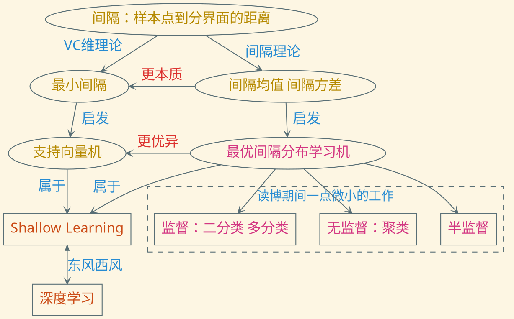

---
presentation:
    transition: "none"
    enableSpeakerNotes: true
    margin: 0
---

@import "../common/css/font-awesome-4.7.0/css/font-awesome.css"
@import "../common/css/zhangt-solarized.css"
@import "css/210829-annual.css"

<!-- slide data-notes="" -->

    

# 暑期教师工作会议

## 张腾

### 2021 - 8 - 29

<!-- slide data-notes="我所做的是最优间隔分布学习机 它对标的是    和深度学习的关系   它其实是两套哲学 一种是说我把一层做到极致    对于下游的用机器学习模型处理自己领域数据的人来说 就是哪个好用用哪个 但是对于我们本身做机器学习的人来说"-->

    
    

        

        <h5>不忘初心</h5>
    

    <h6 class="bottom_left">SCTS & CGCL & BDTS</h6>
    <h6 class="bottom_center">暑期教师工作会议</h6>
    <h6 class="bottom_right">tengzhang@hust.edu.cn</h6>

<!-- slide data-notes="之前读博时的工作针对最标准的学习问题，但现实中的任务大多不是那么标准，所以近两年我一直致力于让它更接地气，总的来说，目前围绕以下三个方面：关于数据生成、关于监督"-->

    
    

        

        <h5>牢记使命</h5>
    

问题：现实中的任务大多不是那么的“标准”

数据生成

- 随时间不断生成的流，分布动态变化，发表在 aaai'20
- 分散在不同地方，分布式训练，王忆麟在做，拟投 aaai'22

监督信息

- 只有若干个样本组成的集合的类标记(全负为负、含正为正)，发表在 ijcai'20
- 只有部分正样本，剩余样本包含正负样本，古文在做，拟投 aaai'22
- 类别标记有冗余噪声，发表在 ijcai'21
- 额外有样本之间的约束信息(必连或勿连)，发表在 ccml'21，推荐至中国科学

高效训练

- 用超参数直接给出模型解的解析表达式，避免网格调参，陈丽君在做，拟投明年初的会议

    <h6 class="bottom_left">SCTS & CGCL & BDTS</h6>
    <h6 class="bottom_center">暑期教师工作会议</h6>
    <h6 class="bottom_right">tengzhang@hust.edu.cn</h6>

<!-- slide data-notes=""-->

    
    

        

        <h5>砥砺前行</h5>
    

计划给新生的课题

监督信息

- 处理结构化的监督信息，例如样本是自然语言句子，类标记是句子的语法树

高效训练

- 根据以“精度”为评价指标学到的模型，得到以准确率、召回率、F1、AUC 等其它评价指标为目标的学习模型
- 探索核函数和多层神经网络等价的条件，用核函数模拟多层神经网络，加速模型的训练，且不失深度学习的性能

<h2 class="top10">敬请各位专家批评指正！</h3>

    <h6 class="bottom_left">SCTS & CGCL & BDTS</h6>
    <h6 class="bottom_center">暑期教师工作会议</h6>
    <h6 class="bottom_right">tengzhang@hust.edu.cn</h6>

