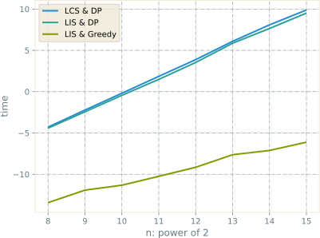

---
presentation:
  transition: "none"
  enableSpeakerNotes: true
  margin: 0
---

@import "../common/css/font-awesome-4.7.0/css/font-awesome.css"
@import "../common/css/zhangt-solarized.css"
@import "css/211112-alg.css"

<!-- slide data-notes="" -->
<div class="header"></div>

<div class="bottom15"></div>

# 算法设计与分析实践

<hr class="width50">

## 最长公共子序列的一道例题

<div class="bottom5"></div>

### 计算机科学与技术学院 &nbsp; &nbsp; 张腾

<br>

#### tengzhang@hust.edu.cn

<!-- slide data-notes="" -->

GNN-HEADER 最长公共子序列 LCS

题目：给定$[n] \triangleq \{ 1,\ldots,n \}$的两个排列$X$和$Y$，求其 LCS 的长度

<br>

将$X$和$Y$看成两个字符串

<br>

定义$c[i,j]$为子串$X[:i]$和子串$Y[:j]$的 LCS 的长度

<br>

递推关系：

$$
\begin{align*}
    c[i,j] = \begin{cases}
    0 & i=0 ~ \vee ~ j=0 \\
    c[i-1,j-1]+1 & i,j>0 ~ \wedge ~ X[i] = Y[j] \\
    \max (c[i-1,j],c[i,j-1]) & i,j>0 ~ \wedge ~ X[i] \ne Y[j] \\
    \end{cases}
\end{align*}
$$

时间复杂度$O(n^2)$

GNN-FOOTER 算法设计与分析实践 例题讲解 tengzhang@hust.edu.cn

<!-- slide data-notes="" -->

GNN-HEADER 最长公共子序列 LCS

```python {.line-numbers}
import numpy as np

def restore_lcs(b, x, i, j, lcs):  # 将LCS恢复出来的函数
    if i == -1 or j == -1:
        return
    if b[i, j] == -1:
        restore_lcs(b, x, i-1, j-1, lcs)
        lcs.append(x[i])
    elif b[i, j] == -2:
        restore_lcs(b, x, i-1, j, lcs)
    else:
        restore_lcs(b, x, i, j-1, lcs)

n = 8

np.random.seed(1)
x = np.random.permutation(n) + 1  # 生成第一个排列
print("X: %s" % x)

np.random.seed(2)
y = np.random.permutation(n) + 1  # 生成第二个排列
print("Y: %s" % y)

b = np.zeros([n, n])
c = np.zeros([n+1, n+1])

for i in range(1, n+1):
    for j in range(1, n+1):
        if x[i-1] == y[j-1]:         # 如果X[1:i]和Y[1:j]的末位字符相同
            c[i, j] = c[i-1, j-1] + 1
            b[i-1, j-1] = -1
        elif c[i-1, j] >= c[i, j-1]: # 如果X[1:i-1]和Y[1:j]的LCS更优
            c[i, j] = c[i-1, j]
            b[i-1, j-1] = -2
        else:                        # 如果X[1:i]和Y[1:j-1]的LCS更优
            c[i, j] = c[i, j-1]
            b[i-1, j-1] = -3

lcs = []
restore_lcs(b, x, n-1, n-1, lcs)
print('LCS: %s' % lcs)
--------------------------------
X: [8 3 2 7 1 5 4 6]
Y: [5 2 7 3 4 8 6 1]
LCS: [2, 7, 4, 6]
```

GNN-FOOTER 算法设计与分析实践 例题讲解 tengzhang@hust.edu.cn

<!-- slide data-notes="" -->

GNN-HEADER 最长公共子序列 LCS

<span class="blue">排列中没有重复元素</span>，俩排列置换后 (重命名) 的 LCS 长度不变

不妨用置换$\sigma$将排列$X \mapsto [1:n]$

```python {.line-numbers}
dict = {key: value for key, value in zip(x, range(1, n+1))}  # X -> [1:n]
print("sigma: %s" % dict)

x2 = [dict[i] for i in x]
print("X: %s -> %s" % (x, x2))

y2 = [dict[i] for i in y]
print("Y: %s -> %s" % (y, y2))

lcs2 = [dict[i] for i in lcs]
print('LCS: %s -> %s' % (lcs, lcs2))
------------------------------------
sigma: {8: 1, 3: 2, 2: 3, 7: 4, 1: 5, 5: 6, 4: 7, 6: 8}
X: [8 3 2 7 1 5 4 6] -> [1, 2, 3, 4, 5, 6, 7, 8]
Y: [5 2 7 3 4 8 6 1] -> [6, 3, 4, 2, 7, 1, 8, 5]
LCS: [2, 7, 4, 6] -> [3, 4, 7, 8]
```

GNN-FOOTER 算法设计与分析实践 例题讲解 tengzhang@hust.edu.cn

<!-- slide data-notes="置换后 Y的任意非递增子序列都不可能是X的子序列" -->

GNN-HEADER 最长递增子序列 LIS

题目：给定$[n] \triangleq \{ 1,\ldots,n \}$的一个排列$X$，求其 LIS 的长度

<br>

定义$d[i]$为以$X[i]$结尾的 LIS 的长度，易知所有$d[i]$的最小值就是 1

<br>

$d[0] = 1$，以$X[0]$结尾的 LIS 就是$[X[0]]$

$d[1]$根据$X[1]$是否可以接在$X[0]$后面分两种情况：

- 若$X[0] < X[1]$，则$d[1] = 2$，此时 LIS 就是$[X[0], X[1]]$
- 若$X[0] > X[1]$，则$d[1] = 1$，此时 LIS 就是$[X[1]]$

对于$X[i]$，考察它可接在以$X[0], X[1], \ldots, X[i-1]$结尾的哪个 LIS 后面

在所有可接的 LIS 后面，选一个最长的，因此有递推关系：

$$
\begin{align*}
    d[i] = \begin{cases}
    1 & i=0 \\
    \max_{j \in [i-1]} d[j] + 1 & X[j] < X[i] \\
    \end{cases}
\end{align*}
$$

GNN-FOOTER 算法设计与分析实践 例题讲解 tengzhang@hust.edu.cn

<!-- slide data-notes="" -->

GNN-HEADER 最长递增子序列 LIS

定义$d[i]$为以$X[i]$结尾的 LIS 的长度，最终$d$中最大值就是 LIS 的长度

```python {.line-numbers}
d = np.ones(n)
p = -1 * np.ones(n, dtype=np.int32)
for i in range(1, n):
    for j in range(i):
        if y2[j] < y2[i] and d[i] < d[j] + 1:  # 如果X[i]可以接在X[j]的后面
            d[i] = d[j] + 1
            p[i] = j  # 指向前一个元素的下标 用来恢复LIS
print('d: %s' % d)

lis_len_index = np.argmax(d)  # d中最大值的下标
lis = [y2[lis_len_index]]  # 将LIS中的最后一个元素加入
pos = p[lis_len_index]  # LIS中倒数第二个元素的下标
while pos != -1:
    lis.append(y2[pos])
    pos = p[pos]

lis.reverse()
print('LIS: %s' % lis)
----------------------
X: [6, 3, 4, 2, 7, 1, 8, 5]
d: [1 1 2 1 3 1 4 3]
LIS: [3, 4, 7, 8]
```

GNN-FOOTER 算法设计与分析实践 例题讲解 tengzhang@hust.edu.cn

<!-- slide data-notes="" -->

GNN-HEADER 最长递增子序列 LIS

定义$d[i]$为以$X[i]$结尾的 LIS 的长度

<br>

对每个$i$，都要让$j$遍历$1, 2, \ldots, i-1$取最大

$$
\begin{align*}
    d[i] = \begin{cases}
    1 & i=0 \\
    \class{blue}{\max_{j \in [i-1]}} d[j] + 1 & X[j] < X[i] \\
    \end{cases}
\end{align*}
$$

```python {.line-numbers}
for i in range(1, n):
    for j in range(i):
        if y2[j] < y2[i] and d[i] < d[j] + 1:  # 如果X[i]可以接在X[j]的后面
            d[i] = d[j] + 1
            p[i] = j
```

时间复杂度依然是$O(n^2)$

GNN-FOOTER 算法设计与分析实践 例题讲解 tengzhang@hust.edu.cn

<!-- slide data-notes="这里说一下为何要3不要6 本质是贪心" -->

GNN-HEADER 最长递增子序列 LIS

定义$e[i]$为所有长度为$i$的 LIS 中末位元素的最小值，初始为空

以$X = [6, 3, 4, 2, 7, 1, 8, 5]$为例，遍历$X$一遍看看$e$是如何动态变化的

第 1 轮，$e = [\class{blue}{6}]$，长度为 1 的所有 LIS 中末位元素最小的是$6$

第 2 轮，$e = [\class{blue}{3}]$，长度为 1 的更新为$3 ~ ( < 6)$，给后面留有更多余地

第 3 轮，$e = [3, \class{blue}{4}]$，$4 ~ (> 3)$可接在$3$后面得到长度为 2 的 LIS

第 4 轮，$e = [\class{blue}{2}, 4]$，长度为 1 的更新为$2 ~ ( < 3)$

第 5 轮，$e = [2, 4, \class{blue}{7}]$，$7 ~(> 4)$可接在$4$后面得到长度为 3 的 LIS

第 6 轮，$e = [\class{blue}{1}, 4, 7]$，长度为 1 的更新为$1 ~ (< 2)$

第 7 轮，$e = [1, 4, 7, \class{blue}{8}]$，$8 ~ (> 7)$可接在$7$后面得到长度为 4 的 LIS

第 8 轮，$e = [1, 4, \class{blue}{5}, 8]$，长度为 3 的更新为$5 ~ (4 < 5 < 7)$

GNN-FOOTER 算法设计与分析实践 例题讲解 tengzhang@hust.edu.cn

<!-- slide data-notes="" -->

GNN-HEADER 最长递增子序列 LIS

定义$e[i]$为所有长度为$i$的 LIS 中末位元素的最小值，初始为空

<br>

对于$X = [6, 3, 4, 2, 7, 1, 8, 5]$为例，最终$e = [1, 4, 5, 8]$

$e$的长度为 4，代表 LIS 的<span class="blue">长度为 4</span>，注意$e$本身并不一定是 LIS

<br>

关键结论：<span class="blue">在任意时刻$e$都是严格单调递增的</span>

反证法：若$i<j$且$e[i] > e[j]$，则有

$$
\begin{align*}
    \text{LIS}_i:~ \underbrace{\square ~ \square ~ \cdots ~ \square ~ e[i]}_{\text{length}=i}, \quad \text{LIS}_j:~ \underbrace{\square ~ \square ~ \square ~ \square ~ \cdots ~ \square ~ \square ~ e[j]}_{\text{length}=j}
\end{align*}
$$

将$\text{LIS}_j$去掉前$j-i$个元素得到长度为$i$的递增序列，其末位元素$< e[i]$

这与$e[i]$的定义矛盾

GNN-FOOTER 算法设计与分析实践 例题讲解 tengzhang@hust.edu.cn

<!-- slide data-notes="" -->

GNN-HEADER 最长递增子序列 LIS

定义$e[i]$为所有长度为$i$的 LIS 中末位元素的最小值，初始为空

<br>

$e$的更新满足

- 若$X[i]$大于$e$的末位元素，则将其接到$e$的后面，此时找到了更长的 LIS
- 若$X[i]$介于$e[j-1]$和$e[j]$之间，则将其赋值给$e[j]$，此时 LIS 没有增长，但长度为$j$的 LIS 变得更优 (末位元素更小) 了，给未来的增长留下更多余地

$$
\begin{align*}
    e = \begin{cases}
    [~] & \text{initialization} \\
    [e, [X[i]] & e[-1] < X[i] \\
    e[j] = X[i] & e[j-1] < X[i] < e[j]
    \end{cases}
\end{align*}
$$

$e$是严格单调递增的，确定$j:e[j-1] < X[i] < e[j]$可用二分查找

<br>

二分查找时间复杂度为$O(\log n)$，于是总体时间复杂度为$O(n \log n)$

GNN-FOOTER 算法设计与分析实践 例题讲解 tengzhang@hust.edu.cn

<!-- slide data-notes="" -->

GNN-HEADER 最长递增子序列 LIS

```python {.line-numbers}
from bisect import bisect_left

e = []
p = -1 * np.ones(n, dtype=np.int32)
for i in range(n):
    j = bisect_left(e, x[i])
    if j == len(e):  # 二分查找的结果等于e的长度 即v大于e的末位元素
        if j > 0:
            p[i] = e[-1]
        e.append(x[i])
    else:
        e[j] = x[i]
        p[i] = e[j-1]
    print("iteration %d: e = %s" % (i+1, e))

dict = {key: value for key, value in zip(x, range(n))}
lis = []
pre = e[-1]
for i in range(len(e)):
    lis.append(pre)
    pre = p[dict[pre]]

lis.reverse()
print('LIS: %s' % lis)
-------------------------
X: [6, 3, 4, 2, 7, 1, 8, 5]
iteration 1: e = [6]
iteration 2: e = [3]
iteration 3: e = [3, 4]
iteration 4: e = [2, 4]
iteration 5: e = [2, 4, 7]
iteration 6: e = [1, 4, 7]
iteration 7: e = [1, 4, 7, 8]
iteration 8: e = [1, 4, 5, 8]
LIS: [3, 4, 7, 8]
```

GNN-FOOTER 算法设计与分析实践 例题讲解 tengzhang@hust.edu.cn

<!-- slide data-notes="" -->

GNN-HEADER 最长递增子序列 LIS

```python {.line-numbers}
X: [18, 7, 14, 12, 15, 20, 1, 4, 10, 8, 9, 2, 6, 5, 19, 3, 13, 11, 16, 17]
iteration 1: e = [18]
iteration 2: e = [7]
iteration 3: e = [7, 14]
iteration 4: e = [7, 12]
iteration 5: e = [7, 12, 15]
iteration 6: e = [7, 12, 15, 20]
iteration 7: e = [1, 12, 15, 20]
iteration 8: e = [1, 4, 15, 20]
iteration 9: e = [1, 4, 10, 20]
iteration 10: e = [1, 4, 8, 20]
iteration 11: e = [1, 4, 8, 9]
iteration 12: e = [1, 2, 8, 9]
iteration 13: e = [1, 2, 6, 9]
iteration 14: e = [1, 2, 5, 9]
iteration 15: e = [1, 2, 5, 9, 19]
iteration 16: e = [1, 2, 3, 9, 19]
iteration 17: e = [1, 2, 3, 9, 13]
iteration 18: e = [1, 2, 3, 9, 11]
iteration 19: e = [1, 2, 3, 9, 11, 16]
iteration 20: e = [1, 2, 3, 9, 11, 16, 17]
LIS: [1, 4, 8, 9, 11, 16, 17]
```

GNN-FOOTER 算法设计与分析实践 例题讲解 tengzhang@hust.edu.cn

<!-- slide data-notes="" -->

GNN-HEADER 时间复杂度对比



GNN-FOOTER 算法设计与分析实践 例题讲解 tengzhang@hust.edu.cn
