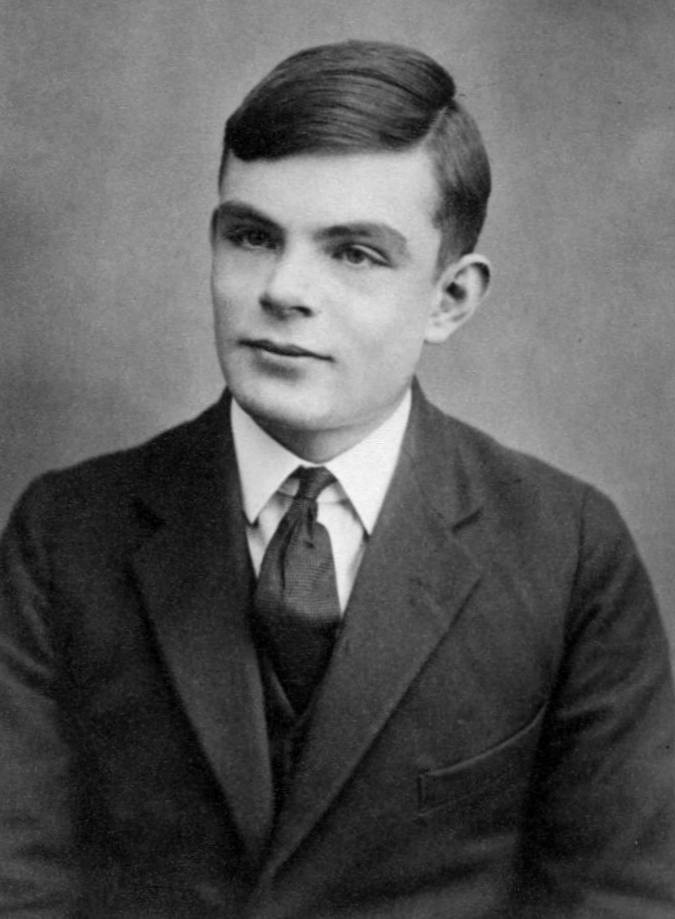

---
presentation:
  transition: "none"
  enableSpeakerNotes: true
  margin: 0
---

@import "../common/css/font-awesome-4.7.0/css/font-awesome.css"
@import "../common/css/style-color.css"
@import "../common/css/margin.css"

<!-- slide data-notes="大家下午好，我是来自计算机学院的张腾，我的演讲题目是人工智能简介" -->

# 机器学习

## 教学竞赛院系初赛 说课环节

### 计算机科学与技术学院 &nbsp; &nbsp; 张腾

 

### 2022 - 03 - 17

<!-- slide vertical=true data-notes="首先提到机器学习，大家会想到什么？" -->

HEADER 引子

@import "../puml/ai.puml" {.center .top10}

FOOTER3 教学竞赛院系初赛 机器学习 tengzhang@hust.edu.cn

<!-- slide data-notes="可能有人会想到围棋程序alphago，16年一经面世就横扫围棋界，将李世乭、柯杰等多位世界冠军杀得毫无还手之力" data-background-video="../videos/alphago.mp4" data-background-video-loop data-background-video-muted -->

<!-- slide data-notes="可能也有人会想到自动驾驶，现在百度、谷歌、特斯拉、比亚迪许多公司都在布局研究，国家也在大力扶持" data-background-video="../videos/self-driving.mp4" data-background-video-loop data-background-video-muted vertical=true -->

<!-- slide data-notes="可能还有人会想到这个要destroy全人类的sophia" data-background-video="../videos/sophia.mp4" data-background-video-loop data-background-video-muted vertical=true -->

<!-- slide data-notes="没有问题，这些都是机器学习的经典应用，除此之外还有很多，例如文字、图像、语音识别，自然语言处理等……但是我们这是一门课，不可能以纪传体的形式，给大家挨个介绍应用，这样走马观花，大家也学不到什么硬核的干货" -->

HEADER 引子

@import "../dot/ml-app.dot"

FOOTER3 教学竞赛院系初赛 机器学习 tengzhang@hust.edu.cn

<!-- slide data-notes="所以本课程会以编年体的形式来组织内容，首先我们会先讲讲机器学习产生的时代背景  然后以时间顺序回顾整个领域的发展历程，机器学习是一个由计算机、统计、应用数学、最优控制、信号处理等多个学科交叉出来的新兴学科  在这门课大家会看到在机器学习这个大舞台上，这些来自不同学科背景的研究者逐渐形成的各大学派，是如何你方唱罢我登场的  最重要的，我们会带大家深入学习这些学派各自压箱底的内功心法" vertical=true -->

HEADER 课程安排

@import "../dot/ml-app-dev.dot"

FOOTER3 教学竞赛院系初赛 机器学习 tengzhang@hust.edu.cn

<!-- slide vertical=true data-notes="这张图算是人工智能的常见黑话大集合，大家如果稍微关注些人工智能的话，应该会经常听到这些词，我这里给大家捋一下它们之间的关系，最大的概念叫人工智能  监督信息和模型假设并不是并列关系的，只是看待机器学习的不同视角，因此有半监督支持向量机这种东西" -->

HEADER 课程大纲

@import "../dot/outline.dot"

FOOTER3 教学竞赛院系初赛 机器学习 tengzhang@hust.edu.cn

<!-- slide data-notes="本课程会" -->

HEADER 教科书 参考书 英文书

    
    
    

FOOTER3 教学竞赛院系初赛 机器学习 tengzhang@hust.edu.cn

<!-- slide data-notes="大家下午好，我是来自计算机学院的张腾，我的演讲题目是人工智能简介" -->

# 机器学习

## 教学竞赛院系初赛 完整讲课

### 计算机科学与技术学院 &nbsp; &nbsp; 张腾

 

### 2022 - 03 - 17

<!-- slide vertical=true data-notes="这张图算是人工智能的常见黑话大集合，大家如果稍微关注些人工智能的话，应该会经常听到这些词，我这里给大家捋一下它们之间的关系，最大的概念叫人工智能  监督信息和模型假设并不是并列关系的，只是看待机器学习的不同视角，因此有半监督支持向量机这种东西" -->

HEADER 课程大纲

@import "../dot/outline-ai.dot"

FOOTER3 教学竞赛院系初赛 机器学习 tengzhang@hust.edu.cn

<!-- slide vertical=true data-notes="控制论之父维纳在他的大作《控制论》  讲完后提一下，现在我们国家也高度重视人工智能的发展，因为1760年第一次工业革命，1870年第二次工业革命我国都完全没赶上，互联网和移动互联网引发第三次工业革命我们国家也只赶上个末班车，而西方国家确立对非西方的绝对优势就是这三次工业革命，所以对于人工智能技术为核心推动的第四次工业革命是绝对重视，所以这里打个广告，大家现在上车还来得及  扯远了" -->

HEADER 背景

 

维纳 《控制论》：

 

> 第一次工业革命：用某种机器来减轻甚至代替体力劳动

> 上世纪中叶：用某种新型机器来减轻甚至代替某些脑力劳动

 

关键：让机器具有人类的智能

 

问题：什么是智能？

FOOTER3 教学竞赛院系初赛 机器学习 tengzhang@hust.edu.cn

<!-- slide vertical=true data-notes="智能这一说法最早是图灵在他1950年的论文里提出的，后来被人们称为图灵测试  学习指学习新东西、探索未知的能力，感知处理看和听，认知是思考和推理" -->

HEADER 起源

《Computing Machinery and Intelligence》

图灵在他 1950 年的这篇论文中提出了图灵测试：一个人在不接触对方的情况下，通过一种特殊的方式，和对方进行一系列的问答，如果在相当长时间内，他无法根据这些问题判断对方是人还是计算机，那么就可以认为这个计算机是智能的

要想通过图灵测试，机器得具备多种能力

- 学习：机器学习
- 感知：计算机视觉，语音识别
- 认知：自然语言处理，知识表示

FOOTER3 教学竞赛院系初赛 机器学习 tengzhang@hust.edu.cn

<!-- slide vertical=true data-notes="图中的5位是06年会议50周年时还建在的5位，左一是摩尔，右二赛弗里奇，右一是所罗门诺夫  香农是被麦卡锡拉过去站台的，除香农都得过图灵奖，C罗奖给梅西，梅西也不会要  1971年麦卡锡获得图灵奖，发明了第一个函数式程序语言Lisp，函数式编程更加强调程序执行的结果而非执行的过程，倡导利用若干简单的执行单元让计算结果不断渐进，逐层推导复杂的运算，而不是设计一个复杂的执行过程  明斯基写过一本书，叫感知机  西蒙是中科院外籍院士，9个博士学位，中文名司马贺  纽厄尔一直是西蒙的合作者，曾在美国智库兰德公司供职" -->

HEADER 元年

达特茅斯会议

- 时间：1956 年
- 地点：达特茅斯学院
- 人物：香农、麦卡锡、明斯基、西蒙、纽厄尔等十人
- 事件：讨论用机器模拟人的智能

 

    
    

FOOTER3 教学竞赛院系初赛 机器学习 tengzhang@hust.edu.cn

<!-- slide vertical=true data-notes="人工智能的发展大致可以分成三个阶段，" -->

HEADER 发展

@import "../mermaid/ai.mermaid"

秽土转生

- 推理：反绎学习
- 知识：知识图谱

FOOTER3 教学竞赛院系初赛 机器学习 tengzhang@hust.edu.cn

<!-- slide data-notes="我个人猜测原因是数学原理讲的是公理集合论 当然是罗素的 不是zfc 天生符号化" -->

HEADER 推理期

机器擅长固定套路的计算 vs. 人类擅长妙手偶得的推理

符号主义：智能 = 逻辑推理

西蒙和纽厄尔设计了逻辑理论家程序

- 1952 年，逻辑理论家证明了 《数学原理》 中的 38 条定理
- 1963 年，证明了全部 52 条定理，其中定理 2.85 的证明比原书作者更巧妙
- 西蒙和纽厄尔获得了 1975 年的图灵奖

衰退：

- 并非所有定理都可以方便地符号化，也并非所有问题都可以转换成推理问题
- 十万步内无法证明两个连续函数之和还是连续函数

FOOTER3 教学竞赛院系初赛 机器学习 tengzhang@hust.edu.cn

<!-- slide vertical=true data-notes="" -->

HEADER 符号主义

根据以下事实判别谁说了实话

- $A$：$B$和$C$都是说谎者
- $B$：$A$和$C$都是说谎者
- $C$：$A$和$B$中至少有一个说谎者

|   公式   |          $p \rightarrow q$           | $\Longleftrightarrow$ |                   $\neg p \vee q$                    |
| :------: | :----------------------------------: | :-------------------: | :--------------------------------------------------: |
| **条件** | $A \rightarrow \neg B \wedge \neg C$ | $\Longleftrightarrow$ | $1.~\neg A \vee \neg B, \quad 2.~\neg A \vee \neg C$ |
|          |    $\neg A \rightarrow B \vee C$     | $\Longleftrightarrow$ |                 $3.~A \vee B \vee C$                 |
|          | $B \rightarrow \neg A \wedge \neg C$ | $\Longleftrightarrow$ |               $4.~\neg B \vee \neg C$                |
|          |    $\neg B \rightarrow A \vee C$     | $\Longleftrightarrow$ |                 $3.~A \vee B \vee C$                 |
|          |  $C \rightarrow \neg A \vee \neg B$  | $\Longleftrightarrow$ |         $5.~\neg A \vee \neg B \vee \neg C$          |
|          |   $\neg C \rightarrow A \wedge B$    | $\Longleftrightarrow$ |           $6.~A \vee C, \quad 7.~B \vee C$           |
| **归结** | $1 + 7 \rightarrow 8.~\neg A \vee C$ | $\Longleftrightarrow$ |                     $C$说了实话                      |

FOOTER3 教学竞赛院系初赛 机器学习 tengzhang@hust.edu.cn

<!-- slide vertical=true data-notes="从推理期得到的教训是" -->

HEADER 知识期

教训：光有逻辑推理远远不够，机器得拥有知识

信仰：知识就是力量，智能 = 知识 + 逻辑推理

专家系统 = 知识库 + 推理机

- 在特定领域内具有专家水平解决问题能力的程序系统
- 第一个成功的专家系统 DENDRAL 于 1968 年问世
- 知识工程之父费根鲍姆获得了 1994 年的图灵奖

衰退：

- 人工构建知识库成本太高
- 很多知识获取困难，甚至无法被清晰地表示出来

FOOTER3 教学竞赛院系初赛 机器学习 tengzhang@hust.edu.cn

<!-- slide vertical=true data-notes="" -->

HEADER 动物识别专家系统

@import "../dot/reasoning.dot"

FOOTER3 教学竞赛院系初赛 机器学习 tengzhang@hust.edu.cn

<!-- slide data-notes="对于人类的很多智能行为(比如语言理解、图像理解等) 我们很难知道其中的原理 也无法描述出这些智能行为背后的“知识”    因此 我们也很难通过知识和推理的方式来实现这些行为的智能系统。为了解决这类问题,研究者开始将研究重点转向让计算机从数据中自己学习" -->

HEADER 学习期

基本想法：让机器从数据中自动学习得到某种知识 (规律)

基本流程：

@import "../dot/ml-old.dot"

原始数据：图片、视频、文本、语音、……

特征工程：

- 提取：选取对目标任务有用的潜在特征，如对西瓜提取色泽、根蒂、敲声等
- 处理：无序的离散类别特征 → 数值特征，特征缺失处理，特征标准化
- 变换：对特征进行挑选或映射得到对目标任务更有效的特征

模型学习：机器学习最核心的部分，学习一个特征到类别标记的映射

FOOTER3 教学竞赛院系初赛 机器学习 tengzhang@hust.edu.cn
