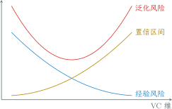

---
presentation:
  margin: 0
  center: false
  transition: "none"
  enableSpeakerNotes: true
  slideNumber: "c/t"
  navigationMode: "linear"
---

@import "../css/font-awesome-4.7.0/css/font-awesome.css"
@import "../css/theme/solarized.css"
@import "../css/logo.css"
@import "../css/font.css"
@import "../css/color.css"
@import "../css/margin.css"
@import "../css/table.css"
@import "../css/main.css"
@import "../plugin/zoom/zoom.js"
@import "../plugin/customcontrols/plugin.js"
@import "../plugin/customcontrols/style.css"
@import "../plugin/chalkboard/plugin.js"
@import "../plugin/chalkboard/style.css"
@import "../plugin/menu/menu.js"
@import "../js/anychart/anychart-core.min.js"
@import "../js/anychart/anychart-venn.min.js"
@import "../js/anychart/pastel.min.js"
@import "../js/anychart/venn-ml.js"

<!-- slide data-notes="尊敬的亚研院的各位专家、冯院长、各位老师，上午好，我叫张腾，是来自计算所金海老师团队的一名青年教师，今天很荣幸，能有这样一个机会和各位专家分享一点自己在间隔分布优化方面的微小的成果" -->

# 基于间隔分布优化的学习方法

## 华中科技大学 计算机学院

### 张腾

#### _tengzhang@hust.edu.cn_

#### 2023 / 04 / 12

<!-- slide data-notes="这是我的报告大纲 我先给出必要的背景介绍 然后是我的几个工作 最后是总结"-->

##### 大纲

---

背景介绍

全监督信息的最优间隔分布学习机

- 二分类
- 多分类

弱监督信息的最优间隔分布学习机

- 聚类
- 半监督

总结

<!-- slide vertical=true data-notes="我的报告聚焦于机器学习中最常见的分类问题，它的过程是……"-->

##### 引子

---

西瓜数据集

| 编号 | 色泽 | 根蒂 | 敲声 | 纹理 | 脐部 | 触感 | 好瓜 |
| :--: | :--: | :--: | :--: | :--: | :--: | :--: | :--: |
|  1   | 青绿 | 蜷缩 | 浊响 | 清晰 | 凹陷 | 硬滑 |  是  |
|  2   | 乌黑 | 蜷缩 | 沉闷 | 清晰 | 凹陷 | 硬滑 |  是  |
|  3   | 乌黑 | 稍蜷 | 沉闷 | 稍糊 | 稍凹 | 软粘 |  否  |
|  4   | 浅白 | 硬挺 | 清脆 | 模糊 | 平坦 | 硬滑 |  否  |
|  5   | 浅白 | 蜷缩 | 浊响 | 稍糊 | 平坦 | 软粘 |  ?   |

分类问题：训练数据 $\xrightarrow{\text{学习算法}}$ 学习模型 $\xrightarrow{\text{未知样本}}$ 类别预测

<!-- slide vertical=true data-notes="这个过程用数学语言描述如下：    X是特征空间    Y是类别标记集合    D是定义在X乘Y上的未知分布    数据集S独立同分布地采样于分布D    判别一个瓜是不是好瓜的函数称作分类器，H是所有候选分类器构成的集合，也称作假设空间    我们的目标是，寻找一个分类器，它在未知分布D上的错误率的期望尽可能的小，也叫泛化风险    问题难点在于D未知，泛化风险无法计算"-->

##### 统计学习

---

问题形式化：

- $\Xcal \subseteq \Rbb^n$为特征空间
- $\Ycal$为类别标记集合
- $\Dcal$为定义在$\Xcal \times \Ycal$上的{==未知==}分布
- $\Scal = \{(\xv_1, y_1), \ldots, (\xv_m, y_m)\}$为{==独立同分布==}采样于$\Dcal$的数据集
- $\Hcal = \{ h: \Xcal \mapsto \Ycal \}$是分类器构成的{==假设空间==}，从中选择最优假设$h^\star$

目标：最小化期望风险，也称为泛化风险

$$
\begin{align*}
    \quad \min_{h \in \Hcal} ~ \color{red}{R(h)} = \Ebb_{(\xv, y) \sim \Dcal}[1_{h(\xv) \neq y}]
\end{align*}
$$

难点：分布$\Dcal$未知，泛化风险无法计算

<!-- slide vertical=true data-notes="我们目前已有的信息就是训练数据，可以计算的是分类器h在训练数据S上的错误率，也叫经验风险    考虑到训练集是D的一个缩影，因此以经验风险代替泛化风险似乎是合情合理的，这就是经验风险最小化原则    然而事与愿违的是如果对假设空间不做任何限制，可能会得到一个强行“记住”每个训练样本类别标记的分类器    显然它在训练数据集上经验风险为零，比任何一个分类器都要好，但是它对未知样本的预测可能非常糟糕，因为它把全部注意力都集中在训练数据集上了，忽略了对真实世界的认知，这种现象称为“过拟合”"-->

##### 经验风险最小化

---

以训练数据上的经验风险替代泛化风险

$$
\begin{align*}
    \quad \class{red}{R(h)} = \Ebb_{(\xv, y) \sim \Dcal}[1_{h(\xv) \neq y}] \longleftarrow \class{blue}{R_\Scal (h)} = \frac{1}{m} \sum_{i \in [m]} 1_{h(\xv_i) \neq y_i}
\end{align*}
$$

- 我们根据训练数据能算的只有经验风险
- 由大数定律，当数据集大小$m \rightarrow \infty$时，经验风险$\rightarrow$泛化风险

不对假设空间做限制$\rightarrow${==强行记忆==}训练数据的分类器：

$$
\begin{align*}
    \quad h(\xv) = \sgn \left( - \| \xv -\xv_{p_1} \|^2 \cdots \| \xv -\xv_{p_n} \|^2 \right), \quad \forall i \in [n], ~ y_{p_i} = 1
\end{align*}
$$

过拟合

- 在训练数据集上经验风险为零
- 对未知样本的预测非常糟糕

<!-- slide vertical=true data-notes="过拟合可以通过这张图来表述，随着假设空间复杂度地不断增大，对训练数据拟合地越来越好，经验风险单调下降；但泛化风险却是先降后升    这启示我们应该在经验风险和假设空间复杂度之间取得平衡，那么问题来了，经验风险是好计算的，假设空间复杂度怎么算？有什么量是可以刻画假设空间复杂度的吗？"-->

##### 过拟合

---

启示：在经验风险和假设空间复杂度之间取得平衡

问题：假设空间复杂度怎么算？有什么量能够刻画它？

<!-- slide data-notes="有，这个量叫假设空间的VC维，直观上来说，这个量应该和假设空间对样本的拟合能力正相关    定义集合H_S，其中每个元素都是对S赋予类别标记的一个可能结果    如果H_S包含了全部可能的结果，则称假设空间H可以“打散”数据集，就是不管它的类别标记赋值是啥，假设空间都能拟合出来，都有个候选分类器与之对应    假设空间的VC维就定义成能被它打散的最大样本集合的大小"-->

##### VC 维

---

基本思想：假设空间复杂度应体现出对数据集的拟合能力

假设空间$\Hcal = \{ h: \Xcal \mapsto \{1,-1\} \}$，数据集$\Scal = \{\xv_1, \ldots, \xv_m\}$

$$
\begin{align*}
    \quad H_\Scal = \{ (h(\xv_1), \ldots, h(\xv_m)) \mid h \in \Hcal \}
\end{align*}
$$

其中$H_\Scal$中每个元素都是对$\Scal$赋予类别标记的可能结果

若$H_\Scal$包含全部可能结果，即$|H_\Scal| = 2^m$，则称$\Hcal$可以打散$\Scal$

假设空间$\Hcal$的 VC 维是能被$\Hcal$打散的最大集合的大小，即

$$
\begin{align*}
    \quad \text{VC} (\Hcal) = \max \{ m \mid \exists \Scal:~|H_\Scal| = 2^m \}
\end{align*}
$$

<!-- slide vertical=true data-notes="举个简单的例子，设特征空间为二维欧氏平面，假设空间为二维平面上的直线构成的集合    从图中可以看出，存在3个样本构成的集合，无论类别标记是什么样的，都有个直线将两类样本分开    对于任意4个样本构成的集合，总有一种类似异或的赋值线性不可分    因此，在二维欧氏平面上，直线集合的VC维是3    可以证明更一般性的结论：n维欧式空间超平面集合的VC维是n+1"-->

##### VC 维

---

基本思想：假设空间复杂度应体现出对数据集的拟合能力

二维平面上的线性划分：$\Xcal = \Rbb^2$，$\Hcal$为二维平面上直线集合

- 存在 3 个样本构成的集合，8 种可能类别标记赋值均是线性可分的
- 对于任意 4 个样本构成的集合，总有一种类别标记赋值线性不可分
- $\Hcal$的 VC 维为 3
- 一般性结论：$\Rbb^n$中超平面集合的 VC 维为$n+1$

<!-- slide vertical=true data-notes="有了VC维的定义，根据集中度不等式可以证明这样一个泛化界，这是VC维理论中最经典的结论    右端第二项称为置信区间，它与VC维和样本数的比值有关，当样本数很大时，这个比值较小，此时第一项经验风险起主导作用，这也是经验风险最小化原则在大数据集上表现不错的原因    但反过来，当这个比值较大时，则必须考虑置信区间的影响，因为此时最小化经验风险并不能保证泛化风险也小"-->

##### VC 维

---

根据集中度不等式有如下泛化界

$$
\begin{align*}
    \quad \class{red}{\underbrace{R(h)}_{\text{泛化风险}}} \leq \class{blue}{\underbrace{R_\Scal(h)}_{\text{经验风险}}} + \class{yellow}{\underbrace{\widetilde{O} \left(\sqrt{\text{VC维/样本数}~~~} \right)}_{\text{置信区间}}}
\end{align*}
$$

<!-- slide vertical=true data-notes="由此产生了结构风险最小化原则，考虑直接最小化这两项的和    一个初步的办法如图所示，给定训练数据，构造一个嵌套的假设空间序列，然后对于每个假设空间，求一个使得经验风险最小的分类器h_t，同时相应的计算一个置信区间的值，最后取使得经验风险与置信区间的和最小的下标t，并以h_t作为最终学习算法输出的分类器    注意到，经验风险和置信区间关于VC维的增加都是单调变化的，因此可以直接最小化两项的加权和    那么问题来了，如何计算一个假设空间的VC维？前面说了，超平面集合的VC维是n+1，如果空间是无穷维，比如高斯核诱导出的特征空间，那么VC维也是无穷，泛化界已经松到没有意义了，这时怎么办？"-->

##### 结构风险最小化

---

- 构造嵌套的假设空间序列 $\Hcal_1 \subseteq \cdots \subseteq \Hcal_t \subseteq \cdots$
- 在$\Hcal_t$上经验风险最小化，从而得到 $R_\Scal (h_1) \geq \cdots \geq R_\Scal (h_t) \geq \cdots$
- 嵌套假设空间序列的 VC 维序列 $\VC(\Hcal_1) \leq \cdots \leq \VC(\Hcal_t) \leq \cdots$
- $h^\star = \min_{h_t} \{ \class{blue}{\text{经验风险}} + \class{yellow}{\text{置信区间}} \}$

问题：

- 如何计算$\VC(\Hcal_t)$？
- 若$\Hcal_t$为超平面集合，当维度趋向于无穷时，VC 维也趋向于无穷

启示：VC 维分布无关、数据独立，导出的泛化界有点“松”

方案：引入数据相关的量加强泛化界，在无穷维空间也可以学习

<!-- slide data-notes="因为VC维分布无关、数据独立，导出的泛化界松是不可避免的，因此需要引入数据相关的量加强泛化界，在无穷维空间也可以学习    这个量就是间隔，对于任意分类器f，它在样本上的间隔定义为 预测函数值 与 类别标记 的乘积    如果存在分类器不仅能将两类样本分开，还存在正数γ，使得分类器在正类样本上的预测值都大于等于γ，在负类样本上的预测值都小于等于-γ，换言之，两类之间有一个宽度为2γ的gap，就说数据集S被F以γ打散，F的尺度为γ的宽打散维fatF(γ)是能被F以γ打散的最大集合的大小    特别的，如果假设空间为超平面集合，且能将数据集以γ打散，就称作γ间隔超平面"-->

##### 间隔 宽打散维

---

设$\Hcal = \{ h: \Xcal \mapsto \Rbb \}$是定义在特征空间$\Xcal$上的实值函数集合，对于$\forall h \in \Hcal$，其关于样本$(\xv_i, y_i)$的{==间隔==}定义为$\gamma_i = y_i h(\xv_i)$

{==加强打散==}：分对$\rightarrow$以高置信度分对

若对数据集$\Scal$的任一类别标记赋值，均存在假设$h \in \Hcal$和$\gamma > 0$使得$y_i h(\xv_i) \ge \gamma$，则称$\Scal$被$\Hcal$以$\gamma$打散，$\Hcal$的{==宽打散维==}$\mathrm{fat}_\Fcal(\gamma)$是能被$\Hcal$以$\gamma$打散的最大集合的大小

特别的，取$\Hcal = \{ \xv \mapsto \wv^\top \xv \mid \|\wv\| = 1 \}$，则能将$\Scal$以$\gamma$打散的超平面称为$\gamma$-间隔超平面，即对$\forall i \in [m]$有$y_i \wv^\top \xv_i \ge \gamma$

<!-- slide vertical=true data-notes="从这张图不难看出，γ是所有间隔的最小值，也称为最小间隔    可以证明，如果数据集包含在半径为R的球里，γ间隔超平面的宽打散维有一个上界，分母上的γ是个正数，所以这个上界是个有限值    所以宽打散维是VC维的加强版，对假设空间的限制力度更强，对于前面所说的VC维无穷的情况，宽打散维也是有限的。而宽打散维与间隔有关，间隔越大，宽打散维越小，对假设空间限制越大"-->

##### $\gamma$-间隔超平面

---

记$\Hcal = \{ \xv \mapsto \wv^\top \xv \mid \|\wv\| = 1 \}$为$\gamma$-间隔超平面构成的假设空间，若数据集包含于半径为$R$的球，则假设空间$\Hcal$的宽打散维$\mathrm{fat}_\Hcal(\gamma) \leq R^2 / \gamma^2$

- 间隔$\gamma$越大，宽打散维越小
- 与维度无关

|  物理量  | 对假设空间的限制 | 泛化界的大小 |
| :------: | :--------------: | :----------: |
|  VC 维   |        弱        |     无穷     |
| 宽打散维 |        强        |     有限     |

<!-- slide vertical=true data-notes="因此结构风险最小化就转化成了最大间隔准则：就是 最小化经验风险 同时最大化间隔，这样就得到了大间隔方法的雏形，就是第一个式子，通过一些的代数变换，约束两边同乘以w的范数，可以得到第二个式子，由于γhat的取值不影响优化问题，因此可以简单地设为1，这样就得到了第三个式子，最后最大化1/w等价于最小化w，就是常见的第四个式子"-->

##### 最大间隔准则

---

间隔$\gamma$越大，宽打散维越小，泛化界越紧

最大间隔准则：最小化经验风险 $\wedge$ 最大化间隔

$$
\begin{align*}
    \quad \max_{\wv} \quad - \lambda \cdot \class{blue}{0} + \class{green}{\gamma} \qquad & \st \quad y_i
    \wv^\top \xv_i /
    \|\wv\| \geq
    \gamma,~ \forall i
    \in [m] \\
    & \Updownarrow \notag \\
    \max_{\wv} \quad \hat{\gamma} / \|\wv\| \qquad & \st \quad y_i \wv^\top \xv_i \geq \hat{\gamma},~ \forall i
    \in [m] \\
    & \Updownarrow \notag \\
    \max_{\wv} \quad 1 / \|\wv\| \qquad & \st \quad y_i \wv^\top \xv_i \geq 1,~ \forall i
    \in [m] \\
    & \Updownarrow \notag \\
    \min_{\wv} \quad \|\wv\| \qquad & \st \quad y_i \wv^\top \xv_i \geq 1,~ \forall i
    \in [m]
\end{align*}
$$

在$1$-间隔超平面构成的假设空间中寻找最小范数假设

<!-- slide vertical=true data-notes="简单总结一下，为了避免过拟合，我们从限制假设空间开始，先引入VC维，然后加强成宽打散维，从而得到最大间隔准则，要最小化经验风险 同时 最大化间隔 最后转换成在$1$-间隔超平面构成的假设空间中寻找最小范数假设     范数有很多种，最小化不同的范数略有不同，例如最小化2范数 ... 可以得到很多经典的模型    接下来的问题就是假设不成立，特征空间不存在γ间隔超平面怎么办？此时约束根本无法全部满足，可行域为空，问题无解"-->

##### 正则化

---

@import "../dot/vc2margin.dot"

$$
\begin{align*}
    \quad \min_\wv ~ R_\Scal (\wv) + \lambda \cdot \Omega(\wv)
\end{align*}
$$

- $\ell_2$正则：$\Omega(\wv) = \| \wv \|_2^2$，得到稠密的$\wv$
- $\ell_1$正则：$\Omega(\wv) = \| \wv \|_1$，得到稀疏的$\wv$，附带特征选择的作用
- $\ell_\infty$正则：$\Omega(\wv) = \| \wv \|_\infty$，得到所有分量值相同的$\wv$
- $\ell_{2,1}$正则：$\Omega(\wv) = \sum_j \| \wv_j \|_2$，特征分组，组内稠密，组间稀疏
- $\ell_{1,2}$正则：$\Omega(\wv) = (\sum_j \| \wv_j \|_1)^2$，特征分组，组内稀疏，组间稠密
- 弹性网：$\ell_1$正则和$\ell_2$正则的线性组合
- OSCAR：$\ell_1$正则和成对$\ell_\infty$正则的线性组合

假设不成立？特征空间不存在$\gamma$-间隔超平面

<!-- slide vertical=true data-notes="既然无法确保样本以某个间隔分开，只好退而求其次，允许约束对少数样本不成立，其中第二项为破坏约束的样本个数，参数lambda用来调节两项的重要性    第二项指示函数非凸非连续，不太好优化，一个常用的办法是用数学性质较好的函数来替代示性函数，通常为凸连续函数且为指示函数的上界，这样问题就转化为一个凸优化问题并且有下面的泛化界 第一步放缩是因为是上界 第二步放缩就是应用集中度不等式 可以有vc维 rademacher covering number等等"-->

##### 替代损失

---

基本思想：允许约束$y_i \wv^{\top} \xv_i \geq 1$对少数样本不成立

$$
\begin{align*}
    \quad \min_{\wv} ~ \frac{1}{2} \|\wv\|^2 + \frac{\lambda}{m} \mathtip{\sum_{i \in [m]} 1_{y_i \wv^\top \xv_i < 1} }{破坏约束的样本个数}
\end{align*}
$$

难点：指示函数$1_{(\cdot)}$非凸非连续，导致问题很难求解

方案：用另一个函数$l(y, f(\xv))$替代，称为替代损失，一般满足

- 数学性质好，问题易求解，如{==凸函数==}
- 是指示函数$1_{y \cdot h(\xv) < 0}$的{==上界==}，从而利用集中度不等式可得到泛化界：

$$
\begin{align*}
    \quad & \class{red}{R (h)} = \Ebb_{(\xv, y) \sim \Dcal} [ 1_{y \cdot h(\xv) < 0} ] \leq \Ebb_{(\xv, y) \sim \Dcal} [ l(y, h(\xv)) ] \\
    & ~~ \leq \class{blue}{\frac{1}{m} \sum_{i \in [m]} l(y_i, f(\xv_i))} + [ ~ \class{yellow}{\text{VC}} \mid \class{yellow}{\text{Rademacher}} \mid \class{yellow}{\text{covering number}} \mid \ldots ~ ]
\end{align*}
$$

<!-- slide vertical=true data-notes="如果用平方损失，就得到了岭回归，如果用hinge损失，就是软间隔支持向量机 …… 这样就得到了一大类大间隔方法"-->

##### 替代损失

---

基本思想：允许约束$y_i \wv^{\top} \xv_i \geq 1$对少数样本不成立

$$
\begin{align*}
    \quad \min_{\wv} ~ \frac{1}{2} \|\wv\|^2 + \frac{\lambda}{m} \mathtip{\sum_{i \in [m]} 1_{y_i \wv^\top \xv_i < 1} }{破坏约束的样本个数}
\end{align*}
$$

难点：指示函数$1_{(\cdot)}$非凸非连续，导致问题很难求解

方案：用另一个函数$l(y, f(\xv))$替代，称为替代损失，常见的有

- 平方损失：$l(y, f(\xv)) = (y - f(\xv))^2$，岭回归
- Hinge 损失：$l(y, f(\xv)) = \max \{ 0, 1 - y f(\xv) \}$，软间隔支持向量机
- 平方 Hinge 损失：$l(y, f(\xv)) = [\max \{ 0, 1 - y f(\xv) \}]^2$
- $\epsilon$-不敏感损失：$l(y, f(\xv)) = \max \{ 0, |y - f(\xv)| - \epsilon \}$，支持向量回归
- 指数损失：$l(y, f(\xv)) = \exp (- y f(\xv))$
- 对数几率损失：$l(y, f(\xv)) = \log (1 + \exp (- y f(\xv)))$，对数几率回归

<!-- slide data-notes="除了大间隔方法外，Boosting是另一类源自理论研究并发展成为实用技术的统计学习算法，其中最具代表性的就是AdaBoost，它采用的假设空间这个式子所示，是基分类器的凸组合    AdaBoost有个令人费解的特征就是不容易出现过拟合，如左图所示：当训练数据集上的经验风险达到零后，继续训练，即继续加入新的基分类器，泛化性能还会继续改善，这与简单就好的“奥卡姆剃刀”原则相悖。因为直觉上来说基分类器越多，模型就越复杂，越容易过拟合，泛化性能理应下降才对。"-->

##### Boosting 算法

---

AdaBoost 的假设空间为基分类器的凸组合：

$$
\begin{align*}
    \quad \Hcal = \left\{ f(\cdot) = \sum_i \alpha_i h_i(\cdot), ~ \sum_i \alpha_i = 1, ~ \alpha_i \geq 0 \right\}
\end{align*}
$$

- 经验风险为零后，继续加入新的基分类器，泛化风险还能得到改善
- 基分类器越多，模型越复杂，越容易过拟合
- 与奥卡姆剃刀原则相悖

<!-- slide vertical=true data-notes="为了从理论上给这个怪现象一个解释，Schapire等人引入了间隔的概念，依然是 分类器预测值 和 类别标记 的乘积    然后证明了第一个关于AdaBoost的泛化界，如(7)式所示。该定理表明AdaBoost的泛化风险与训练数据集上的间隔、训练数据集的大小m以及假设空间的大小|H|有关。后两者事先就定好了，因此主要看第一项，当最小间隔越大时，第一项越小，泛化界越紧。因此某种程度上，该定理揭示了最小间隔的重要性"-->

##### 间隔理论

---

样本$(\xv, y)$的间隔定义为

$$
\begin{align*}
    \quad y f(\xv) = y \sum_i \alpha_i h_i(\cdot) = \sum_{i: y = h_i(\xv)} \alpha_i - \sum_{i: y \neq h_i(\xv)} \alpha_i
\end{align*}
$$

[Schapire et al., ICML'97] 对任意$\delta > 0$，$\theta > 0$，$f \in \Hcal$和独立同分布采样于$\Dcal$的$m$个训练样本组成的数据集$\Scal$，

$$
\begin{align*}
    \quad \class{red}{R(f)} \leq \class{blue}{\underbrace{\Pbb_\Scal (y f(\xv) \leq \theta)}_{\text{最小间隔越大，该项越小}}} + \class{yellow}{O \left( \sqrt{ \frac{\ln m \ln |\Hcal|}{m \theta^2} + \frac{1}{m} \ln \frac{1}{\delta} } \right)}
\end{align*}
$$

至少以$1 - \delta$的概率成立

<!-- slide vertical=true data-notes="受此启发，Breiman直接考虑最小间隔并证明了一个bound    不难看出这个界是O(\ln m / m)的，比Schapire的O(\sqrt{\ln m / m})的界要紧，因此这个定理更加明确地显示了最小间隔的重要性"-->

##### 间隔理论

---

直接考虑最小间隔$\theta_0 = \min_i y_i f(\xv_i)$

[Breiman, NC'99] 对任意$\delta > 0$，$\theta_0 > 4 \sqrt{2 / |\Hcal|}$，$B = 32 \ln 2|\Hcal| / m \theta_0^2 \leq 2m$，$f \in \Hcal$和独立同分布采样于$\Dcal$的$m$个训练样本组成的数据集$\Scal$，

$$
\begin{align*}
    \quad R(f) \leq B \left( \ln (2m) + \ln \frac{1}{B} + 1 \right) + \frac{1}{m} \ln \frac{|\Hcal|}{\delta}
\end{align*}
$$

至少以$1 - \delta$的概率成立

最小间隔的重要性：

- [Schapire et al., ICML'97]：$O(\sqrt{\ln m / m})$
- [Breiman, NC'99]：$O(\ln m / m)$

<!-- slide vertical=true data-notes="鉴于此，Breiman紧接着提出了一个直接优化最小间隔的AdaBoost的变体算法：Arc-gv。但事与愿违的是，在真实数据集上，Arc-gv表现出的泛化性能并没有AdaBoost好，尽管它确实得到了更大的最小间隔，于是Breiman宣称用间隔来解释AdaBoost的稳健性是行不通的    后来，Reyzin和Schapire发现Breiman的实验存在漏洞：比较两个模型给出的间隔的前提是它们必须有相同的复杂度，而他没有保证这一点。Breiman用的基分类器是分类回归树CART，他认为代表树型分类器复杂度的度量是叶子结点的个数，因此他只固定了每个CART上叶子结点的个数，但是树型分类器的复杂度与它的深度也是相关的。因此，Reyzin和Schapire重做了Breiman的实验，只不过这次选用的基分类器是只有一层深度、两个叶子结点的决策树桩，最终实验结果表明Arc-gv虽然给出的最小间隔要大于AdaBoost，但它的整体间隔分布没有AdaBoost好    于是他们猜测优化最小间隔也许并无必要，间隔分布才是更重要的，至此问题转变成如何得到更紧的基于间隔分布的泛化界"-->

##### 间隔理论

---

危机

- Breiman 提出直接优化最小间隔的 Boosting 算法：Arc-gv
- 真实数据集上，Arc-gv 的泛化性能没有 AdaBoost 好
- 用间隔理论解释 AdaBoost 的良好性能 ✗

挽救 [Reyzin & Schapire, ICML'06]

- Breiman 的实验没有有效控制基分类器 (分类回归树的复杂度)
- Reyzin 和 Schapire 采用决策树桩为基分类器重做 Breiman 的实验
- 最小间隔：Arc-gv 优于 AdaBoost
- 间隔分布：AdaBoost 优于 Arc-gv

间隔分布更为重要$\rightarrow$证明更紧的基于间隔分布的泛化界

<!-- slide vertical=true data-notes="几年后，Gao和Zhou利用改进的Bernstein不等式，给出了更紧的基于间隔分布的泛化界，不难看出，这个界也是O(\ln m / m)"-->

##### 间隔理论

---

[Gao & Zhou, AIJ'13] 对$\forall \delta > 0$，$m \geq 5$，$f \in \Hcal$和独立同分布采样于未知分布$\Dcal$的$m$个训练样本组成的数据集$\Scal$，

$$
\begin{align*}
    \begin{split}
        \quad R(f) & \leq \frac{2}{m} + \inf_{\theta \in (0,1]} \left\{ \Pbb_\Scal (y f(\xv) <\theta) + \frac{7 \mu + 3 \sqrt{3 \mu}}{3m} \right. \\ & \qquad \qquad \qquad \qquad + \left. \sqrt{\frac{3\mu}{m} \Pbb_D (y f(\xv) <\theta)} \right\}
    \end{split}
\end{align*}
$$

至少以$1 - \delta$的概率成立，其中

$$
\begin{align*}
    \quad \mu = \frac{8}{\theta^2} \ln m \ln (2 |\Hcal|) + \ln \frac{2|\Hcal|}{\delta}
\end{align*}
$$

<!-- slide vertical=true data-notes="因此相较于Schapire等人的结果，这个界更紧    此外当这里列出的三个条件满足时，这个界比Breiman的界也要紧，因此以最小间隔的界更紧但是实验效果差来说明间隔理论不可行的说法就不攻自破了，同时也说明了AdaBoost的良好性能来自对间隔分布的优化"-->

##### 间隔理论

---

相较于 Schapire 等人的结果

- [Schapire et al., ICML'97]：$O(\sqrt{\ln m / m})$
- [Gao & Zhou, AIJ'13]：$O(\ln m / m)$

相较于 Breiman 的结果，当以下条件满足时，泛化界更紧

$$
\begin{align*}
    \quad & \theta_0 > 4 \sqrt{2 / |\Hcal|}, \quad B = \frac{32 \ln 2|\Hcal|}{m \theta_0^2} \leq 2m \\
    & m \geq \max \left\{ 4, \exp \left( \frac{\theta_0^2}{4 \ln (2|\Hcal|)} \ln \frac{|\Hcal|}{8} \right) \right\}
\end{align*}
$$

AdaBoost 的良好性能来自对间隔分布的隐式优化

<!-- slide data-notes="简单回顾一下，Boosting算法表明最小间隔并不能保证良好的泛化性能，间隔分布更为重要；而以支持向量机为代表的大间隔方法是以最小间隔为优化目标的，因此我们不禁要问如果让它们优化间隔分布，能否带来更好的泛化性能？    首要的问题是如何优化间隔分布，Reyzin和Schapire曾经猜想应该通过最大化间隔均值或者加权间隔和来优化间隔分布，但并没有给出理论保证。后来Gao和Zhou给出的另一个形式的间隔定理表明，只用间隔均值来刻画间隔分布是远远不够的，还要把二阶统计量间隔方差也考虑进来，应该通过最大化间隔均值同时最小化间隔方差来优化间隔分布    看一个简单的图示，虚线椭圆分别代表两类样本的潜在分布，圆形和正方形分别代表采样出的两类样本"-->

##### 小结

---

Boosting 算法

- 最小间隔$\not \rightarrow$良好的泛化性能
- 间隔分布更为重要

大间隔方法

- 以最小间隔为优化目标
- 间隔分布$\rightarrow$更好的泛化性能？

如何优化间隔分布？

- 一阶统计量：间隔均值
- 二阶统计量：间隔方差
- 最大化间隔均值、最小化间隔方差

<!-- slide vertical=true data-notes="如果以最小间隔为优化目标，就是考虑两个最近的样本，最终学到的分界面是h_{\min}，它与右边的椭圆已经相交了，这意味着它有将正方形样本误分类的风险"-->

##### 小结

---

Boosting 算法

- 最小间隔$\not \rightarrow$良好的泛化性能
- 间隔分布更为重要

大间隔方法

- 以最小间隔为优化目标
- 间隔分布$\rightarrow$更好的泛化性能？

如何优化间隔分布？

- 一阶统计量：间隔均值
- 二阶统计量：间隔方差
- 最大化间隔均值、最小化间隔方差

    $h_{\min} \leftarrow$ 优化最小间隔

<!-- slide vertical=true data-notes="实心圆形和实心正方形是样本均值，如果考虑优化整个间隔分布，最终学到的分界面大致会是h_dist，它到两类中心点差不多远，和样本的第一主成分平行，显然比h_min稳健得多"-->

##### 小结

---

Boosting 算法

- 最小间隔$\not \rightarrow$良好的泛化性能
- 间隔分布更为重要

大间隔方法

- 以最小间隔为优化目标
- 间隔分布$\rightarrow$更好的泛化性能？

如何优化间隔分布？

- 一阶统计量：间隔均值
- 二阶统计量：间隔方差
- 最大化间隔均值、最小化间隔方差

    $h_{\min} \leftarrow$ 优化最小间隔 
    $h_{\mathrm{dist}} \leftarrow$ 优化间隔分布

<!-- slide data-notes="下面介绍针对不同学习任务的最优间隔分布学习机，首先考虑有全监督信息的情形"-->

##### 大纲

---

背景介绍

全监督信息的最优间隔分布学习机

- 二分类
- 多分类

弱监督信息的最优间隔分布学习机

- 聚类
- 半监督

总结

<!-- slide vertical=true data-notes="假设空间是超平面集合，样本间隔依然定义为 分类器预测值 和 类别标记 的乘积，加个hat表示是归一化的间隔，间隔均值下标加个m，表示mean    最大化间隔均值 同时 最小化间隔方差就得到了这里的形式式，参数ρ用来权衡两项的重要性    第i个样本的间隔或者大于均值、或者小于均值，两种情况不可能同时成立，因此两个松弛变量必然一个非负一个为零，为负是不可能的，否则将其设成零不破坏任何约束却可以使目标函数值下降，所以目标函数第二项就是间隔方差"-->

##### 二分类

---

符号表示

- 分类器$f(\xv) = \wv^\top \phi(\xv)$
- 样本$(\xv_i ,y_i)$的归一化间隔$\hat{\gamma} (\xv_i, y_i) = y_i \wv^\top \phi(\xv_i) / \| \wv \|$
- 训练集上的归一化间隔均值$\hat{\gamma}_m$

最大化间隔均值 $\wedge$ 最小化间隔方差 (点击下式可显示形式化变化过程)

$$
\toggle
{\begin{align*}
    \quad \max_{\wv, \hat{\xi}_i, \hat{\epsilon}_i} & ~~ \rho \color{red}{\hat{\gamma}_m}^2 - \class{blue}{\frac{1}{m} \sum_{i \in [m]} (\hat{\xi}_i^2 + \hat{\epsilon}_i^2)} \\
    \st & ~~ \hat{\gamma} (\xv_i, y_i) \geq \hat{\gamma}_m - \hat{\xi}_i \\
    & ~~ \hat{\gamma} (\xv_i, y_i) \leq \hat{\gamma}_m + \hat{\epsilon}_i, ~ \forall i \in [m]
\end{align*}}
{\begin{align*}
    \quad \max_{\wv, \hat{\xi}_i, \hat{\epsilon}_i} & ~~ \rho \color{red}{\hat{\gamma}_m}^2 - \class{blue}{\frac{1}{m} \sum_{i \in [m]} (\hat{\xi}_i^2 + \hat{\epsilon}_i^2)} \\
    \st & ~~ \| \wv \| \hat{\gamma} (\xv_i, y_i) \geq \| \wv \| \hat{\gamma}_m - \| \wv \| \hat{\xi}_i \\
    & ~~ \| \wv \| \hat{\gamma} (\xv_i, y_i) \leq \| \wv \| \hat{\gamma}_m + \| \wv \| \hat{\epsilon}_i, ~ \forall i \in [m]
\end{align*}}
{\begin{align*}
    \quad \max_{\wv, \xi_i, \epsilon_i} & ~~ \rho \left( \class{red}{ \frac{\gamma_m}{\|\wv\|} } \right)^2 - \class{blue}{ \frac{1}{m} \sum_{i \in [m]} \frac{\xi_i^2 + \epsilon_i^2}{\|\wv\|^2} } \\
    \st & ~~ \gamma (\xv_i, y_i) \geq \gamma_m - \xi_i \\
    & ~~ \gamma (\xv_i, y_i) \leq \gamma_m + \epsilon_i, ~ \forall i \in [m]
\end{align*}}
{\begin{align*}
    \quad \max_{\wv, \xi_i, \epsilon_i} & ~~ \frac{1}{\| \wv \|^2} \left( \rho \gamma_m^2 - \frac{1}{m} \sum_{i \in [m]} (\xi_i^2 + \epsilon_i^2) \right) \\
    \st & ~~ y_i \wv^\top \phi(\xv_i) \geq \gamma_m - \xi_i \\
    & ~~ y_i \wv^\top \phi(\xv_i) \leq \gamma_m + \epsilon_i, ~ \forall i \in [m]
\end{align*}}
{\begin{align*}
    \quad \max_{\wv, \xi_i, \epsilon_i} & ~~ \frac{1}{\| \wv \|^2} \left( \rho - \frac{1}{m} \sum_{i \in [m]} (\xi_i^2 + \epsilon_i^2) \right) \\
    \st & ~~ y_i \wv^\top \phi(\xv_i) \geq 1 - \xi_i \\
    & ~~ y_i \wv^\top \phi(\xv_i) \leq 1 + \epsilon_i, ~ \forall i \in [m]
\end{align*}}
{\begin{align*}
    \quad \min_{\wv, \xi_i, \epsilon_i} & ~~ \frac{1}{2} \|\wv\|^2 + \frac{\lambda}{2m} \sum_{i \in [m]} (\xi_i^2 + \epsilon_i^2) \\
    \st & ~~ y_i \wv^\top \phi(\xv_i) \geq 1 - \xi_i \\
    & ~~ y_i \wv^\top \phi(\xv_i) \leq 1 + \epsilon_i, ~ \forall i \in [m]
\end{align*}}
\endtoggle
$$

<!-- slide vertical=true data-notes="下面我们再做三点改进，首先两个松弛变量对应了样本间隔对间隔均值的两种不同方向的偏离，它们是不能一视同仁的，因为向更大方向的偏离在远离分类超平面，这不会对分类错误率有什么影响；而向变小方向的偏离则是在接近分类超平面，这同时也增加了样本被误分类的可能性，因此需区别对待，我们引入参数μ来权衡两种不同的偏离损失    其次根据表示定理，最终的分类超平面由损失不为零的样本构成，所以只要间隔不等于均值就有损失，几乎所有样本都是支持向量，这大大增加了计算开销和存储开销，没有必要。为此我们借鉴支持向量回归的思想，引入θ-不敏感损失，就是只要偏离程度不超过θ，就认为没有损失，超过的部分才会计算损失    最后，机器学习问题的常见形式化是 正则项 + 替代损失函数，所以将第二项加了个分母(1 - θ)^2，使得它成为0-1损失的上界，这就是ODM的最终形式"-->

##### 二分类

---

改进

- $\xi_i,\epsilon_i$：两种不同方向的偏离
- 几乎所有的样本都是支持向量：计算、存储开销大
- 机器学习问题的常见优化形式：正则项 + 损失函数

最终形式化：

$$
\begin{align*}
    \quad \min_{\wv, \xi_i, \epsilon_i} & ~~ \frac{1}{2} \|\wv\|^2 + \frac{\lambda}{2m} \sum_{i \in [m]} \frac{\xi_i^2 + \class{red}{\mu} \epsilon_i^2}{\class{cyan}{(1 - \theta)^2}} \\
    \st & ~~ y_i \wv^\top \phi(\xv_i) \geq 1 \class{blue}{- \theta} - \xi_i \\
    & ~~ y_i \wv^\top \phi(\xv_i) \leq 1 \class{blue}{+ \theta} + \epsilon_i, ~ \forall i \in [m]
\end{align*}
$$

<!-- slide data-notes="由于核的存在，优化变量可能是无穷维的，但约束个数是有限的，此时我们通常求其拉格朗日对偶问题，求得对偶最优解α⋆后，原始问题的解可以通过KKT条件恢复出来，然后利用核技巧对未知样本进行预测"-->

##### 对偶问题

---

$\Xv = [\phi(\xv_1), \ldots, \phi(\xv_m)], ~ \Yv = \diag(\yv), ~ \Qv = \Yv \Xv^\top \Xv \Yv, ~ c = \frac{m (1 - \theta)^2}{\lambda\mu}$

对偶问题

$$
\begin{align*}
    \quad \min_{\alphav \geq \zerov} & ~~ \frac{1}{2} \alphav^\top \begin{bmatrix}
        \Qv + c \mu \Iv & - \Qv \\
        - \Qv & \Qv + c \Iv
    \end{bmatrix} \alphav + \begin{bmatrix}
    (\theta - 1) \ev \\
    (\theta + 1) \ev
    \end{bmatrix}^\top \alphav
\end{align*}
$$

原问题的解：$\wv^\star = \Xv \Yv (\zetav - \betav) = \Xv \Yv [\Iv, -\Iv] \alphav^\star$

预测：$\phi(\zv)^\top \wv^\star = [\kappa(\xv_1, \zv), \ldots, \kappa(\xv_m, \zv)] \Yv [\Iv, -\Iv] \alphav^\star$

<!-- slide vertical=true data-notes="对偶问题是一个凸二次规划，由于优化变量相互之间没有牵扯，因此每轮可以挑出一个变量单独优化，固定其他变量不变，这就是坐标下降法，每轮只是求解一个固定区间上的二次函数极值问题，是有闭式解的 当然直接用投影梯度法也是可以的"-->

##### 优化算法

---

对偶问题：二次规划

$$
\begin{align*}
    \quad \min_{\alphav \geq \zerov} \quad f(\alphav) = \frac{1}{2} \alphav^\top \underbrace{\begin{bmatrix}
            \Qv + c \mu \Iv & - \Qv \\
            - \Qv & \Qv + c \Iv
        \end{bmatrix}}_{\Hv \succeq \zerov} \alphav + \begin{bmatrix}
        (\theta - 1) \ev \\
        (\theta + 1) \ev
        \end{bmatrix}^\top \alphav
\end{align*}
$$

- 非负象限可行域
- 正定对称二次型
- 优化变量解耦合

坐标下降法：$\min_t f(\alphav + t \ev_i) \quad \st ~ [\alphav]_i + t \geq 0$

闭式解：$[\alphav]_i^{new} \leftarrow \max \{ [\alphav]_i - [\nabla f(\alphav)]_i / [\Hv]_{ii}, 0 \}$

<!-- slide vertical=true data-notes="当不使用非线性核时，就没必要非要解对偶问题了，可以直接求解原问题，这时目标函数是一阶可微的，它的梯度如下式所示，对于这种m项遍历求和的形式很容易得到它的随机梯度"-->

##### 线性核原问题

---

线性核原问题

$$
\begin{align*}
    \quad \min_{\wv} ~~ f(\wv) & = \frac{1}{2} \| \wv \|^2 + \frac{\lambda}{2m(1 - \theta)^2} \sum_{i \in [m]} [1 - \theta - y_i \wv^\top \xv_i]_+^2 \\
    & \qquad + \frac{\lambda \mu}{2m(1 - \theta)^2} \sum_{i \in [m]} [y_i \wv^\top \xv_i - 1 - \theta]_+^2
\end{align*}
$$

梯度

$$
\begin{align*}
    \quad \nabla f(\wv) & = \wv + \frac{\lambda}{\class{yellow}{m} (1-\theta)^2} \class{yellow}{\sum_{i \in [m]}} (y_i \wv^\top \xv_i + \theta - 1) y_i \xv_i 1_{y_i \wv^\top \xv_i \leq 1 - \theta} \\
    & \qquad + \frac{\lambda \mu}{\class{yellow}{m} (1-\theta)^2} \class{yellow}{\sum_{i \in [m]}} (y_i \wv^\top \xv_i - \theta - 1) y_i \xv_i 1_{y_i \wv^\top \xv_i \geq 1 + \theta}
\end{align*}
$$

<!-- slide vertical=true data-notes="就是从m个样本里随机挑一个，于是就可以利用svrg saga之类的基于随机梯度的算法进行求解"-->

##### 线性核原问题

---

线性核原问题

$$
\begin{align*}
    \quad \min_{\wv} ~~ f(\wv) & = \frac{1}{2} \| \wv \|^2 + \frac{\lambda}{2m(1 - \theta)^2} \sum_{i \in [m]} [1 - \theta - y_i \wv^\top \xv_i]_+^2 \\
    & \qquad + \frac{\lambda \mu}{2m(1 - \theta)^2} \sum_{i \in [m]} [y_i \wv^\top \xv_i - 1 - \theta]_+^2
\end{align*}
$$

随机梯度

$$
\begin{align*}
    \quad \nabla f(\wv, \xv_i) & = \wv + \frac{\lambda}{(1-\theta)^2} (y_i \wv^\top \xv_i + \theta - 1) y_i \xv_i 1_{y_i \wv^\top \xv_i \leq 1 - \theta} \\
    & \qquad + \frac{\lambda \mu}{(1-\theta)^2} (y_i \wv^\top \xv_i - \theta - 1) y_i \xv_i 1_{y_i \wv^\top \xv_i \geq 1 + \theta}
\end{align*}
$$

<!-- slide data-notes="下面是多分类的版本，设有k个类，每个类都有一个打分函数，分类器的预测值是打分函数的最大值，预测标记是给出最大分数的打分函数的下标。第i个样本的间隔定义为它所在类的打分函数值与非正确分类的打分函数的最大值的差。显然，如果这个差是正的，那么这个样本就被正确分类了，值越大，代表分类置信度越大，值为负则表示分类错了    依然考虑最大化间隔均值同时最小化间隔方差，这可以借鉴前面的形式化"-->

##### 多分类

---

符号表示

- 类别标记集合$\Ycal = \{ 1, \ldots, k \}$
- 分类器$f(\xv) = \argmax_{i \in [k]} \wv_i^\top \phi(\xv)$
- 样本$(\xv_i ,y_i)$的间隔$\gamma (\xv_i, y_i) = \wv_{y_i}^\top \phi(\xv_i) - \max_{l \neq y_i} \wv_l^\top \phi(\xv_i)$

最大化间隔均值 $\wedge$ 最小化间隔方差 (点击下式可显示形式化变化过程)

$$
\toggle
{\begin{align*}
    \quad \min_{\wv, \xi_i, \epsilon_i} & ~~ \class{violet}{\frac{1}{2} \|\wv\|^2} + \frac{\lambda}{2m} \sum_{i \in [m]} \frac{\xi_i^2 + \mu \epsilon_i^2}{(1 - \theta)^2} \\
    \st & ~~ \class{violet}{y_i \wv^\top \phi(\xv_i)} \geq 1 - \theta - \xi_i \\
    & ~~ \class{violet}{y_i \wv^\top \phi(\xv_i)} \leq 1 + \theta + \epsilon_i, ~ \forall i \in [m]
\end{align*}}
{\begin{align*}
    \quad \min_{\wv, \xi_i, \epsilon_i} & ~~ \class{violet}{\frac{1}{2} \sum_{l \in [k]} \| \wv_l \|^2} + \frac{\lambda}{2m} \sum_{i \in [m]} \frac{\xi_i^2 + \mu \epsilon_i^2}{(1 - \theta)^2} \\
    \st & ~~ \class{violet}{\wv_{y_i}^\top \phi(\xv_i) - \max_{l \neq y_i} \wv_l^\top \phi(\xv_i)} \geq 1 - \theta - \xi_i \\
    & ~~ \class{violet}{\wv_{y_i}^\top \phi(\xv_i) - \max_{l \neq y_i} \wv_l^\top \phi(\xv_i)} \leq 1 + \theta + \epsilon_i, ~ \forall i \in [m]
\end{align*}}
\endtoggle
$$

<!-- slide vertical=true data-notes="这样就得到了多分类版本初步的形式化    由于约束中有max操作，导致这是个非凸非平滑的优化问题，不太好直接求解，考虑做一些变换，首先将第一个约束写成k-1个不等式，接着将第二项中max用上一轮的最大值替代掉"-->

##### 多分类

---

最大化间隔均值 $\wedge$ 最小化间隔方差

$$
\begin{align*}
    \quad \min_{\wv, \xi_i, \epsilon_i} & ~~ \frac{1}{2} \sum_{l \in [k]} \| \wv_l \|^2 + \frac{\lambda}{2m} \sum_{i \in [m]} \frac{\xi_i^2 + \mu \epsilon_i^2}{(1 - \theta)^2} \\
    \st & ~~ \wv_{y_i}^\top \phi(\xv_i) - \max_{l \neq y_i} \wv_l^\top \phi(\xv_i) \geq 1 - \theta - \xi_i \\
    & ~~ \wv_{y_i}^\top \phi(\xv_i) - \max_{l \neq y_i} \wv_l^\top \phi(\xv_i) \leq 1 + \theta + \epsilon_i, ~ \forall i \in [m]
\end{align*}
$$

约束中的$\max$导致该优化问题非凸非平滑

- 第一个约束：$\wv_{y_i}^\top \phi(\xv_i) - \wv_l^\top \phi(\xv_i) \geq 1 - \theta - \xi_i, ~ l \neq y_i$
- 第二个约束：$\wv_{y_i}^\top \phi(\xv_i) - M_i \leq 1 + \theta + \epsilon_i$

<!-- slide vertical=true data-notes="这样就得到了一个平滑凸二次优化，不难求解，之后只需不断迭代求解直至收敛即可"-->

##### 多分类

---

平滑凸二次优化

$$
\begin{align*}
    \quad \min_{\wv, \xi_i, \epsilon_i} & ~~ \frac{1}{2} \sum_{l \in [k]} \| \wv_l \|^2 + \frac{\lambda}{2m} \sum_{i \in [m]} \frac{\xi_i^2 + \mu \epsilon_i^2}{(1 - \theta)^2} \\
    \st & ~~ \wv_{y_i}^\top \phi(\xv_i) - \wv_{l}^\top \phi(\xv_i) \geq 1 - \theta - \xi_i, ~ \forall l \neq y_i \\
    & ~~ \wv_{y_i}^\top \phi(\xv_i) - M_i \leq 1 + \theta + \epsilon_i, ~ \forall i \in [m]
\end{align*}
$$

迭代求解直至收敛

<!-- slide data-notes="同样由于核的存在，考虑求解对偶问题，这依然是一个凸二次规划，但是比二分类的情形要复杂得多了，总共有m(k+1)个优化变量    x_i对应的k+1个优化变量是α_1,,…,α_k,βi，把它们看成一组变量的话，总共有m组变量，不同组间的变量是相互没有牵扯的，因此可以把坐标下降的思想用进来，每轮挑选一组变量进行优化，剩下的m-1组固定不变，这样每轮要优化的变量个数大大减少，只有k+1个，就容易得多了"-->

##### 对偶问题

---

$$
\begin{align*}
    \quad \min_{\alpha_i^l, \alpha_i^{y_i}, \beta_i} & ~~ \frac{1}{2} \sum_{l \in [k]} \sum_{i,j \in [m]} (\alpha_i^l - \delta_{y_i, l} \beta_i) (\alpha_j^l - \delta_{y_j, l} \beta_j) \kappa(\xv_i, \xv_j) \\
    & ~~ + \frac{m (1-\theta)^2}{2 \lambda} \sum_{i \in [m]} (\alpha_i^{y_i})^2 + \frac{m (1-\theta)^2}{2 \lambda \mu} \sum_{i \in [m]} \beta_i^2 \\
    & ~~ + (1 - \theta) \sum_{i \in [m]} \sum_{l \neq y_i} \alpha_i^l + (M_i + 1 + \theta) \sum_{i \in [m]} \beta_i \\
    \st & ~~ \sum_{l \in [k]} \alpha_i^l = 0, ~ \alpha_i^l \leq 0, ~ \forall l \neq y_i, ~ \beta_i \geq 0, ~ \forall i \in [m]
\end{align*}
$$

- $\xv_i$对应的$k+1$个优化变量为$\alpha_i^1, \ldots, \alpha_i^k, \beta_i$
- $\xv_i$对应的优化变量与$\xv_j$对应的优化变量解耦合

<!-- slide data-notes="这里给出了k+1个变量的优化子问题，其中ABDEF都是已知参数，刚说了这是一个凸二次优化，用的凸二次优化算法的时间开销是O(k3)，我们提出一种基于排序的算法，时间开销是O(k logk)，进一步加速算法"-->

##### 优化子问题

---

以$\alpha_i^1, \ldots, \alpha_i^k, \beta_i$为优化变量

$$
\begin{align*}
    \quad \min_{\alpha_i^l, \alpha_i^{y_i}, \beta_i} & ~~ \sum_{l \neq y_i} \frac{A}{2} (\alpha_i^l)^2 + \sum_{l \neq y_i} B_l \alpha_i^l + \frac{D}{2} (\alpha_i^{y_i})^2 - A \alpha_i^{y_i} \beta_i \\
    & ~~ + B_{y_i} \alpha_i^{y_i} + \frac{E}{2} \beta_i^2 + F \beta_i \\
    \st & ~~ \sum_{l=1}^k \alpha_i^l = 0, ~ \alpha_i^l \leq 0, ~ \forall l \neq y_i,~\beta_i \geq 0
\end{align*}
$$

- 含有$k+1$个优化变量的凸二次优化
- 通用的凸二次优化算法的时间开销是$O(k^3)$
- 基于排序的算法的时间开销是$O(k \log k)$

<!-- slide vertical=true data-notes="求解该问题只需求解KKT条件导出的方程组，通过一些代数运算和分类讨论，最终突破口在ν这个变量上"-->

##### KKT 条件

---

存在标量$\nu, \rho_l, \eta$满足

$$
\begin{align*}
    \quad \begin{cases}
    \sum_{l=1}^k \alpha_i^l = 0 \\
    \alpha_i^l \leq 0 \\
    \beta_i \geq 0 \\
    \rho_l \alpha_i^l = 0, \ \rho_l \geq 0 \\
    A \alpha_i^l + B_l - \nu + \rho_l = 0 \\
    \eta \beta_i =0, \ \eta \geq 0 \\
    - A \alpha_i^{y_i} + E \beta_i + F - \eta = 0 \\
    D \alpha_i^{y_i} - A \beta_i + B_{y_i} - \nu = 0
    \end{cases} & \longrightarrow
    \begin{cases}
    \sum_{l=1}^k \alpha_i^l = 0 \\
    \alpha_i^l = \min ( 0, (\nu - B_l)/A ) \\
    \beta_i = \max ( 0, (A \alpha_i^{y_i} - F) / E ) \\
    D \alpha_i^{y_i} + B_{y_i} - \nu \\
    \quad = \max ( 0, A(A \alpha_i^{y_i} - F) / E )
    \end{cases}
\end{align*}
$$

- $A \alpha_i^{y_i} \leq F \longrightarrow \beta_i = 0$，$\alpha_i^{y_i} = (\nu - B_{y_i})/D$，$\nu \leq B_{y_i} + DF/A$
- $A \alpha_i^{y_i} > F \longrightarrow \beta_i = (A \alpha_i^{y_i} - F)/E$，$\alpha_i^{y_i} = (E \nu - AF - E B_{y_i})/(DE - A^2)$，$\nu > B_{y_i} + DF/A$

<!-- slide vertical=true data-notes="可以证明，不论哪种情形，ν的最优解是第一个式子的形式    这可以通过对数组B降序排列，然后将其顺次添加到空集中直至第二个式子成立得到"-->

##### KKT 条件

---

无论那种情形

$$
\begin{align*}
    \quad \nu^\star = \frac{ P + \sum_{l: \alpha_i^l <0} B_l }{ Q + |\{l | \alpha_i^l <0 \}| }
\end{align*}
$$

对$\{ B_l \mid l \neq y_i \}$降序排列，并顺次添加到空集$\Phi$中直至下式成立

$$
\begin{align*}
    \quad \nu^\star= \frac{P + \sum_{l \in \Phi} \hat{B}_l}{Q + |\Phi|} & \geq \max_{l \not \in \Phi} \hat{B}_l
\end{align*}
$$

<!-- slide vertical=true data-notes="最后我们给出一个bound 泛化界由三项组成，其中第一项跟训练数据集上的经验损失相关，最后一项是集中度不等式必带的副产品，因此只需主要关注第二项    分子是间隔的上界，这表明间隔的上界不能太大。另一方面，1-θ是无损失的间隔带的下界，它类似于SVM的软间隔，是某个第p小的间隔，这表明第p小的间隔要尽可能的大    两相结合表明，在固定间隔均值为1的情况下，间隔方差越小泛化界越紧，这与Gao和Zhou的结论也是一致的"-->

##### 理论分析

---

设$\Hcal = \{ (\xv, y) \in \Xcal \times [k] \mapsto \wv_y^\top \phi(\xv) \mid \sum_{l=1}^k \|\wv_l\|^2 \leq \Lambda^2 \}$为假设空间，$\phi: \Xcal \mapsto \Hbb$是某个正定核函数$\kappa(\cdot, \cdot)$诱导的特征映射，数据集$\Scal \subseteq \{ \xv: \kappa(\xv, \xv) \leq r^2 \}$，则对于任意$\delta > 0$，以及任意$h \in \Hcal$，

$$
\begin{align*}
    \quad R(h) \leq \underbrace{\frac{1}{m} \sum_{i=1}^m \Phi(\gamma (\xv_i, y_i))}_{\text{经验风险相关}} + \frac{16 r \Lambda}{1 - \theta} \sqrt{\frac{2 \pi k}{m}} + \underbrace{3 \sqrt{\frac{\ln (2 / \delta)}{2m}}}_{\text{集中度不等式相关}}
\end{align*}
$$

至少以$1 - \delta$的概率成立

- $\gamma \leq \| \wv^\top \phi(\xv) \| \leq \| \wv \| \| \phi(\xv) \| \leq r \Lambda$，上界要尽可能的小
- $1 - \theta$是无损失的间隔带的下界，第$p$小的间隔要尽可能的大
- 固定间隔均值为$1$的情况下，间隔方差越小泛化界越紧

<!-- slide data-notes="接下来是面向弱监督学习的最优间隔分布学习机"-->

##### 大纲

---

背景介绍

全监督信息的最优间隔分布学习机

- 二分类
- 多分类

弱监督信息的最优间隔分布学习机

- 聚类
- 半监督

总结

<!-- slide vertical=true data-notes="依然还是从最初的形式出发，不过由于监督信息不全，类别标记y也变成了优化变量，就是多了外面蓝色的这层，也就是同时优化间隔分布和簇标记，即将类别标记赋予给每个样本时，在这个“伪全监督数据”上可以训练得到一个有好的间隔分布的划分超平面    这里为了后面优化推导的方便，对形式做了一些简化，把原来损失函数分母(1 - theta)^2丢进lambda_i中了    聚类属于无监督学习，没有类别标记信息 因此样本权重都是一样的，这里关键的是候选类别标记集合B，根据问题的领域知识来设置，可以是簇的平衡度，或者必连、勿连之类的样本对"-->

##### 问题形式化

---

类别标记$\yv$也作为优化变量：

$$
\begin{align*}
    \quad \class{blue}{\min_{\yvhat \in \Bcal}} \min_{\wv, \xi_i, \epsilon_i} & ~~ \frac{1}{2} \|\wv\|^2 + \frac{1}{2m} \sum_{i=1}^m \lambda_i (\xi_i^2 + \nu \epsilon_i^2) \\
    \st & ~~ \class{blue}{\yhat_i} \wv^\top \phi(\xv_i) \geq 1 - \theta - \xi_i \\
    & ~~ \class{blue}{\yhat_i} \wv^\top \phi(\xv_i) \leq 1 + \theta + \epsilon_i, ~ \forall i \in [m]
\end{align*}
$$

聚类：所有样本的类别标记均缺失

- 样本权重$\lambda_i$相等，即$\lambda_1 = \lambda_2 = \cdots = \lambda_m$

(半监督) 聚类：必连约束集合$\Mcal$，勿连约束集合$\Ccal$

- 必连：$\Bcal = \{ \hat{\yv} \mid \hat{y}_i = \hat{y}_j, \forall (\xv_i, \xv_j) \in \Mcal \}$
- 勿连：$\Bcal = \{ \hat{\yv} \mid \hat{y}_j \neq \hat{y}_k, \forall (\xv_j, \xv_k) \in \Ccal \}$

<!-- slide vertical=true data-notes="对于半监督，一部分样本有类别标记，一部分没有，就是把损失拆成两项，第二项是有标记数据上的损失，第三项是无标记数据上的损失，两者的权重不同，集合B依然根据问题的领域知识来定，例如平衡性约束，要求无标记数据上的类别比例和有标记数据相同"-->

##### 问题形式化

---

半监督：$\Scal = \Scal_l \cup \Scal_u = \{ (\xv_1, y_1), \ldots, (\xv_l,y_l) \} \cup \{ \xv_{l+1}, \ldots, \xv_{l+u} \}$

$$
\begin{align*}
    \quad \class{blue}{\min_{\yvhat \in \Bcal}} \min_{\wv, \xi_i, \epsilon_i} & ~~ \frac{1}{2} \|\wv\|^2 + \underbrace{\frac{\lambda_1}{l} \sum_{i=1}^l (\xi_i^2 + \nu \epsilon_i^2)}_{\text{有标记数据}~~~} + \underbrace{\frac{\lambda_2}{u} \sum_{i=l+1}^{l+u} (\xi_i^2 + \nu \epsilon_i^2)}_{\text{无标记数据}~~~} \\
    \st & ~~ \class{blue}{\yhat_i} \wv^\top \phi(\xv_i) \geq 1 - \theta - \xi_i \\
    & ~~ \class{blue}{\yhat_i} \wv^\top \phi(\xv_i) \leq 1 + \theta + \epsilon_i, ~ \forall i \in [m]
\end{align*}
$$

- 有标记样本权重为$\lambda_1$，无标记样本权重为$\lambda_2$
- 平衡性约束：$\Bcal = \left\{ \hat{\yv} ~ \bigg| ~ \frac{\ev^\top \hat{\yv}_U}{m-l} = \frac{\ev^\top \yv_L}{l} \right\}$

<!-- slide data-notes="由于核映射的存在，内层问题一般转化为对偶问题"-->

##### 问题形式化 变形

---

$$
\begin{align*}
    \quad \class{blue}{\min_{\yvhat \in \Bcal}} \min_{\wv, \xi_i, \epsilon_i} & ~~ \frac{1}{2} \|\wv\|^2 + \frac{1}{2m} \sum_{i \in [m]} \lambda_i (\xi_i^2 + \nu \epsilon_i^2), \\
    \st & ~~ \class{blue}{\yhat_i} \langle \wv, \phi(\xv_i) \rangle \geq 1 - \theta - \xi_i, ~ \class{blue}{\yhat_i} \langle \wv, \phi(\xv_i) \rangle \leq 1 + \theta + \epsilon_i, ~ \forall i \in [m]
\end{align*}
$$

由于核映射$\phi$的存在，内层问题一般转化为对偶问题，引入拉格朗日乘子$\alphav = [\alpha_1; \ldots; \alpha_m]$、$\betav = [\beta_1; \ldots; \beta_m]$、$\deltav = \alphav - \betav$，根据 KKT 条件

$$
\begin{align*}
    \quad \wv = \sum_{i \in [m]} (\alpha_i - \beta_i) \yhat_i \phi(\xv_i), \quad \lambda_i \xi_i = m \alpha_i, \quad \lambda_i \nu \epsilon_i = m \beta_i
\end{align*}
$$

对偶问题为$\class{blue}{\min_{\yvhat \in \Bcal}} \max_{\alphav, \betav \succeq \zerov} - \frac{1}{2} \deltav^\top (\Kv \odot \class{blue}{\yvhat} \class{blue}{\yvhat}^\top) \deltav - A(\alphav, \betav)$，其中

$$
\begin{align*}
    \quad A(\alphav, \betav) = \frac{m}{2} \begin{bmatrix}
        \alphav \\ \betav
    \end{bmatrix}^\top
    \begin{bmatrix}
        \Iv /  \lambdav         \\
        & \Iv / \nu \lambdav
    \end{bmatrix}
    \begin{bmatrix}
        \alphav \\ \betav
    \end{bmatrix} - \begin{bmatrix} (\theta - 1) \ev \\ (\theta + 1) \ev \end{bmatrix}^\top \begin{bmatrix}
        \alphav \\ \betav
    \end{bmatrix}
\end{align*}
$$

<!-- slide vertical=true data-notes="外层问题是整数规划，直接求解是NP难的，所以交换……，将它挪到内层，方便进一步处理，这步交换实际是做了一个凸放松  挪到内层之后，将内层的从有限集合B中选取是目标函数值最小的\yhat，转化为连续优化问题，只需引入变量\mu即可  最后再次交换min和max顺序，这个交换是等价交换，得到要求解的对偶问题"-->

##### 问题形式化 变形

---

外层问题是整数规划，交换$\min_{\yvhat \in \Bcal}$和$\max_{\alphav, \betav \succeq \zerov}$

$$
\begin{align*}
    \quad \max_{\alphav, \betav \succeq \zerov} \class{blue}{\min_{\yvhat \in \Bcal}} - \frac{1}{2} \deltav^\top (\Kv \odot \class{blue}{\yvhat} \class{blue}{\yvhat}^\top) \deltav - A(\alphav, \betav)
\end{align*}
$$

引入$|\Bcal|$维单纯形$\Delta^{|\Bcal|} = \{ \muv \mid \ev^\top \muv = 1, ~ \muv \succeq \zerov \}$可得连续优化：

$$
\begin{align*}
    \quad \max_{\alphav, \betav \succeq \zerov} \class{blue}{\min_{\muv \in \Delta^{|\Bcal|}}} - \frac{1}{2} \deltav^\top \left( \sum_{t:\yvhat_t \in \Bcal} \mu_t \Kv \odot \yvhat_t \yvhat_t^\top \right) \deltav - A(\alphav, \betav)
\end{align*}
$$

根据{==鞍点定理==}，再次 (等价) 交换

$$
\begin{align*}
    \quad \text{D}: ~ \min_{\muv \in \Delta^{|\Bcal|}} \max_{\alphav, \betav \succeq \zerov} - \frac{1}{2} \deltav^\top \left( \sum_{t: \yvhat_t \in \Bcal} \mu_t \Kv \odot \yvhat_t \yvhat_t^\top \right) \deltav - A(\alphav, \betav)
\end{align*}
$$

<!-- slide vertical=true data-notes="有了放松后的对偶问题，下面再推导下原问题，引入辅助样本和辅助核矩阵，可以将对偶问题第一项中的求和写成紧凑的形式，对比没放松前的对偶问题，就是K变成了\tilde{K}，\yhat变成了\ev，因此立刻可以得到原问题"-->

##### 问题形式化 变形

---

$$
\begin{align*}
    \quad \text{D}: ~ \min_{\muv \in \Delta^{|\Bcal|}} \max_{\alphav, \betav \succeq \zerov} - \frac{1}{2} \deltav^\top \left( \sum_{t: \yvhat_t \in \Bcal} \mu_t \Kv \odot \yvhat_t \yvhat_t^\top \right) \deltav - A(\alphav, \betav)
\end{align*}
$$

- 辅助样本$\xvt_i = [\sqrt{\mu_1} [\yvhat_1]_i \phi(\xv_i); \ldots; \sqrt{\mu_{|\Bcal|}} [\yvhat_{|\Bcal|}]_i \phi(\xv_i)]$
- 辅助核矩阵$\Kvt$满足$[\Kvt]_{ij} = \langle \xvt_i, \xvt_j \rangle$

$$
\begin{align*}
    \quad \text{D}: ~ \min_{\muv \in \Delta^{|\Bcal|}} \max_{\alphav, \betav \succeq \zerov} & - \frac{1}{2} \deltav^\top (\class{blue}{\Kvt \odot \ev \ev^\top}) \deltav - A(\alphav, \betav). \\
    & ~~ \class{red}{\big \Downarrow ~ \Kv \rightarrow \Kvt, ~ \yvhat \rightarrow \ev} \\
    \text{P}: ~ \min_{\muv \in \Delta^{|\Bcal|}} \min_{\wvt, \xi_i, \epsilon_i} & ~~ \frac{1}{2} \|\wvt\|^2 + \frac{1}{2m} \sum_{i \in [m]} \lambda_i (\xi_i^2 + \nu \epsilon_i^2), \\
    \st & ~~ \langle \wvt, \xvt_i \rangle \geq 1 - \theta - \xi_i, ~ \langle \wvt, \xvt_i \rangle \leq 1 + \theta + \epsilon_i, ~ \forall i \in [m].
\end{align*}
$$

KKT 条件为$\wvt = \sum_{i \in [m]} (\alpha_i - \beta_i) \xvt_i$、$\lambda_i \xi_i = m \alpha_i$、$\lambda_i \nu \epsilon_i = m \beta_i$

<!-- slide vertical=true data-notes="最后通过引入\wv_1, \ldots, \wv_B，将隐藏在\xvt_i中外层优化变量\muv给显式地弄出来，就得到了最终要求解地原问题"-->

##### 问题形式化 变形

---

原问题

$$
\begin{align*}
    \quad \text{P}: ~ \min_{\muv \in \Delta^{|\Bcal|}} \min_{\wvt, \xi_i, \epsilon_i} & ~~ \frac{1}{2} \|\wvt\|^2 + \frac{\lambda}{2m} \sum_{i \in [m]} (\xi_i^2 + \nu \epsilon_i^2), \\
    \st & ~~ \langle \wvt, \xvt_i \rangle \geq 1 - \theta - \xi_i, ~ \langle \wvt, \xvt_i \rangle \leq 1 + \theta + \epsilon_i, ~ \forall i \in [m]
\end{align*}
$$

外层优化变量$\muv$隐藏在$\xvt_i$中，设$\wvt = [\wv_1 / \sqrt{\mu_1}; \ldots; \wv_{|\Bcal|} / \sqrt{\mu_{|\Bcal|}}]$

$$
\begin{align*}
    \quad \text{P}: ~ \min_{\muv \in \Delta^{|\Bcal|}} \min_{\wv_t, \xi_i, \epsilon_i} & ~~ \frac{1}{2} \sum_{t: \yvhat_t \in \Bcal} \frac{\|\wv_t\|^2}{\mu_t} + \frac{\lambda}{2m} \sum_{i \in [m]} (\xi_i^2 + \nu \epsilon_i^2), \\
    \st & ~~ \sum_{t: \yvhat_t \in \Bcal} [\yvhat_t]_i \langle \wv_t, \phi(\xv_i) \rangle \geq 1 - \theta - \xi_i \\
    & ~~ \sum_{t: \yvhat_t \in \Bcal} [\yvhat_t]_i \langle \wv_t, \phi(\xv_i) \rangle \leq 1 + \theta + \epsilon_i, ~ \forall i \in [m]
\end{align*}
$$

<!-- slide vertical=true data-notes="这就是最终要求解的原问题和对偶问题"-->

##### 问题形式化 变形

---

原问题

$$
\begin{align*}
    \quad \min_{\muv \in \Delta^{|\Bcal|}} \min_{\wv_t, \xi_i, \epsilon_i} & ~~ \frac{1}{2} \sum_{t: \yvhat_t \in \Bcal} \frac{\|\wv_t\|^2}{\mu_t} + \frac{1}{2m} \sum_{i \in [m]} \lambda_i (\xi_i^2 + \nu \epsilon_i^2), \\
    \st & ~~ \sum_{t: \yvhat_t \in \Bcal} [\yvhat_t]_i \langle \wv_t, \phi(\xv_i) \rangle \geq 1 - \theta - \xi_i \\
    & ~~ \sum_{t: \yvhat_t \in \Bcal} [\yvhat_t]_i \langle \wv_t, \phi(\xv_i) \rangle \leq 1 + \theta + \epsilon_i, ~ \forall i \in [m]
\end{align*}
$$

对偶问题

$$
\begin{align*}
    \quad \min_{\muv \in \Delta^{|\Bcal|}} \max_{\alphav, \betav \succeq \zerov} & - \frac{1}{2} \begin{bmatrix}
        \alphav \\ \betav
    \end{bmatrix}^\top \begin{bmatrix}
        \Iv \\ -\Iv
    \end{bmatrix} \Kvt \begin{bmatrix}
        \Iv \\ -\Iv
    \end{bmatrix}^\top \begin{bmatrix}
        \alphav \\ \betav
    \end{bmatrix} \\
    & \qquad - \frac{m}{2} \begin{bmatrix}
        \alphav \\ \betav
    \end{bmatrix}^\top
    \begin{bmatrix}
        \Iv / \lambdav &           \\
            & \Iv / \nu \lambdav
    \end{bmatrix}
    \begin{bmatrix}
        \alphav \\ \betav
    \end{bmatrix} - \begin{bmatrix} (\theta - 1) \ev \\ (\theta + 1) \ev \end{bmatrix}^\top \begin{bmatrix}
        \alphav \\ \betav
    \end{bmatrix}
\end{align*}
$$

<!-- slide data-notes="由于有两层优化，我们采用交替优化，当\muv固定时，通过对偶问题可以得到\alphav、\betav优化子问题，这是非负象限上的凸二次规划，可以采用投影梯度法或坐标下降法"-->

##### 交替优化

---

当$\muv$固定时，$\Kvt$亦固定，优化$\alphav, \betav$为非负象限上的凸二次规划

$$
\begin{align*}
    \quad \max_{\alphav, \betav \succeq \zerov} - \frac{1}{2} \begin{bmatrix}
        \alphav \\ \betav
    \end{bmatrix}^\top \begin{bmatrix}
        \Kvt + m \Iv / \lambdav & -\Kvt \\ -\Kvt & \Kvt + m \Iv / \nu \lambdav
    \end{bmatrix} \begin{bmatrix}
        \alphav \\ \betav
    \end{bmatrix} - \begin{bmatrix} (\theta - 1) \ev \\ (\theta + 1) \ev \end{bmatrix}^\top \begin{bmatrix}
        \alphav \\ \betav
    \end{bmatrix}
\end{align*}
$$

采用投影梯度法或坐标下降法

$$
\begin{align*}
    \quad \begin{bmatrix}
        \alphav \\ \betav
    \end{bmatrix} \leftarrow \left[ \begin{bmatrix}
        \alphav \\ \betav
    \end{bmatrix} - \eta \left( \begin{bmatrix}
        \Kvt + m \Iv / \lambdav & -\Kvt \\ -\Kvt & \Kvt + m \Iv / \nu \lambdav
    \end{bmatrix} \begin{bmatrix}
        \alphav \\ \betav
    \end{bmatrix} + \begin{bmatrix} (\theta - 1) \ev \\ (\theta + 1) \ev \end{bmatrix} \right) \right]_+
\end{align*}
$$

求得$\alphav, \betav$后，由$\lambda_i \xi_i = m \alpha_i, \lambda_i \nu \epsilon_i = m \beta_i$可得$\epsilon_i, \xi_i$，以及

$$
\begin{align*}
    \quad \begin{bmatrix}
        \wv_1 / \sqrt{\mu_1} \\ \vdots \\ \wv_{|\Bcal|} / \sqrt{\mu_{|\Bcal|}}
    \end{bmatrix} = \sum_{i \in [m]} (\alpha_i - \beta_i) \xvt_i = \sum_{i \in [m]} (\alpha_i - \beta_i) \begin{bmatrix}
        \sqrt{\mu_1} [\yvhat_1]_i \phi(\xv_i) \\ \vdots \\ \sqrt{\mu_{|\Bcal|}} [\yvhat_{|\Bcal|}]_i \phi(\xv_i)
    \end{bmatrix}
\end{align*}
$$

<!-- slide vertical=true data-notes="当\alphav、\betav固定时，\muv优化子问题较为简单，通过柯西不等式可以直接得到闭式解"-->

##### 交替优化

---

当$\alphav, \betav$固定时，$\wv_t, \epsilon_i, \xi_i$亦固定，$\muv$优化子问题为

$$
\begin{align*}
    \quad \min_{\muv \in \Delta^{|\Bcal|}} ~ \sum_{t: \yvhat_t \in \Bcal} \frac{\|\wv_t\|^2}{\mu_t}
\end{align*}
$$

由柯西-施瓦茨不等式知

$$
\begin{align*}
    \quad \sum_{t: \yvhat_t \in \Bcal} \frac{\|\wv_t\|^2}{\mu_t} = \left( \sum_{t: \yvhat_t \in \Bcal} \frac{\|\wv_t\|^2}{\mu_t} \right) \left( \sum_{t: \yvhat_t \in \Bcal} \mu_t \right) \ge \left( \sum_{t: \yvhat_t \in \Bcal} \|\wv_t\| \right)^2
\end{align*}
$$

取等号的条件是$\|\wv_t\| / \mu_t$为常数，不妨设为$k$，于是有闭式解

$$
\begin{align*}
    \quad \mu_t = \frac{\|\wv_t\|}{k} = \frac{\|\wv_t\|}{k \sum_{i: \yvhat_i \in \Bcal} \mu_i} = \frac{\|\wv_t\|}{\sum_{i: \yvhat_i \in \Bcal} \|\wv_i\|}
\end{align*}
$$

<!-- slide data-notes="下面我们说一下具体的实现，回忆一下，优化变量\yvhat是整型变量，难以直接优化，我们引入\muv将问题连续化，但\muv的维度与样本数是呈指数关系的，所以我们其实是将混合整数规划转化为了指数维的连续优化  但好在一个稀疏的\muv就足以以很高的精度接近最优解，因此算法可设计为内外两层循环……"-->

##### 算法实现

---

优化变量$\yvhat \in \Bcal$是整型变量

- 引入$|\Bcal|$维单纯形$\muv \in \Delta^{|\Bcal|}$将问题连续化
- $\muv$的维度$|\Bcal|$与样本数呈指数关系
- 混合整数规划$\rightarrow$高维连续优化

稀疏的$\muv$足以以很高的精度接近最优解

算法总体结构可设计为内外两层循环

- 外层循环不断扩充$\muv$的非零维
- 内层循环对$\muv$的非零维做交替优化并输出最优目标函数值
- 当相邻两轮外层循环的最优目标函数值无显著变化时，停止对$\muv$的非零维的扩充，结束整个优化过程

<!-- slide vertical=true data-notes="再回过头看一下，最初要求解的问题是第一个式子，它关于\yvhat的优化问题是凸函数求极大值，这很难求  设第T轮外层循环\muv的非零维下标集合为\Ical_T，显然随着不断迭代，\Ical_T逐渐扩充"-->

##### 算法实现

---

最初的问题

$$
\begin{align*}
    \quad \class{blue}{\min_{\yvhat \in \Bcal}} \max_{\alphav, \betav \succeq \zerov} - \frac{1}{2} \deltav^\top (\Kv \odot \class{blue}{\yvhat} \class{blue}{\yvhat}^\top) \deltav - A (\alphav, \betav)
\end{align*}
$$

关于$\yvhat$的优化问题：凸函数求极大值

$$
\begin{align*}
    \quad \max_{\yvhat \in \Bcal} ~ \deltav^\top \diag(\yvhat) \Kv \diag(\yvhat) \deltav = \max_{\yvhat \in \Bcal} ~ \yvhat^\top \underbrace{\diag(\deltav) \Kv \diag(\deltav)}_{= ~ \Hv} \yvhat = \max_{\yvhat \in \Bcal} ~ \yvhat^\top \Hv \yvhat
\end{align*}
$$

设第$T$轮外层循环，$\muv$的非零维下标集合为$\Ical_T$

- 定义候选簇标记赋值集合$\Acal_T = \{ \yvhat_t \in \Bcal \mid t \in \Ical_T \}$
- 由于$\Ical_1 \subseteq \Ical_2 \subseteq \cdots \subseteq [|\Bcal|]$，因此$\Acal_1 \subseteq \Acal_2 \subseteq \cdots \subseteq \Bcal$，故

$$
\begin{align*}
    \quad \max_{\yvhat \in \Acal_1} ~ \yvhat^\top \Hv \yvhat ~ < ~ \max_{\yvhat \in \Acal_2} ~ \yvhat^\top \Hv \yvhat ~ < ~ \cdots ~ < ~ \max_{\yvhat \in \Bcal} ~ \yvhat^\top \Hv \yvhat
\end{align*}
$$

<!-- slide vertical=true data-notes="因此不断增加\muv的非零维可以看成构造了一个问题序列，逐步逼近原问题，由于单调有界序列必有极限，因此我们算法的收敛性也有了保障，此外扩充非零维时应选择尽可能使得目标函数值增大的\yhat，我们提出了一个简单的算法，先求\ybar，再求\tilde{y}，只要蓝色的式子满足，就有严格单调增成立  由于\Acal_T中只有有限个元素，因此遍历取令目标函数最大的\yvhat即可，最终只剩求解$\yvt$，这是一个整数线性规划"-->

##### 算法实现

---

$$
\begin{align*}
    \quad \max_{\yvhat \in \Acal_1} ~ \yvhat^\top \Hv \yvhat ~ < ~ \max_{\yvhat \in \Acal_2} ~ \yvhat^\top \Hv \yvhat ~ < ~ \cdots ~ < ~ \max_{\yvhat \in \Bcal} ~ \yvhat^\top \Hv \yvhat
\end{align*}
$$

- 扩充$\muv$的非零维的过程相当于构造问题序列逐渐逼近原问题的过程
- 扩充$\Acal_T$时应选择尽可能使得目标函数值增大的$\yvhat$
- 凸函数求极大值的问题，难以直接求解

定义$\yvbar = \argmax_{\yvhat \in \Acal_T} \yvhat^\top \Hv \yvhat$、$\yvt = \argmax_{\yvhat \in \Bcal} \yvhat^\top \Hv \yvbar$

只要$\class{blue}{\yvt^\top \Hv \yvbar \neq \yvbar^\top \Hv \yvbar}$，就有$\yvt^\top \Hv \yvt > \yvbar^\top \Hv \yvbar$，于是

$$
\begin{align*}
    \quad 0 \le (\yvt - \yvbar)^\top \Hv (\yvt - \yvbar) \le 2 (\yvbar^\top \Hv \yvbar - \yvt^\top \Hv \yvbar) < 0
\end{align*}
$$

- 由于$\Acal_T$中只有有限个元素，因此遍历取令目标函数最大的$\yvhat$即可
- 最终只剩求解$\yvt$，这是一个整数线性规划

<!-- slide vertical=true data-notes="由于y都是整形变量，故若不考虑约束...则有闭式解，之后根据B的形式做相应的后处理，例如B如果是“必连”约束和“勿连”约束关系集合，当闭式解不满足..."-->

##### 算法实现

---

整数线性规划

$$
\begin{align*}
    \quad \yvt = \argmax_{\yvhat \in \Bcal} \yvhat^\top \Hv \yvbar
\end{align*}
$$

由于$\yvhat \in \{ 1, -1\}^m$，故若不考虑$\yvhat \in \Bcal$，有闭式解$\yvt = \sgn(\Hv \yvbar)$

若$\Bcal$是“必连”约束和“勿连”约束关系集合

- 当$\yvt$不满足某个约束时，则需改变$[\yvt]_i$和$[\yvt]_j$之一的符号
- 设要改变的是$[\yvt]_i$，则同时改变与$\xv_i$有“必连”约束和“勿连”约束关系的所有样本的簇标记赋值，使得约束得以满足
- 比较改变$[\yvt]_i$、$[\yvt]_j$时目标函数值的变化，取其优者

<!-- slide data-notes="直接翻页"-->

##### 大纲

---

背景介绍

全监督信息的最优间隔分布学习机

- 二分类
- 多分类

弱监督信息的最优间隔分布学习机

- 聚类
- 半监督

总结

<!-- slide data-notes="最后总结一下就是这张图"-->

##### 总结

---

@import "../dot/odm-review.dot" {.center .top5}
