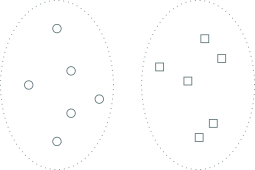
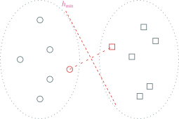

---
presentation:
  margin: 0
  center: false
  transition: "none"
  enableSpeakerNotes: true
  slideNumber: "c/t"
  navigationMode: "linear"
---

@import "../css/font-awesome-4.7.0/css/font-awesome.css"
@import "../css/theme/solarized.css"
@import "../css/logo.css"
@import "../css/font.css"
@import "../css/color.css"
@import "../css/margin.css"
@import "../css/table.css"
@import "../css/main.css"
@import "../plugin/zoom/zoom.js"
@import "../plugin/customcontrols/plugin.js"
@import "../plugin/customcontrols/style.css"
@import "../plugin/chalkboard/plugin.js"
@import "../plugin/chalkboard/style.css"
@import "../plugin/menu/menu.js"
@import "../js/anychart/anychart-core.min.js"
@import "../js/anychart/anychart-venn.min.js"
@import "../js/anychart/pastel.min.js"
@import "../js/anychart/venn-ml.js"

<!-- slide data-notes="尊敬的各位专家、各位老师上午好，我叫张腾，今天很荣幸有这样一个机会向各位专家汇报自己在间隔分布优化方面的微小的工作，作为一个后学末进，也希望能得到各位前辈专家的指点" -->

# 基于间隔分布优化的学习方法

## 华中科技大学 计算机学院

### 张腾

#### _tengzhang@hust.edu.cn_

#### 2023 / 05 / 26

<!-- slide data-notes="首先是一些基本概念的介绍，间隔，也是我们报告的核心，可以说是机器学习中最重要的概念，一个样本关于决策函数。。。"-->

##### 间隔定义

---

样本$(\xv, y)$关于决策函数$h(\cdot)$的间隔$\gamma_{(\xv, y)} = y \cdot h(\xv)$

间隔的大小反应对决测结果的置信度，为负表示预测错误

$h(\cdot)$的形式

- 线性函数：支持向量机
- 复合函数：神经网络
- 函数的加性组合：AdaBoost

<!-- slide vertical=true data-notes="间隔为和重要呢，因为它和模型的泛化性能息息相关，通过。。。"-->

##### 间隔理论

---

通过 Rademacher 复杂度、集中不等式等工具可得泛化界：

$\qquad \text{泛化风险} \le \text{经验风险} + \text{与间隔有关的项}$

间隔的统计量：

- 最小值，第$k$小的值，分位数值
- 均值，(半) 方差

更紧的界$\rightarrow$更本质的统计量

- 间隔分布很重要，均值越大、方差越小，界越紧 [1]
- 上述结论的发现过程非常曲折有趣 [2]

[1] W. Gao, Z.-H. Zhou. On the doubt about margin explanation of boosting. Artif. Intell., 203:1–18, 2013.
[2] 周志华. Boosting 学习理论的探索. 中国计算机学会通讯, 2020, 16(4): 36-42.

<!-- slide data-notes="看一个简单的图示，直观对比下优化最小间隔和间隔分布，虚线椭圆分别代表两类样本的潜在分布，圆形和正方形分别代表采样出的两类样本"-->

##### 最小间隔 _vs._ 间隔分布

---

<!-- slide vertical=true data-notes="如果以最小间隔为优化目标，就是考虑两个最近的样本，最终学到的分界面是h_{\min}，它与右边的椭圆已经相交了，这意味着它有将正方形样本误分类的风险"-->

##### 最小间隔 _vs._ 间隔分布

---

$\qquad h_{\min} \leftarrow$ 优化最小间隔

<!-- slide vertical=true data-notes="实心圆形和实心正方形是样本均值，如果考虑优化整个间隔分布，最终学到的分界面大致会是h_dist，它到两类中心点差不多远，和样本的第一主成分平行，显然比h_min稳健得多"-->

##### 最小间隔 _vs._ 间隔分布

---

$\qquad h_{\min} \leftarrow$ 优化最小间隔
$\qquad h_{\mathrm{dist}} \leftarrow$ 优化间隔分布

<!-- slide data-notes="到这里我们就明确了目标：优化间隔分布，下面是我的报告大纲，从全监督、弱监督两个方面展开，介绍一些工作"-->

##### 大纲

---

@import "../vega/outline.json" {as="vega" .top-2}

<!-- slide vertical=true data-notes="假设空间是超平面集合，样本间隔依然定义为 分类器预测值 和 类别标记 的乘积，加个hat表示是归一化的间隔，间隔均值下标加个m，表示mean    最大化间隔均值 同时 最小化间隔方差就得到了这里的形式，参数ρ用来权衡两项的重要性    第i个样本的间隔或者大于均值、或者小于均值，两种情况不可能同时成立，因此两个松弛变量必然一个非负一个为零，为负是不可能的，否则将其设成零不破坏任何约束却可以使目标函数值下降，所以目标函数第二项就是间隔方差"-->

##### 二分类

---

符号表示

- 分类器$f(\xv) = \wv^\top \phi(\xv)$
- 样本$(\xv_i ,y_i)$的归一化间隔$\hat{\gamma} (\xv_i, y_i) = y_i \wv^\top \phi(\xv_i) / \| \wv \|$
- 训练集上的归一化间隔均值$\hat{\gamma}_m$

最大化间隔均值 $\wedge$ 最小化间隔方差 (点击下式可显示形式化变化过程)

$$
\toggle
{\begin{align*}
    \quad \max_{\wv, \hat{\xi}_i, \hat{\epsilon}_i} & ~~ \rho \color{red}{\hat{\gamma}_m}^2 - \class{blue}{\frac{1}{m} \sum_{i \in [m]} (\hat{\xi}_i^2 + \hat{\epsilon}_i^2)} \\
    \st & ~~ \hat{\gamma} (\xv_i, y_i) \geq \hat{\gamma}_m - \hat{\xi}_i \\
    & ~~ \hat{\gamma} (\xv_i, y_i) \leq \hat{\gamma}_m + \hat{\epsilon}_i, ~ \forall i \in [m]
\end{align*}}
{\begin{align*}
    \quad \max_{\wv, \hat{\xi}_i, \hat{\epsilon}_i} & ~~ \rho \color{red}{\hat{\gamma}_m}^2 - \class{blue}{\frac{1}{m} \sum_{i \in [m]} (\hat{\xi}_i^2 + \hat{\epsilon}_i^2)} \\
    \st & ~~ \| \wv \| \hat{\gamma} (\xv_i, y_i) \geq \| \wv \| \hat{\gamma}_m - \| \wv \| \hat{\xi}_i \\
    & ~~ \| \wv \| \hat{\gamma} (\xv_i, y_i) \leq \| \wv \| \hat{\gamma}_m + \| \wv \| \hat{\epsilon}_i, ~ \forall i \in [m]
\end{align*}}
{\begin{align*}
    \quad \max_{\wv, \xi_i, \epsilon_i} & ~~ \rho \left( \class{red}{ \frac{\gamma_m}{\|\wv\|} } \right)^2 - \class{blue}{ \frac{1}{m} \sum_{i \in [m]} \frac{\xi_i^2 + \epsilon_i^2}{\|\wv\|^2} } \\
    \st & ~~ \gamma (\xv_i, y_i) \geq \gamma_m - \xi_i \\
    & ~~ \gamma (\xv_i, y_i) \leq \gamma_m + \epsilon_i, ~ \forall i \in [m]
\end{align*}}
{\begin{align*}
    \quad \max_{\wv, \xi_i, \epsilon_i} & ~~ \frac{1}{\| \wv \|^2} \left( \rho \gamma_m^2 - \frac{1}{m} \sum_{i \in [m]} (\xi_i^2 + \epsilon_i^2) \right) \\
    \st & ~~ y_i \wv^\top \phi(\xv_i) \geq \gamma_m - \xi_i \\
    & ~~ y_i \wv^\top \phi(\xv_i) \leq \gamma_m + \epsilon_i, ~ \forall i \in [m]
\end{align*}}
{\begin{align*}
    \quad \max_{\wv, \xi_i, \epsilon_i} & ~~ \frac{1}{\| \wv \|^2} \left( \rho - \frac{1}{m} \sum_{i \in [m]} (\xi_i^2 + \epsilon_i^2) \right) \\
    \st & ~~ y_i \wv^\top \phi(\xv_i) \geq 1 - \xi_i \\
    & ~~ y_i \wv^\top \phi(\xv_i) \leq 1 + \epsilon_i, ~ \forall i \in [m]
\end{align*}}
{\begin{align*}
    \quad \min_{\wv, \xi_i, \epsilon_i} & ~~ \frac{1}{2} \|\wv\|^2 + \frac{\lambda}{2m} \sum_{i \in [m]} (\xi_i^2 + \epsilon_i^2) \\
    \st & ~~ y_i \wv^\top \phi(\xv_i) \geq 1 - \xi_i \\
    & ~~ y_i \wv^\top \phi(\xv_i) \leq 1 + \epsilon_i, ~ \forall i \in [m]
\end{align*}}
\endtoggle
$$

<!-- slide vertical=true data-notes="下面我们再做三点微小的调整，让模型的灵活度更高一些，首先两个松弛变量对应了样本间隔对间隔均值的两种不同方向的偏离，它们是不能一视同仁的，因为向更大方向的偏离在远离分类超平面，这不会对分类错误率有什么影响；而向变小方向的偏离则是在接近分类超平面，这同时也增加了样本被误分类的可能性，因此需区别对待，我们引入参数μ来权衡两种不同的偏离损失    其次根据表示定理，最终的分类超平面由损失不为零的样本构成，所以只要间隔不等于均值就有损失，几乎所有样本都是支持向量，这大大增加了计算开销和存储开销，没有必要。为此我们借鉴支持向量回归的思想，引入θ-不敏感损失，就是只要偏离程度不超过θ，就认为没有损失，超过的部分才会计算损失    最后，机器学习问题的常见形式化是 正则项 + 替代损失函数，所以将第二项加了个分母(1 - θ)^2，使得它成为0-1损失的上界，这就是ODM的最终形式"-->

##### 二分类

---

改进 [1]

- $\xi_i,\epsilon_i$：两种不同方向的偏离，$\mu = 1$：方差；$\mu=0$：半方差 [2]
- 几乎所有的样本都是支持向量：计算、存储开销大
- 机器学习问题的常见优化形式：正则项 + 损失函数

最终形式化

$$
\begin{align*}
    \quad \min_{\wv, \xi_i, \epsilon_i} & ~~ \frac{1}{2} \|\wv\|^2 + \frac{\lambda}{2m} \sum_{i \in [m]} \frac{\xi_i^2 + \class{red}{\mu} \epsilon_i^2}{\class{cyan}{(1 - \theta)^2}} \\
    \st & ~~ y_i \wv^\top \phi(\xv_i) \geq 1 \class{blue}{- \theta} - \xi_i \\
    & ~~ y_i \wv^\top \phi(\xv_i) \leq 1 \class{blue}{+ \theta} + \epsilon_i, ~ \forall i \in [m]
\end{align*}
$$

[1] <u>T. Zhang</u> and Z.-H. Zhou. Optimal margin distribution machine. IEEE Trans. Knowl. Data Eng., 32(6):1143–1156, 2019.
[2] M.-Z. Qian, Z. Ai, <u>T. Zhang</u> and W. Gao. On the Optimization of Margin Distribution. In IJCAI, pp. 3387–3393, 2022.

<!-- slide data-notes="由于核的存在，优化变量可能是无穷维的，但约束个数是有限的，此时我们通常求其拉格朗日对偶问题，求得对偶最优解α⋆后，原始问题的解可以通过KKT条件恢复出来，然后利用核技巧对未知样本进行预测"-->

##### 对偶问题

---

$\Xv = [\phi(\xv_1), \ldots, \phi(\xv_m)], ~ \Yv = \diag(\yv), ~ \Qv = \Yv \Xv^\top \Xv \Yv, ~ c = \frac{m (1 - \theta)^2}{\lambda\mu}$

对偶问题

$$
\begin{align*}
    \quad \min_{\alphav \geq \zerov} & ~~ \frac{1}{2} \alphav^\top \begin{bmatrix}
        \Qv + c \mu \Iv & - \Qv \\
        - \Qv & \Qv + c \Iv
    \end{bmatrix} \alphav + \begin{bmatrix}
    (\theta - 1) \ev \\
    (\theta + 1) \ev
    \end{bmatrix}^\top \alphav
\end{align*}
$$

原问题的解：$\wv^\star = \Xv \Yv (\zetav - \betav) = \Xv \Yv [\Iv, -\Iv] \alphav^\star$

预测：$\phi(\zv)^\top \wv^\star = [\kappa(\xv_1, \zv), \ldots, \kappa(\xv_m, \zv)] \Yv [\Iv, -\Iv] \alphav^\star$

<!-- slide vertical=true data-notes="对偶问题是一个凸二次规划，由于优化变量相互之间解耦合，因此每轮可以挑出一个变量单独优化，固定其他变量不变，这就是坐标下降法，每轮只是求解一个固定区间上的二次函数极值问题，是有闭式解的 当然直接用投影梯度下降法也是可以的"-->

##### 优化算法

---

对偶问题：二次规划

$$
\begin{align*}
    \quad \min_{\alphav \geq \zerov} \quad f(\alphav) = \frac{1}{2} \alphav^\top \underbrace{\begin{bmatrix}
            \Qv + c \mu \Iv & - \Qv \\
            - \Qv & \Qv + c \Iv
        \end{bmatrix}}_{\Hv \succeq \zerov} \alphav + \begin{bmatrix}
        (\theta - 1) \ev \\
        (\theta + 1) \ev
        \end{bmatrix}^\top \alphav
\end{align*}
$$

- 非负象限可行域
- 正定对称二次型
- 优化变量解耦合

坐标下降法：$\min_t f(\alphav + t \ev_i) \quad \st ~ [\alphav]_i + t \geq 0$

闭式解：$[\alphav]_i^{new} \leftarrow \max \{ [\alphav]_i - [\nabla f(\alphav)]_i / [\Hv]_{ii}, 0 \}$

<!-- slide vertical=true data-notes="当不使用非线性核时，就没必要非要解对偶问题了，可以直接求解原问题，这时目标函数是一阶可微的，它的梯度如下式所示，对于这种m项遍历求和的形式很容易得到它的随机梯度"-->

##### 线性核原问题

---

线性核原问题

$$
\begin{align*}
    \quad \min_{\wv} ~~ f(\wv) & = \frac{1}{2} \| \wv \|^2 + \frac{\lambda}{2m(1 - \theta)^2} \sum_{i \in [m]} [1 - \theta - y_i \wv^\top \xv_i]_+^2 \\
    & \qquad + \frac{\lambda \mu}{2m(1 - \theta)^2} \sum_{i \in [m]} [y_i \wv^\top \xv_i - 1 - \theta]_+^2
\end{align*}
$$

梯度

$$
\begin{align*}
    \quad \nabla f(\wv) & = \wv + \frac{\lambda}{\class{yellow}{m} (1-\theta)^2} \class{yellow}{\sum_{i \in [m]}} (y_i \wv^\top \xv_i + \theta - 1) y_i \xv_i 1_{y_i \wv^\top \xv_i \leq 1 - \theta} \\
    & \qquad + \frac{\lambda \mu}{\class{yellow}{m} (1-\theta)^2} \class{yellow}{\sum_{i \in [m]}} (y_i \wv^\top \xv_i - \theta - 1) y_i \xv_i 1_{y_i \wv^\top \xv_i \geq 1 + \theta}
\end{align*}
$$

<!-- slide vertical=true data-notes="就是从m个样本里随机挑一个，于是就可以利用svrg saga之类的基于随机梯度的算法进行求解"-->

##### 线性核原问题

---

线性核原问题

$$
\begin{align*}
    \quad \min_{\wv} ~~ f(\wv) & = \frac{1}{2} \| \wv \|^2 + \frac{\lambda}{2m(1 - \theta)^2} \sum_{i \in [m]} [1 - \theta - y_i \wv^\top \xv_i]_+^2 \\
    & \qquad + \frac{\lambda \mu}{2m(1 - \theta)^2} \sum_{i \in [m]} [y_i \wv^\top \xv_i - 1 - \theta]_+^2
\end{align*}
$$

随机梯度

$$
\begin{align*}
    \quad \nabla f(\wv, \xv_i) & = \wv + \frac{\lambda}{(1-\theta)^2} (y_i \wv^\top \xv_i + \theta - 1) y_i \xv_i 1_{y_i \wv^\top \xv_i \leq 1 - \theta} \\
    & \qquad + \frac{\lambda \mu}{(1-\theta)^2} (y_i \wv^\top \xv_i - \theta - 1) y_i \xv_i 1_{y_i \wv^\top \xv_i \geq 1 + \theta}
\end{align*}
$$

<!-- slide data-notes=""-->

##### 大纲

---

@import "../vega/outline.json" {as="vega" .top-2}

<!-- slide vertical=true data-notes="下面是多分类的版本，设有k个类，每个类都有一个打分函数，分类器的预测值是打分函数的最大值，预测标记是给出最大分数的打分函数的下标。第i个样本的间隔定义为它所在类的打分函数值与非正确分类的打分函数的最大值的差。显然，如果这个差是正的，那么这个样本就被正确分类了，值越大，代表分类置信度越大，值为负则表示分类错了    依然考虑最大化间隔均值同时最小化间隔方差，这可以借鉴前面的形式化"-->

##### 多分类

---

符号表示

- 类别标记集合$\Ycal = \{ 1, \ldots, k \}$
- 分类器$f(\xv) = \argmax_{i \in [k]} \wv_i^\top \phi(\xv)$
- 样本$(\xv_i ,y_i)$的间隔$\gamma (\xv_i, y_i) = \wv_{y_i}^\top \phi(\xv_i) - \max_{l \neq y_i} \wv_l^\top \phi(\xv_i)$

最大化间隔均值 $\wedge$ 最小化间隔方差 (点击下式可显示形式化变化过程)

$$
\toggle
{\begin{align*}
    \quad \min_{\wv, \xi_i, \epsilon_i} & ~~ \class{violet}{\frac{1}{2} \|\wv\|^2} + \frac{\lambda}{2m} \sum_{i \in [m]} \frac{\xi_i^2 + \mu \epsilon_i^2}{(1 - \theta)^2} \\
    \st & ~~ \class{violet}{y_i \wv^\top \phi(\xv_i)} \geq 1 - \theta - \xi_i \\
    & ~~ \class{violet}{y_i \wv^\top \phi(\xv_i)} \leq 1 + \theta + \epsilon_i, ~ \forall i \in [m]
\end{align*}}
{\begin{align*}
    \quad \min_{\wv, \xi_i, \epsilon_i} & ~~ \class{violet}{\frac{1}{2} \sum_{l \in [k]} \| \wv_l \|^2} + \frac{\lambda}{2m} \sum_{i \in [m]} \frac{\xi_i^2 + \mu \epsilon_i^2}{(1 - \theta)^2} \\
    \st & ~~ \class{violet}{\wv_{y_i}^\top \phi(\xv_i) - \max_{l \neq y_i} \wv_l^\top \phi(\xv_i)} \geq 1 - \theta - \xi_i \\
    & ~~ \class{violet}{\wv_{y_i}^\top \phi(\xv_i) - \max_{l \neq y_i} \wv_l^\top \phi(\xv_i)} \leq 1 + \theta + \epsilon_i, ~ \forall i \in [m]
\end{align*}}
\endtoggle
$$

<!-- slide vertical=true data-notes="同样由于核的存在，考虑求解对偶问题，这依然是一个凸二次规划，但是比二分类的情形要复杂得多了，总共有m(k+1)个优化变量    x_i对应的k+1个优化变量是α_1,,…,α_k,βi，把它们看成一组变量的话，总共有m组变量，不同组间的变量是相互没有牵扯的，因此可以把坐标下降的思想用进来，每轮挑选一组变量进行优化，剩下的m-1组固定不变，这样每轮要优化的变量个数大大减少，只有k+1个，就容易得多了"-->

##### 对偶问题

---

$$
\begin{align*}
    \quad \min_{\alpha_i^l, \alpha_i^{y_i}, \beta_i} & ~~ \frac{1}{2} \sum_{l \in [k]} \sum_{i,j \in [m]} (\alpha_i^l - \delta_{y_i, l} \beta_i) (\alpha_j^l - \delta_{y_j, l} \beta_j) \kappa(\xv_i, \xv_j) \\
    & ~~ + \frac{m (1-\theta)^2}{2 \lambda} \sum_{i \in [m]} (\alpha_i^{y_i})^2 + \frac{m (1-\theta)^2}{2 \lambda \mu} \sum_{i \in [m]} \beta_i^2 \\
    & ~~ + (1 - \theta) \sum_{i \in [m]} \sum_{l \neq y_i} \alpha_i^l + (M_i + 1 + \theta) \sum_{i \in [m]} \beta_i \\
    \st & ~~ \sum_{l \in [k]} \alpha_i^l = 0, ~ \alpha_i^l \leq 0, ~ \forall l \neq y_i, ~ \beta_i \geq 0, ~ \forall i \in [m]
\end{align*}
$$

- $\xv_i$对应的$k+1$个优化变量为$\alpha_i^1, \ldots, \alpha_i^k, \beta_i$
- $\xv_i$对应的优化变量与$\xv_j$对应的优化变量解耦合

<!-- slide data-notes="这里给出了k+1个变量的优化子问题，其中ABDEF都是已知参数，刚说了这是一个凸二次优化，用的凸二次优化算法的时间开销是O(k3)，我们提出一种基于排序的算法，时间开销是O(k logk)，进一步加速算法"-->

##### 优化子问题

---

以$\alpha_i^1, \ldots, \alpha_i^k, \beta_i$为优化变量

$$
\begin{align*}
    \quad \min_{\alpha_i^l, \alpha_i^{y_i}, \beta_i} & ~~ \sum_{l \neq y_i} \frac{A}{2} (\alpha_i^l)^2 + \sum_{l \neq y_i} B_l \alpha_i^l + \frac{D}{2} (\alpha_i^{y_i})^2 - A \alpha_i^{y_i} \beta_i \\
    & ~~ + B_{y_i} \alpha_i^{y_i} + \frac{E}{2} \beta_i^2 + F \beta_i \\
    \st & ~~ \sum_{l=1}^k \alpha_i^l = 0, ~ \alpha_i^l \leq 0, ~ \forall l \neq y_i,~\beta_i \geq 0
\end{align*}
$$

- 含有$k+1$个优化变量的凸二次优化
- 通用的凸二次优化算法的时间开销是$O(k^3)$
- 我们提出基于排序的算法 [1]，时间开销是$O(k \log k)$

[1] <u>T. Zhang</u> and Z.-H. Zhou. Multi-class optimal margin distribution machine. In ICML, pp. 4063-4071, 2017.

<!-- slide vertical=true data-notes="求解该问题只需求解KKT条件导出的方程组，通过一些代数运算和分类讨论，最终突破口在ν这个变量上"-->

##### KKT 条件

---

存在标量$\nu, \rho_l, \eta$满足

$$
\begin{align*}
    \quad \begin{cases}
    \sum_{l=1}^k \alpha_i^l = 0 \\
    \alpha_i^l \leq 0 \\
    \beta_i \geq 0 \\
    \rho_l \alpha_i^l = 0, \ \rho_l \geq 0 \\
    A \alpha_i^l + B_l - \nu + \rho_l = 0 \\
    \eta \beta_i =0, \ \eta \geq 0 \\
    - A \alpha_i^{y_i} + E \beta_i + F - \eta = 0 \\
    D \alpha_i^{y_i} - A \beta_i + B_{y_i} - \nu = 0
    \end{cases} & \longrightarrow
    \begin{cases}
    \sum_{l=1}^k \alpha_i^l = 0 \\
    \alpha_i^l = \min ( 0, (\nu - B_l)/A ) \\
    \beta_i = \max ( 0, (A \alpha_i^{y_i} - F) / E ) \\
    D \alpha_i^{y_i} + B_{y_i} - \nu \\
    \quad = \max ( 0, A(A \alpha_i^{y_i} - F) / E )
    \end{cases}
\end{align*}
$$

- $A \alpha_i^{y_i} \leq F \longrightarrow \beta_i = 0$，$\alpha_i^{y_i} = (\nu - B_{y_i})/D$，$\nu \leq B_{y_i} + DF/A$
- $A \alpha_i^{y_i} > F \longrightarrow \beta_i = (A \alpha_i^{y_i} - F)/E$，$\alpha_i^{y_i} = (E \nu - AF - E B_{y_i})/(DE - A^2)$，$\nu > B_{y_i} + DF/A$

<!-- slide vertical=true data-notes="可以证明，不论哪种情形，ν的最优解是第一个式子的形式    这可以通过对数组B降序排列，然后将其顺次添加到空集中直至第二个式子成立得到"-->

##### KKT 条件

---

无论那种情形

$$
\begin{align*}
    \quad \nu^\star = \frac{ P + \sum_{l: \alpha_i^l <0} B_l }{ Q + |\{l | \alpha_i^l <0 \}| }
\end{align*}
$$

对$\{ B_l \mid l \neq y_i \}$降序排列，并顺次添加到空集$\Phi$中直至下式成立

$$
\begin{align*}
    \quad \nu^\star= \frac{P + \sum_{l \in \Phi} \hat{B}_l}{Q + |\Phi|} & \geq \max_{l \not \in \Phi} \hat{B}_l
\end{align*}
$$

<!-- slide data-notes=""-->

##### 大纲

---

@import "../vega/outline.json" {as="vega" .top-2}

<!-- slide vertical=true data-notes=""-->

##### 效率对比

---

|                       | 支持向量机 | 最优间隔分布学习机 |
| :-------------------: | :--------: | :----------------: |
|     原问题的约束      |    $m$     |        $2m$        |
|  对偶问题的优化变量   |    $m$     |        $2m$        |
| 超参数 (不考虑核函数) |    $1$     |        $3$         |

<!-- slide data-notes=""-->

##### 子集近似

---

基本想法 [1]

- 给定半径，构造尽可能少的球覆盖全部训练数据
- 所有球心构成{==核心集==} (coreset)，可视为对原数据的近似
- 优化中需用到全部数据的步骤只在核心集上进行，如计算梯度

子集近似 + 随机优化：CoresetSVRG

理论分析：

- 核心集产生的近似误差可由球半径表示出来
- 在适当条件下，控制球半径可使近似误差不超过随机优化引入的误差
- 不改变 SVRG 收敛率的情况下，大幅减少每轮的计算开销

[1] Z.-H. Tan, <u>T. Zhang</u>, W. Wang. Coreset Stochastic Variance-Reduced Gradient with Application to Optimal Margin Distribution Machine. In AAAI, pp. 5083–5090, 2019.

<!-- slide vertical=true data-notes=""-->

##### 分而治之

---

基本想法 [1]

- 对数据集做划分，在每个小块数据上训练局部模型
- 不断合并小块，合并前一轮的局部模型为初始，重新训练

加速的关键：小的局部模型与全局模型很接近，模型“复用”了

数据划分时，每个小块数据的分布应接近数据的总体分布

借鉴分层抽样：

- 先对数据做聚类，每个簇视为一层
- 将每个簇的样本分摊到各个小块上

[1] Y. Wang, N. Cao, <u>T. Zhang</u>, X. Shi, H. Jin. Scalable Optimal Margin Distribution Machine. In IJCAI, 2023.

<!-- slide vertical=true data-notes=""-->

##### 增量减量

---

增量学习

- 应用：数据本就会随时间不断新增的学习任务
- 先用有限资源在部分数据上训练一个模型，再增量更新

减量学习

- 应用：因为隐私等原因，被数据的拥有者收回使用权
- $n$-折交叉验证：训练模型$n$次 _vs._ 训练模型$1$次 + 减量学习$n$次

基本想法 [1]

- 新增/待删样本对应的拉格朗日乘子：$0 \rightarrow \alpha^\star / \alpha^\star \rightarrow 0$
- 分析 KKT 条件，样本可分为 3 个子集：带状区域 内、边界上、外
- 在 3 个集合不发生改变时，其他样本的$\alpha$随增/删样本线性变化

[1] L.-J. Chen, <u>T. Zhang</u>, X. Shi, H. Jin. Incremental and Decremental Optimal Margin Distribution Learning. In IJCAI, 2023.

<!-- slide data-notes=""-->

##### 大纲

---

@import "../vega/outline.json" {as="vega" .top-2}

<!-- slide vertical=true data-notes="依然还是从最初的形式出发，不过由于监督信息不全，类别标记y也变成了优化变量，就是多了外面蓝色的这层，也就是同时优化间隔分布和簇标记，即将类别标记赋予给每个样本时，在这个“伪全监督数据”上可以训练得到一个有好的间隔分布的划分超平面    这里为了后面优化推导的方便，对形式做了一些简化，把原来损失函数分母(1 - theta)^2丢进lambda_i中了    聚类属于无监督学习，没有类别标记信息 因此样本权重都是一样的，这里关键的是候选类别标记集合B，根据问题的领域知识来设置，可以是簇的平衡度，或者必连、勿连之类的样本对"-->

##### 问题形式化

---

类别标记$\yv$也作为优化变量：

$$
\begin{align*}
    \quad \class{blue}{\min_{\yvhat \in \Bcal}} \min_{\wv, \xi_i, \epsilon_i} & ~~ \frac{1}{2} \|\wv\|^2 + \frac{1}{2m} \sum_{i=1}^m \lambda_i (\xi_i^2 + \nu \epsilon_i^2) \\
    \st & ~~ \class{blue}{\yhat_i} \wv^\top \phi(\xv_i) \geq 1 - \theta - \xi_i \\
    & ~~ \class{blue}{\yhat_i} \wv^\top \phi(\xv_i) \leq 1 + \theta + \epsilon_i, ~ \forall i \in [m]
\end{align*}
$$

聚类：所有样本的类别标记均缺失

- 样本权重$\lambda_i$相等，即$\lambda_1 = \lambda_2 = \cdots = \lambda_m$

(半监督) 聚类：必连约束集合$\Mcal$，勿连约束集合$\Ccal$

- 必连：$\Bcal = \{ \hat{\yv} \mid \hat{y}_i = \hat{y}_j, \forall (\xv_i, \xv_j) \in \Mcal \}$
- 勿连：$\Bcal = \{ \hat{\yv} \mid \hat{y}_j \neq \hat{y}_k, \forall (\xv_j, \xv_k) \in \Ccal \}$

<!-- slide vertical=true data-notes="对于半监督，一部分样本有类别标记，一部分没有，就是把损失拆成两项，第二项是有标记数据上的损失，第三项是无标记数据上的损失，两者的权重不同，集合B依然根据问题的领域知识来定，例如平衡性约束，要求无标记数据上的类别比例和有标记数据相同"-->

##### 问题形式化

---

半监督：$\Scal = \Scal_l \cup \Scal_u = \{ (\xv_1, y_1), \ldots, (\xv_l,y_l) \} \cup \{ \xv_{l+1}, \ldots, \xv_{l+u} \}$

$$
\begin{align*}
    \quad \class{blue}{\min_{\yvhat \in \Bcal}} \min_{\wv, \xi_i, \epsilon_i} & ~~ \frac{1}{2} \|\wv\|^2 + \underbrace{\frac{\lambda_1}{l} \sum_{i=1}^l (\xi_i^2 + \nu \epsilon_i^2)}_{\text{有标记数据}~~~} + \underbrace{\frac{\lambda_2}{u} \sum_{i=l+1}^{l+u} (\xi_i^2 + \nu \epsilon_i^2)}_{\text{未标记数据}~~~} \\
    \st & ~~ \class{blue}{\yhat_i} \wv^\top \phi(\xv_i) \geq 1 - \theta - \xi_i \\
    & ~~ \class{blue}{\yhat_i} \wv^\top \phi(\xv_i) \leq 1 + \theta + \epsilon_i, ~ \forall i \in [m]
\end{align*}
$$

- 有标记样本权重为$\lambda_1$，未标记样本权重为$\lambda_2$
- 平衡性约束：$\Bcal = \left\{ \hat{\yv} ~ \bigg| ~ \frac{\ev^\top \hat{\yv}_U}{m-l} = \frac{\ev^\top \yv_L}{l} \right\}$

<!-- slide data-notes="由于核映射的存在，内层问题一般转化为对偶问题"-->

##### 问题形式化 变形

---

$$
\begin{align*}
    \quad \class{blue}{\min_{\yvhat \in \Bcal}} \min_{\wv, \xi_i, \epsilon_i} & ~~ \frac{1}{2} \|\wv\|^2 + \frac{1}{2m} \sum_{i \in [m]} \lambda_i (\xi_i^2 + \nu \epsilon_i^2), \\
    \st & ~~ \class{blue}{\yhat_i} \langle \wv, \phi(\xv_i) \rangle \geq 1 - \theta - \xi_i, ~ \class{blue}{\yhat_i} \langle \wv, \phi(\xv_i) \rangle \leq 1 + \theta + \epsilon_i, ~ \forall i \in [m]
\end{align*}
$$

由于核映射$\phi$的存在，内层问题一般转化为对偶问题，引入拉格朗日乘子$\alphav = [\alpha_1; \ldots; \alpha_m]$、$\betav = [\beta_1; \ldots; \beta_m]$、$\deltav = \alphav - \betav$，根据 KKT 条件

$$
\begin{align*}
    \quad \wv = \sum_{i \in [m]} (\alpha_i - \beta_i) \yhat_i \phi(\xv_i), \quad \lambda_i \xi_i = m \alpha_i, \quad \lambda_i \nu \epsilon_i = m \beta_i
\end{align*}
$$

对偶问题为$\class{blue}{\min_{\yvhat \in \Bcal}} \max_{\alphav, \betav \succeq \zerov} - \frac{1}{2} \deltav^\top (\Kv \odot \class{blue}{\yvhat} \class{blue}{\yvhat}^\top) \deltav - A(\alphav, \betav)$，其中

$$
\begin{align*}
    \quad A(\alphav, \betav) = \frac{m}{2} \begin{bmatrix}
        \alphav \\ \betav
    \end{bmatrix}^\top
    \begin{bmatrix}
        \Iv /  \lambdav         \\
        & \Iv / \nu \lambdav
    \end{bmatrix}
    \begin{bmatrix}
        \alphav \\ \betav
    \end{bmatrix} - \begin{bmatrix} (\theta - 1) \ev \\ (\theta + 1) \ev \end{bmatrix}^\top \begin{bmatrix}
        \alphav \\ \betav
    \end{bmatrix}
\end{align*}
$$

<!-- slide vertical=true data-notes="外层问题是整数规划，直接求解是NP难的，所以交换……，将它挪到内层，方便进一步处理，这步交换实际是做了一个凸放松  挪到内层之后，将内层的从有限集合B中选取是目标函数值最小的\yhat，转化为连续优化问题，只需引入变量\mu即可  最后再次交换min和max顺序，这个交换是等价交换，得到要求解的对偶问题"-->

##### 问题形式化 变形

---

外层问题是整数规划，交换$\min_{\yvhat \in \Bcal}$和$\max_{\alphav, \betav \succeq \zerov}$

$$
\begin{align*}
    \quad \max_{\alphav, \betav \succeq \zerov} \class{blue}{\min_{\yvhat \in \Bcal}} - \frac{1}{2} \deltav^\top (\Kv \odot \class{blue}{\yvhat} \class{blue}{\yvhat}^\top) \deltav - A(\alphav, \betav)
\end{align*}
$$

引入$|\Bcal|$维单纯形$\Delta^{|\Bcal|} = \{ \muv \mid \ev^\top \muv = 1, ~ \muv \succeq \zerov \}$可得连续优化：

$$
\begin{align*}
    \quad \max_{\alphav, \betav \succeq \zerov} \class{blue}{\min_{\muv \in \Delta^{|\Bcal|}}} - \frac{1}{2} \deltav^\top \left( \sum_{t:\yvhat_t \in \Bcal} \mu_t \Kv \odot \yvhat_t \yvhat_t^\top \right) \deltav - A(\alphav, \betav)
\end{align*}
$$

根据{==鞍点定理==}，再次 (等价) 交换

$$
\begin{align*}
    \quad \text{D}: ~ \min_{\muv \in \Delta^{|\Bcal|}} \max_{\alphav, \betav \succeq \zerov} - \frac{1}{2} \deltav^\top \left( \sum_{t: \yvhat_t \in \Bcal} \mu_t \Kv \odot \yvhat_t \yvhat_t^\top \right) \deltav - A(\alphav, \betav)
\end{align*}
$$

<!-- slide vertical=true data-notes="有了放松后的对偶问题，下面再推导下原问题，引入辅助样本和辅助核矩阵，可以将对偶问题第一项中的求和写成紧凑的形式，对比没放松前的对偶问题，就是K变成了\tilde{K}，\yhat变成了\ev，因此立刻可以得到原问题"-->

##### 问题形式化 变形

---

$$
\begin{align*}
    \quad \text{D}: ~ \min_{\muv \in \Delta^{|\Bcal|}} \max_{\alphav, \betav \succeq \zerov} - \frac{1}{2} \deltav^\top \left( \sum_{t: \yvhat_t \in \Bcal} \mu_t \Kv \odot \yvhat_t \yvhat_t^\top \right) \deltav - A(\alphav, \betav)
\end{align*}
$$

- 辅助样本$\xvt_i = [\sqrt{\mu_1} [\yvhat_1]_i \phi(\xv_i); \ldots; \sqrt{\mu_{|\Bcal|}} [\yvhat_{|\Bcal|}]_i \phi(\xv_i)]$
- 辅助核矩阵$\Kvt$满足$[\Kvt]_{ij} = \langle \xvt_i, \xvt_j \rangle$

$$
\begin{align*}
    \quad \text{D}: ~ \min_{\muv \in \Delta^{|\Bcal|}} \max_{\alphav, \betav \succeq \zerov} & - \frac{1}{2} \deltav^\top (\class{blue}{\Kvt \odot \ev \ev^\top}) \deltav - A(\alphav, \betav). \\
    & ~~ \class{red}{\big \Downarrow ~ \Kv \rightarrow \Kvt, ~ \yvhat \rightarrow \ev} \\
    \text{P}: ~ \min_{\muv \in \Delta^{|\Bcal|}} \min_{\wvt, \xi_i, \epsilon_i} & ~~ \frac{1}{2} \|\wvt\|^2 + \frac{1}{2m} \sum_{i \in [m]} \lambda_i (\xi_i^2 + \nu \epsilon_i^2), \\
    \st & ~~ \langle \wvt, \xvt_i \rangle \geq 1 - \theta - \xi_i, ~ \langle \wvt, \xvt_i \rangle \leq 1 + \theta + \epsilon_i, ~ \forall i \in [m].
\end{align*}
$$

KKT 条件为$\wvt = \sum_{i \in [m]} (\alpha_i - \beta_i) \xvt_i$、$\lambda_i \xi_i = m \alpha_i$、$\lambda_i \nu \epsilon_i = m \beta_i$

<!-- slide vertical=true data-notes="最后通过引入\wv_1, \ldots, \wv_B，将隐藏在\xvt_i中外层优化变量\muv给显式地弄出来，就得到了最终要求解地原问题"-->

##### 问题形式化 变形

---

原问题

$$
\begin{align*}
    \quad \text{P}: ~ \min_{\muv \in \Delta^{|\Bcal|}} \min_{\wvt, \xi_i, \epsilon_i} & ~~ \frac{1}{2} \|\wvt\|^2 + \frac{\lambda}{2m} \sum_{i \in [m]} (\xi_i^2 + \nu \epsilon_i^2), \\
    \st & ~~ \langle \wvt, \xvt_i \rangle \geq 1 - \theta - \xi_i, ~ \langle \wvt, \xvt_i \rangle \leq 1 + \theta + \epsilon_i, ~ \forall i \in [m]
\end{align*}
$$

外层优化变量$\muv$隐藏在$\xvt_i$中，设$\wvt = [\wv_1 / \sqrt{\mu_1}; \ldots; \wv_{|\Bcal|} / \sqrt{\mu_{|\Bcal|}}]$

$$
\begin{align*}
    \quad \text{P}: ~ \min_{\muv \in \Delta^{|\Bcal|}} \min_{\wv_t, \xi_i, \epsilon_i} & ~~ \frac{1}{2} \sum_{t: \yvhat_t \in \Bcal} \frac{\|\wv_t\|^2}{\mu_t} + \frac{\lambda}{2m} \sum_{i \in [m]} (\xi_i^2 + \nu \epsilon_i^2), \\
    \st & ~~ \sum_{t: \yvhat_t \in \Bcal} [\yvhat_t]_i \langle \wv_t, \phi(\xv_i) \rangle \geq 1 - \theta - \xi_i \\
    & ~~ \sum_{t: \yvhat_t \in \Bcal} [\yvhat_t]_i \langle \wv_t, \phi(\xv_i) \rangle \leq 1 + \theta + \epsilon_i, ~ \forall i \in [m]
\end{align*}
$$

<!-- slide vertical=true data-notes="这就是最终要求解的原问题和对偶问题"-->

##### 问题形式化 变形

---

原问题

$$
\begin{align*}
    \quad \min_{\muv \in \Delta^{|\Bcal|}} \min_{\wv_t, \xi_i, \epsilon_i} & ~~ \frac{1}{2} \sum_{t: \yvhat_t \in \Bcal} \frac{\|\wv_t\|^2}{\mu_t} + \frac{1}{2m} \sum_{i \in [m]} \lambda_i (\xi_i^2 + \nu \epsilon_i^2), \\
    \st & ~~ \sum_{t: \yvhat_t \in \Bcal} [\yvhat_t]_i \langle \wv_t, \phi(\xv_i) \rangle \geq 1 - \theta - \xi_i \\
    & ~~ \sum_{t: \yvhat_t \in \Bcal} [\yvhat_t]_i \langle \wv_t, \phi(\xv_i) \rangle \leq 1 + \theta + \epsilon_i, ~ \forall i \in [m]
\end{align*}
$$

对偶问题

$$
\begin{align*}
    \quad \min_{\muv \in \Delta^{|\Bcal|}} \max_{\alphav, \betav \succeq \zerov} & - \frac{1}{2} \begin{bmatrix}
        \alphav \\ \betav
    \end{bmatrix}^\top \begin{bmatrix}
        \Iv \\ -\Iv
    \end{bmatrix} \Kvt \begin{bmatrix}
        \Iv \\ -\Iv
    \end{bmatrix}^\top \begin{bmatrix}
        \alphav \\ \betav
    \end{bmatrix} \\
    & \qquad - \frac{m}{2} \begin{bmatrix}
        \alphav \\ \betav
    \end{bmatrix}^\top
    \begin{bmatrix}
        \Iv / \lambdav &           \\
            & \Iv / \nu \lambdav
    \end{bmatrix}
    \begin{bmatrix}
        \alphav \\ \betav
    \end{bmatrix} - \begin{bmatrix} (\theta - 1) \ev \\ (\theta + 1) \ev \end{bmatrix}^\top \begin{bmatrix}
        \alphav \\ \betav
    \end{bmatrix}
\end{align*}
$$

<!-- slide data-notes="由于有两层优化，我们采用交替优化，当\muv固定时，通过对偶问题可以得到\alphav、\betav优化子问题，这是非负象限上的凸二次规划，可以采用投影梯度法或坐标下降法"-->

##### 交替优化

---

当$\muv$固定时，$\Kvt$亦固定，优化$\alphav, \betav$为非负象限上的凸二次规划

$$
\begin{align*}
    \quad \max_{\alphav, \betav \succeq \zerov} - \frac{1}{2} \begin{bmatrix}
        \alphav \\ \betav
    \end{bmatrix}^\top \begin{bmatrix}
        \Kvt + m \Iv / \lambdav & -\Kvt \\ -\Kvt & \Kvt + m \Iv / \nu \lambdav
    \end{bmatrix} \begin{bmatrix}
        \alphav \\ \betav
    \end{bmatrix} - \begin{bmatrix} (\theta - 1) \ev \\ (\theta + 1) \ev \end{bmatrix}^\top \begin{bmatrix}
        \alphav \\ \betav
    \end{bmatrix}
\end{align*}
$$

采用投影梯度法或坐标下降法

$$
\begin{align*}
    \quad \begin{bmatrix}
        \alphav \\ \betav
    \end{bmatrix} \leftarrow \left[ \begin{bmatrix}
        \alphav \\ \betav
    \end{bmatrix} - \eta \left( \begin{bmatrix}
        \Kvt + m \Iv / \lambdav & -\Kvt \\ -\Kvt & \Kvt + m \Iv / \nu \lambdav
    \end{bmatrix} \begin{bmatrix}
        \alphav \\ \betav
    \end{bmatrix} + \begin{bmatrix} (\theta - 1) \ev \\ (\theta + 1) \ev \end{bmatrix} \right) \right]_+
\end{align*}
$$

求得$\alphav, \betav$后，由$\lambda_i \xi_i = m \alpha_i, \lambda_i \nu \epsilon_i = m \beta_i$可得$\epsilon_i, \xi_i$，以及

$$
\begin{align*}
    \quad \begin{bmatrix}
        \wv_1 / \sqrt{\mu_1} \\ \vdots \\ \wv_{|\Bcal|} / \sqrt{\mu_{|\Bcal|}}
    \end{bmatrix} = \sum_{i \in [m]} (\alpha_i - \beta_i) \xvt_i = \sum_{i \in [m]} (\alpha_i - \beta_i) \begin{bmatrix}
        \sqrt{\mu_1} [\yvhat_1]_i \phi(\xv_i) \\ \vdots \\ \sqrt{\mu_{|\Bcal|}} [\yvhat_{|\Bcal|}]_i \phi(\xv_i)
    \end{bmatrix}
\end{align*}
$$

<!-- slide vertical=true data-notes="当\alphav、\betav固定时，\muv优化子问题较为简单，通过柯西不等式可以直接得到闭式解"-->

##### 交替优化

---

当$\alphav, \betav$固定时，$\wv_t, \epsilon_i, \xi_i$亦固定，$\muv$优化子问题为

$$
\begin{align*}
    \quad \min_{\muv \in \Delta^{|\Bcal|}} ~ \sum_{t: \yvhat_t \in \Bcal} \frac{\|\wv_t\|^2}{\mu_t}
\end{align*}
$$

由柯西-施瓦茨不等式知

$$
\begin{align*}
    \quad \sum_{t: \yvhat_t \in \Bcal} \frac{\|\wv_t\|^2}{\mu_t} = \left( \sum_{t: \yvhat_t \in \Bcal} \frac{\|\wv_t\|^2}{\mu_t} \right) \left( \sum_{t: \yvhat_t \in \Bcal} \mu_t \right) \ge \left( \sum_{t: \yvhat_t \in \Bcal} \|\wv_t\| \right)^2
\end{align*}
$$

取等号的条件是$\|\wv_t\| / \mu_t$为常数，不妨设为$k$，于是有闭式解

$$
\begin{align*}
    \quad \mu_t = \frac{\|\wv_t\|}{k} = \frac{\|\wv_t\|}{k \sum_{i: \yvhat_i \in \Bcal} \mu_i} = \frac{\|\wv_t\|}{\sum_{i: \yvhat_i \in \Bcal} \|\wv_i\|}
\end{align*}
$$

<!-- slide data-notes="下面我们说一下具体的实现，回忆一下，优化变量\yvhat是整型变量，难以直接优化，我们引入\muv将问题连续化，但\muv的维度与样本数是呈指数关系的，所以我们其实是将混合整数规划转化为了指数维的连续优化  但好在一个稀疏的\muv就足以以很高的精度接近最优解，因此算法可设计为内外两层循环……"-->

##### 算法实现

---

优化变量$\yvhat \in \Bcal$是整型变量

- 引入$|\Bcal|$维单纯形$\muv \in \Delta^{|\Bcal|}$将问题连续化
- $\muv$的维度$|\Bcal|$与样本数呈指数关系
- 混合整数规划$\rightarrow$高维连续优化

稀疏的$\muv$足以以很高的精度接近最优解

算法总体结构可设计为内外两层循环

- 外层循环不断扩充$\muv$的非零维
- 内层循环对$\muv$的非零维做交替优化并输出最优目标函数值
- 当相邻两轮外层循环的最优目标函数值无显著变化时，停止对$\muv$的非零维的扩充，结束整个优化过程

<!-- slide vertical=true data-notes="再回过头看一下，最初要求解的问题是第一个式子，它关于\yvhat的优化问题是凸函数求极大值，这很难求  设第T轮外层循环\muv的非零维下标集合为\Ical_T，显然随着不断迭代，\Ical_T逐渐扩充"-->

##### 算法实现

---

最初的问题

$$
\begin{align*}
    \quad \class{blue}{\min_{\yvhat \in \Bcal}} \max_{\alphav, \betav \succeq \zerov} - \frac{1}{2} \deltav^\top (\Kv \odot \class{blue}{\yvhat} \class{blue}{\yvhat}^\top) \deltav - A (\alphav, \betav)
\end{align*}
$$

关于$\yvhat$的优化问题：凸函数求极大值

$$
\begin{align*}
    \quad \max_{\yvhat \in \Bcal} ~ \deltav^\top \diag(\yvhat) \Kv \diag(\yvhat) \deltav = \max_{\yvhat \in \Bcal} ~ \yvhat^\top \underbrace{\diag(\deltav) \Kv \diag(\deltav)}_{= ~ \Hv} \yvhat = \max_{\yvhat \in \Bcal} ~ \yvhat^\top \Hv \yvhat
\end{align*}
$$

设第$T$轮外层循环，$\muv$的非零维下标集合为$\Ical_T$

- 定义候选簇标记赋值集合$\Acal_T = \{ \yvhat_t \in \Bcal \mid t \in \Ical_T \}$
- 由于$\Ical_1 \subseteq \Ical_2 \subseteq \cdots \subseteq [|\Bcal|]$，因此$\Acal_1 \subseteq \Acal_2 \subseteq \cdots \subseteq \Bcal$，故

$$
\begin{align*}
    \quad \max_{\yvhat \in \Acal_1} ~ \yvhat^\top \Hv \yvhat ~ < ~ \max_{\yvhat \in \Acal_2} ~ \yvhat^\top \Hv \yvhat ~ < ~ \cdots ~ < ~ \max_{\yvhat \in \Bcal} ~ \yvhat^\top \Hv \yvhat
\end{align*}
$$

<!-- slide vertical=true data-notes="因此不断增加\muv的非零维可以看成构造了一个问题序列，逐步逼近原问题，由于单调有界序列必有极限，因此我们算法的收敛性也有了保障，此外扩充非零维时应选择尽可能使得目标函数值增大的\yhat，我们提出了一个简单的算法，先求\ybar，再求\tilde{y}，只要蓝色的式子满足，就有严格单调增成立  由于\Acal_T中只有有限个元素，因此遍历取令目标函数最大的\yvhat即可，最终只剩求解$\yvt$，这是一个整数线性规划"-->

##### 算法实现

---

$$
\begin{align*}
    \quad \max_{\yvhat \in \Acal_1} ~ \yvhat^\top \Hv \yvhat ~ < ~ \max_{\yvhat \in \Acal_2} ~ \yvhat^\top \Hv \yvhat ~ < ~ \cdots ~ < ~ \max_{\yvhat \in \Bcal} ~ \yvhat^\top \Hv \yvhat
\end{align*}
$$

- 扩充$\muv$的非零维的过程相当于构造问题序列逐渐逼近原问题的过程
- 扩充$\Acal_T$时应选择尽可能使得目标函数值增大的$\yvhat$
- 凸函数求极大值的问题，难以直接求解

定义$\yvbar = \argmax_{\yvhat \in \Acal_T} \yvhat^\top \Hv \yvhat$、$\yvt = \argmax_{\yvhat \in \Bcal} \yvhat^\top \Hv \yvbar$

只要$\class{blue}{\yvt^\top \Hv \yvbar \neq \yvbar^\top \Hv \yvbar}$，就有$\yvt^\top \Hv \yvt > \yvbar^\top \Hv \yvbar$，于是

$$
\begin{align*}
    \quad 0 \le (\yvt - \yvbar)^\top \Hv (\yvt - \yvbar) \le 2 (\yvbar^\top \Hv \yvbar - \yvt^\top \Hv \yvbar) < 0
\end{align*}
$$

- 由于$\Acal_T$中只有有限个元素，因此遍历取令目标函数最大的$\yvhat$即可
- 最终只剩求解$\yvt$，这是一个整数线性规划

<!-- slide vertical=true data-notes="由于y都是整形变量，故若不考虑约束...则有闭式解，之后根据B的形式做相应的后处理，例如B如果是“必连”约束和“勿连”约束关系集合，当闭式解不满足..."-->

##### 算法实现

---

整数线性规划

$$
\begin{align*}
    \quad \yvt = \argmax_{\yvhat \in \Bcal} \yvhat^\top \Hv \yvbar
\end{align*}
$$

由于$\yvhat \in \{ 1, -1\}^m$，故若不考虑$\yvhat \in \Bcal$，有闭式解$\yvt = \sgn(\Hv \yvbar)$

若$\Bcal$是“必连”约束和“勿连”约束关系集合

- 当$\yvt$不满足某个约束时，则需改变$[\yvt]_i$和$[\yvt]_j$之一的符号
- 设要改变的是$[\yvt]_i$，则同时改变与$\xv_i$有“必连”约束和“勿连”约束关系的所有样本的簇标记赋值，使得约束得以满足
- 比较改变$[\yvt]_i$、$[\yvt]_j$时目标函数值的变化，取其优者

<!-- slide data-notes=""-->

##### 大纲

---

@import "../vega/outline.json" {as="vega" .top-2}

