---
presentation:
  margin: 0
  center: false
  transition: "none"
  enableSpeakerNotes: true
  slideNumber: "c/t"
  navigationMode: "linear"
---

@import "../css/font-awesome-4.7.0/css/font-awesome.css"
@import "../css/theme/solarized.css"
@import "../css/logo.css"
@import "../css/font.css"
@import "../css/color.css"
@import "../css/margin.css"
@import "../css/table.css"
@import "../css/main.css"
@import "../plugin/zoom/zoom.js"
@import "../plugin/customcontrols/plugin.js"
@import "../plugin/customcontrols/style.css"
@import "../plugin/chalkboard/plugin.js"
@import "../plugin/chalkboard/style.css"
@import "../plugin/menu/menu.js"
@import "../js/anychart/anychart-core.min.js"
@import "../js/anychart/anychart-venn.min.js"
@import "../js/anychart/pastel.min.js"
@import "../js/anychart/venn-ml.js"

<!-- slide data-notes="各位专家老师下午好，我是张腾，我的教学竞赛题目是机器学习，首先是说课环节" -->

# 机器学习

### 教学竞赛 说课环节

### 计算机学院 &nbsp; &nbsp; 张腾

#### 2024/04/07

<!-- slide vertical=true data-notes="首先提到机器学习，大家会想到什么？" -->

##### 引子

---

@import "../puml/ml.puml" {.center}

<!-- slide data-background-video="../videos/facial-recognition.webm" data-background-video-loop data-background-video-muted data-notes="可能有人会想到人脸识别，这项技术目前已经深入到生活的方方面面，通过它，我们可以在机场、银行、车站等公共场所对可疑人员进行实时监控和跟踪，极大地提高了安全防范的效率和准确性" -->

<!-- slide data-background-video="../videos/alphago.mp4" data-background-video-loop data-background-video-muted vertical=true data-notes="可能有人会想到alphago，这个围棋程序16年一经面世就横扫围棋界，将李世乭、柯杰等多位世界冠军杀得毫无还手之力" -->

<!-- slide data-background-video="../videos/aito.mp4" data-background-video-loop data-background-video-muted vertical=true data-notes="可能也有人会想到智能驾驶，现在华为、小米、特斯拉、比亚迪许多公司都在布局研究，我们国家也在出政策大力扶持" -->

<!-- slide data-background-video="../videos/chatgpt.mp4" data-background-video-loop data-background-video-muted vertical=true data-notes="可能还有人会想到chatgpt，以及各类风头正劲的大模型" -->

<!-- slide data-notes="没有问题，这些都是机器学习的经典应用，除此之外还有很多，例如文字、图像、语音识别，自然语言处理等等  但是我们这是一门课，不可能以纪传体的形式，给大家挨个介绍应用，这样走马观花，大家无法构建自己的知识体系" -->

##### 引子

---

@import "../dot/ml-app.dot" {.left15}

<!-- slide vertical=true data-notes="所以本课程会以编年体的形式来组织内容，首先我们会先讲讲机器学习产生的时代背景  然后以时间顺序回顾整个领域的发展历程，机器学习是一个由计算机、统计、应用数学、信息学、最优控制等多个学科交叉出来的新兴学科  在这门课大家会看到在机器学习这个大舞台上，这些来自不同学科背景的研究者逐渐形成的各大学派，是如何你方唱罢我登场的  最重要的，我们会带大家深入学习这些学派各自压箱底的独门绝技" -->

##### 课程安排

---

@import "../dot/ml-app-dev.dot" {.left15}

<!-- slide vertical=true data-notes="这是这门课的大纲，我们从最广义的概念人工智能说起，从一开始的逻辑推理，到后来的知识工程，再到现在占主导地位的机器学习  之后我们深入机器学习，先从任务类型的角度给大家介绍机器学习常见的学习任务，包括分类、回归、排序等  再从模型方法的角度给大家介绍四大学派的代表性方法，包括决策树、感知机、对率回归等" -->

##### 课程大纲

---

@import "../vega/outline-ml-course.json" {as="vega" .top-2}

<!-- slide data-notes="本课程会以周志华老师的西瓜书作为教材，李航老师的统计学习方法为参考补充，对于喜欢读英文著作的同学，推荐第二排的三本书，都是机器学习领域的圣经" -->

##### 教科书 参考书

---

    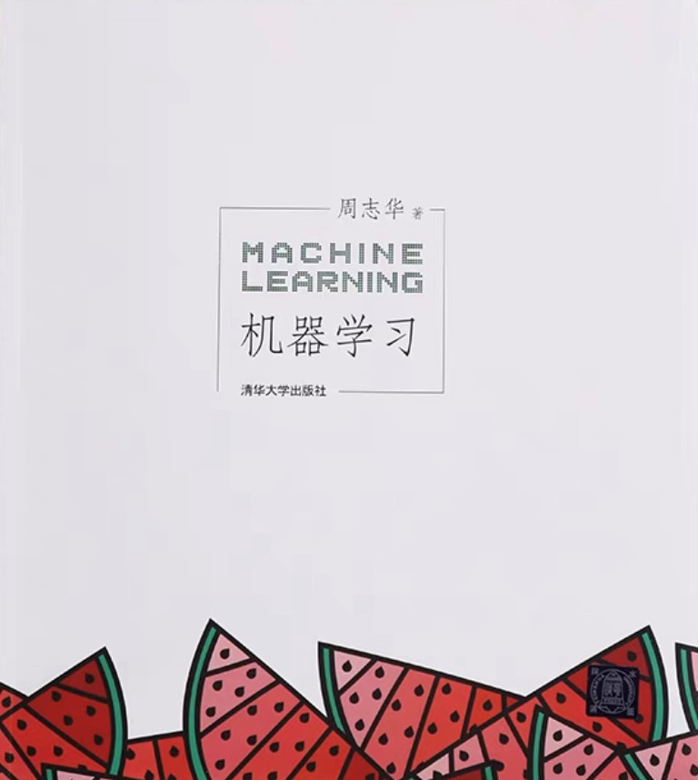
    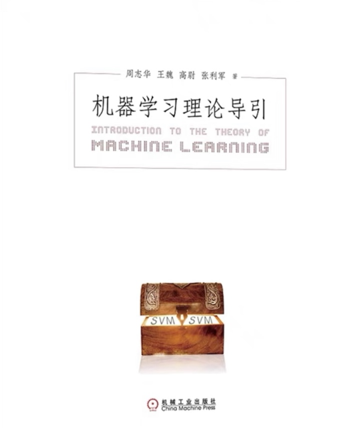
    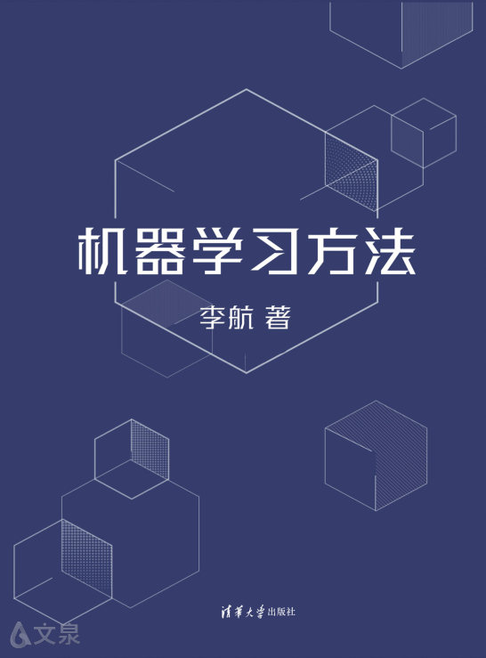

    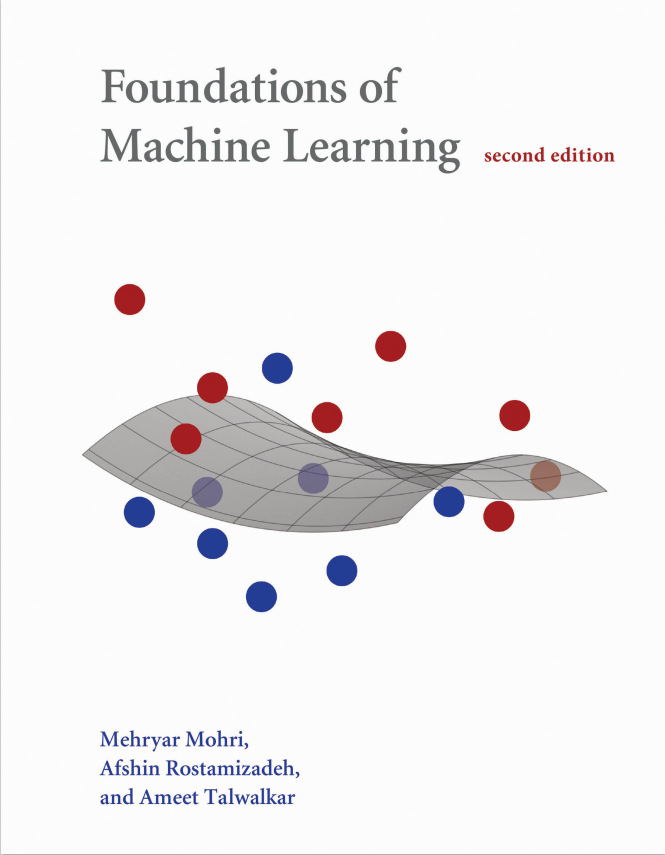
    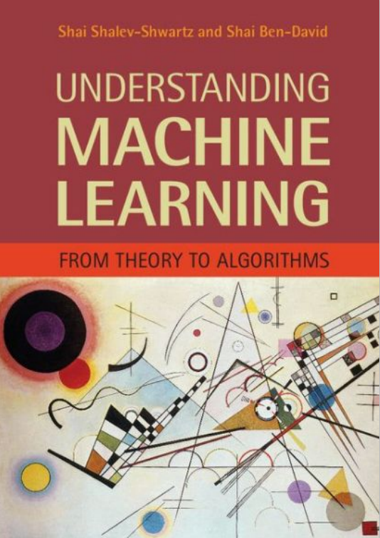
    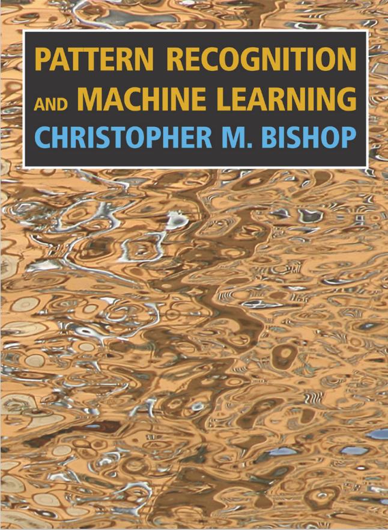

<!-- slide data-notes="下面就是完整讲课部分" -->

# 机器学习

### 教学竞赛 完整讲课

### 计算机学院 &nbsp; &nbsp; 张腾

#### 2024/04/07

<!-- slide vertical=true data-notes="这节课我们介绍机器学习的本源，人工智能的研究为何从一开始的逻辑推理，逐步迁移到了现在的机器学习" -->

##### 课程大纲

---

@import "../vega/outline-ml-course.json" {as="vega" .top-2}

<!-- slide data-notes="首先，我们为什么要研究人工智能？控制论之父维纳在他的《控制论》中提到  第一次工业革命，人们期望...，于是瓦特发明了蒸汽机，第二次工业革命其实是第一次的延续，在法拉第发现电磁感应后，可以用更高效的电动机代替蒸汽机了  但是到了上世纪中叶，两次工业革命的红利已经消耗殆尽，于是人们又开始想...于是人工智能应运而生，要让机器像人一样拥有智能，关键问题是什么是智能？  讲完后提一下，现在我们国家也高度重视人工智能的发展，因为1760年第一次工业革命，1870年第二次工业革命我国都完全没赶上，互联网和移动互联网引发的第三次工业革命我们国家也只赶上个末班车，而西方国家确立对非西方的绝对优势就是这三次工业革命，所以对于人工智能技术推动的第四次工业革命非常重视，大家现在上车还来得及，但前提是好好学习这门课" -->

##### 背景

---

维纳 Norbert Wiener 1894.11.26 ~ 1964.3.18 《控制论》

> 第一次工业革命：用某种机器来减轻甚至代替{==体力==}劳动 
> 上世纪中叶：用某种新型机器来减轻甚至代替{==脑力==}劳动

关键：让机器具有人类的智能

问题：什么是智能？

<!-- slide vertical=true data-notes="智能这一说法最早是图灵在他1950年的论文里提出的" -->

##### 起源

---

图灵 Alan Turing 1912.6.23 ~ 1954.6.7

1950 _Computing Machinery and Intelligence_

    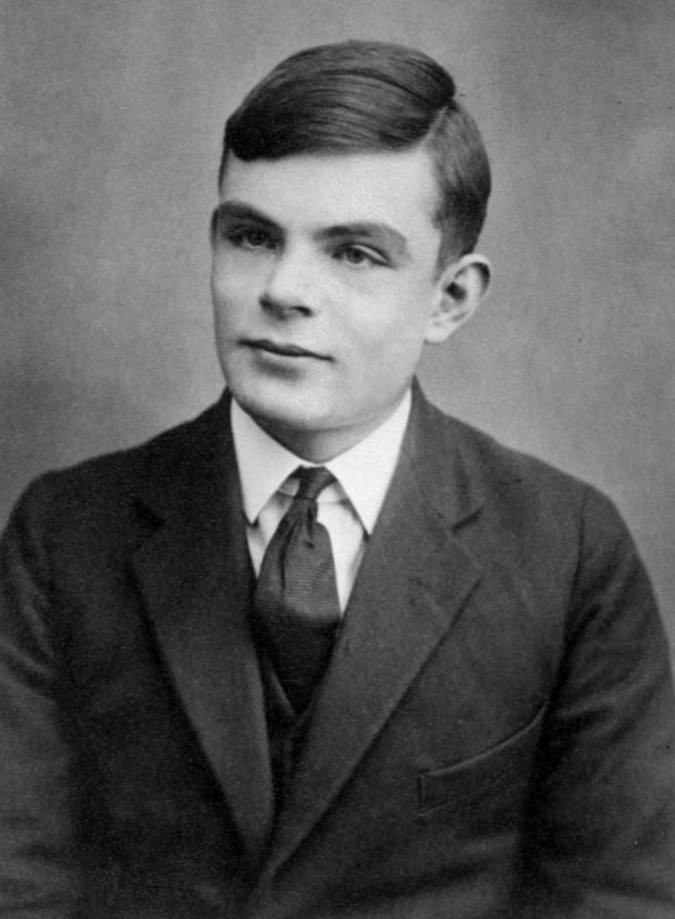
    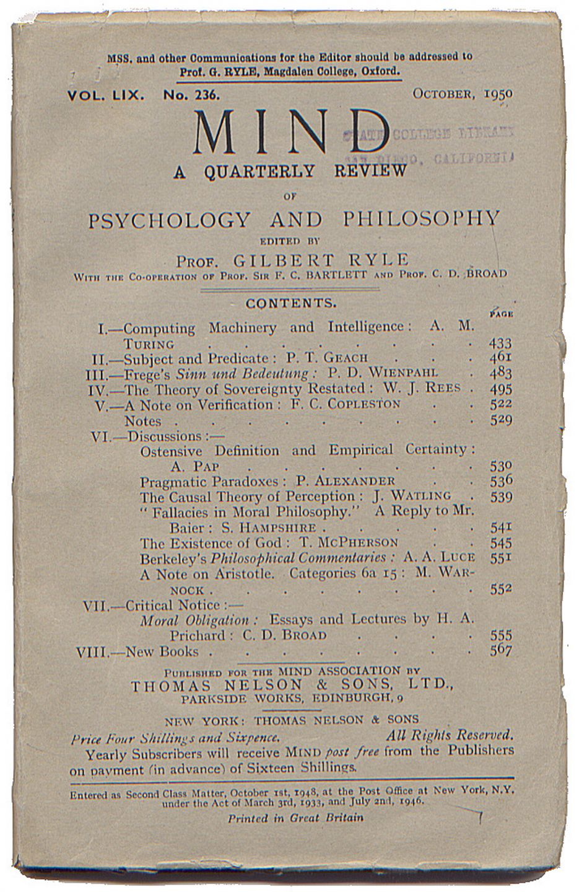
    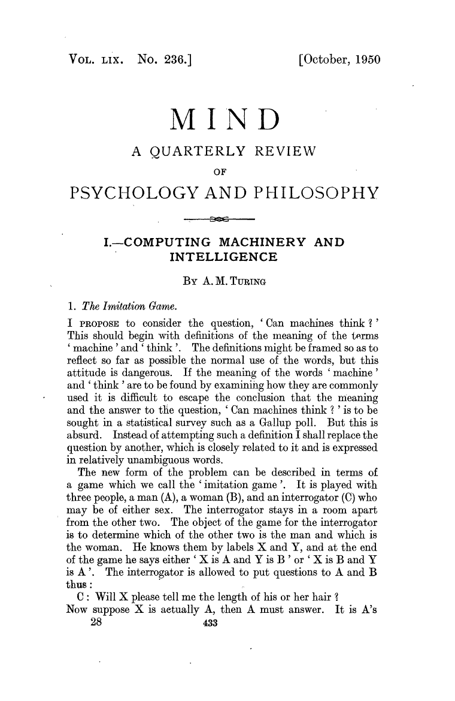

<!-- slide vertical=true data-notes="在这篇论文里，他提出了图灵测试的概念...要想通过图灵测试...学习指学习新东西、探索未知的能力，感知处理看和听，认知是思考和推理" -->

##### 图灵测试

---

图灵 Alan Turing 1912.6.23 ~ 1954.6.7

1950 _Computing Machinery and Intelligence_

{==图灵测试==}：一个人在不接触对方的情况下，通过一种特殊的方式，和对方进行一系列的问答，如果在相当长时间内，他无法根据这些问题判断对方是人还是计算机，那么就可以认为这个计算机是智能的

要想通过图灵测试，机器得具备多种能力

<ul class="fragment">
  <li>学习：机器学习</li>
  <li>感知：计算机视觉，语音识别</li>
  <li>认知：自然语言处理，知识表示</li>
</ul>

<!-- slide data-notes="人工智能的元年一般认为是1956年，标志性事件就是达特茅斯会议  当时的主要参会者有10人，其中第一排的5位分别是麦卡锡、明斯基、香农、西蒙、纽厄尔，除香农外，另外4位后来都得了图灵奖，其中第4位西蒙还获得了诺贝尔经济学奖，有9个博士学位，是个全才，提携指导过中国早期的人工智能研究者，对我国的人工智能发展也起了重要贡献，因此他也被聘为中科院外籍院士，中文名司马贺  纽厄尔一直是西蒙的合作者，曾在美国智库兰德公司供职  香农就是那个信息论之父，他是被麦卡锡拉过去站台的，他其实比这些人要大一些，成名也更早，虽然没得过图灵奖，不过他应该也不care，就像C罗搞个C罗奖颁给梅西，梅西也不一定会要  右图的5位是06年会议50周年时还建在的5位，另外5位已经仙逝，左一是东道主摩尔local chair，右二模式识别的奠基人赛弗里奇，MIT的人工智能实验室也是他创立的，右一是发明了算法概率论的所罗门诺夫" -->

##### 元年

---

1956 人工智能元年 达特茅斯会议 十仙过海

    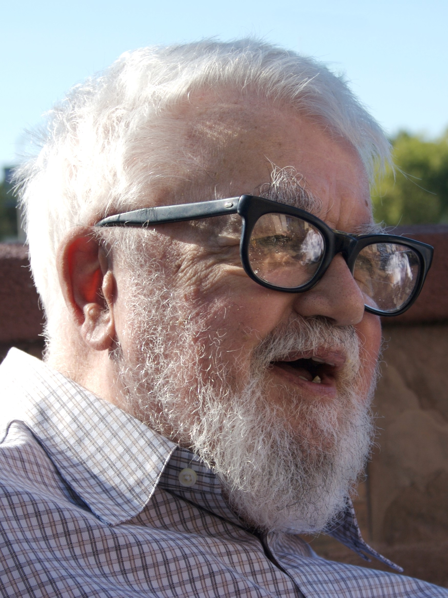
    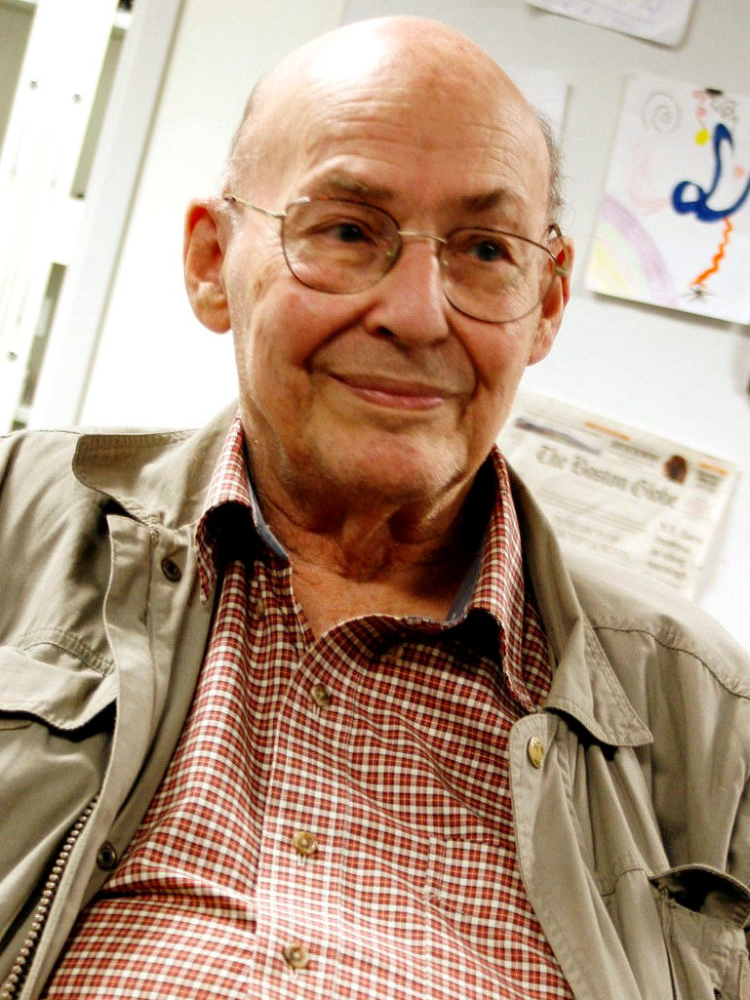
    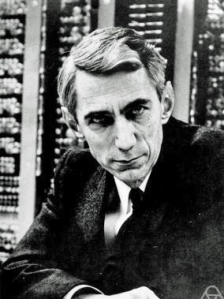
    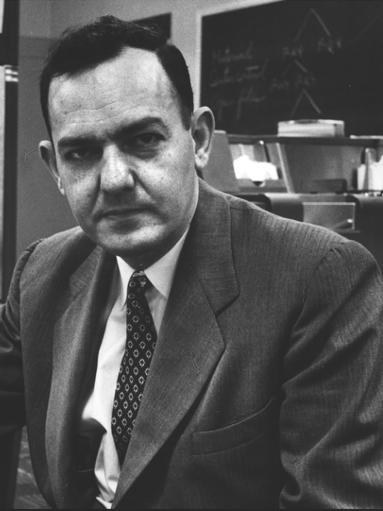
    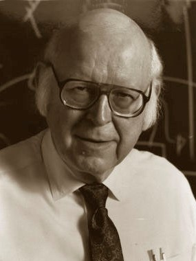

    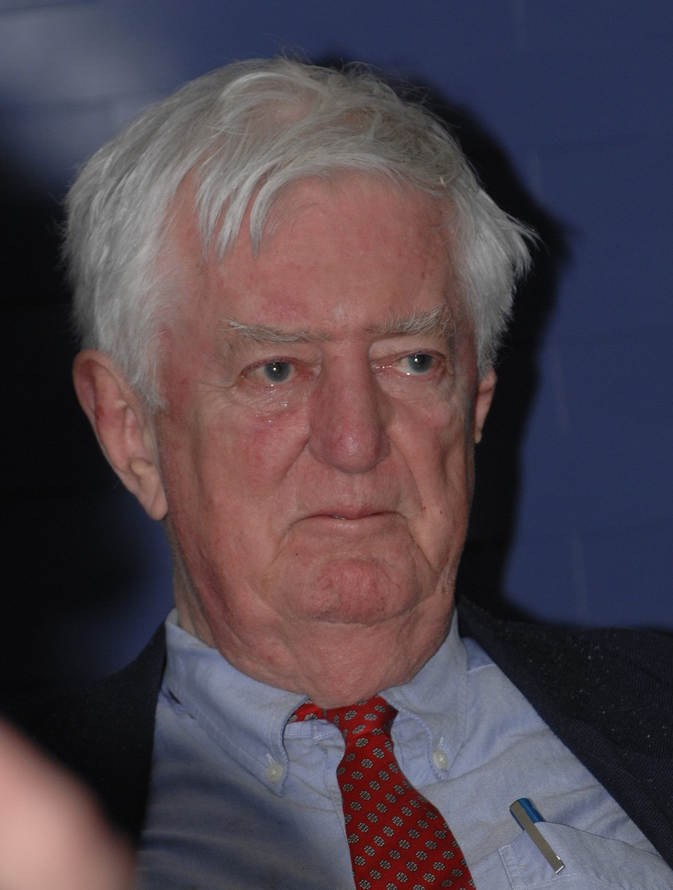
    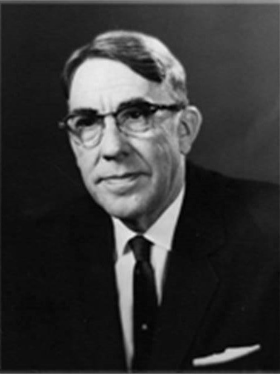
    
    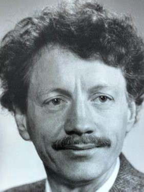
    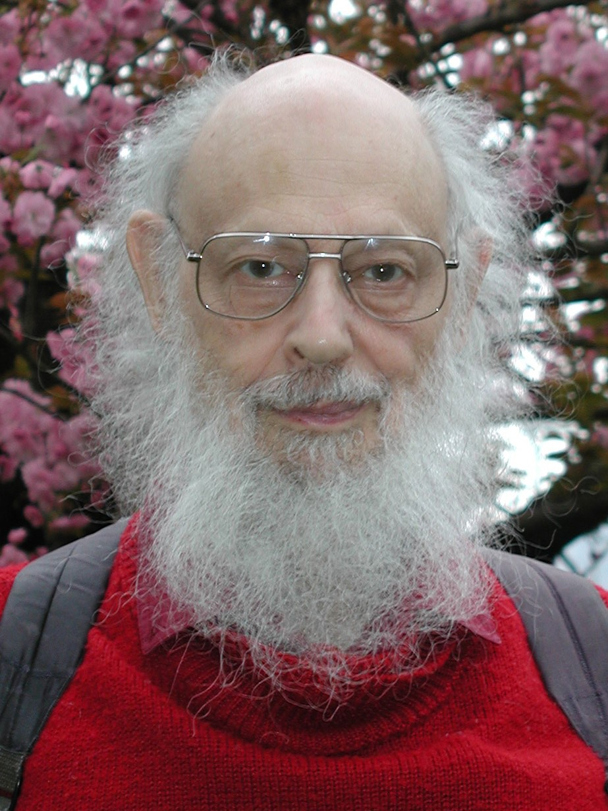

<!-- slide vertical=true data-notes="这是主要参会人物之间的关系，他们能聚到一起，归根结底，还是他们都有普林斯顿数学系的背景" -->

##### 人物关系

---

@import "../dot/dartmouth.dot" {.center}

<!-- slide vertical=true data-notes="会议共讨论出7个人工智能要发力研究的方向，其中第5个就是机器学习，除此之外，西蒙和纽厄尔还带来了第一个可运行的人工智能程序 逻辑理论家，能证明罗素《数学原理》中的命题逻辑定理" -->

##### 会议内容

---

七个研究方向：

- 自动计算机，“自动”指的是可编程
- 编程语言
- 神经网络
- 计算规模理论，即计算复杂性
- 自我改进，即机器学习
- 抽象
- 随机性和创见性

干货：西蒙、纽厄尔的{==逻辑理论家==} (logic theorist)

- 第一个可运行的人工智能程序
- 证明罗素《数学原理》中的定理

<!-- slide data-notes="前面已经说了，人工智能的发展按时间先后可大致可以分成三个阶段，这张图表示了三个阶段的大概起止时间，以及代表性事件  注意虽然现在是学习期，但不代表前两方面的研究已经销声匿迹，他们其实早就和机器学习结合，例如 推理 => 神经符号，知识 => 知识图谱" -->

##### 发展

---

@import "../mermaid/ai.mermaid"

<!-- slide data-notes="首先是推理期，当时人工智能的先驱普遍都是数学家，所以他们的学科背景决定了当时对人工智能的理解就是能帮人证明数学定理，数学定理都是高度符号化的，所以这些人也被称为符号主义" -->

##### 推理期

---

机器擅长固定套路的计算 _vs._ 人类擅长妙手偶得的推理

西蒙、纽厄尔设计了{==逻辑理论家==}程序

- 1952 年证明了《数学原理》中的 38 条定理
- 1963 年证明了《数学原理》中的 52 条定理，其中定理 2.85 的证明比罗素的更巧妙
- 西蒙、纽厄尔获得了 1975 年的图灵奖

衰退：

- 并非所有问题都可以转换成逻辑推理问题
- 十万步内无法证明{==两个连续函数之和还是连续函数==}
- 数学家不认可机器证明的定理 (可能出于保护自己的饭碗)

<!-- slide vertical=true data-notes="值得一提的是在这一时期，华人也做出了非常杰出的工作，" -->

##### 王浩和吴文俊的工作

---

- 1959 年王浩在 IBM 704 计算机上用 9 分钟证明了《数学原理》中 150 条一阶逻辑定理和 200 条命题逻辑定理，获 IJCAI'83 首届证明自动化奖，关于高阶逻辑复杂性的研究启发了学生库克的 NP 理论
- 1978 年吴文俊提出几何定理自动证明的 Wu 方法，也称数学机械化，中国人工智能学会设立“吴文俊人工智能科学技术奖”

    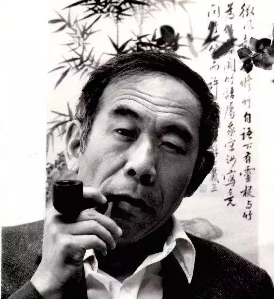
    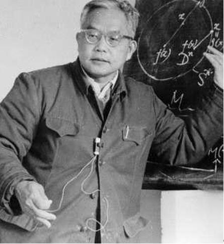

<!-- slide vertical=true data-notes="下面通过一个例子感受一下如何用纯符号的逻辑推理解决问题" -->

##### 谁说了实话

---

- A：B 和 C 都是说谎者
- B：A 和 C 都是说谎者
- C：A 和 B 中至少有一个说谎者

根据 A 说实话与否有 (利用$p \rightarrow q \Longleftrightarrow \neg p \vee q$)

- $A \rightarrow \neg B \wedge \neg C \Longleftrightarrow A \rightarrow \neg B, ~ A \rightarrow \neg C \Longleftrightarrow (1)~\neg A \vee \neg B, ~ (2)~ \neg A \vee \neg C$
- $\neg A \rightarrow B \vee C \Longleftrightarrow (3)~ A \vee B \vee C$

根据 B 说实话与否有

- $B \rightarrow \neg A \wedge \neg C \Longleftrightarrow B \rightarrow \neg A, ~ B \rightarrow \neg C \Longleftrightarrow (4)~\neg B \vee \neg C$

根据 C 说实话与否有

- $C \rightarrow \neg A \vee \neg B \Longleftrightarrow (5)~\neg A \vee \neg B \vee \neg C$
- $\neg C \rightarrow A \wedge B \Longleftrightarrow (6)~A \vee C, ~ (7)~B \vee C $

<!-- slide vertical=true data-notes="" -->

##### 归结原理

---

1. $\neg A \vee \neg B$
2. $\neg A \vee \neg C$
3. $A \vee B \vee C$
4. $\neg B \vee \neg C$
5. $\neg A \vee \neg B \vee \neg C$
6. $A \vee C$
7. $B \vee C$

利用归结原理 $p \vee q, ~ \neg p \vee r \Longrightarrow q \vee r$ 消除变量$p$

8. 1 + 7：$\neg A \vee C$
9. 6 + 8：$C$，C 是老实人
10. 2 + 8：$\neg A$，A 是说谎者
11. 4 + 9：$\neg B$，B 是说谎者

<!-- slide data-notes="从推理期得到的教训是光有逻辑推理远远不够，机器还得拥有知识，智能是将两者结合起来，于是出现了一些在特定领域内具有专家水平解决问题能力的程序，称为专家系统" -->

##### 知识期

---

教训：光会逻辑推理还不够，机器得拥有知识

信仰：{==知识就是力量==}

专家系统 = 知识库 + 推理机

- 在特定领域内具有专家水平解决问题能力的程序系统
- 第一个成功的专家系统 DENDRAL 于 1965 年问世
- 知识工程之父费根鲍姆获得了 1994 年的图灵奖

衰退：

- 人工构建知识库成本太高，专业知识需相关领域的专家来提供
- 人类的很多智能行为，无法描述其背后的知识

<!-- slide vertical=true data-notes="这是一个动物识别专家系统的例子，左边就是构建好的知识库，对于任意新问题，只需要在知识库中做推理即可" -->

##### 动物识别专家系统

---

@import "../dot/reasoning.dot"

<!-- slide data-notes="前面提到人类的很多智能行为，难以描述其背后的知识，比如这些手写数字图片，人一眼可以看出写的是数字几，但要想总结成一些明确的规则，让机器按部就班地执行，似乎很难" -->

##### 图像知识

---

我们人类是如何识别这些手写数字的？

@import "../img/number.svg" {.center .width80}

<!-- slide vertical=true data-notes="同样对于这样的一首词，人很容易感受出词人对亲人的思念之情，但要想总结规则让机器执行确定其中的情感，似乎很难" -->

##### 文本知识

---

我们人类是如何判断这首词的情感的？

> 明月几时有？把酒问青天。不知天上宫阙，今夕是何年。我欲乘风归去，又恐琼楼玉宇，高处不胜寒。起舞弄清影，何似在人间。 
> 转朱阁，低绮户，照无眠。不应有恨，何事长向别时圆？人有悲欢离合，月有阴晴圆缺，此事古难全。但愿人长久，千里共婵娟。

<!-- slide vertical=true data-notes="还有这段语音，我们也能秒懂说的是什么，表达了什么意思，但机器看到的就是一个想让机器明白该怎么总结规则呢？" -->

##### 语音知识

---

我们人类是如何听出下面这段语音的？

<svg version="1.1" xmlns="http://www.w3.org/2000/svg" style="display:none;"><symbol id="pause" viewBox="0 0 1024 1024"><path fill="#586e75" d="M512 1024C229.696 1024 0 794.304 0 512S229.696 0 512 0s512 229.696 512 512-229.696 512-512 512zm0-960C264.96 64 64 264.96 64 512s200.96 448 448 448 448-200.96 448-448S759.04 64 512 64z"/><path fill="#586e75" d="M416 352h64v320h-64V352zm128 0h64v320h-64V352z"/></symbol><symbol id="play" viewBox="0 0 1024 1024"><path fill="#586e75" d="M512 0C229.228 0 0 229.241 0 512s229.228 512 512 512c282.759 0 512-229.241 512-512S794.759 0 512 0zm0 970.105c-253.009 0-458.105-205.11-458.105-458.105S258.99 53.895 512 53.895c252.995 0 458.105 205.11 458.105 458.105S764.995 970.105 512 970.105zM377.263 727.58l377.263-215.552L377.263 296.42V727.58z"/></symbol></svg>

<a href="javascript:" id="btnPlay" role="button" style="margin:0;"><svg><use href="#play"/></svg></a>
<a href="javascript:" id="btnPause" role="button" style="margin:0;"><svg><use href="#pause"/></svg></a>

@import "../js/wavesurfer/wavesurfer.js"
@import "../js/wavesurfer/play-audio.js"

### 启示：让{==机器==}从数据中自动{==学习==}得到知识

<!-- slide data-notes="机器学习的基本流程是..." -->

##### 机器学习

---

@import "../dot/ml-old.dot"

原始数据：表格、图片、视频、文本、语音、……

模型学习：最核心的部分，学习一个用来预测的映射

特征工程：

- 提取：选取、构造对目标任务有用的潜在特征
- 处理：无序的离散类别特征 → 数值特征，缺失处理，标准化
- 变换：对特征进行挑选或映射得到对目标任务更有效的特征

<!-- slide data-notes="机器学习的基本流程是..." -->

##### &nbsp; &nbsp;

---

## 请各位专家批评指正！
