---
presentation:
  transition: "none"
  enableSpeakerNotes: true
  margin: 0
---

@import "../common/css/zhangt-style.css"
@import "../common/css/font-awesome-4.7.0/css/font-awesome.css"

<!-- slide data-notes="" -->

  
  
  

  <h1 class="front_page_title top_10">强化学习<strike>研究前沿</strike>简介</h1>

  

  <h4 class="author top_15">张腾</h4>
  <h4 class="mail">tengzhang@hust.edu.cn</h4>
  <h4 class="date">2019 - 07 - 31</h4>

<!-- slide data-notes="可能有人会想到alphago，横扫围棋界，将多位世界冠军杀得毫无还手之力" data-background-video="../common/videos/alphago.mp4" data-background-video-loop data-background-video-muted vertical=true -->

<!-- slide vertical=true data-notes="" -->

  

    

    <h5 class="title">大纲</h5>
  

  

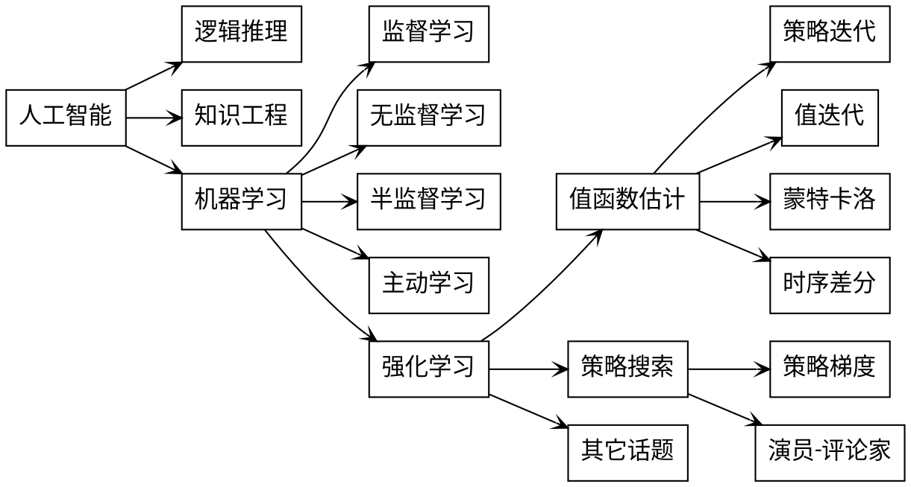

  

  

    <h6 class="bottom_left">华中科技大学计算机学院</h6>
    <h6 class="bottom_center">SCTS & CGCL</h6>
    <h6 class="bottom_right">tengzhang@hust.edu.cn</h6>
  

<!-- slide data-notes="" -->

  

    

    <h5 class="title">大纲</h5>
  

  

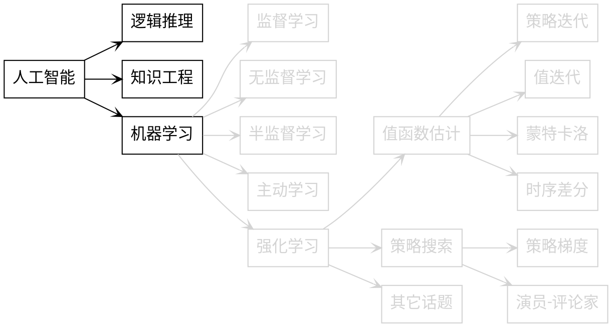

  

  

    <h6 class="bottom_left">华中科技大学计算机学院</h6>
    <h6 class="bottom_center">SCTS & CGCL</h6>
    <h6 class="bottom_right">tengzhang@hust.edu.cn</h6>
  

<!-- slide vertical=true data-notes="" -->

  

    

    <h5 class="title">人工智能 时代背景</h5>
  

  

N. Wiener 《控制论》:

> 第一次工业革命：用某种机器来减轻甚至代替体力劳动

> 上世纪中叶：用某种新型机器来减轻甚至代替某些脑力劳动

  

  

    <h6 class="bottom_left">华中科技大学计算机学院</h6>
    <h6 class="bottom_center">SCTS & CGCL</h6>
    <h6 class="bottom_right">tengzhang@hust.edu.cn</h6>
  

<!-- slide vertical=true data-notes="" -->

  

    

    <h5 class="title">人工智能 起源</h5>
  

  

- 时间：1956 年
- 地点：达特茅斯学院
- 人物：Shannon、McCarthy、Minsky、Simon、Newell 等
- 事件：讨论用机器模拟人的智能

  

  

    <h6 class="bottom_left">华中科技大学计算机学院</h6>
    <h6 class="bottom_center">SCTS & CGCL</h6>
    <h6 class="bottom_right">tengzhang@hust.edu.cn</h6>
  

<!-- slide vertical=true data-notes="" -->

  

    

    <h5 class="title">人工智能 发展</h5>
  

  

三次浪潮

- 推理期
  - 热潮：1956 - 60 年代初
  - 凛冬：60 年代中 - 60 年代末
     
- 知识期
  - 热潮：70 年代初 - 80 年代初
  - 凛冬：80 年代中 - 90 年代初
     
- 学习期
  - 热潮：90 年代中 - 2012
  - 井喷：2012 - ？

  

  

    <h6 class="bottom_left">华中科技大学计算机学院</h6>
    <h6 class="bottom_center">SCTS & CGCL</h6>
    <h6 class="bottom_right">tengzhang@hust.edu.cn</h6>
  

<!-- slide data-notes="" -->

  

    

    <h5 class="title">逻辑推理</h5>
  

  

机器：擅长固定套路的计算　 vs.　人类：擅长妙手偶得的推理

符号主义：智能 = 逻辑推理

Simon 和 Newell 设计了“逻辑理论家”程序

- 1952 年，“逻辑理论家”证明了《数学原理》中的 38 条定理
- 1963 年，证明了全部 52 条定理，其中定理 2.85 的证明比原书作者更巧妙
- Simon 和 Newell 获得了 75 年的图灵奖
   
- 面对更难的定理就无能为力了，十万步无法证明“两个连续函数之和还是连续函数”

  

  

    <h6 class="bottom_left">华中科技大学计算机学院</h6>
    <h6 class="bottom_center">SCTS & CGCL</h6>
    <h6 class="bottom_right">tengzhang@hust.edu.cn</h6>
  

<!-- slide vertical=true data-notes="" -->

  

    

    <h5 class="title">符号化 归结原理</h5>
  

  

$A$：“$B$和$C$都是说谎者”；$B$：“$A$和$C$都是说谎者”；$C$：“$A$和$B$中至少有一个说谎者”，谁说了实话？

<table class="dataset" style="width:88%;margin-left:6%">
  <thead>
    <tr>
      <th style="border-right: 1px solid">公式</th>
      <th>$p \rightarrow q$</th>
      <th>$\Longleftrightarrow$</th>
      <th>$\neg p \vee q$</th>
    </tr>
  </thead>
  <tbody>
    <tr>
      <td style="border-right: 1px solid"><b>条件</b></td>
      <td>$A \rightarrow \neg B \wedge \neg C$</td>
      <td>$\Longleftrightarrow$</td>
      <td>$1.~\neg A \vee \neg B$</td>
    </tr>
    <tr>
      <td style="border-right: 1px solid"></td>
      <td>&nbsp;</td>
      <td>$\Longleftrightarrow$</td>
      <td>$2.~\neg A \vee \neg C$</td>
    </tr>
    <tr>
      <td style="border-right: 1px solid"></td>
      <td>$\neg A \rightarrow B \vee C$</td>
      <td>$\Longleftrightarrow$</td>
      <td>$3.~A \vee B \vee C$</td>
    </tr>
    <tr>
      <td style="border-right: 1px solid"></td>
      <td>$B \rightarrow \neg A \wedge \neg C$</td>
      <td>$\Longleftrightarrow$</td>
      <td>$4.~\neg B \vee \neg C$</td>
    </tr>
    <tr>
      <td style="border-right: 1px solid"></td>
      <td>$\neg B \rightarrow A \vee C$</td>
      <td>$\Longleftrightarrow$</td>
      <td>$3.~A \vee B \vee C$</td>
    </tr>
    <tr>
      <td style="border-right: 1px solid"></td>
      <td>$C \rightarrow \neg A \vee \neg B$</td>
      <td>$\Longleftrightarrow$</td>
      <td>$5.~\neg A \vee \neg B \vee \neg C$</td>
    </tr>
    <tr>
      <td style="border-right: 1px solid"></td>
      <td>$\neg C \rightarrow A \wedge B$</td>
      <td>$\Longleftrightarrow$</td>
      <td>$6.~A \vee C$</td>
    </tr>
    <tr>
      <td style="border-right: 1px solid"></td>
      <td>&nbsp;</td>
      <td>$\Longleftrightarrow$</td>
      <td>$7.~B \vee C$</td>
    </tr>
    <tr>
      <td style="border: 1px solid;border-left: none"><b>归结</b></td>
      <td style="border-top: 1px solid;border-bottom: 1px solid">$1 + 7 \rightarrow 8.~\neg A \vee C$</td>
      <td style="border-top: 1px solid;border-bottom: 1px solid">$6 + 8 \rightarrow C$</td>
      <td style="border-top: 1px solid;border-bottom: 1px solid">$C$说了实话</td>
    </tr>
  </tbody>
</table>

  

  

    <h6 class="bottom_left">华中科技大学计算机学院</h6>
    <h6 class="bottom_center">SCTS & CGCL</h6>
    <h6 class="bottom_right">tengzhang@hust.edu.cn</h6>
  

<!-- slide vertical=true data-notes="" -->

  

    

    <h5 class="title">知识工程</h5>
  

  

教训：光有逻辑推理远远不够，机器得拥有知识

基本想法：“知识就是力量”，智能 = 知识 + 逻辑推理

专家系统(知识工程) = 知识库 + 推理引擎

- 在特定领域内具有专家水平解决问题能力的程序系统
- 第一个成功的专家系统 DENDRAL 于 1968 年问世
- “知识工程”之父 E. A. Feigenbaum 获得了 94 年的图灵奖
   
- 人工构建知识库成本太高
- 知识获取困难

  

  

    <h6 class="bottom_left">华中科技大学计算机学院</h6>
    <h6 class="bottom_center">SCTS & CGCL</h6>
    <h6 class="bottom_right">tengzhang@hust.edu.cn</h6>
  

<!-- slide vertical=true data-notes="" -->

  

    

    <h5 class="title">动物识别专家系统</h5>
  

  

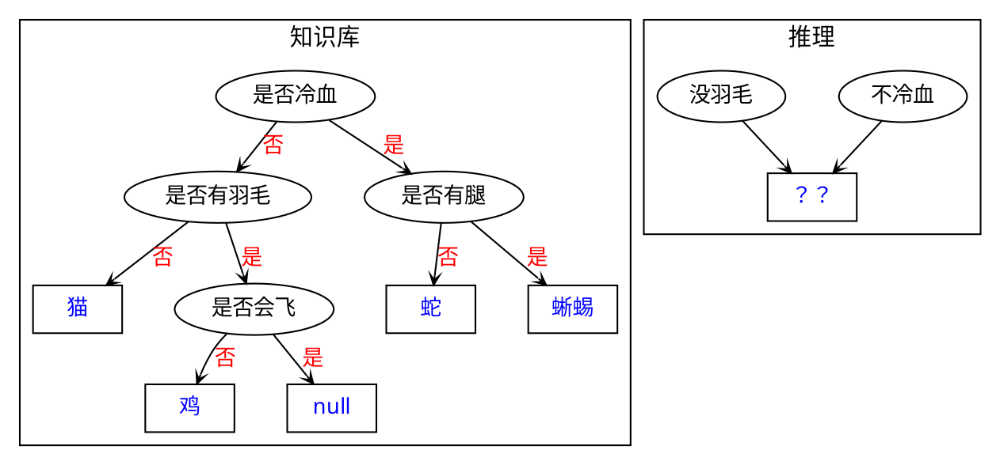

  

  

    <h6 class="bottom_left">华中科技大学计算机学院</h6>
    <h6 class="bottom_center">SCTS & CGCL</h6>
    <h6 class="bottom_right">tengzhang@hust.edu.cn</h6>
  

<!-- slide data-notes="" -->

  

    

    <h5 class="title">大纲</h5>
  

  

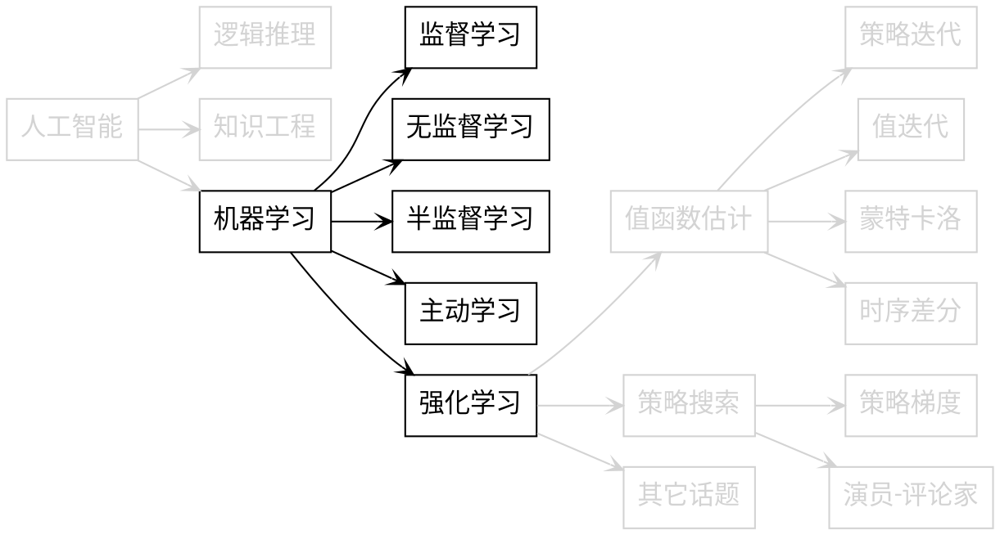

  

  

    <h6 class="bottom_left">华中科技大学计算机学院</h6>
    <h6 class="bottom_center">SCTS & CGCL</h6>
    <h6 class="bottom_right">tengzhang@hust.edu.cn</h6>
  

<!-- slide vertical=true data-notes="" -->

  

    

    <h5 class="title">机器学习</h5>
  

  

基本想法：知识由机器从数据中自动学习得到

$$
\begin{align*}
  数据 =
  \begin{array}{c|ccc|c}
    样本 & & 特征 & & 类标记 \\
    \hline
    \xv_1 & [~x_{11} & \cdots & x_{1n}~] & y_1 \\
    \xv_2 & [~x_{21} & \cdots & x_{2n}~] & y_2 \\
    \vdots & \vdots & \ddots & \vdots & \vdots \\
    \xv_m & [~x_{m1} & \cdots & x_{mn}~] & y_m \\
	\end{array}
\end{align*}
$$

- 被动接收数据：监督学习、无监督学习、半监督学习
- 主动获取数据：主动学习、强化学习

  

  

    <h6 class="bottom_left">华中科技大学计算机学院</h6>
    <h6 class="bottom_center">SCTS & CGCL</h6>
    <h6 class="bottom_right">tengzhang@hust.edu.cn</h6>
  

<!-- slide vertical=true data-notes="" -->

  

    

    <h5 class="title">监督学习</h5>
  

  

- 分类
- 输入：$\{ (\xv_1,y_1), \ldots, (\xv_m,y_m) \}$
- 输出：$y = f(\xv)$，$\Pr[y | \xv]$

  

  

  

    <h6 class="bottom_left">华中科技大学计算机学院</h6>
    <h6 class="bottom_center">SCTS & CGCL</h6>
    <h6 class="bottom_right">tengzhang@hust.edu.cn</h6>
  

<!-- slide vertical=true data-notes="" -->

  

    

    <h5 class="title">监督学习</h5>
  

  

- 分类
- 输入：$\{ (\xv_1,y_1), \ldots, (\xv_m,y_m) \}$
- 输出：$y = f(\xv)$，$\Pr[y | \xv]$

  

  

  

    <h6 class="bottom_left">华中科技大学计算机学院</h6>
    <h6 class="bottom_center">SCTS & CGCL</h6>
    <h6 class="bottom_right">tengzhang@hust.edu.cn</h6>
  

<!-- slide data-notes="" -->

  

    

    <h5 class="title">无监督学习</h5>
  

  

- 聚类：从样本层面，对数据进行分组
- 输入：$\{ \xv_1, \ldots, \xv_m \}$
- 输出：样本所属的组，$c_i = f(\xv_i)$

  

  

  

    <h6 class="bottom_left">华中科技大学计算机学院</h6>
    <h6 class="bottom_center">SCTS & CGCL</h6>
    <h6 class="bottom_right">tengzhang@hust.edu.cn</h6>
  

<!-- slide vertical=true data-notes="" -->

  

    

    <h5 class="title">无监督学习</h5>
  

  

- 聚类：从样本层面，对数据进行分组
- 输入：$\{ \xv_1, \ldots, \xv_m \}$
- 输出：样本所属的组，$c_i = f(\xv_i)$

  

  

  

    <h6 class="bottom_left">华中科技大学计算机学院</h6>
    <h6 class="bottom_center">SCTS & CGCL</h6>
    <h6 class="bottom_right">tengzhang@hust.edu.cn</h6>
  

<!-- slide vertical=true data-notes="" -->

  

    

    <h5 class="title">无监督学习</h5>
  

  

- 降维：从特征层面，对数据进行压缩
- 输入：$\{ \xv_1, \ldots, \xv_m \}$
- 输出：投影映射$y_i = f(\xv_i)$

  

  

  

    <h6 class="bottom_left">华中科技大学计算机学院</h6>
    <h6 class="bottom_center">SCTS & CGCL</h6>
    <h6 class="bottom_right">tengzhang@hust.edu.cn</h6>
  

<!-- slide vertical=true data-notes="" -->

  

    

    <h5 class="title">无监督学习</h5>
  

  

- 降维：从特征层面，对数据进行压缩
- 输入：$\{ \xv_1, \ldots, \xv_m \}$
- 输出：投影映射$y_i = f(\xv_i)$

  

  

  

    <h6 class="bottom_left">华中科技大学计算机学院</h6>
    <h6 class="bottom_center">SCTS & CGCL</h6>
    <h6 class="bottom_right">tengzhang@hust.edu.cn</h6>
  

<!-- slide data-notes="" -->

  

    

    <h5 class="title">半监督学习</h5>
  

  

- 对未标记样本进行分类
- 输入：$\{ (\xv_1,y_1), \ldots, (\xv_l,y_l), \xv_{l+1}, \ldots, \xv_{l+u} \}, ~ l \ll u$
- 输出：$y_i = f(\xv_i),~i = l+1, \ldots, l+u$

  

  

  

    <h6 class="bottom_left">华中科技大学计算机学院</h6>
    <h6 class="bottom_center">SCTS & CGCL</h6>
    <h6 class="bottom_right">tengzhang@hust.edu.cn</h6>
  

<!-- slide vertical=true data-notes="" -->

  

    

    <h5 class="title">半监督学习</h5>
  

  

- 对未标记样本进行分类
- 输入：$\{ (\xv_1,y_1), \ldots, (\xv_l,y_l), \xv_{l+1}, \ldots, \xv_{l+u} \}, ~ l \ll u$
- 输出：$y_i = f(\xv_i),~i = l+1, \ldots, l+u$

  

  

  

    <h6 class="bottom_left">华中科技大学计算机学院</h6><h6 class="bottom_center">SCTS & CGCL</h6><h6 class="bottom_right">tengzhang@hust.edu.cn</h6>
  

<!-- slide vertical=true data-notes="" -->

  

    

    <h5 class="title">主动学习</h5>
  

  

- 分类：选择尽可能少的样本查询其类标记，构建分类器
- 输入：$\{ \xv_1, \ldots, \xv_m \}$
- 输出：$y = f(\xv)$，$\Pr[y | \xv]$

  

  

  

    <h6 class="bottom_left">华中科技大学计算机学院</h6>
    <h6 class="bottom_center">SCTS & CGCL</h6>
    <h6 class="bottom_right">tengzhang@hust.edu.cn</h6>
  

<!-- slide vertical=true data-notes="" -->

  

    

    <h5 class="title">主动学习</h5>
  

  

- 分类：选择尽可能少的样本查询其类标记，构建分类器
- 输入：$\{ \xv_1, \ldots, \xv_m \}$
- 输出：$y = f(\xv)$，$\Pr[y | \xv]$

  

  

  

    <h6 class="bottom_left">华中科技大学计算机学院</h6>
    <h6 class="bottom_center">SCTS & CGCL</h6>
    <h6 class="bottom_right">tengzhang@hust.edu.cn</h6>
  

<!-- slide vertical=true data-notes="" -->

  

    

    <h5 class="title">主动学习</h5>
  

  

- 分类：选择尽可能少的样本查询其类标记，构建分类器
- 输入：$\{ \xv_1, \ldots, \xv_m \}$
- 输出：$y = f(\xv)$，$\Pr[y | \xv]$

  

  

  

    <h6 class="bottom_left">华中科技大学计算机学院</h6>
    <h6 class="bottom_center">SCTS & CGCL</h6>
    <h6 class="bottom_right">tengzhang@hust.edu.cn</h6>
  

<!-- slide data-notes="" -->

  

    

    <h5 class="title">强化学习 引子</h5>
  

  

2$\longrightarrow$5

  

  

    <h6 class="bottom_left">华中科技大学计算机学院</h6>
    <h6 class="bottom_center">SCTS & CGCL</h6>
    <h6 class="bottom_right">tengzhang@hust.edu.cn</h6>
  

<!-- slide vertical=true data-notes="" -->

  

    

    <h5 class="title">强化学习 引子</h5>
  

  

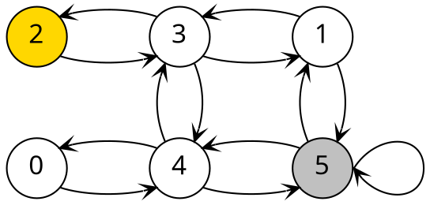

形式化：有限状态自动机

核心问题：快速熟悉环境，走向目标状态

  

  

    <h6 class="bottom_left">华中科技大学计算机学院</h6>
    <h6 class="bottom_center">SCTS & CGCL</h6>
    <h6 class="bottom_right">tengzhang@hust.edu.cn</h6>
  

<!-- slide vertical=true data-notes="" -->

  

    

    <h5 class="title">强化学习 引子</h5>
  

  

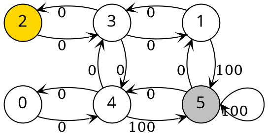

$$
\begin{align*}
  Q^1 = 
  \begin{array}{c|ccccc}
    & 0 & 1 & 2 & 3 & 4 & 5 \\ 
    \hline 
    0 & & & & & 0 \\
    1 & & & & 0 & & 100 \\
    2 & & & & 0 \\
    3 & & 0 & 0 & & 0 \\
    4 & 0 & & & 0 & & 100 \\
    5 & & 0 & & & 0 & 100 \\
	\end{array}
\end{align*}
$$

引入折扣引子$\gamma = 0.8$

$$
  \begin{align*}
    Q^2 (0,4) & = 0 + \gamma \cdot \max \{ Q^1 (4,0), Q^1 (4,3), \color{blue}{Q^1 (4,5)} \} = 80 \\
    Q^2 (3,1) & = 0 + \gamma \cdot \max \{ Q^1 (1,3), \color{blue}{Q^1 (1,5)} \} = 80
  \end{align*}
$$

  

  

    <h6 class="bottom_left">华中科技大学计算机学院</h6>
    <h6 class="bottom_center">SCTS & CGCL</h6>
    <h6 class="bottom_right">tengzhang@hust.edu.cn</h6>
  

<!-- slide vertical=true data-notes="" -->

  

    

    <h5 class="title">强化学习 引子</h5>
  

  

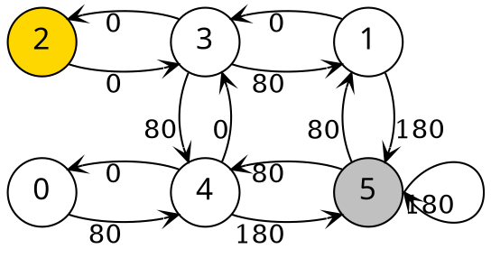

$$
\begin{align*}
  Q^2 = 
  \begin{array}{c|ccccc}
    & 0 & 1 & 2 & 3 & 4 & 5 \\ 
    \hline 
    0 & & & & & 80 \\
    1 & & & & 0 & & 180 \\
    2 & & & & 0 \\
    3 & & 80 & 0 & & 80 \\
    4 & 0 & & & 0 & & 180 \\
    5 & & 80 & & & 80 & 180 \\
	\end{array}
\end{align*}
$$

引入折扣引子$\gamma = 0.8$

$$
  \begin{align*}
    Q^2 (0,4) & = 0 + \gamma \cdot \max \{ Q^1 (4,0), Q^1 (4,3), \color{blue}{Q^1 (4,5)} \} = 80 \\
    Q^2 (3,1) & = 0 + \gamma \cdot \max \{ Q^1 (1,3), \color{blue}{Q^1 (1,5)} \} = 80
  \end{align*}
$$

  

  

    <h6 class="bottom_left">华中科技大学计算机学院</h6>
    <h6 class="bottom_center">SCTS & CGCL</h6>
    <h6 class="bottom_right">tengzhang@hust.edu.cn</h6>
  

<!-- slide vertical=true data-notes="" -->

  

    

    <h5 class="title">强化学习 引子</h5>
  

  

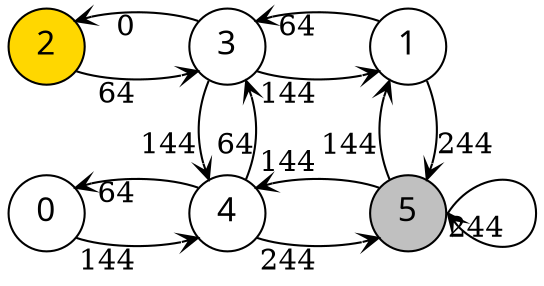

$$
\begin{align*}
  Q^3 = 
  \begin{array}{c|ccccc}
    & 0 & 1 & 2 & 3 & 4 & 5 \\ 
    \hline 
    0 & & & & & 144 \\
    1 & & & & 64 & & 244 \\
    2 & & & & 64 \\
    3 & & 144 & 0 & & 144 \\
    4 & 64 & & & 64 & & 244 \\
    5 & & 144 & & & 144 & 244 \\
	\end{array}
\end{align*}
$$

$$
  \begin{align*}
    Q^3 (*,4) & = 0 + \gamma \cdot \max \{ Q^2 (4,0), Q^2 (4,3), \color{blue}{Q^2 (4,5)} \} = 144 \\
    Q^3 (*,1) & = 0 + \gamma \cdot \max \{ Q^2 (1,3), \color{blue}{Q^2 (1,5)} \} = 144 \\
    Q^3 (*,3) & = 0 + \gamma \cdot \max \{ \color{blue}{Q^2 (3,1)}, Q^2 (3,2), \color{blue}{Q^2 (3,4)} \} = 64
  \end{align*}
$$

  

  

    <h6 class="bottom_left">华中科技大学计算机学院</h6>
    <h6 class="bottom_center">SCTS & CGCL</h6>
    <h6 class="bottom_right">tengzhang@hust.edu.cn</h6>
  

<!-- slide vertical=true data-notes="" -->

  

    

    <h5 class="title">强化学习 引子</h5>
  

  

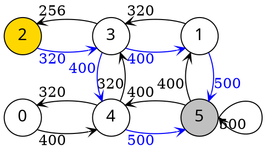

$$
\begin{align*}
  \begin{array}{c|ccccc}
    & 0 & 1 & 2 & 3 & 4 & 5 \\ 
    \hline 
    0 & & & & & 400 \\
    1 & & & & 320 & & 500 \\
    2 & & & & 320 \\
    3 & & 400 & 256 & & 400 \\
    4 & 320 & & & 320 & & 500 \\
    5 & & 400 & & & 400 & 500 \\
	\end{array}
\end{align*}
$$

最优轨迹：

- $2 \longrightarrow 3 \longrightarrow 1 \longrightarrow 5$
- $2 \longrightarrow 3 \longrightarrow 4 \longrightarrow 5$

  

  

    <h6 class="bottom_left">华中科技大学计算机学院</h6>
    <h6 class="bottom_center">SCTS & CGCL</h6>
    <h6 class="bottom_right">tengzhang@hust.edu.cn</h6>
  

<!-- slide data-notes="" -->

  

    

    <h5 class="title">基本概念</h5>
  

  

<ul style="width:100%">
  <li>
    状态集合$S = \{0, 1, 2, 3, 4, 5\}$
  </li>
  <li>
    动作集合$A = \{ 有向边 \}$
  </li>
  <li>
    转移概率$P_{s \rightarrow s'}^a: S \times A [\times S] \mapsto \Rbb$
  </li>
  <li>
    奖赏函数$R_{s \rightarrow s'}^a: S [\times A] \times S \mapsto \Rbb$
  </li>
  <li>
    确定策略$\pi(s): S \mapsto A$
  </li>
  <li>
    随机策略$\pi(a|s): S \times A \mapsto \Rbb$
  </li>
</ul>

“传统”机器学习　vs.　强化学习

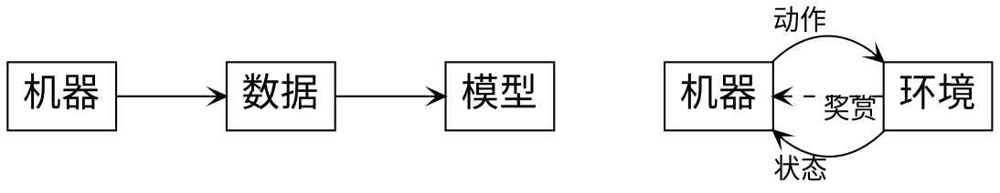

  

  

    <h6 class="bottom_left">华中科技大学计算机学院</h6>
    <h6 class="bottom_center">SCTS & CGCL</h6>
    <h6 class="bottom_right">tengzhang@hust.edu.cn</h6>
  

<!-- slide vertical=true data-notes="" -->

  

    

    <h5 class="title">基本概念</h5>
  

  

策略$\pi \rightarrow$轨迹$\tau: s_0 \stackrel{a_0 / r_1}{\longrightarrow} s_1 \stackrel{a_1 / r_2}{\longrightarrow} s_2 \stackrel{a_2 / r_3}{\longrightarrow} \cdots \stackrel{a_{t-1} / r_t}{\longrightarrow} s_t \stackrel{a_t / r_{t+1}}{\longrightarrow} \cdots$

轨迹$\tau$的累积奖赏：$G^\pi (\tau) = \sum_{t=0}^\infty \gamma^t r_{t+1}$

目标：$\pi^\star = \argmax_\pi \sum_\tau G^\pi (\tau) = \argmax_\pi \sum_s \sum_\tau G^\pi (\tau(s_0) = s)$

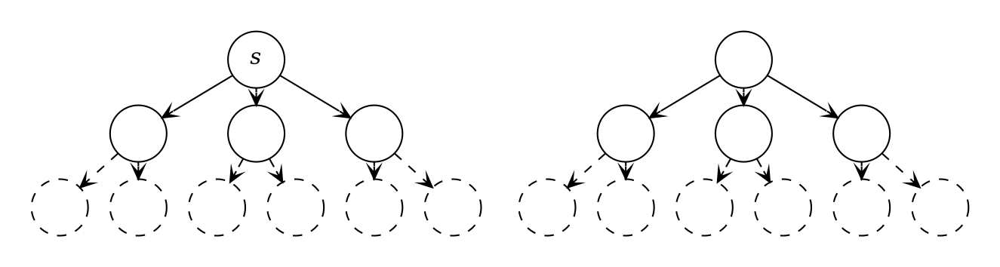

  

  

    <h6 class="bottom_left">华中科技大学计算机学院</h6>
    <h6 class="bottom_center">SCTS & CGCL</h6>
    <h6 class="bottom_right">tengzhang@hust.edu.cn</h6>
  

<!-- slide vertical=true data-notes="" -->

  

    

    <h5 class="title">值函数</h5>
  

  

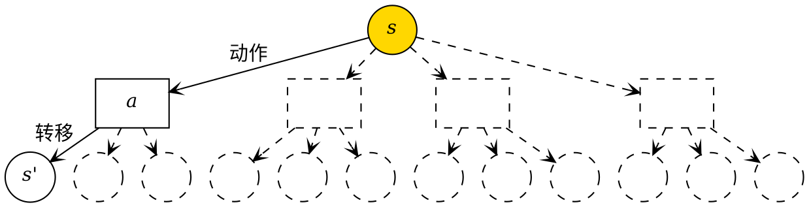

状态值函数：$\color{blue}{V^\pi (s)} = \sum_a \pi(a|s) \sum_{s'} P_{s \rightarrow s'}^a [R_{s \rightarrow s'}^a + \gamma \color{blue}{V^\pi (s')]}$

Bellman 方程：递归形式，压缩映射，不动点

  

  

    <h6 class="bottom_left">华中科技大学计算机学院</h6>
    <h6 class="bottom_center">SCTS & CGCL</h6>
    <h6 class="bottom_right">tengzhang@hust.edu.cn</h6>
  

<!-- slide vertical=true data-notes="" -->

  

    

    <h5 class="title">值函数</h5>
  

  

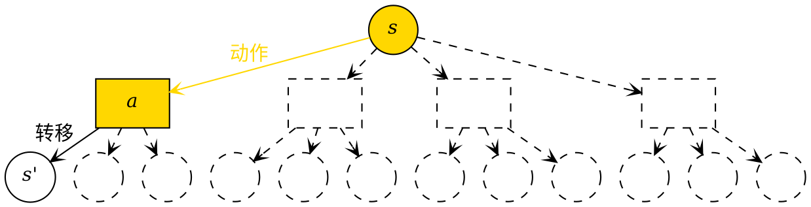

状态值函数：$V^\pi (s) = \sum_a \pi(a|s) \color{blue}{\sum_{s'} P_{s \rightarrow s'}^a [R_{s \rightarrow s'}^a + \gamma V^\pi (s')]}$

状态-动作值函数：$Q^\pi(s,a) = \sum_{s'} P_{s \rightarrow s'}^a [R_{s \rightarrow s'}^a + \gamma V^\pi (s')]$

当$\pi$为确定策略且$\pi(s) = a$时，$V^\pi (s) = Q^\pi(s,a)$

  

  

    <h6 class="bottom_left">华中科技大学计算机学院</h6>
    <h6 class="bottom_center">SCTS & CGCL</h6>
    <h6 class="bottom_right">tengzhang@hust.edu.cn</h6>
  

<!-- slide data-notes="" -->

  

    

    <h5 class="title">大纲</h5>
  

  

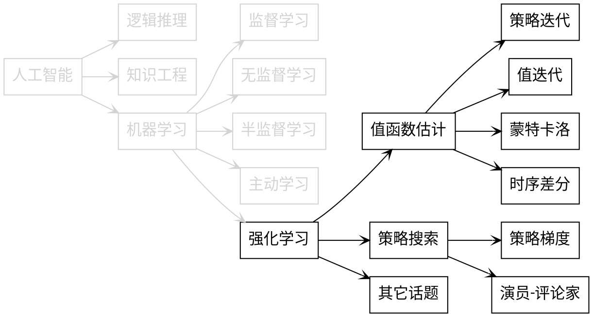

  

  

    <h6 class="bottom_left">华中科技大学计算机学院</h6>
    <h6 class="bottom_center">SCTS & CGCL</h6>
    <h6 class="bottom_right">tengzhang@hust.edu.cn</h6>
  

<!-- slide vertical=true data-notes="" -->

  

    

    <h5 class="title">两种思路</h5>
  

  

值函数估计：

- 先估计最优值函数，再据此求得最优策略$\pi^\star(s) = \argmax_a Q^\star (s,a)$
- 固定最优策略，最优值函数是 Bellman 方程的不动点
- 先有鸡？先有蛋？
- DeepMind

策略搜索：

- 绕过值函数，直接求最优策略
- OpenAI

孰优孰劣？信仰

  

  

    <h6 class="bottom_left">华中科技大学计算机学院</h6>
    <h6 class="bottom_center">SCTS & CGCL</h6>
    <h6 class="bottom_right">tengzhang@hust.edu.cn</h6>
  

<!-- slide vertical=true data-notes="" -->

  

    

    <h5 class="title">大纲</h5>
  

  

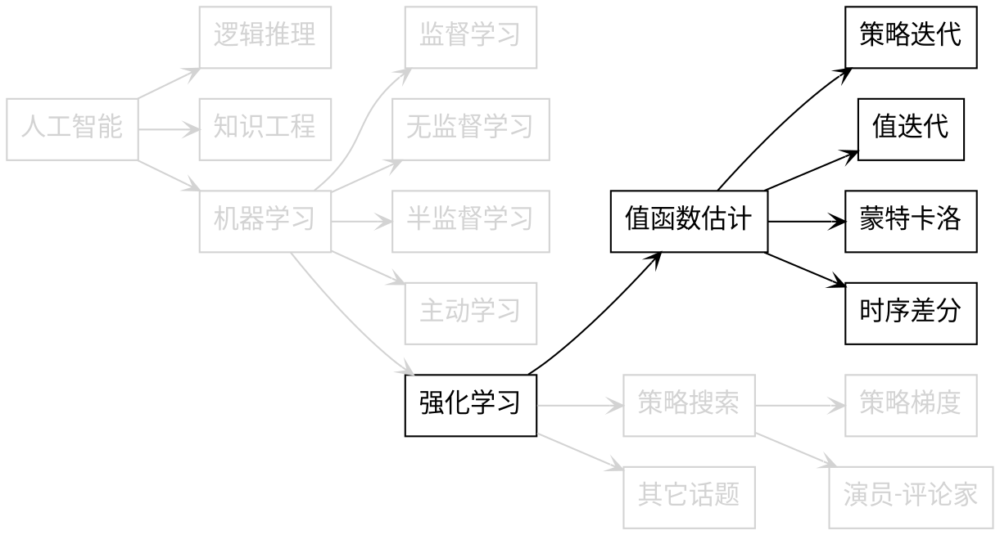

  

  

    <h6 class="bottom_left">华中科技大学计算机学院</h6>
    <h6 class="bottom_center">SCTS & CGCL</h6>
    <h6 class="bottom_right">tengzhang@hust.edu.cn</h6>
  

<!-- slide data-notes="" -->

  

    

    <h5 class="title">策略迭代</h5>
  

  

策略迭代：交替更新

1. 随机初始化策略$\pi$和$\pi'$
2. while $\pi \neq \pi'$ do
3. &emsp;&emsp;迭代$V^\pi(s) \leftarrow \sum_a \pi(a|s) \sum_{s'} P_{s \rightarrow s'}^a [R_{s \rightarrow s'}^a + \gamma V^\pi (s')]$至不动点
4. &emsp;&emsp;计算状态-动作值函数$Q^\pi(s,a) \leftarrow \sum_{s'} P_{s \rightarrow s'}^a [R_{s \rightarrow s'}^a + \gamma V^\pi (s')]$
5. &emsp;&emsp;更新策略$\pi'(s) \leftarrow \argmax_a Q^\pi(s,a)$

缺点：当值函数$V^\pi (s)$未收敛到不动点时，策略函数$\pi$可能就已经收敛了，计算力的巨大浪费

  

  

    <h6 class="bottom_left">华中科技大学计算机学院</h6>
    <h6 class="bottom_center">SCTS & CGCL</h6>
    <h6 class="bottom_right">tengzhang@hust.edu.cn</h6>
  

<!-- slide vertical=true data-notes="" -->

  

    

    <h5 class="title">值迭代</h5>
  

  

最优策略必然是确定策略：

$$
\begin{align*}
  V^\star (s) = \max_a \sum_{s'} P_{s \rightarrow s'}^a [R_{s \rightarrow s'}^a + \gamma V^\star (s')]
\end{align*}
$$

值迭代：

1. 随机初始化状态值函数$V(s)$
2. while $V(s)$没有收敛 do
3. &emsp;&emsp;$V (s) \leftarrow \max_a \sum_{s'} P_{s \rightarrow s'}^a [R_{s \rightarrow s'}^a + \gamma V (s')]$直至收敛到不动点
4. 计算$Q^\star(s,a)$，$\pi^\star (s) = \argmax_a Q^\star(s, a)$

有模型方法：状态转移矩阵$P$已知，可以求解 Bellman 方程

  

  

    <h6 class="bottom_left">华中科技大学计算机学院</h6>
    <h6 class="bottom_center">SCTS & CGCL</h6>
    <h6 class="bottom_right">tengzhang@hust.edu.cn</h6>
  

<!-- slide vertical=true data-notes="" -->

  

    

    <h5 class="title">蒙特卡洛</h5>
  

  

基本想法：多次随机模拟求平均

$$
\begin{align*}
  V^\pi (s) \approx \frac{1}{N} \sum_{n=1}^N G(\tau_{s_0=s}^{(n)})
\end{align*}
$$

1. 随机初始化状态值函数$V(s)$
2. for $t = 1, 2, \ldots$ do
3. &emsp;&emsp;for $s \in S$ do
4. &emsp;&emsp;&emsp;&emsp;执行策略$\pi$产生$N$条轨迹，计算$V^\pi (s)$
5. &emsp;&emsp;计算$Q (s,a)$，更新策略$\pi(s)$

  

  

    <h6 class="bottom_left">华中科技大学计算机学院</h6>
    <h6 class="bottom_center">SCTS & CGCL</h6>
    <h6 class="bottom_right">tengzhang@hust.edu.cn</h6>
  

<!-- slide vertical=true data-notes="" -->

  

    

    <h5 class="title">时序差分</h5>
  

  

蒙特卡洛需要足够多的完整轨迹，效率太低，结合 Bellman 方程和蒙特卡洛随机模拟

$$
\begin{align*}
  V(s) \leftarrow (1 - \alpha) V(s) + \alpha (R_{s \rightarrow s'}^{\pi(s)} + \gamma V(s'))
\end{align*}
$$

1. 随机初始化状态值函数$V(s)$
2. for $t = 1, 2, \ldots$ do
3. &emsp;&emsp;for $s \in S$ do
4. &emsp;&emsp;&emsp;&emsp;$V(s) \leftarrow (1 - \alpha) V(s) + \alpha (R_{s \rightarrow s'}^{\pi(s)} + \gamma V(s'))$
5. &emsp;&emsp;计算$Q (s,a)$，更新策略$\pi(s)$

  

  

    <h6 class="bottom_left">华中科技大学计算机学院</h6>
    <h6 class="bottom_center">SCTS & CGCL</h6>
    <h6 class="bottom_right">tengzhang@hust.edu.cn</h6>
  

<!-- slide vertical=true data-notes="" -->

  

    

    <h5 class="title">值函数近似</h5>
  

  

有限状态和动作：值函数是数组

无限状态和动作：值函数是真·函数

基本想法：借助统计机器学习，对值函数进行拟合：

$$
\begin{align*}
  \theta_\pi = \argmin_\theta (V^\pi(s) - \theta^\top \phi(s))^2
\end{align*}
$$

- $\phi(s)$：样本，$\phi$是对$s$的编码方式，类似于核函数
- $V^\pi(s)$：通过随机模拟获得
- $\theta$：通过梯度下降之类的方法进行更新

  

  

    <h6 class="bottom_left">华中科技大学计算机学院</h6>
    <h6 class="bottom_center">SCTS & CGCL</h6>
    <h6 class="bottom_right">tengzhang@hust.edu.cn</h6>
  

<!-- slide data-notes="" -->

  

    

    <h5 class="title">大纲</h5>
  

  

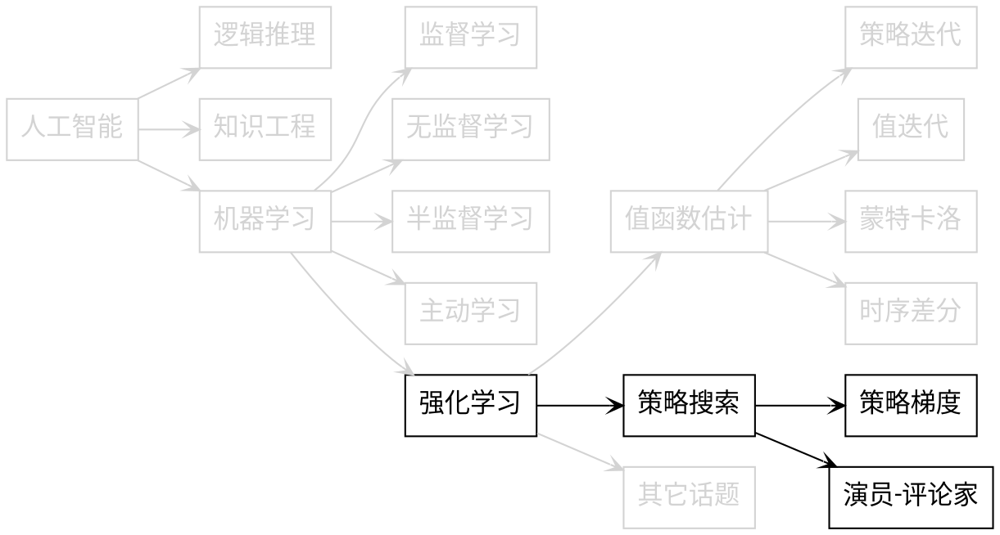

  

  

    <h6 class="bottom_left">华中科技大学计算机学院</h6>
    <h6 class="bottom_center">SCTS & CGCL</h6>
    <h6 class="bottom_right">tengzhang@hust.edu.cn</h6>
  

<!-- slide vertical=true data-notes="" -->

  

    

    <h5 class="title">策略梯度</h5>
  

  

基本想法：将策略$\pi(a|s)$写成以$\theta$为参数的连续可微函数

$$
\begin{align*}
  \theta \longrightarrow \pi_\theta (a|s) \longrightarrow \tau \longrightarrow \sum_\tau G^\pi (\tau)
\end{align*}
$$

目标：$\pi^\star = \argmax_\pi \sum_\tau G^\pi (\tau) \longrightarrow \theta^\star = \argmax_\theta \sum_\tau G^\pi (\tau)$

代表性方法：

- REINFORCE 算法：采样一条轨迹，随机梯度上升更新$\theta$
- 带基准线的 REINFORCE 算法：多引入一个控制变量减小方差

缺点：需要采集整条轨迹

  

  

    <h6 class="bottom_left">华中科技大学计算机学院</h6>
    <h6 class="bottom_center">SCTS & CGCL</h6>
    <h6 class="bottom_right">tengzhang@hust.edu.cn</h6>
  

<!-- slide vertical=true data-notes="" -->

  

    

    <h5 class="title">演员-评论家</h5>
  

  

基本想法：不采样整条轨迹，利用时序差分

演员-评论家算法：

- 演员：策略函数$\pi_\theta (a|s)$
- 评论家：值函数$V_\varphi (s)$

每一轮：

- 时序差分更新$\varphi = \argmin_\varphi (V_\varphi (s) - R_{s \rightarrow s'} - \gamma V_\varphi (s'))^2$
- 策略梯度法更新$\theta$

  

  

    <h6 class="bottom_left">华中科技大学计算机学院</h6>
    <h6 class="bottom_center">SCTS & CGCL</h6>
    <h6 class="bottom_right">tengzhang@hust.edu.cn</h6>
  

<!-- slide vertical=true data-notes="" -->

  

    

    <h5 class="title">一些改进工作</h5>
  

  

固定套路：执行策略$\longrightarrow$估计回报$\longrightarrow$更新策略

值函数近似：$\theta_\pi = \argmin_\theta (V^\pi(s) - \theta^\top \phi(s))^2$

- 引进正则项控制过拟合，$\| \theta \|_2^2 \rightarrow$岭回归、$\| \theta \|_1 \rightarrow$LASSO
- 编码方式$\phi(\cdot)$的设计方式：高斯核、拉普拉斯核、扩散小波

策略迭代：

- 提高样本的使用效率：重要性采样
- 引入主动学习的思想加速收敛

  

  

    <h6 class="bottom_left">华中科技大学计算机学院</h6>
    <h6 class="bottom_center">SCTS & CGCL</h6>
    <h6 class="bottom_right">tengzhang@hust.edu.cn</h6>
  

<!-- slide data-notes="" -->

  

    

    <h5 class="title">大纲</h5>
  

  

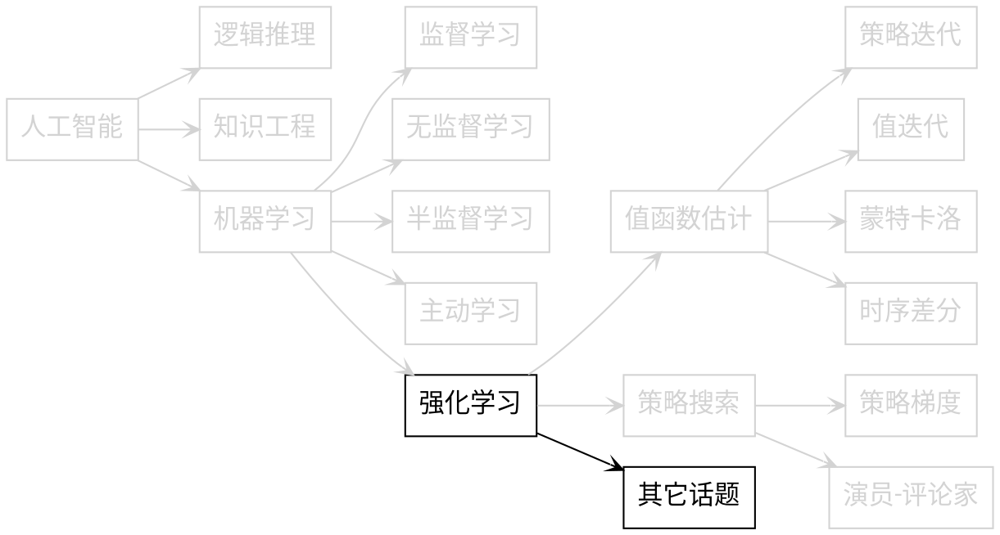

  

  

    <h6 class="bottom_left">华中科技大学计算机学院</h6>
    <h6 class="bottom_center">SCTS & CGCL</h6>
    <h6 class="bottom_right">tengzhang@hust.edu.cn</h6>
  

<!-- slide vertical=true data-notes="" -->

  

    

    <h5 class="title">其它话题</h5>
  

  

深度强化学习：策略函数和值函数全部采用神经网络来近似

- 基于视觉感知的控制任务，打游戏：卷积神经网络
- 连续历史状态信息：循环神经网络
- 复杂状态：注意力机制

逆向强化学习：从人类专家提供的决策轨迹数据反推奖赏函数

分层强化学习：将最终目标分解为多个子任务来学习层次化的策略

迁移强化学习：星际争霸$\longrightarrow$DOTA

多智能体强化学习：八人局三国杀，无人机群

  

  

    <h6 class="bottom_left">华中科技大学计算机学院</h6>
    <h6 class="bottom_center">SCTS & CGCL</h6>
    <h6 class="bottom_right">tengzhang@hust.edu.cn</h6>
  

<!-- slide vertical=true data-notes="" -->

  

    

    <h5 class="title">深度强化学习</h5>
  

  

研究现状：

- 门庭若市：三天的会议，一天半的深度强化学习

主要问题：

- 奖赏信号稀疏：很难甄别算法不 work 与代码有 bug
- 性能不稳定：同一个算法同一套参数跑两次，结果可以大相近庭
- 幸存者偏差：大多数问题上其实都不 work

适用任务：

- 数据获取非常容易
- 可以进行左右互搏
- 奖励函数容易定义

  

  

    <h6 class="bottom_left">华中科技大学计算机学院</h6>
    <h6 class="bottom_center">SCTS & CGCL</h6>
    <h6 class="bottom_right">tengzhang@hust.edu.cn</h6>
  

<!-- slide vertical=true data-notes="" -->

  

    

    <h5 class="title">深度强化学习</h5>
  

  

发展方向：

- 大力出奇迹：堆硬件，硬杠有限时间下随机模拟的不靠谱
- 利用有模型的学习任务：与迁移强化学习结合
- 自动学习奖励函数：与逆向强化学习结合

<h3 class="top_10">谢谢！</h3>

  

  

    <h6 class="bottom_left">华中科技大学计算机学院</h6>
    <h6 class="bottom_center">SCTS & CGCL</h6>
    <h6 class="bottom_right">tengzhang@hust.edu.cn</h6>
  

