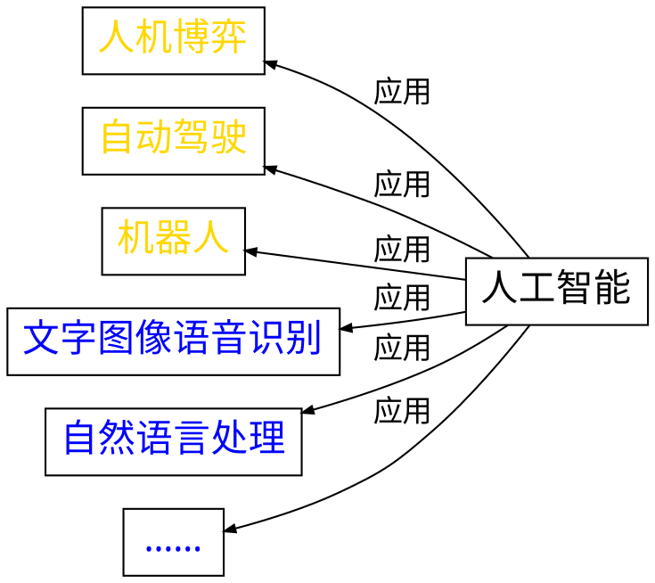
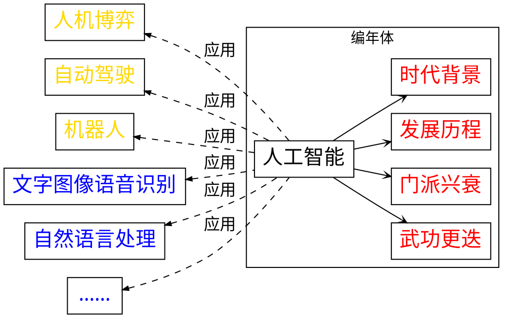

---
presentation:
  transition: "none"
  enableSpeakerNotes: true
  margin: 0
---

@import "../common/css/zhangt-style.css"
@import "../common/css/font-awesome-4.7.0/css/font-awesome.css"

<!-- slide data-notes="大家下午好，我是来自计算机学院的张腾，我的演讲题目是人工智能简介" -->
<div id="logo">
  
  
</div>

<div>
  <h1 class="front_page_title top_10">人工智能 简介</h1>

  <hr class="hr_medium_1">
  <h4 class="front_page_subtitle top_2">微格教学法培训</h4>

  <h4 class="author top_10">张腾</h4>
  <h4 class="mail">tengzhang@hust.edu.cn</h4>
  <h4 class="date">2019 / 09 / 18</h4>
</div>

<!-- slide vertical=true data-notes="首先提到人工智能，大家会想到什么？" -->
<div class="multi_column">
  <div class="title_hr">
    <hr class="hr_top">
    <h5 class="title">引子</h5>
  </div>
  
</div>

```puml
scale 2
张三 -right-> (人工智能) : ？
李四 -left-> (人工智能) : ？
```

<div class="footer">
  <hr class="hr_bottom">
  <div class="multi_column">
    <h6 class="bottom_left">华中科技大学计算机学院</h6>
    <h6 class="bottom_center">SCTS & CGCL</h6>
    <h6 class="bottom_right">tengzhang@hust.edu.cn</h6>
  </div>
</div>

<!-- slide data-notes="可能有人会想到围棋程序alphago，16年一经面世就横扫围棋界，将李世乭、柯杰等多位世界冠军杀得毫无还手之力" data-background-video="../common/videos/alphago.mp4" data-background-video-loop data-background-video-muted -->

<!-- slide data-notes="可能也有人会想到自动驾驶，现在谷歌、百度、特斯拉许多公司都在布局研究" data-background-video="../common/videos/self-driving.mp4" data-background-video-loop data-background-video-muted vertical=true -->

<!-- slide data-notes="可能还有人会想到这个要destroy全人类的sophia" data-background-video="../common/videos/sophia.mp4" data-background-video-loop data-background-video-muted vertical=true -->

<!-- slide data-notes="没有问题，这些都是人工智能的经典应用，除此之外还有很多，例如……但是如果这个讲座只以纪传体的形式来展开，我觉得大家可能不会有太多收获，走马观花一样，看完就忘了" -->
<div class="multi_column">
  <div class="title_hr">
    <hr class="hr_top">
    <h5 class="title">引子</h5>
  </div>
  
</div>



<div class="footer">
  <hr class="hr_bottom">
  <div class="multi_column">
    <h6 class="bottom_left">华中科技大学计算机学院</h6>
    <h6 class="bottom_center">SCTS & CGCL</h6>
    <h6 class="bottom_right">tengzhang@hust.edu.cn</h6>
  </div>
</div>

<!-- slide data-notes="所以我打算以编年体的形式来组织内容，首先我会讲一讲人工智能产生的时代背景，然后以时间顺序简单回顾整个领域的发展历程，各个流派是如何你方唱罢我登场的，还有他们各自的想法和代表性技术分别是啥" vertical=true -->
<div class="multi_column">
  <div class="title_hr">
    <hr class="hr_top">
    <h5 class="title">引子</h5>
  </div>
  
</div>



<div class="footer">
  <hr class="hr_bottom">
  <div class="multi_column">
    <h6 class="bottom_left">华中科技大学计算机学院</h6>
    <h6 class="bottom_center">SCTS & CGCL</h6>
    <h6 class="bottom_right">tengzhang@hust.edu.cn</h6>
  </div>
</div>

<!-- slide data-notes="人工智能的时代背景在维纳的《控制论》一书中有提到过，前两次工业革命出现了蒸汽机和发电机，人类开始用机器代替手工劳动，将人类从辛苦的体力劳动中解放出来，到上世纪中叶，前两次工业革命的红利基本吃完了，这些得益于前两次工业革命的资本主义强国又开始思考，是否还可以设计一些机器，将人类从复杂的脑力劳动中解放出来" -->
<div class="multi_column">
  <div class="title_hr">
    <hr class="hr_top">
    <h5 class="title">人工智能 时代背景</h5>
  </div>
  
</div>

N. Wiener 《控制论》:

> 前两次工业革命：用某种机器来减轻甚至代替<font color=blue>体力</font>劳动

> 上世纪中叶：用某种新型机器来减轻甚至代替某些<font color=blue>脑力</font>劳动

<div class="footer">
  <hr class="hr_bottom">
  <div class="multi_column">
    <h6 class="bottom_left">华中科技大学计算机学院</h6>
    <h6 class="bottom_center">SCTS & CGCL</h6>
    <h6 class="bottom_right">tengzhang@hust.edu.cn</h6>
  </div>
</div>

<!-- slide data-notes="在这个大背景下，1956年，香浓、麦卡锡、明斯基、西蒙、纽维尔等人工智能的先驱在美国达特茅斯学院举行了一个研讨会，主题就是如何用机器模拟人的智能，这标志着人工智能的诞生，这一年也被称为人工智能元年" vertical=true -->
<div class="multi_column">
  <div class="title_hr">
    <hr class="hr_top">
    <h5 class="title">人工智能 起源</h5>
  </div>
  
</div>

时间：1956 年
地点：达特茅斯学院
人物：Shannon、McCarthy、Minsky、Simon、Newell 等
事件：讨论用机器模拟人的智能

<div class="multi_column top_2">


</div>

<div class="footer">
  <hr class="hr_bottom">
  <div class="multi_column">
    <h6 class="bottom_left">华中科技大学计算机学院</h6>
    <h6 class="bottom_center">SCTS & CGCL</h6>
    <h6 class="bottom_right">tengzhang@hust.edu.cn</h6>
  </div>
</div>

<!-- slide data-notes="之后人工智能的发展经历了三次浪潮，首先是推理期" vertical=true -->
<div class="multi_column">
  <div class="title_hr">
    <hr class="hr_top">
    <h5 class="title">人工智能 三次浪潮</h5>
  </div>
  
</div>

- 推理期(符号主义)
  - 热潮：1956 - 60 年代初，凛冬：60 年代中 - 60 年代末
  - 机器擅长固定套路的计算，人类擅长妙手偶得的推理，<font color=blue>智能 = 逻辑推理</font>，数学机械化
  - Simon 和 Newell，“逻辑理论家”程序，《数学原理》全部 52 条定理，1975 年图灵奖
  - 面对更难的定理就无能为力了，十万步无法证明“两个连续函数之和还是连续函数”
    <br>
- 知识期(知识工程)
  - 热潮：70 年代初 - 80 年代初，凛冬：80 年代中 - 90 年代初
  - 光会逻辑推理远远不够，机器得拥有知识，<font color=blue>智能 = 知识 + 逻辑推理</font>
  - Feigenbaum，专家系统 DENDRAL 于 1968 年问世，1994 年图灵奖
  - 人工构建知识库成本太高，知识获取困难
    <br>
- 学习期(机器学习)
  - 热潮：90 年代中 - 2012，井喷：2012 - ？，凛冬将至？
  - <font color=blue>知识由机器从数据中自动学习得到</font>
  - PAC 可学习理论(2010 年图灵奖)、贝叶斯网(2011 年图灵奖)、深度学习(2019 年图灵奖)

<div class="footer">
  <hr class="hr_bottom">
  <div class="multi_column">
    <h6 class="bottom_left">华中科技大学计算机学院</h6>
    <h6 class="bottom_center">SCTS & CGCL</h6>
    <h6 class="bottom_right">tengzhang@hust.edu.cn</h6>
  </div>
</div>

<!-- slide data-notes="人工智能的每一次兴起都伴随着对前一次热潮的反思，前两个流派也在借鉴最新的机器学习的思想，融合出了新的研究方向，符号主义现在摇身一变成了因果学习，专家系统也鸟枪换炮成了知识图谱，那么为了避免人工智能的第三次寒冬，我们应该思考机器学习的瓶颈是什么？又该引进哪些新技术新方法？" vertical=true -->
<div class="multi_column">
  <div class="title_hr">
    <hr class="hr_top">
    <h5 class="title">小结</h5>
  </div>
  
</div>

每一次兴起都伴随着对前一次热潮的反思

现状：流派间的相互融合

- 推理期：逻辑推理 $\longrightarrow$ 因果学习
- 知识期：专家系统 $\longrightarrow$ 知识图谱
- 学习期：机器学习

机器学习的瓶颈是啥？何去何从？

<h3 class="top_3">谢谢！</h3>

<div class="footer">
  <hr class="hr_bottom">
  <div class="multi_column">
    <h6 class="bottom_left">华中科技大学计算机学院</h6>
    <h6 class="bottom_center">SCTS & CGCL</h6>
    <h6 class="bottom_right">tengzhang@hust.edu.cn</h6>
  </div>
</div>
