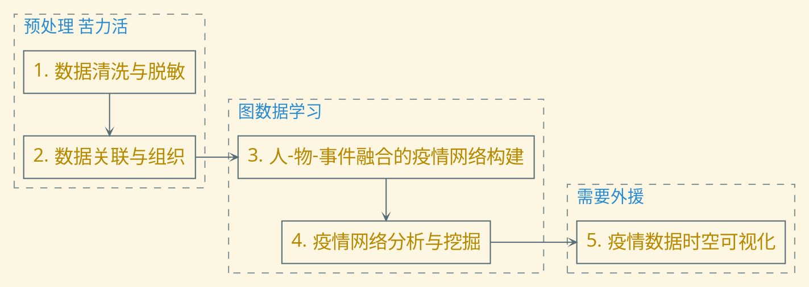
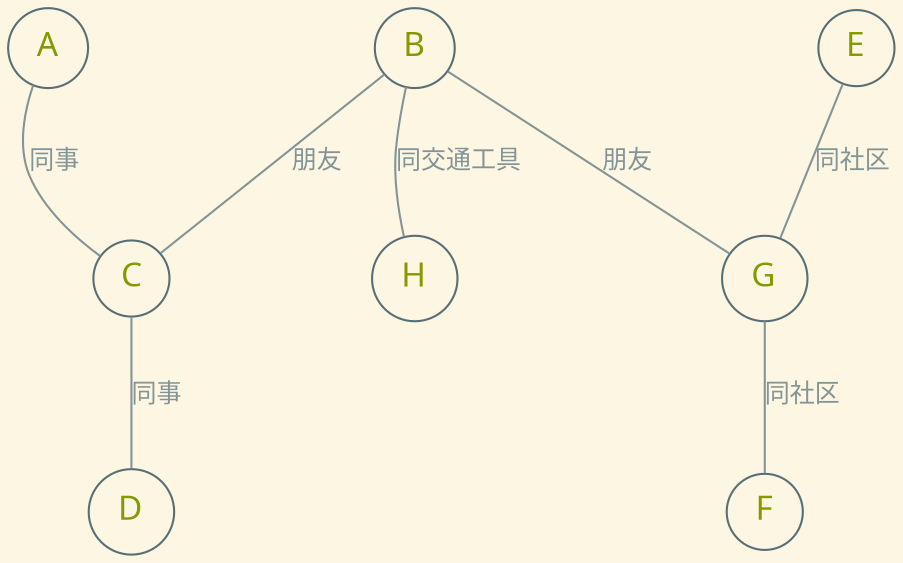
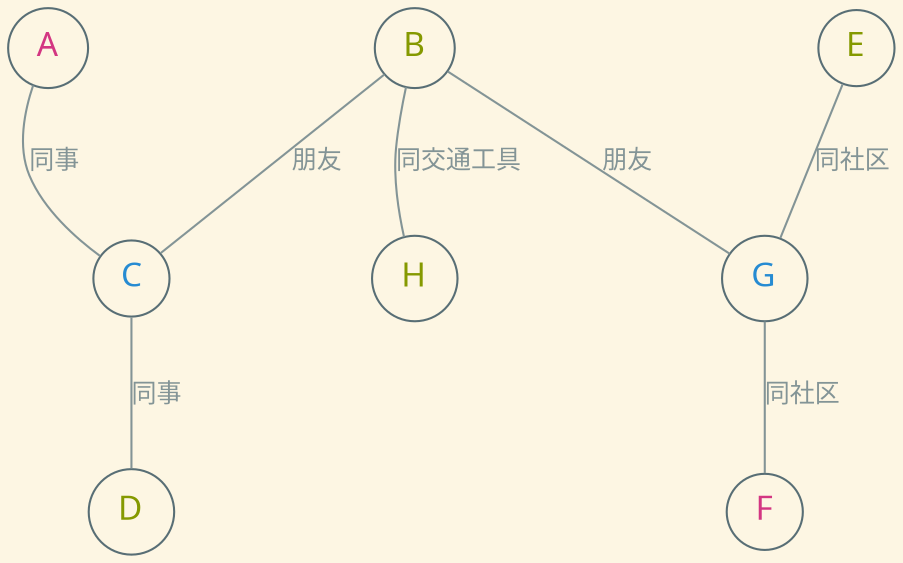
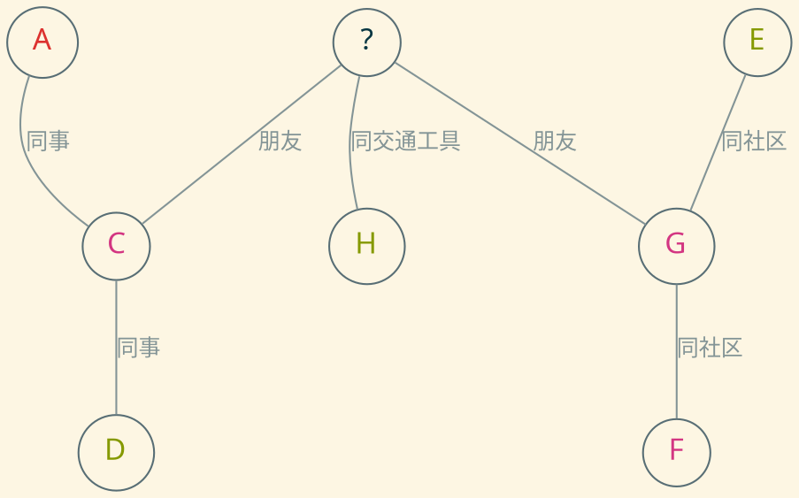
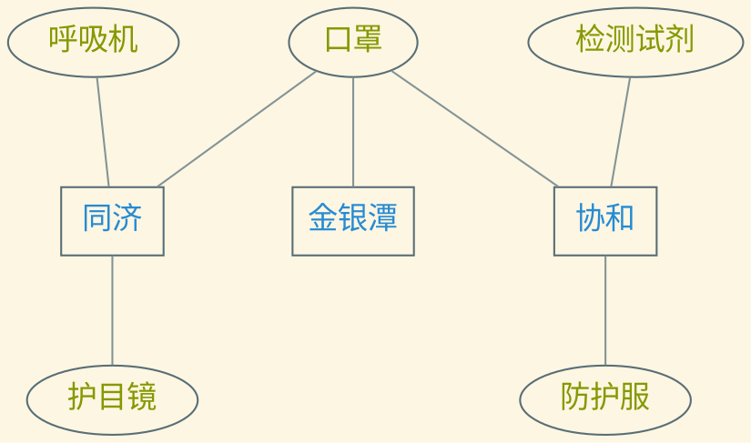
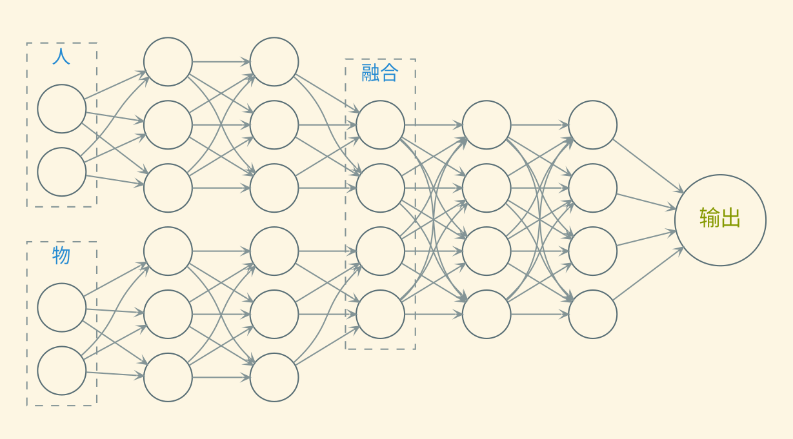

---
presentation:
    transition: "none"
    enableSpeakerNotes: true
    margin: 0
---

@import " zhangt-style.css"
@import "../common/css/font-awesome-4.7.0/css/font-awesome.css"

<!-- slide data-notes="" -->

    
    

    <h1 class="front_page_title top_10">面向特定时空的新冠疫情复盘</h1>
    
 
    <!-- <h4 class="front_page_subtitle top_2">暑期年会</h4> -->
    <h4 class="author top_10">大数据组</h4>
    <!-- <h4 class="mail">tengzhang@hust.edu.cn</h4> -->
    <h4 class="date">2020 / 07 / 30</h4>

<!-- slide data-notes="一份“国家记忆”：沉淀一份由原始数据承载的“国家记忆”，按“能收尽收、能汇尽汇”的原则，汇聚PB级可反映疫情及其抗击过程的各种载体、各种记录形式的数据；一份复盘“全数据集”：构建一份经过脱敏处理的可以用于复盘的“全数据集”，满足用户隐私保护与数据安全要求；一套“数字武汉”系统：研制一套疫情及其抗击过程的“数字武汉”系统，挖掘千万级节点的疫情网络数据，用数字化手段复现疫情的宏观态势和微观事件。" -->

    

        

        <h5 class="title">项目概述</h5>
    

    

总体目标

成果形式

-   一份经过脱敏处理的可以用于复盘的“全数据集”
-   一套疫情大数据复盘的“数字武汉”系统

    

    

        <h6 class="bottom_left">华中科技大学计算机学院</h6>
        <h6 class="bottom_center">BDTS</h6>
        <h6 class="bottom_right">tengzhang@hust.edu.cn</h6>
    

<!-- slide data-notes=""  vertical=true -->

    
 
        

        <h5 class="title">疫情复盘</h5>
    

    

5 个子任务

    

    

        <h6 class="bottom_left">华中科技大学计算机学院</h6>
        <h6 class="bottom_center">BDTS</h6>
        <h6 class="bottom_right">tengzhang@hust.edu.cn</h6>
    

<!-- slide data-notes="数据源头众多、格式多样、噪声数据多、数据准确性参差不齐，项目需根据项目任务的实际需要，对数据进行清洗，对数据进行密级分级，分类归档。从保护公民个人通讯自由和隐私的目的，对姓名等涉及个人隐私的数据进行必要的匿名化处理。" -->

    

        

        <h5 class="title">预处理</h5>
    

    

清洗与脱敏

-   源头众多，格式多样
-   噪声多，质量参差不齐
-   密级分级，分类归档
-   保护公民个人通讯自由和隐私，匿名化处理

 

关联与组织

-   对象异构：人、物品、事件
-   时空特性：人的移动轨迹，事件发生的时间地点

    

    

        <h6 class="bottom_left">华中科技大学计算机学院</h6>
        <h6 class="bottom_center">BDTS</h6>
        <h6 class="bottom_right">tengzhang@hust.edu.cn</h6>
    

<!-- slide data-notes="建立起以人为节点的网络，该网络以人的交互关系为边，如两个人在同一趟地铁上同时出现则认为该二者间存在一条边；不同场所得影响则刻画为节点的属性，如在医院出现或者在无疫情小区出现等。该网络可有效追踪病毒的传播扩散途径等" -->

    

        

        <h5 class="title">图数据学习</h5>
    

    

人流网络：预测节点健康状态

节点属性：年龄、性别、住址、工作、位置 类标记：未感染、密切接触者、轻症、重症

    

    

        <h6 class="bottom_left">华中科技大学计算机学院</h6>
        <h6 class="bottom_center">BDTS</h6>
        <h6 class="bottom_right">tengzhang@hust.edu.cn</h6>
    

<!-- slide data-notes="建立起以人为节点的网络，该网络以人的交互关系为边，如两个人在同一趟地铁上同时出现则认为该二者间存在一条边；不同场所得影响则刻画为节点的属性，如在医院出现或者在无疫情小区出现等。该网络可有效追踪病毒的传播扩散途径等" vertical=true -->

    

        

        <h5 class="title">图数据学习</h5>
    

    

人流网络：预测节点健康状态

节点属性：年龄、性别、住址、工作、位置 类标记：未感染、密切接触者、轻症、重症

    

    

        <h6 class="bottom_left">华中科技大学计算机学院</h6>
        <h6 class="bottom_center">BDTS</h6>
        <h6 class="bottom_right">tengzhang@hust.edu.cn</h6>
    

<!-- slide data-notes="建立起以人为节点的网络，该网络以人的交互关系为边，如两个人在同一趟地铁上同时出现则认为该二者间存在一条边；不同场所得影响则刻画为节点的属性，如在医院出现或者在无疫情小区出现等。该网络可有效追踪病毒的传播扩散途径等" vertical=true -->

    

        

        <h5 class="title">图数据学习</h5>
    

    

人流网络：预测节点健康状态

节点属性：年龄、性别、住址、工作、位置 类标记：未感染、密切接触者、轻症、重症

    

    

        <h6 class="bottom_left">华中科技大学计算机学院</h6>
        <h6 class="bottom_center">BDTS</h6>
        <h6 class="bottom_right">tengzhang@hust.edu.cn</h6>
    

<!-- slide data-notes="物流网络构建：该网络以物资为主体，侧重跟踪物资的在疫情相关节点的全流程" -->

    

        

        <h5 class="title">图数据学习</h5>
    

    

物流网络：智能推荐物资运送方案

节点：物资（所在位置，数量）、医院（各种物资的消耗和储备，各类病人的数量）

    

    

        <h6 class="bottom_left">华中科技大学计算机学院</h6>
        <h6 class="bottom_center">BDTS</h6>
        <h6 class="bottom_right">tengzhang@hust.edu.cn</h6>
    

<!-- slide data-notes="对人流网络与物流网络融合的异质网络提取特征；利用抽取出的特征学习疫情扩散模型；结合疫情扩散模型的关键节点建模，明确疫情传播、控制中的关键人、物、事件、场景等；在人物融合疫情网络上实现快速响应的关键节点挖掘" -->

    

        

        <h5 class="title">图数据学习</h5>
    

    

网络融合：相互辅助，共同提升

    

    

        <h6 class="bottom_left">华中科技大学计算机学院</h6>
        <h6 class="bottom_center">BDTS</h6>
        <h6 class="bottom_right">tengzhang@hust.edu.cn</h6>
    

<!-- slide data-notes="" -->

    

        

        <h5 class="title">疫情扩散模型学习</h5>
    

    

SIR 模型：$S(t)$未感染者，$I(t)$已感染者，$R(t)$已康复者

通过三个带参数的方程描述各类人相互之间的转化关系

$$
\begin{align*}
S'(t) & = -\frac{\beta}{N} I(t) S(t) \\
I'(t) & = -\frac{\beta}{N} I(t) S(t) - \gamma I(t) \\
R'(t) & = \gamma I(t)
\end{align*}
$$

关键：如何估计参数$\beta$、$\gamma$？

    

    

        <h6 class="bottom_left">华中科技大学计算机学院</h6>
        <h6 class="bottom_center">BDTS</h6>
        <h6 class="bottom_right">tengzhang@hust.edu.cn</h6>
    

<!-- slide data-notes="" vertical=true -->

    

        

        <h5 class="title">疫情扩散模型学习</h5>
    

    

新的特征，新的模型

-   潜伏期长，免疫没用，主要靠隔离
-   每天更新确诊/疑似人数，可以用更精细的模型

 

本质上与经典的 SIR 模型一样，依然将人群分为若干类，用带参数的差分方程组描述转化关系，最终通过拟合真实数据得到参数

 

引入机器学习

-   损失函数为预测确诊/疑似人数与实际确诊/疑似人数的差
-   损失函数关于参数不可微，可采用 Bayes 优化之类的零阶优化方法

    

    

        <h6 class="bottom_left">华中科技大学计算机学院</h6>
        <h6 class="bottom_center">BDTS</h6>
        <h6 class="bottom_right">tengzhang@hust.edu.cn</h6>
    

<!-- slide data-notes="" -->

    

        

        <h5 class="title">可视化</h5>
    

    

难点

-   影响因素众多
-   数据量大
-   展示角度复杂
-   时间跨度长

 

主要任务

-   从时空维度进行数据建模，结合三维地理信息系统，构建虚拟城市空间，并与数据模型进行交互，支持对疫情扩散的历史分析、实时监测及未来仿真
-   高时效并行数据可视化，实现海量数据实时渲染与数据交互

    

    

        <h6 class="bottom_left">华中科技大学计算机学院</h6>
        <h6 class="bottom_center">BDTS</h6>
        <h6 class="bottom_right">tengzhang@hust.edu.cn</h6>
    

<!-- slide data-notes="" -->

    

        

        <h5 class="title">人员分工安排</h5>
    

    

-   疫情数据的统一表示模型 &nbsp;&nbsp;&nbsp;&nbsp; 2 人
-   基于图神经网络的疫情预测 &nbsp;&nbsp;&nbsp;&nbsp; 1 人
-   基于图神经网络的智能物资调配 &nbsp;&nbsp;&nbsp;&nbsp; 1 人
-   融合异构数据的疫情建模 &nbsp;&nbsp;&nbsp;&nbsp; 1 人
-   基于零阶优化的疫情扩散模型学习 &nbsp;&nbsp;&nbsp;&nbsp; 1 人
-   高时效海量数据可视化 &nbsp;&nbsp;&nbsp;&nbsp; 2 人

    

    

        <h6 class="bottom_left">华中科技大学计算机学院</h6>
        <h6 class="bottom_center">BDTS</h6>
        <h6 class="bottom_right">tengzhang@hust.edu.cn</h6>
    

<!-- slide data-notes="" -->

    

        

        <h5 class="title">完</h5>
    

    

敬请各位老师批评指正

谢谢！

    

    

        <h6 class="bottom_left">华中科技大学计算机学院</h6>
        <h6 class="bottom_center">BDTS</h6>
        <h6 class="bottom_right">tengzhang@hust.edu.cn</h6>
    

